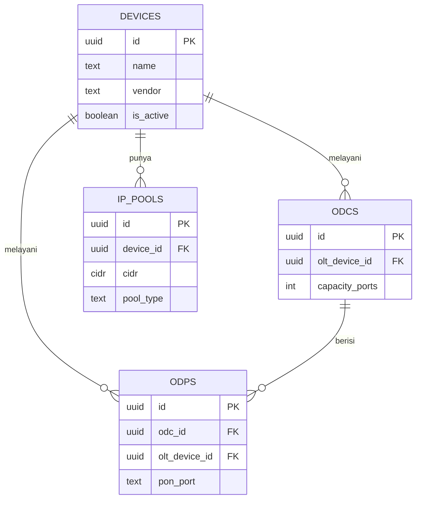
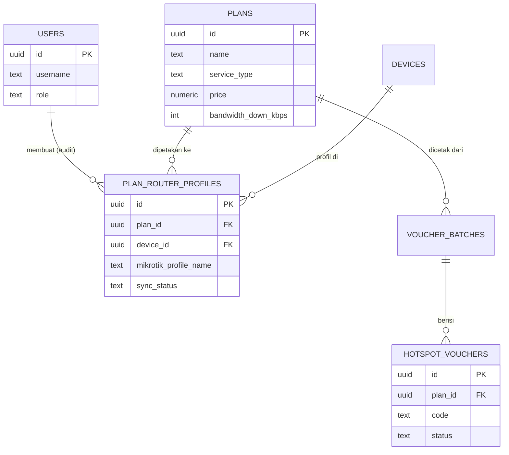
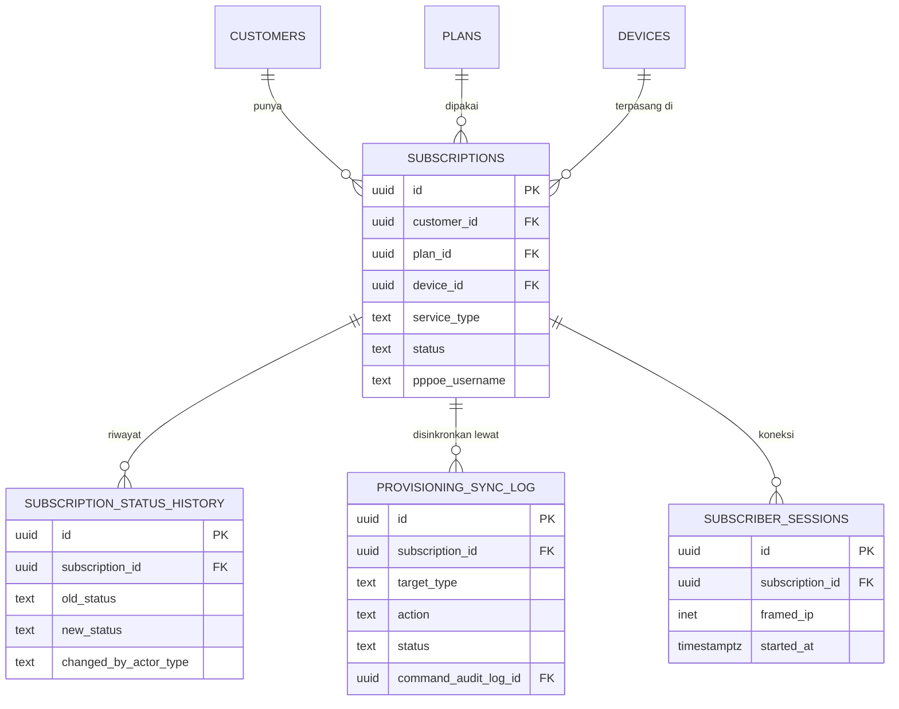
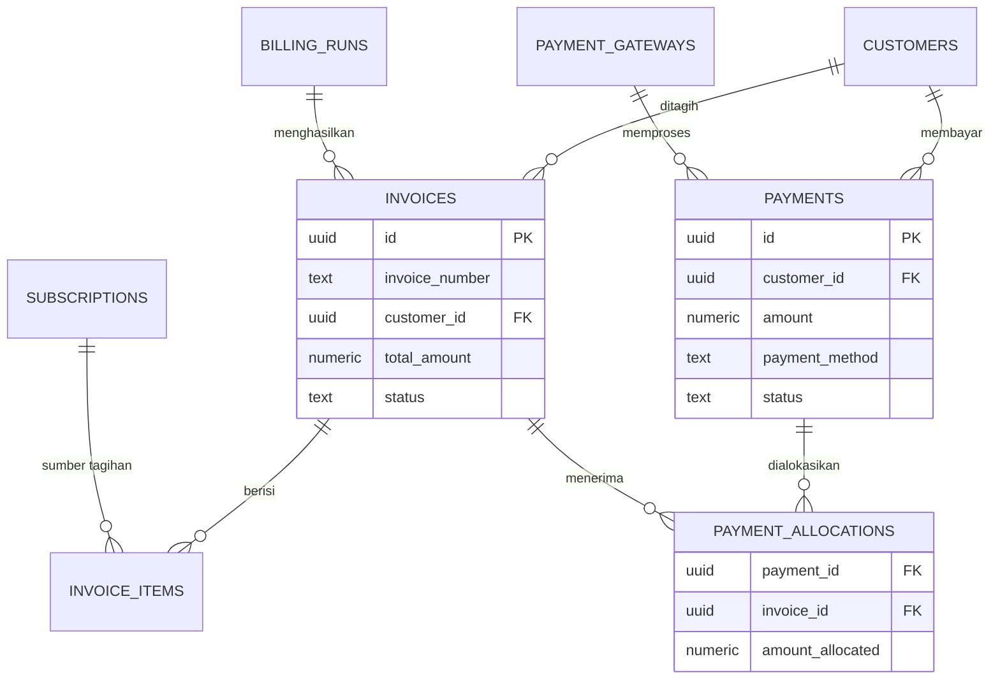
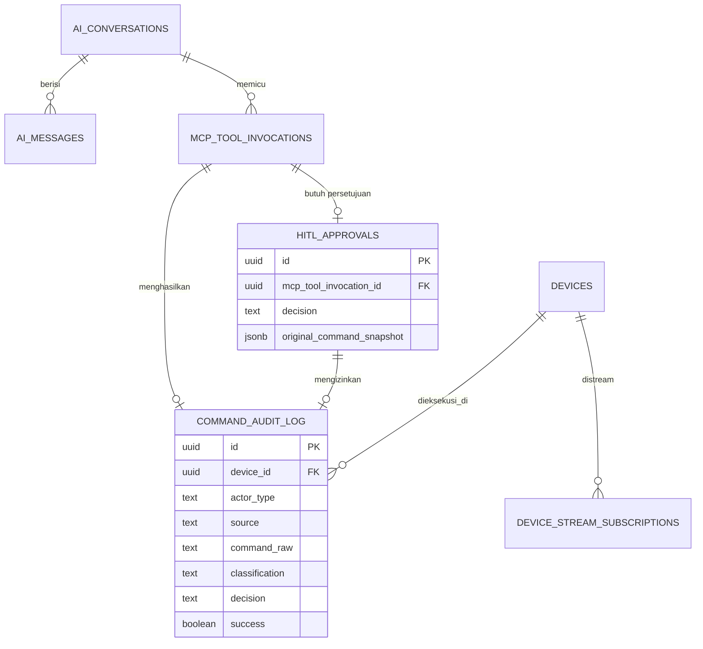

# Struktur Database — NetOps Engine (ISP Management + AI/MCP Ops)

> **Status:** v1 — seluruh DDL di dokumen ini sudah divalidasi langsung
> (bukan cuma ditulis lalu diasumsikan benar): dijalankan ke instance
> PostgreSQL 16 sungguhan di sandbox, seluruh 27 tabel dan 45 foreign key
> berhasil dibuat tanpa error, dan diuji dengan alur data end-to-end nyata
> (lihat §9).
> **Melengkapi:** `NetOps-Architecture.md`, `TECH-STACK-DAN-PERSIAPAN.md`,
> `CLAUDE.md`
> **Database:** PostgreSQL, via `golang-migrate` (per
> `TECH-STACK-DAN-PERSIAPAN.md` §12), diakses lewat GORM

---

## 0. Kenapa Dokumen Ini Ada

Anda meminta seluruh struktur database untuk ISP management — customer,
subscription, billing, pembayaran, invoice, paket PPPoE/Hotspot — DAN
menyebut eksplisit bahwa project ini akan jadi produk baru karena ada
MCP, streaming, dan integrasi LLM. Itu bukan detail tambahan yang bisa
diabaikan: itu mengubah desain di titik-titik tertentu, dijelaskan satu
per satu di §8.

Prinsip desain paling penting yang menjawab permintaan Anda "apa pun yang
perlu sinkron dengan MikroTik harus sinkron":

**Sinkronisasi bukan sistem terpisah yang dibangun dari nol.** Ia menumpang
di atas pipeline eksekusi command + audit + HITL yang SUDAH ada di kode Go
project ini (`command.Decide`, `command_audit_log`,
`internal/usecase/network`). Setiap perubahan bisnis (pelanggan baru,
suspend, ganti paket) menghasilkan SATU baris di `provisioning_sync_log`
yang menunjuk ke SATU baris di `command_audit_log` — command yang sama
persis yang dipakai kalau seorang AI agent lewat MCP menjalankan command
itu secara langsung. Detail lengkap di §7.

---

## 1. Prinsip & Konvensi

- **UUID sebagai primary key** (`gen_random_uuid()`, extension `pgcrypto`)
  di semua tabel — konsisten dengan `devices` yang sudah ada di
  `migrations/000001`.
- **`TIMESTAMPTZ` untuk semua waktu** — konsisten dengan migration yang
  sudah ada.
- **Status pakai `TEXT` + `CHECK constraint`, bukan native Postgres ENUM.**
  Ini pilihan sadar: menambah nilai status baru ke `CHECK` cukup
  `ALTER TABLE ... DROP CONSTRAINT ... ADD CONSTRAINT ...` di satu migration
  file, sedangkan `ALTER TYPE ... ADD VALUE` di native ENUM Postgres tidak
  bisa dijalankan di dalam transaksi (masalah nyata kalau
  `golang-migrate` membungkus tiap migration dalam transaksi).
- **Satu `public` schema, bukan schema-per-domain.** Dipertimbangkan
  memisah jadi schema `billing`/`customer`/`aiops`, tapi itu nambah
  kerumitan cross-schema FK + konfigurasi GORM tanpa manfaat langsung di
  skala project ini sekarang. Pengelompokan di dokumen ini murni
  organisasi penjelasan, bukan schema fisik. Revisit kalau data sudah
  besar dan butuh backup/retensi terpisah per domain (mis. `ai_messages`
  yang bisa tumbuh cepat).
- **Kredensial PPPoE terenkripsi, bukan plaintext.**
  `subscriptions.pppoe_password_encrypted` dienkripsi lewat mekanisme yang
  SAMA dengan `internal/adapter/vault` (AES) yang sudah dirancang untuk
  kredensial device — jangan bikin mekanisme enkripsi kedua yang terpisah.
  Reversibel (bukan hash satu-arah) karena password ASLI harus bisa
  dikirim ulang ke MikroTik saat sinkronisasi.
- **Riwayat, bukan cuma status terkini.** `subscription_status_history`,
  `provisioning_sync_log`, `command_audit_log` semuanya append-only —
  tidak ada yang meng-overwrite baris lama. Ini bukan sekadar
  "best practice" umum: begitu ada AI agent yang bisa mengeksekusi command
  ke jaringan Anda, "siapa yang mengubah apa dan kenapa" menjadi
  pertanyaan yang HARUS selalu bisa dijawab dari database, bukan dari log
  file yang bisa hilang.
- **Batas tegas dengan FreeRADIUS**: `radcheck`/`radreply`/`radacct`/`nas`
  adalah skema BAKU milik FreeRADIUS sendiri — dokumen ini TIDAK
  mendesain ulang itu. Tabel di sini adalah SUMBER yang men-generate baris
  ke tabel-tabel itu (lihat §7.3), bukan pengganti.

---

## 2. Peta Domain (27 Tabel)

| Domain | Tabel | Poin Kunci |
|---|---|---|
| **Infrastruktur** | `devices`* , `odcs`, `odps`, `ip_pools` | `devices` sudah ada — cuma ditambah kolom (§3) |
| **IAM** | `users` | Role persis sama dengan model Casbin di `TECH-STACK-DAN-PERSIAPAN.md` §3 |
| **Katalog** | `plans`, `plan_router_profiles`, `voucher_batches`, `hotspot_vouchers` | `plan_router_profiles` = titik sinkron paket↔MikroTik |
| **Pelanggan** | `customers`, `customer_documents` | |
| **Langganan & Sinkron** | `subscriptions`, `subscription_status_history`, `provisioning_sync_log`, `subscriber_sessions` | `provisioning_sync_log` = jantung sinkronisasi MikroTik |
| **Billing** | `billing_runs`, `invoices`, `invoice_items`, `payments`, `payment_allocations`, `payment_gateways` | Mendukung pembayaran sebagian & satu pembayaran untuk banyak invoice |
| **AI/MCP/Ops** | `ai_conversations`, `ai_messages`, `mcp_tool_invocations`, `hitl_approvals`, `command_audit_log`, `device_stream_subscriptions` | Karena project ini produk AI-native, bukan tambahan opsional — lihat §8 |

\* `devices` sudah ada di `migrations/000001_create_devices_table` — lihat §3 untuk kolom tambahan.

---

## 3. Infrastruktur Jaringan



### 3.1 Tambahan kolom pada `devices` (sudah ada — migration BARU, bukan revisi 000001)

```sql
ALTER TABLE devices ADD COLUMN site_name TEXT;
ALTER TABLE devices ADD COLUMN credential_vault_ref TEXT;
ALTER TABLE devices ADD COLUMN is_active BOOLEAN NOT NULL DEFAULT true;
```

- `credential_vault_ref` — kunci referensi ke `port.CredentialVault`
  (`internal/adapter/vault`), BUKAN kredensial itu sendiri. Konsisten
  dengan prinsip yang sudah ditulis di `port/credential_vault.go`: "AI/LLM
  layers must never see raw credentials."
- `site_name` — lokasi fisik (POP), berguna untuk dispatch teknisi
  lapangan berdasarkan area, relevan dengan pola kerja on-call reaktif.

### 3.2 `odcs` — Optical Distribution Cabinet (FTTH)

```sql
CREATE TABLE odcs (
    id              UUID PRIMARY KEY DEFAULT gen_random_uuid(),
    name            TEXT NOT NULL,
    olt_device_id   UUID NOT NULL REFERENCES devices(id) ON DELETE RESTRICT,
    location_lat    DOUBLE PRECISION,
    location_lng    DOUBLE PRECISION,
    capacity_ports  INTEGER NOT NULL,
    created_at      TIMESTAMPTZ NOT NULL DEFAULT now(),
    updated_at      TIMESTAMPTZ NOT NULL DEFAULT now()
);
```

### 3.3 `odps` — Optical Distribution Point (splitter box tempat ONU pelanggan tersambung)

```sql
CREATE TABLE odps (
    id              UUID PRIMARY KEY DEFAULT gen_random_uuid(),
    odc_id          UUID REFERENCES odcs(id) ON DELETE SET NULL,
    olt_device_id   UUID NOT NULL REFERENCES devices(id) ON DELETE RESTRICT,
    pon_port        TEXT NOT NULL,
    name            TEXT NOT NULL,
    capacity_ports  INTEGER NOT NULL,
    location_lat    DOUBLE PRECISION,
    location_lng    DOUBLE PRECISION,
    created_at      TIMESTAMPTZ NOT NULL DEFAULT now(),
    updated_at      TIMESTAMPTZ NOT NULL DEFAULT now(),
    UNIQUE (olt_device_id, pon_port)
);
```

`odc_id` nullable: sebagian topologi ODP terhubung langsung ke OLT tanpa
ODC perantara (splitter satu tingkat) — jangan paksa hierarki dua tingkat
kalau instalasi Anda tidak selalu begitu.

### 3.4 `ip_pools` — pool IP per device (cermin `/ip pool` di MikroTik)

```sql
CREATE TABLE ip_pools (
    id              UUID PRIMARY KEY DEFAULT gen_random_uuid(),
    device_id       UUID NOT NULL REFERENCES devices(id) ON DELETE CASCADE,
    name            TEXT NOT NULL,
    cidr            CIDR NOT NULL,
    gateway         INET,
    pool_type       TEXT NOT NULL CHECK (pool_type IN ('pppoe', 'hotspot', 'static')),
    created_at      TIMESTAMPTZ NOT NULL DEFAULT now(),
    UNIQUE (device_id, name)
);
```

---

## 4. IAM & Katalog Layanan



### 4.1 `users` — akun staff/admin (bukan pelanggan)

```sql
CREATE TABLE users (
    id              UUID PRIMARY KEY DEFAULT gen_random_uuid(),
    username        TEXT NOT NULL UNIQUE,
    password_hash   TEXT NOT NULL,
    full_name       TEXT NOT NULL,
    email           TEXT,
    phone           TEXT,
    role            TEXT NOT NULL CHECK (role IN ('superadmin','owner','admin','staff','teknisi')),
    is_active       BOOLEAN NOT NULL DEFAULT true,
    created_at      TIMESTAMPTZ NOT NULL DEFAULT now(),
    last_login_at   TIMESTAMPTZ
);
```

`role` sengaja persis sama dengan lima peran Casbin di
`TECH-STACK-DAN-PERSIAPAN.md` §3 — jangan buat daftar role kedua yang
berbeda di database.

Catatan: `casbin_rule` (tabel policy Casbin sendiri) TIDAK didesain di
sini — itu dibuat otomatis oleh `gorm-adapter/v3` saat
`gormadapter.NewAdapterByDB(db)` dipanggil (lihat
`internal/adapter/auth/casbin.go`), bukan sesuatu yang perlu Anda tulis
migration-nya sendiri.

### 4.2 `plans` — produk komersial (paket PPPoE/Hotspot/dll)

```sql
CREATE TABLE plans (
    id                      UUID PRIMARY KEY DEFAULT gen_random_uuid(),
    name                    TEXT NOT NULL,
    service_type            TEXT NOT NULL CHECK (service_type IN ('pppoe','hotspot','static_ip','dhcp')),
    description             TEXT,
    price                   NUMERIC(14,2) NOT NULL,
    billing_period_months   INTEGER NOT NULL DEFAULT 1,
    bandwidth_down_kbps     INTEGER NOT NULL,
    bandwidth_up_kbps       INTEGER NOT NULL,
    burst_down_kbps         INTEGER,
    burst_up_kbps           INTEGER,
    burst_threshold_kbps    INTEGER,
    burst_time_seconds      INTEGER,
    fup_quota_mb            INTEGER,
    fup_throttle_down_kbps  INTEGER,
    fup_throttle_up_kbps    INTEGER,
    is_active               BOOLEAN NOT NULL DEFAULT true,
    created_at              TIMESTAMPTZ NOT NULL DEFAULT now(),
    updated_at              TIMESTAMPTZ NOT NULL DEFAULT now()
);
```

Kolom `burst_*` dan `fup_*` dipisah eksplisit (bukan JSONB) karena
langsung memetakan ke parameter `/ppp profile` MikroTik
(`rate-limit=down/up burst-down/up burst-threshold burst-time`) — kalau
disimpan sebagai JSONB generik, kode sinkronisasi harus parse struktur
yang tidak dijamin konsisten. `fup_quota_mb` nullable: banyak paket
"unlimited" tanpa FUP sama sekali.

### 4.3 `plan_router_profiles` — **titik sinkron paket ↔ MikroTik**

```sql
CREATE TABLE plan_router_profiles (
    id                      UUID PRIMARY KEY DEFAULT gen_random_uuid(),
    plan_id                 UUID NOT NULL REFERENCES plans(id) ON DELETE CASCADE,
    device_id               UUID NOT NULL REFERENCES devices(id) ON DELETE CASCADE,
    mikrotik_profile_name   TEXT NOT NULL,
    sync_status             TEXT NOT NULL DEFAULT 'pending' CHECK (sync_status IN ('pending','synced','error')),
    last_synced_at          TIMESTAMPTZ,
    sync_error_message      TEXT,
    created_at              TIMESTAMPTZ NOT NULL DEFAULT now(),
    UNIQUE (plan_id, device_id)
);
```

Satu `plan` itu ABSTRAK ("Home 10Mbps") — tapi profil `/ppp profile`
harus benar-benar ADA di SETIAP router MikroTik tempat paket itu dipakai.
ISP dengan banyak POP/router butuh satu baris di sini PER router. Ini
memisahkan "apa yang dijual" (`plans`) dari "sudah di-provision di router
mana saja" (`plan_router_profiles`) — kalau ada router baru, tinggal
tambah baris di sini, bukan ubah tabel `plans`.

### 4.4 `voucher_batches` & `hotspot_vouchers` — voucher Hotspot (model RT/RW Net)

```sql
CREATE TABLE voucher_batches (
    id                  UUID PRIMARY KEY DEFAULT gen_random_uuid(),
    plan_id             UUID NOT NULL REFERENCES plans(id) ON DELETE RESTRICT,
    quantity_generated  INTEGER NOT NULL,
    price_per_voucher   NUMERIC(14,2) NOT NULL,
    generated_by        UUID REFERENCES users(id) ON DELETE SET NULL,
    generated_at        TIMESTAMPTZ NOT NULL DEFAULT now()
);

CREATE TABLE hotspot_vouchers (
    id                          UUID PRIMARY KEY DEFAULT gen_random_uuid(),
    batch_id                    UUID REFERENCES voucher_batches(id) ON DELETE SET NULL,
    plan_id                     UUID NOT NULL REFERENCES plans(id) ON DELETE RESTRICT,
    code                        TEXT NOT NULL UNIQUE,
    status                      TEXT NOT NULL DEFAULT 'unused' CHECK (status IN ('unused','active','expired','used')),
    used_by_subscription_id     UUID, -- FK ke subscriptions ditambahkan di §6.1 (ALTER TABLE) — subscriptions belum ada di titik ini
    used_by_mac                 MACADDR,
    activated_at                TIMESTAMPTZ,
    expires_at                  TIMESTAMPTZ,
    created_at                  TIMESTAMPTZ NOT NULL DEFAULT now()
);
```

`used_by_subscription_id` DAN `used_by_mac` sengaja keduanya nullable dan
tidak saling eksklusif secara skema: voucher yang dijual bebas di warung
(tanpa akun formal) cuma terisi `used_by_mac`; voucher yang dikaitkan ke
pelanggan terdaftar terisi `used_by_subscription_id`. FK ke `subscriptions`
ditambahkan lewat `ALTER TABLE` terpisah di §6.1 — bukan inline di sini —
karena `subscriptions` (dan tabel yang menjadi prasyaratnya: `customers`,
`devices`) belum eksis di urutan migration sejauh ini. Ini BUKAN
kelalaian; ini pola normal saat ada dependensi melingkar/maju antar
tabel dalam skema yang berkembang — pecah jadi migration file terpisah
sesuai urutan pembuatan tabel yang sebenarnya saat diimplementasikan.

---

## 5. Pelanggan

```sql
CREATE TABLE customers (
    id                  UUID PRIMARY KEY DEFAULT gen_random_uuid(),
    full_name           TEXT NOT NULL,
    id_number           TEXT,              -- NIK/KTP
    phone               TEXT NOT NULL,
    whatsapp            TEXT,
    email               TEXT,
    address             TEXT NOT NULL,
    location_lat        DOUBLE PRECISION,
    location_lng        DOUBLE PRECISION,
    customer_type       TEXT NOT NULL DEFAULT 'residential' CHECK (customer_type IN ('residential','business')),
    status              TEXT NOT NULL DEFAULT 'prospect' CHECK (status IN ('prospect','active','suspended','terminated')),
    referral_source     TEXT,
    notes               TEXT,
    registered_at       TIMESTAMPTZ NOT NULL DEFAULT now(),
    terminated_at       TIMESTAMPTZ
);

CREATE TABLE customer_documents (
    id              UUID PRIMARY KEY DEFAULT gen_random_uuid(),
    customer_id     UUID NOT NULL REFERENCES customers(id) ON DELETE CASCADE,
    doc_type        TEXT NOT NULL CHECK (doc_type IN ('ktp','kk','npwp','other')),
    file_url        TEXT NOT NULL,
    uploaded_at     TIMESTAMPTZ NOT NULL DEFAULT now()
);
```

Catatan:
- `whatsapp` terpisah dari `phone` — di konteks ISP Indonesia, nomor WA
  seringkali beda dari nomor telepon terdaftar, dan WA adalah kanal
  komunikasi utama (notifikasi tagihan, konfirmasi gangguan).
- `location_lat`/`lng` di level customer (bukan cuma di `odps`) — berguna
  untuk dispatch teknisi ke ALAMAT pelanggan, bukan cuma ke titik ODP.
- `customer.status` beda dari `subscription.status` — SATU customer bisa
  punya BANYAK subscription (mis. WiFi rumah + hotspot voucher terpisah
  untuk usaha kecil di rumah yang sama), jadi status berlangganan itu
  properti subscription, bukan customer. `customer.status` menandai
  keseluruhan relasi (mis. "terminated" kalau semua subscription-nya
  ditutup).

---

## 6. Langganan & Sinkronisasi — Bagian Inti



### 6.1 `subscriptions` — entitas penghubung utama

```sql
CREATE TABLE subscriptions (
    id                      UUID PRIMARY KEY DEFAULT gen_random_uuid(),
    customer_id             UUID NOT NULL REFERENCES customers(id) ON DELETE RESTRICT,
    plan_id                 UUID NOT NULL REFERENCES plans(id) ON DELETE RESTRICT,
    service_type            TEXT NOT NULL CHECK (service_type IN ('pppoe','hotspot','static_ip','dhcp')),
    status                  TEXT NOT NULL DEFAULT 'pending_install'
                                CHECK (status IN ('pending_install','active','suspended','terminated')),
    device_id               UUID NOT NULL REFERENCES devices(id) ON DELETE RESTRICT,
    odp_id                  UUID REFERENCES odps(id) ON DELETE SET NULL,
    odp_port                TEXT,
    onu_serial_number       TEXT,
    ip_pool_id              UUID REFERENCES ip_pools(id) ON DELETE SET NULL,
    pppoe_username          TEXT,
    pppoe_password_encrypted TEXT,
    static_ip               INET,
    mac_address             MACADDR,
    installed_at            TIMESTAMPTZ,
    activated_at             TIMESTAMPTZ,
    suspended_at             TIMESTAMPTZ,
    terminated_at            TIMESTAMPTZ,
    suspension_reason        TEXT,
    created_at               TIMESTAMPTZ NOT NULL DEFAULT now(),
    updated_at               TIMESTAMPTZ NOT NULL DEFAULT now(),
    UNIQUE (device_id, pppoe_username)
);
```

`UNIQUE (device_id, pppoe_username)` — username PPPoE cuma harus unik PER
ROUTER (RouterOS sendiri juga begitu, `/ppp secret` unik per device),
bukan unik global, supaya dua router beda POP boleh punya username yang
sama tanpa konflik.

`device_id NOT NULL` — setiap subscription HARUS terikat ke satu device
MikroTik tertentu sejak awal (tempat provisioning terjadi), bukan
ditentukan belakangan. Ini konsisten dengan model `internal/registry`
yang menyimpan satu `port.DeviceDriver` per device — subscription tahu
persis driver mana yang akan dipanggil untuk sinkronisasinya.

```sql
-- Sekarang subscriptions sudah ada, lengkapi FK yang ditunda dari §4.4
ALTER TABLE hotspot_vouchers
    ADD CONSTRAINT fk_voucher_subscription
    FOREIGN KEY (used_by_subscription_id) REFERENCES subscriptions(id) ON DELETE SET NULL;
```

### 6.2 `subscription_status_history` — audit setiap perubahan status

```sql
CREATE TABLE subscription_status_history (
    id                      UUID PRIMARY KEY DEFAULT gen_random_uuid(),
    subscription_id         UUID NOT NULL REFERENCES subscriptions(id) ON DELETE CASCADE,
    old_status               TEXT,
    new_status               TEXT NOT NULL,
    changed_by_user          UUID REFERENCES users(id) ON DELETE SET NULL,
    changed_by_actor_type    TEXT NOT NULL DEFAULT 'human' CHECK (changed_by_actor_type IN ('human','ai_agent','system_scheduled')),
    reason                   TEXT,
    changed_at                TIMESTAMPTZ NOT NULL DEFAULT now()
);
```

`changed_by_actor_type` membedakan tiga kemungkinan pemicu perubahan
status: staff manual (`human`), AI agent lewat MCP (`ai_agent`), atau job
terjadwal seperti auto-isolir telat bayar (`system_scheduled`). Ini
BUKAN kolom kosmetik — begitu ada AI yang bisa mengubah status
langganan, "siapa/apa yang menyuruh suspend pelanggan ini" harus bisa
dijawab tanpa ambigu.

### 6.3 `provisioning_sync_log` — **jantung sinkronisasi ke MikroTik (dan target lain)**

```sql
CREATE TABLE provisioning_sync_log (
    id                      UUID PRIMARY KEY DEFAULT gen_random_uuid(),
    subscription_id          UUID NOT NULL REFERENCES subscriptions(id) ON DELETE CASCADE,
    target_type              TEXT NOT NULL CHECK (target_type IN
                                ('mikrotik_ppp_secret','mikrotik_hotspot_user','mikrotik_address_list','freeradius','genieacs_tr069')),
    device_id                UUID REFERENCES devices(id) ON DELETE SET NULL,
    action                   TEXT NOT NULL CHECK (action IN ('create','update','disable','enable','delete','change_profile')),
    status                   TEXT NOT NULL DEFAULT 'pending' CHECK (status IN ('pending','success','failed')),
    requested_at              TIMESTAMPTZ NOT NULL DEFAULT now(),
    completed_at              TIMESTAMPTZ,
    error_message             TEXT,
    command_audit_log_id     UUID, -- FK ke command_audit_log ditambahkan di §9.1 (ALTER TABLE) — tabel itu didefinisikan belakangan
    external_reference        TEXT
);
```

Ini jawaban langsung untuk "apa pun yang perlu sinkron dengan MikroTik
harus sinkron" — dijelaskan penuh di §7, karena ini bukan cuma satu
tabel, ini POLA yang harus diikuti konsisten di seluruh kode.

`target_type` mencakup 5 kemungkinan, bukan cuma MikroTik — sengaja
digeneralisasi supaya SATU mekanisme sinkron/audit dipakai juga untuk
FreeRADIUS dan GenieACS/TR-069 (dua sistem lain yang sudah disebut di
`NetOps-Architecture.md`), bukan tiga mekanisme sinkron terpisah yang
harus dirawat sendiri-sendiri.

### 6.4 `subscriber_sessions` — riwayat koneksi PPPoE/Hotspot pelanggan

```sql
CREATE TABLE subscriber_sessions (
    id                      UUID PRIMARY KEY DEFAULT gen_random_uuid(),
    subscription_id          UUID NOT NULL REFERENCES subscriptions(id) ON DELETE CASCADE,
    device_id                UUID NOT NULL REFERENCES devices(id) ON DELETE CASCADE,
    external_session_id      TEXT,
    framed_ip                 INET,
    mac_address               MACADDR,
    started_at                 TIMESTAMPTZ NOT NULL,
    stopped_at                 TIMESTAMPTZ,
    bytes_in                   BIGINT,
    bytes_out                  BIGINT,
    terminate_cause            TEXT
);
```

**PENTING — nama tabel ini sengaja BUKAN `sessions`.** Project ini SUDAH
punya `internal/domain/session` yang artinya berbeda total: riwayat
koneksi driver KE device (lihat ADR 0002/0003), bukan riwayat koneksi
PELANGGAN ke internet. Menamai keduanya sama-sama "session" akan jadi
sumber salah paham permanen antara "device sedang saya SSH ke sana" vs
"pelanggan Budi sedang online" — dua konsep yang sama sekali tidak
berhubungan tapi kebetulan sama-sama disebut "sesi".

Cara pengisian tabel ini juga harus konsisten dengan prinsip
"tidak ada polling" yang sudah ditetapkan di project ini (lihat ADR 0003):
JANGAN isi lewat polling periodik `/ppp active print`. Yang lebih
konsisten dengan arsitektur yang sudah ada: manfaatkan
`port.StreamingDeviceDriver` (sudah diimplementasikan untuk MikroTik) dan
`Stream()` command **`/ppp/active/print follow`** — di RouterOS API setiap
tabel ber-`print` mendukung `follow`, sehingga tabel active langsung mem-push
record terstruktur (connect saat entry masuk, disconnect saat entry `.dead=yes`)
secara real-time. Ini lebih andal daripada mem-parsing teks `/log`, dan `follow`
meng-emit state awal lebih dulu sehingga snapshot inheren. `subscriber_sessions`
diisi dari stream itu, bukan dari snapshot berkala. Detail di
`docs/plan-provisioning/issue-12-subscriber-sessions.md`.

---

## 7. Mekanisme Sinkronisasi ke MikroTik — Penjelasan Menyeluruh

Ini bagian yang menjawab langsung: **"apa pun yang perlu sinkron dengan
MikroTik harus sinkron."** Supaya tidak jadi janji kosong, berikut alurnya
konkret, dipetakan ke kode Go yang SUDAH ada di project ini.

### 7.1 Prinsip: sinkronisasi = event bisnis yang menumpang pipeline command yang sudah ada

Setiap perubahan di tabel bisnis (`subscriptions`, `plan_router_profiles`)
yang punya konsekuensi di jaringan HARUS melalui urutan yang SAMA:

1. Perubahan bisnis terjadi (mis. `UPDATE subscriptions SET status='suspended'`).
2. Baris baru ditulis ke `provisioning_sync_log` dengan `status='pending'`
   — ini "niat" untuk sinkron, bukan eksekusi itu sendiri.
3. Sebuah usecase (perluasan dari `internal/usecase/network` yang sudah
   ada) membaca baris `pending`, menerjemahkannya jadi `command.Command`
   yang sesuai (mis. `/ppp/secret/disable` dengan `.id` yang tepat), lalu
   memanggil PERSIS `usecase/network.ExecuteCommand` yang sudah ada.
4. `ExecuteCommand` menjalankan `Classify` → `Decide` → (kalau
   destruktif) masuk jalur HITL yang sudah ada → `Execute` di
   `port.DeviceDriver` (di sini: `internal/driver/mikrotik`).
5. Command yang benar-benar dieksekusi tercatat di `command_audit_log`
   (§8) — SATU baris, entah pemicunya staff manual, AI agent lewat MCP,
   atau job terjadwal.
6. `provisioning_sync_log.command_audit_log_id` diisi menunjuk ke baris
   itu, `status` diupdate jadi `success`/`failed`.

**Konsekuensi paling penting**: tidak ada "jalur sinkron MikroTik" yang
terpisah dari "jalur AI menjalankan command." Keduanya adalah HAL YANG
SAMA di level database — satu baris `command_audit_log`, dibedakan cuma
oleh kolom `source` (`'scheduled_job'` untuk sinkron otomatis vs
`'mcp_tool'` untuk AI agent). Kalau nanti Anda audit "kenapa profil
pelanggan si Budi berubah jam 2 pagi", jawabannya ada di SATU tempat,
bukan tersebar di dua sistem log berbeda.

### 7.2 Pemetaan operasi bisnis → command MikroTik

| Peristiwa bisnis | `provisioning_sync_log.action` | Command MikroTik (indikatif) |
|---|---|---|
| Subscription baru (PPPoE) | `create` | `/ppp/secret/add` (username, password, profile, service=pppoe) |
| Ganti paket | `change_profile` | `/ppp/secret/set` (`.id`, profile baru) |
| Suspend (telat bayar / manual) | `disable` | `/ppp/secret/set` (`.id`, disabled=yes) — atau pindah ke profil "isolir" berkecepatan sangat rendah + redirect, tergantung kebijakan ISP |
| Reaktivasi | `enable` | `/ppp/secret/set` (`.id`, disabled=no) |
| Terminasi | `delete` | `/ppp/secret/remove` |
| Voucher hotspot dipakai | `create` | `/ip/hotspot/user/add` |

Katalog command ASLI (path lengkap, klasifikasi risiko) tetap tinggal di
`internal/driver/mikrotik/commands.go` — tabel di atas cuma peta
konseptual, bukan pengganti kode itu.

### 7.3 Batas dengan FreeRADIUS & GenieACS

- **FreeRADIUS**: kalau router dikonfigurasi pakai RADIUS-backed auth
  (umum untuk deployment banyak-router), `provisioning_sync_log` dengan
  `target_type='freeradius'` berarti usecase terkait menulis/mengubah
  baris di `radcheck`/`radreply` (skema FreeRADIUS sendiri, TIDAK
  didesain ulang di sini) alih-alih `/ppp secret` langsung ke router.
  `subscriptions` tetap SUMBER kebenaran; FreeRADIUS cuma salah satu
  TARGET provisioning.
- **GenieACS/TR-069**: untuk CPE yang dikelola lewat ACS (disebut di
  memori project sebagai bagian visi NetOps AI Agent jangka panjang),
  `target_type='genieacs_tr069'` menunjuk ke task GenieACS NBI, dengan
  `external_reference` menyimpan task ID dari GenieACS.

Poin intinya: `provisioning_sync_log` adalah SATU tabel audit untuk
SEMUA target provisioning, bukan tiga tabel terpisah yang harus disatukan
manual saat butuh laporan lintas-sistem.

---

## 8. Billing, Invoice, Pembayaran



### 8.1 `billing_runs` — riwayat batch job pembuatan tagihan bulanan

```sql
CREATE TABLE billing_runs (
    id                      UUID PRIMARY KEY DEFAULT gen_random_uuid(),
    period                  DATE NOT NULL,
    generated_at             TIMESTAMPTZ NOT NULL DEFAULT now(),
    generated_by             UUID REFERENCES users(id) ON DELETE SET NULL,
    total_invoices_created   INTEGER NOT NULL DEFAULT 0,
    status                   TEXT NOT NULL DEFAULT 'running' CHECK (status IN ('running','completed','failed')),
    UNIQUE (period)
);
```

`UNIQUE (period)` mencegah billing run bulan yang sama dijalankan dua
kali tanpa sengaja — kesalahan operasional nyata yang sering terjadi
kalau job dijalankan manual.

### 8.2 `invoices` & `invoice_items`

```sql
CREATE TABLE invoices (
    id              UUID PRIMARY KEY DEFAULT gen_random_uuid(),
    invoice_number   TEXT NOT NULL UNIQUE,
    customer_id      UUID NOT NULL REFERENCES customers(id) ON DELETE RESTRICT,
    billing_run_id   UUID REFERENCES billing_runs(id) ON DELETE SET NULL,
    period_start      DATE NOT NULL,
    period_end        DATE NOT NULL,
    issue_date        DATE NOT NULL DEFAULT CURRENT_DATE,
    due_date          DATE NOT NULL,
    status            TEXT NOT NULL DEFAULT 'draft' CHECK (status IN ('draft','issued','partially_paid','paid','overdue','void')),
    subtotal          NUMERIC(14,2) NOT NULL DEFAULT 0,
    tax_amount        NUMERIC(14,2) NOT NULL DEFAULT 0,
    total_amount      NUMERIC(14,2) NOT NULL DEFAULT 0,
    notes             TEXT,
    created_at         TIMESTAMPTZ NOT NULL DEFAULT now()
);

CREATE TABLE invoice_items (
    id              UUID PRIMARY KEY DEFAULT gen_random_uuid(),
    invoice_id       UUID NOT NULL REFERENCES invoices(id) ON DELETE CASCADE,
    subscription_id  UUID REFERENCES subscriptions(id) ON DELETE SET NULL,
    item_type        TEXT NOT NULL CHECK (item_type IN
                        ('subscription_fee','installation_fee','equipment_rental','late_fee','discount','other')),
    description      TEXT NOT NULL,
    quantity         NUMERIC(10,2) NOT NULL DEFAULT 1,
    unit_price       NUMERIC(14,2) NOT NULL,
    amount           NUMERIC(14,2) NOT NULL
);
```

- `tax_amount` terpisah dari `subtotal` — PPN 11% berlaku untuk transaksi
  di Indonesia; pisahkan sejak desain awal supaya tidak perlu migrasi
  data lama saat ISP Anda mulai wajib PKP (Pengusaha Kena Pajak).
- `subscription_id` di `invoice_items` nullable dan boleh diulang lintas
  baris — satu invoice BOLEH menagih beberapa subscription sekaligus
  (pelanggan bisnis dengan banyak titik), atau item non-subscription
  (biaya instalasi, sewa alat).

### 8.3 `payments`, `payment_allocations`, `payment_gateways`

```sql
CREATE TABLE payment_gateways (
    id          UUID PRIMARY KEY DEFAULT gen_random_uuid(),
    name        TEXT NOT NULL UNIQUE,
    provider    TEXT NOT NULL CHECK (provider IN ('midtrans','xendit','manual')),
    config_ref  TEXT,
    is_active   BOOLEAN NOT NULL DEFAULT true
);

CREATE TABLE payments (
    id                              UUID PRIMARY KEY DEFAULT gen_random_uuid(),
    customer_id                      UUID NOT NULL REFERENCES customers(id) ON DELETE RESTRICT,
    payment_method                   TEXT NOT NULL CHECK (payment_method IN
                                        ('cash','bank_transfer','e_wallet','payment_gateway','retail_outlet')),
    payment_gateway_id                UUID REFERENCES payment_gateways(id) ON DELETE SET NULL,
    payment_gateway_transaction_id    TEXT,
    amount                            NUMERIC(14,2) NOT NULL,
    status                            TEXT NOT NULL DEFAULT 'pending' CHECK (status IN ('pending','confirmed','failed','refunded')),
    reference_number                  TEXT,
    verified_by                       UUID REFERENCES users(id) ON DELETE SET NULL,
    paid_at                            TIMESTAMPTZ NOT NULL DEFAULT now()
);

CREATE TABLE payment_allocations (
    id                  UUID PRIMARY KEY DEFAULT gen_random_uuid(),
    payment_id           UUID NOT NULL REFERENCES payments(id) ON DELETE CASCADE,
    invoice_id           UUID NOT NULL REFERENCES invoices(id) ON DELETE CASCADE,
    amount_allocated      NUMERIC(14,2) NOT NULL,
    UNIQUE (payment_id, invoice_id)
);
```

`payment_allocations` adalah junction table standar akuntansi: SATU
pembayaran boleh melunasi BANYAK invoice sekaligus (pelanggan bayar
rapel 3 bulan), dan SATU invoice boleh dilunasi lewat BEBERAPA
pembayaran (bayar sebagian dulu, lunasi belakangan). Tanpa tabel ini,
kasus "bayar 3 bulan sekaligus" terpaksa dipaksakan jadi satu invoice
gabungan yang tidak natural secara akuntansi.

`payment_method` mencakup `retail_outlet` (Indomaret/Alfamart) secara
eksplisit — kanal pembayaran yang nyata dan umum dipakai lewat
Midtrans/Xendit di Indonesia, bukan cuma transfer bank/e-wallet.

---

## 9. Lapisan AI/MCP/Observability — Kenapa Ini Bukan Opsional

Anda bilang project ini jadi produk baru karena ada MCP, streaming, dan
integrasi LLM. Konsekuensi konkretnya di level database: begitu sebuah AI
bisa MENGEKSEKUSI command ke jaringan pelanggan Anda (bukan cuma
membaca), pertanyaan "siapa/apa yang melakukan X, kapan, apakah disetujui
manusia, dan apa persisnya yang dijalankan" berubah dari "nice to have"
jadi KEBUTUHAN KESELAMATAN OPERASIONAL. Enam tabel di bawah ada karena
itu, bukan karena "AI itu trendi".



### 9.1 `command_audit_log` — **satu tabel, semua eksekusi command, siapa pun pelakunya**

```sql
CREATE TABLE command_audit_log (
    id                  UUID PRIMARY KEY DEFAULT gen_random_uuid(),
    device_id            UUID NOT NULL REFERENCES devices(id) ON DELETE RESTRICT,
    actor_type            TEXT NOT NULL CHECK (actor_type IN ('human','ai_agent','system_scheduled')),
    actor_user_id          UUID REFERENCES users(id) ON DELETE SET NULL,
    actor_display_name     TEXT,
    source                 TEXT NOT NULL CHECK (source IN ('mcp_tool','rest_api','scheduled_job','manual_cli')),
    command_raw            TEXT NOT NULL,
    command_args           JSONB,
    classification         TEXT NOT NULL CHECK (classification IN ('read_only','destructive')),
    decision                TEXT NOT NULL CHECK (decision IN ('auto_approved','required_approval','denied')),
    hitl_approval_id        UUID, -- FK ke hitl_approvals ditambahkan di akhir §9.3 (ALTER TABLE) — lihat catatan siklus di bawah
    executed_at              TIMESTAMPTZ NOT NULL DEFAULT now(),
    completed_at             TIMESTAMPTZ,
    success                  BOOLEAN,
    result_summary           TEXT,
    error_message            TEXT
);

-- Lengkapi FK yang ditunda dari §6.3 — provisioning_sync_log sudah ada, command_audit_log baru saja dibuat
ALTER TABLE provisioning_sync_log
    ADD CONSTRAINT fk_sync_log_command_audit
    FOREIGN KEY (command_audit_log_id) REFERENCES command_audit_log(id) ON DELETE SET NULL;
```

⚠ **Siklus tiga arah**: `command_audit_log` → `hitl_approvals` →
`mcp_tool_invocations` → `command_audit_log`. Tidak mungkin ketiganya
dibuat dengan FK inline sekaligus — salah satu mata rantai HARUS
`ALTER TABLE` belakangan. §9.2 dan §9.3 di bawah membuat
`hitl_approvals` dan `mcp_tool_invocations` tanpa FK inline ke
`command_audit_log`; constraint yang menutup siklus ini ditambahkan di
akhir §9.3.

Tabel ini SUDAH DISEBUT di komentar kode yang ada
(`internal/audit/writer.go`: *"NewWriter returns a port.AuditWriter
backed by Postgres (`command_audit_log` table per
NetOps-Architecture.md §7.2)"*) tapi belum pernah benar-benar didesain —
ini pertama kalinya. `classification` dan `decision` PERSIS mencerminkan
`command.Class` dan `command.Decision` yang sudah ada di
`internal/domain/command` — jangan buat vocabulary status baru yang beda
dari enum Go yang sudah ada, supaya serialisasi Go↔DB tidak butuh
pemetaan manual yang gampang basi.

### 9.2 `hitl_approvals` — persetujuan manusia untuk command destruktif

```sql
CREATE TABLE hitl_approvals (
    id                          UUID PRIMARY KEY DEFAULT gen_random_uuid(),
    mcp_tool_invocation_id       UUID, -- FK ke mcp_tool_invocations ditutup di akhir §9.4
    requested_at                  TIMESTAMPTZ NOT NULL DEFAULT now(),
    approver_user_id              UUID REFERENCES users(id) ON DELETE SET NULL,
    approval_channel               TEXT NOT NULL CHECK (approval_channel IN ('librechat_ui','rest_api','cli')),
    decision                       TEXT NOT NULL DEFAULT 'pending' CHECK (decision IN ('pending','approved','rejected','expired')),
    decided_at                     TIMESTAMPTZ,
    decision_reason                TEXT,
    original_command_snapshot      JSONB NOT NULL
);
```

`original_command_snapshot` — menyimpan PERSIS apa yang diusulkan AI
SEBELUM disetujui, sebagai JSONB. Kalau nanti seorang admin memodifikasi
command sebelum approve (mis. AI usul `/ppp/secret/remove` tapi admin
ganti jadi `/ppp/secret/disable` yang lebih aman), snapshot ini
membuktikan APA YANG ASLINYA DIUSULKAN vs apa yang BENAR-BENAR
dijalankan (tercatat di `command_audit_log.command_raw`) — dua hal yang
harus bisa dibedakan untuk audit yang jujur.

### 9.3 `mcp_tool_invocations` — setiap pemanggilan tool MCP

```sql
CREATE TABLE mcp_tool_invocations (
    id                      UUID PRIMARY KEY DEFAULT gen_random_uuid(),
    conversation_id          UUID, -- FK ke ai_conversations ditutup di akhir §9.4
    tool_name                TEXT NOT NULL,
    input_params              JSONB,
    actor_type                TEXT NOT NULL CHECK (actor_type IN ('ai_agent','human_direct','scheduled_job')),
    requires_approval         BOOLEAN NOT NULL DEFAULT false,
    approval_status            TEXT NOT NULL DEFAULT 'not_required' CHECK (approval_status IN ('not_required','pending','approved','rejected')),
    command_audit_log_id      UUID REFERENCES command_audit_log(id) ON DELETE SET NULL,
    invoked_at                 TIMESTAMPTZ NOT NULL DEFAULT now()
);
```

`tool_name` memetakan langsung ke tiga tool yang sudah didokumentasikan
di `api/mcp-tools.md`: `get_device_status`, `run_command`, `push_config`.

### 9.4 `ai_conversations` & `ai_messages` — riwayat percakapan

```sql
CREATE TABLE ai_conversations (
    id              UUID PRIMARY KEY DEFAULT gen_random_uuid(),
    actor_user_id    UUID REFERENCES users(id) ON DELETE SET NULL,
    channel          TEXT NOT NULL CHECK (channel IN ('claude_desktop','web_chat','mobile','cli')),
    started_at        TIMESTAMPTZ NOT NULL DEFAULT now(),
    ended_at           TIMESTAMPTZ,
    summary            TEXT
);

CREATE TABLE ai_messages (
    id              UUID PRIMARY KEY DEFAULT gen_random_uuid(),
    conversation_id  UUID NOT NULL REFERENCES ai_conversations(id) ON DELETE CASCADE,
    role             TEXT NOT NULL CHECK (role IN ('user','assistant','tool')),
    content          TEXT NOT NULL,
    model_name        TEXT,
    tokens_used        INTEGER,
    created_at          TIMESTAMPTZ NOT NULL DEFAULT now()
);

-- Penutup siklus: ai_conversations sekarang sudah ada, jadi ketiga FK yang
-- ditunda dari §9.1-§9.3 bisa dilengkapi di sini, urutan sesuai dependensi.
ALTER TABLE mcp_tool_invocations
    ADD CONSTRAINT fk_mcp_invocation_conversation
    FOREIGN KEY (conversation_id) REFERENCES ai_conversations(id) ON DELETE SET NULL;

ALTER TABLE hitl_approvals
    ADD CONSTRAINT fk_hitl_mcp_invocation
    FOREIGN KEY (mcp_tool_invocation_id) REFERENCES mcp_tool_invocations(id) ON DELETE CASCADE;

ALTER TABLE command_audit_log
    ADD CONSTRAINT fk_command_audit_hitl
    FOREIGN KEY (hitl_approval_id) REFERENCES hitl_approvals(id) ON DELETE SET NULL;
```

⚠ **Catatan retensi**: `ai_messages` berpotensi tumbuh JAUH lebih cepat
daripada tabel bisnis lain (satu percakapan bisa puluhan baris). Rencanakan
kebijakan retensi/arsip (mis. pindah ke tabel `_archive` atau hapus setelah
N bulan) sejak awal — jangan tunda sampai tabel ini jadi jutaan baris.
Ini juga salah satu alasan §1 menyebut kemungkinan schema terpisah untuk
domain AI/Ops kalau data sudah besar.

### 9.5 `device_stream_subscriptions` — riwayat sesi streaming (ping/monitor-traffic/log)

```sql
CREATE TABLE device_stream_subscriptions (
    id                  UUID PRIMARY KEY DEFAULT gen_random_uuid(),
    device_id            UUID NOT NULL REFERENCES devices(id) ON DELETE CASCADE,
    requested_by_user     UUID REFERENCES users(id) ON DELETE SET NULL,
    command_raw           TEXT NOT NULL,
    started_at             TIMESTAMPTZ NOT NULL DEFAULT now(),
    ended_at                TIMESTAMPTZ,
    end_reason              TEXT CHECK (end_reason IN ('client_disconnected','cancelled','device_error','completed'))
);
```

Mencatat setiap kali `port.StreamingDeviceDriver.Stream()` dipanggil
(lihat `internal/driver/mikrotik/stream.go`) lewat WebSocket
(`internal/adapter/ws/device_stream_handler.go`) — berguna untuk
mendeteksi pola pemakaian streaming yang aneh (mis. stream yang tidak
pernah di-`Cancel()`, konsisten dengan prinsip resource-cleanup yang
sudah ditegakkan di `mikrotik.Driver.Close()`).

---

## 10. Validasi yang Sudah Dilakukan

Bukan klaim kosong — berikut yang benar-benar dijalankan di sandbox
sebelum dokumen ini diselesaikan:

1. Seluruh DDL di atas dijalankan ke instance **PostgreSQL 16** sungguhan.
2. **Ekstraksi otomatis seluruh blok SQL dari file markdown ini
   (bukan dari draf terpisah) dan dijalankan berurutan persis seperti
   urutan baca dokumen** — supaya benar-benar teruji "apa yang tertulis"
   bukan "apa yang saya kira sudah saya tulis". Putaran pertama
   percobaan ini justru GAGAL: menemukan 3 forward-reference nyata
   (`hotspot_vouchers`→`subscriptions`, `provisioning_sync_log`→
   `command_audit_log`, dan siklus tiga arah
   `command_audit_log`↔`hitl_approvals`↔`mcp_tool_invocations`) yang
   tidak akan jalan kalau dieksekusi top-to-bottom apa adanya. ketiganya
   diperbaiki dengan pola `ALTER TABLE ... ADD CONSTRAINT` yang
   ditunda ke titik setelah tabel yang direferensikan benar-benar ada
   (lihat catatan ⚠ di §6.1, §9.1, dan §9.4). Putaran kedua: 27 tabel,
   45 foreign key, **nol error**.
3. **Smoke test end-to-end** dengan data sampel: device MikroTik → plan →
   customer → subscription PPPoE → command AI agent lewat MCP tercatat di
   `command_audit_log` → `provisioning_sync_log` menunjuk ke situ. Satu
   query `JOIN` melintasi customer → subscription → sync log → audit log
   berhasil mengembalikan baris yang benar setelah perbaikan di atas,
   membuktikan rantai relasi tersambung SECARA NYATA.

**Yang BELUM divalidasi**: performa di skala data besar (indeks
tambahan di luar `UNIQUE`/FK belum ditentukan — akan sangat bergantung
pola query nyata aplikasi Anda), dan integrasi sungguhan dengan
FreeRADIUS/GenieACS (baru batas konseptual, lihat §7.3).

---

## 11. Yang Sengaja Belum Dicakup

- **File migration `.sql` (up/down) per tabel** — dokumen ini adalah
  DESAIN, belum dipecah jadi file migration `golang-migrate` individual
  menyusul pola `migrations/000001_*`. Bisa saya buatkan sebagai langkah
  berikutnya kalau diminta.
- **Indeks tambahan** (selain yang implisit dari `UNIQUE`/FK) — mis.
  index di `invoices.status` untuk query "semua invoice overdue" yang
  kemungkinan sering dipanggil. Sengaja ditunda sampai ada pola akses
  nyata untuk dioptimalkan, bukan ditebak di awal.
- **Skema `radcheck`/`radreply`/`radacct`/`nas` milik FreeRADIUS sendiri**
  — sesuai §1, itu skema baku eksternal, bukan sesuatu yang didesain
  ulang di sini.
- **GORM model struct (Go)** — dokumen ini murni desain database;
  penerjemahan ke `internal/adapter/postgres/*_repository.go` (yang
  sudah ada sebagai placeholder) adalah pekerjaan implementasi
  menyusul, bukan bagian dari dokumen desain ini.
