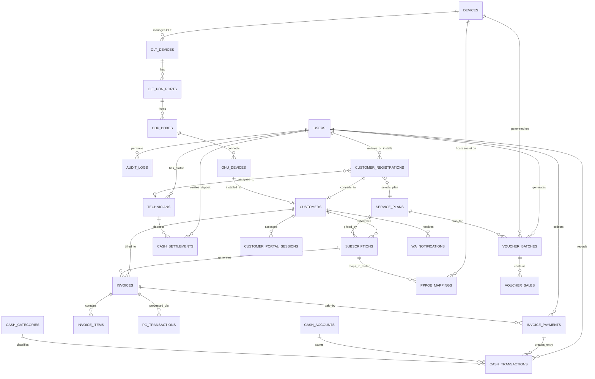

# Skema Database Definitif ISP Management & NetOps Engine (Polyglot)

> **Prinsip Arsitektur Utama**:
> 1. **Database PostgreSQL**: Sumber kebenaran tunggal untuk data bisnis (pendaftaran online, pelanggan, infrastruktur FTTH/OLT, plan, harga, invoice, kas, setoran kolektor, voucher sales, & audit log).
> 2. **Mikrotik Router**: Sumber kebenaran tunggal untuk data operasional jaringan (PPPoE secrets, active sessions, IP leases, queue). Database **hanya menyimpan mapping/referensi** (`pppoe_mappings`).
> 3. **Live Monitoring Only**: Metrik CPU/memori/traffic router dipantau secara *live* melalui WebSocket/SSE saat dashboard dibuka — **tidak disimpan di DB** untuk mencegah *database bloat*.

---

## 1. Matriks Penyesuaian Berdasarkan Kebutuhan Nyata ISP

| Komponen | Status di Skema | Alasan & Bentuk Implementasi |
|---|---|---|
| **Pendaftaran Online & Approval** | **Aktif (`customer_registrations`)** | Alur pendaftaran mandiri: `PENDING` $\rightarrow$ `APPROVED` (Jadwal pasang & Teknisi) $\rightarrow$ `IN_INSTALLATION` $\rightarrow$ `COMPLETED` (Otomatis buat pelanggan & push secret ke Mikrotik). |
| **Infrastruktur FTTH / OLT** | **Modul Baru (`olt_devices`, `olt_pon_ports`, `odp_boxes`, `onu_devices`)** | Manajemen hierarki OLT (ZTE/Huawei), PON Port, ODP Box, dan spesifikasi ONU/ONT (Serial Number, Redaman Optik dBm) terhubung langsung ke pelanggan. |
| **Penyimpanan Data PPPoE** | **Mapping Only (`pppoe_mappings`)** | Database hanya menyimpan `username`, `device_id`, dan `sync_status`. Password & profile *live* di Mikrotik `/ppp/secret`. |
| **Manajemen Voucher Hotspot** | **Modul Baru (`voucher_batches`, `voucher_sales`)** | Mendukung **Cetak Voucher Fisik Batch** & **Penjualan Online via QRIS di Portal Captive Hotspot**. Menjadi sumber kebenaran laporan penjualan (menggantikan `/system/script` Mikrotik). |
| **Pembukuan Keuangan & Kas** | **Buku Kas Sederhana (`cash_accounts`, `cash_categories`, `cash_transactions`)** | Fokus pada Arus Kas Keluar-Masuk (pembayaran tagihan, penjualan voucher, operasional) tanpa komplikasi akuntansi *double-entry*. |
| **Setoran Penagihan Lapangan** | **Modul Baru (`cash_settlements`)** | Pelacakan dompet kas lapangan per teknisi/kolektor dan alur verifikasi **setoran kas kolektor ke kasir kantor**. |
| **Riwayat Telemetri Router** | **Dihapus (Live Monitoring Only)** | Tabel `device_metrics` dihapus. Metrik dibaca real-time dari router via WebSocket/SSE saat admin membuka dashboard. |

---

## 2. Diagram Relasi Entitas (Entity-Relationship Diagram)



---

## 3. Definisi Skema Database (DDL PostgreSQL)

### 3.1 Utilitas Umum
```sql
CREATE EXTENSION IF NOT EXISTS "pgcrypto";

CREATE OR REPLACE FUNCTION set_updated_at()
RETURNS TRIGGER AS $$
BEGIN
    NEW.updated_at = CURRENT_TIMESTAMP;
    RETURN NEW;
END;
$$ LANGUAGE plpgsql;
```

---

### 3.2 Identitas, Pengguna & Dompet Kolektor Lapangan

```sql
-- 1. Pengguna System (Admin, NOC, Kasir, Teknisi)
CREATE TABLE users (
    id            UUID PRIMARY KEY DEFAULT gen_random_uuid(),
    username      VARCHAR(50)  UNIQUE NOT NULL,
    email         VARCHAR(100) UNIQUE NOT NULL,
    password_hash VARCHAR(255) NOT NULL,
    full_name     VARCHAR(100) NOT NULL,
    phone         VARCHAR(20),
    role          VARCHAR(30)  NOT NULL DEFAULT 'OPERATOR', 
    -- SUPERADMIN, ADMIN, NOC, TECHNICIAN, COLLECTOR, FINANCE
    is_active     BOOLEAN      NOT NULL DEFAULT TRUE,
    created_at    TIMESTAMPTZ  NOT NULL DEFAULT CURRENT_TIMESTAMP,
    updated_at    TIMESTAMPTZ  NOT NULL DEFAULT CURRENT_TIMESTAMP
);

CREATE INDEX idx_users_role ON users(role);

-- 2. Profil Teknisi / Penagih Lapangan (Collector)
CREATE TABLE technicians (
    id                 UUID PRIMARY KEY DEFAULT gen_random_uuid(),
    user_id            UUID        NOT NULL REFERENCES users(id) ON DELETE CASCADE,
    employee_code      VARCHAR(30) UNIQUE NOT NULL,
    assigned_zone      VARCHAR(100),
    specialization     VARCHAR(50), -- FIBER_OPTIC, WIRELESS, NOC_SUPPORT
    phone_number       VARCHAR(20),
    is_collector       BOOLEAN     DEFAULT FALSE,
    current_cash_limit NUMERIC(15,2) DEFAULT 0.00, -- Batas maksimal uang kas sebelum disetor
    created_at         TIMESTAMPTZ NOT NULL DEFAULT CURRENT_TIMESTAMP,
    updated_at         TIMESTAMPTZ NOT NULL DEFAULT CURRENT_TIMESTAMP
);

CREATE TRIGGER trg_users_upd BEFORE UPDATE ON users FOR EACH ROW EXECUTE FUNCTION set_updated_at();
CREATE TRIGGER trg_tech_upd  BEFORE UPDATE ON technicians FOR EACH ROW EXECUTE FUNCTION set_updated_at();
```

---

### 3.3 Infrastruktur FTTH & Inventori OLT / ODP / ONU (Baru)

Mengelola hierarki perangkat optik dari OLT $\rightarrow$ PON Port $\rightarrow$ ODP $\rightarrow$ ONU/ONT Pelanggan.

```sql
-- 3. Perangkat OLT (ZTE / Huawei OLT)
CREATE TABLE olt_devices (
    id             UUID PRIMARY KEY DEFAULT gen_random_uuid(),
    device_id      UUID UNIQUE NOT NULL REFERENCES devices(id) ON DELETE CASCADE, -- Reference ke devices inventory
    name           VARCHAR(100) NOT NULL,
    vendor         VARCHAR(30)  NOT NULL, -- ZTE, HUAWEI
    total_pon_ports INT         NOT NULL DEFAULT 8,
    ip_address     VARCHAR(45)  NOT NULL,
    created_at     TIMESTAMPTZ  NOT NULL DEFAULT CURRENT_TIMESTAMP,
    updated_at     TIMESTAMPTZ  NOT NULL DEFAULT CURRENT_TIMESTAMP
);

-- 4. Port PON OLT
CREATE TABLE olt_pon_ports (
    id            UUID PRIMARY KEY DEFAULT gen_random_uuid(),
    olt_id        UUID        NOT NULL REFERENCES olt_devices(id) ON DELETE CASCADE,
    port_number   INT         NOT NULL, -- 1 s/d 16
    name          VARCHAR(30) NOT NULL, -- Contoh: gpon-olt_1/1/1
    max_onu_limit INT         NOT NULL DEFAULT 64,
    created_at    TIMESTAMPTZ NOT NULL DEFAULT CURRENT_TIMESTAMP,
    CONSTRAINT uq_olt_port UNIQUE (olt_id, port_number)
);

-- 5. Kotak ODP (Optical Distribution Point)
CREATE TABLE odp_boxes (
    id           UUID PRIMARY KEY DEFAULT gen_random_uuid(),
    pon_port_id  UUID         NOT NULL REFERENCES olt_pon_ports(id) ON DELETE RESTRICT,
    code         VARCHAR(50)  UNIQUE NOT NULL, -- Contoh: ODP-KOT-01/04
    name         VARCHAR(100) NOT NULL,
    total_ports  INT          NOT NULL DEFAULT 8,
    latitude     DOUBLE PRECISION,
    longitude    DOUBLE PRECISION,
    address_note TEXT,
    created_at   TIMESTAMPTZ  NOT NULL DEFAULT CURRENT_TIMESTAMP,
    updated_at   TIMESTAMPTZ  NOT NULL DEFAULT CURRENT_TIMESTAMP
);

-- 6. Perangkat ONU / ONT Modem Pelanggan
CREATE TABLE onu_devices (
    id                UUID PRIMARY KEY DEFAULT gen_random_uuid(),
    odp_id            UUID        REFERENCES odp_boxes(id) ON DELETE SET NULL,
    odp_port_number   INT,
    serial_number     VARCHAR(50) UNIQUE NOT NULL, -- SN Modem (Gpon SN / MAC)
    brand_model       VARCHAR(50), -- ZTE F660, Huawei HG8245H, Fiberhome
    rx_power_dbm      NUMERIC(5,2), -- Redaman Optik (misal: -19.40 dBm)
    status            VARCHAR(20) NOT NULL DEFAULT 'ACTIVE', -- ACTIVE, LOS, OFFLINE, REPLACEMENT
    last_optical_check TIMESTAMPTZ,
    created_at        TIMESTAMPTZ NOT NULL DEFAULT CURRENT_TIMESTAMP,
    updated_at        TIMESTAMPTZ NOT NULL DEFAULT CURRENT_TIMESTAMP
);

CREATE INDEX idx_onu_sn  ON onu_devices(serial_number);
CREATE INDEX idx_onu_odp ON onu_devices(odp_id);

CREATE TRIGGER trg_olt_upd BEFORE UPDATE ON olt_devices FOR EACH ROW EXECUTE FUNCTION set_updated_at();
CREATE TRIGGER trg_odp_upd BEFORE UPDATE ON odp_boxes FOR EACH ROW EXECUTE FUNCTION set_updated_at();
CREATE TRIGGER trg_onu_upd BEFORE UPDATE ON onu_devices FOR EACH ROW EXECUTE FUNCTION set_updated_at();
```

---

### 3.4 Modul Pendaftaran Online & Work Order Pemasangan

```sql
-- 7. Pendaftaran Pelanggan Baru Online
CREATE TABLE customer_registrations (
    id                     UUID PRIMARY KEY DEFAULT gen_random_uuid(),
    registration_no        VARCHAR(30)  UNIQUE NOT NULL, -- Contoh: REG-202608-0012
    plan_id                UUID         NOT NULL REFERENCES service_plans(id) ON DELETE RESTRICT,
    target_device_id       UUID         REFERENCES devices(id) ON DELETE RESTRICT, -- Router BRAS Mikrotik
    
    -- Data Pemohon
    full_name              VARCHAR(100) NOT NULL,
    identity_number        VARCHAR(30),
    identity_photo_url     TEXT,
    phone                  VARCHAR(20)  NOT NULL, -- Nomor WhatsApp aktif
    email                  VARCHAR(100),
    installation_address   TEXT         NOT NULL,
    latitude               DOUBLE PRECISION,
    longitude              DOUBLE PRECISION,
    notes_from_customer    TEXT,
    
    -- Status Alur
    status                 VARCHAR(20)  NOT NULL DEFAULT 'PENDING', 
    -- PENDING, APPROVED, IN_INSTALLATION, COMPLETED, REJECTED, CANCELLED
    
    -- Review Admin & Penjadwalan
    reviewed_by            UUID         REFERENCES users(id),
    reviewed_at            TIMESTAMPTZ,
    admin_notes            TEXT,
    scheduled_install_date DATE,
    scheduled_install_time VARCHAR(20),
    
    -- Data Hasil Pemasangan Teknisi Lapangan
    assigned_technician_id UUID         REFERENCES technicians(id),
    installed_at           TIMESTAMPTZ,
    onu_device_id          UUID         REFERENCES onu_devices(id) ON DELETE SET NULL,
    technician_notes       TEXT,
    installation_photo_url TEXT,
    
    -- Relasi ke Pelanggan Aktif setelah Selesai
    converted_customer_id  UUID,
    
    created_at             TIMESTAMPTZ  NOT NULL DEFAULT CURRENT_TIMESTAMP,
    updated_at             TIMESTAMPTZ  NOT NULL DEFAULT CURRENT_TIMESTAMP
);

CREATE INDEX idx_reg_status ON customer_registrations(status);
CREATE INDEX idx_reg_phone  ON customer_registrations(phone);
CREATE INDEX idx_reg_tech   ON customer_registrations(assigned_technician_id);

CREATE TRIGGER trg_reg_upd BEFORE UPDATE ON customer_registrations FOR EACH ROW EXECUTE FUNCTION set_updated_at();
```

---

### 3.5 Master Pelanggan Aktif & Portal Pelanggan

```sql
-- 8. Master Pelanggan Aktif
CREATE TABLE customers (
    id                 UUID PRIMARY KEY DEFAULT gen_random_uuid(),
    customer_no        VARCHAR(30)  UNIQUE NOT NULL, -- Contoh: CUST-2026-0001
    registration_id    UUID         UNIQUE REFERENCES customer_registrations(id) ON DELETE SET NULL,
    onu_device_id      UUID         UNIQUE REFERENCES onu_devices(id) ON DELETE SET NULL,
    name               VARCHAR(100) NOT NULL,
    identity_number    VARCHAR(30),
    email              VARCHAR(100),
    phone              VARCHAR(20)  NOT NULL,
    address            TEXT         NOT NULL,
    latitude           DOUBLE PRECISION,
    longitude          DOUBLE PRECISION,
    portal_access_code VARCHAR(16)  UNIQUE NOT NULL, -- Kode unik 6-16 digit untuk scan/portal
    status             VARCHAR(20)  NOT NULL DEFAULT 'ACTIVE', -- ACTIVE, ISOLATED, SUSPENDED, TERMINATED
    registered_at      DATE         NOT NULL DEFAULT CURRENT_DATE,
    created_at         TIMESTAMPTZ  NOT NULL DEFAULT CURRENT_TIMESTAMP,
    updated_at         TIMESTAMPTZ  NOT NULL DEFAULT CURRENT_TIMESTAMP
);

CREATE INDEX idx_cust_phone  ON customers(phone);
CREATE INDEX idx_cust_portal ON customers(portal_access_code);
CREATE INDEX idx_cust_status ON customers(status);

-- 9. Sesi Login Portal Pelanggan
CREATE TABLE customer_portal_sessions (
    id            UUID PRIMARY KEY DEFAULT gen_random_uuid(),
    customer_id   UUID         NOT NULL REFERENCES customers(id) ON DELETE CASCADE,
    session_token VARCHAR(128) UNIQUE NOT NULL,
    ip_address    VARCHAR(45),
    user_agent    TEXT,
    expires_at    TIMESTAMPTZ  NOT NULL,
    created_at    TIMESTAMPTZ  NOT NULL DEFAULT CURRENT_TIMESTAMP
);

CREATE TRIGGER trg_cust_upd BEFORE UPDATE ON customers FOR EACH ROW EXECUTE FUNCTION set_updated_at();
```

---

### 3.6 Paket Layanan (Service Plans) — Sumber Kebenaran Harga & Bandwidth

```sql
-- 10. Master Paket Layanan (Service Plans)
CREATE TABLE service_plans (
    id                     UUID PRIMARY KEY DEFAULT gen_random_uuid(),
    name                   VARCHAR(50)   NOT NULL,
    service_type           VARCHAR(20)   NOT NULL, -- PPPOE, HOTSPOT, DEDICATED
    bandwidth_download_kbps INT          NOT NULL,
    bandwidth_upload_kbps   INT          NOT NULL,
    burst_download_kbps     INT,
    burst_upload_kbps       INT,
    burst_threshold_kbps    INT,
    burst_time_seconds      INT,
    price                  NUMERIC(15,2) NOT NULL,
    selling_price          NUMERIC(15,2),
    installation_fee       NUMERIC(15,2) DEFAULT 0.00,
    tax_percent            NUMERIC(5,2)  DEFAULT 0.00,
    validity               VARCHAR(20)   DEFAULT '30d',
    validity_mode          VARCHAR(20)   DEFAULT 'CALENDAR', -- CALENDAR, UPTIME
    simultaneous_use       INT           DEFAULT 1,
    ip_pool_name           VARCHAR(50),
    parent_queue           VARCHAR(50),
    address_list           VARCHAR(50),
    shared_users           INT           DEFAULT 1,
    expire_mode            VARCHAR(10)   DEFAULT 'ntf', -- ntf, ntfc, rem, remc, 0
    lock_user              BOOLEAN       DEFAULT FALSE,
    lock_server            BOOLEAN       DEFAULT FALSE,
    limit_uptime           VARCHAR(20),
    limit_bytes            VARCHAR(20),
    is_active              BOOLEAN       NOT NULL DEFAULT TRUE,
    description            TEXT,
    created_at             TIMESTAMPTZ   NOT NULL DEFAULT CURRENT_TIMESTAMP,
    updated_at             TIMESTAMPTZ   NOT NULL DEFAULT CURRENT_TIMESTAMP
);

CREATE INDEX idx_plans_type   ON service_plans(service_type);
CREATE INDEX idx_plans_active ON service_plans(is_active);

CREATE TRIGGER trg_plans_upd BEFORE UPDATE ON service_plans FOR EACH ROW EXECUTE FUNCTION set_updated_at();
```

---

### 3.7 Langganan & PPPoE Mapping (Ke Router Mikrotik)

```sql
-- 11. Langganan Pelanggan
CREATE TABLE subscriptions (
    id                   UUID PRIMARY KEY DEFAULT gen_random_uuid(),
    customer_id          UUID         NOT NULL REFERENCES customers(id) ON DELETE RESTRICT,
    plan_id              UUID         NOT NULL REFERENCES service_plans(id) ON DELETE RESTRICT,
    service_type         VARCHAR(20)  NOT NULL, -- PPPOE, HOTSPOT
    billing_type         VARCHAR(20)  NOT NULL DEFAULT 'POSTPAID',
    billing_cycle_day    INT          NOT NULL DEFAULT 1,
    auto_isolate         BOOLEAN      NOT NULL DEFAULT TRUE,
    isolation_grace_days INT          NOT NULL DEFAULT 3,
    current_status       VARCHAR(20)  NOT NULL DEFAULT 'ACTIVE',
    start_date           DATE         NOT NULL,
    end_date             DATE,
    custom_price         NUMERIC(15,2),
    notes                TEXT,
    created_at           TIMESTAMPTZ  NOT NULL DEFAULT CURRENT_TIMESTAMP,
    updated_at           TIMESTAMPTZ  NOT NULL DEFAULT CURRENT_TIMESTAMP
);

CREATE INDEX idx_sub_cust   ON subscriptions(customer_id);
CREATE INDEX idx_sub_status ON subscriptions(current_status);

-- 12. Mapping Referensi PPPoE ke Mikrotik (Tanpa Duplikasi Password/Rate-Limit)
CREATE TABLE pppoe_mappings (
    id              UUID PRIMARY KEY DEFAULT gen_random_uuid(),
    subscription_id UUID        UNIQUE NOT NULL REFERENCES subscriptions(id) ON DELETE CASCADE,
    device_id       UUID        NOT NULL REFERENCES devices(id) ON DELETE RESTRICT,
    username        VARCHAR(64) UNIQUE NOT NULL,
    profile_name    VARCHAR(50) NOT NULL,
    static_ip       VARCHAR(45),
    caller_id       VARCHAR(50),
    comment_tag     VARCHAR(100),
    provisioned_at  TIMESTAMPTZ,
    last_synced_at  TIMESTAMPTZ,
    sync_status     VARCHAR(20) NOT NULL DEFAULT 'PENDING', -- PENDING, SYNCED, ERROR, DEPROVISIONED
    error_message   TEXT,
    created_at      TIMESTAMPTZ NOT NULL DEFAULT CURRENT_TIMESTAMP,
    updated_at      TIMESTAMPTZ NOT NULL DEFAULT CURRENT_TIMESTAMP
);

CREATE INDEX idx_pppoe_map_device ON pppoe_mappings(device_id);
CREATE INDEX idx_pppoe_map_user   ON pppoe_mappings(username);

CREATE TRIGGER trg_sub_upd BEFORE UPDATE ON subscriptions FOR EACH ROW EXECUTE FUNCTION set_updated_at();
CREATE TRIGGER trg_pppoe_map_upd BEFORE UPDATE ON pppoe_mappings FOR EACH ROW EXECUTE FUNCTION set_updated_at();
```

---

### 3.8 Voucher Management (Cetak Fisik & Penjualan Online Portal)

```sql
-- 13. Batch Cetak Voucher Fisik Hotspot
CREATE TABLE voucher_batches (
    id              UUID PRIMARY KEY DEFAULT gen_random_uuid(),
    batch_code      VARCHAR(32) UNIQUE NOT NULL,
    plan_id         UUID        NOT NULL REFERENCES service_plans(id) ON DELETE RESTRICT,
    device_id       UUID        NOT NULL REFERENCES devices(id) ON DELETE RESTRICT,
    quantity        INT         NOT NULL,
    unit_price      NUMERIC(15,2) NOT NULL,
    selling_price   NUMERIC(15,2) NOT NULL,
    charset_type    VARCHAR(20) NOT NULL DEFAULT 'lowernum',
    username_length INT         NOT NULL DEFAULT 6,
    prefix          VARCHAR(10) DEFAULT '',
    generated_by    UUID        NOT NULL REFERENCES users(id),
    generated_at    TIMESTAMPTZ NOT NULL DEFAULT CURRENT_TIMESTAMP,
    notes           TEXT
);

CREATE INDEX idx_vbatch_plan   ON voucher_batches(plan_id);
CREATE INDEX idx_vbatch_device ON voucher_batches(device_id);

-- 14. Record Penjualan Voucher (Fisik + Pembelian Online Portal via QRIS)
CREATE TABLE voucher_sales (
    id                   UUID PRIMARY KEY DEFAULT gen_random_uuid(),
    batch_id             UUID           REFERENCES voucher_batches(id) ON DELETE CASCADE, -- NULL jika pembelian online mandiri
    plan_id              UUID           NOT NULL REFERENCES service_plans(id) ON DELETE RESTRICT,
    device_id            UUID           NOT NULL REFERENCES devices(id) ON DELETE RESTRICT,
    username             VARCHAR(64)    NOT NULL,
    password             VARCHAR(64)    NOT NULL,
    profile_name         VARCHAR(50)    NOT NULL,
    sold_price           NUMERIC(15,2)  NOT NULL,
    cost_price           NUMERIC(15,2)  NOT NULL,
    sale_channel         VARCHAR(20)    NOT NULL DEFAULT 'PHYSICAL_PRINT', -- PHYSICAL_PRINT, ONLINE_PORTAL, AGENT_RESELLER
    status               VARCHAR(20)    NOT NULL DEFAULT 'AVAILABLE', -- AVAILABLE, ACTIVE, USED, EXPIRED
    comment_tag          VARCHAR(100),
    sold_at              TIMESTAMPTZ,
    sold_by              UUID           REFERENCES users(id),
    buyer_phone          VARCHAR(20), -- Nomor WA pembeli jika via portal online
    payment_gateway_tx_id UUID,        -- Reference ke payment_gateway_transactions jika beli online
    activated_at         TIMESTAMPTZ,
    expires_at           TIMESTAMPTZ,
    created_at           TIMESTAMPTZ    NOT NULL DEFAULT CURRENT_TIMESTAMP
);

CREATE INDEX idx_vsale_batch    ON voucher_sales(batch_id);
CREATE INDEX idx_vsale_status   ON voucher_sales(status);
CREATE INDEX idx_vsale_username ON voucher_sales(username);
CREATE INDEX idx_vsale_sold_at  ON voucher_sales(sold_at);
```

---

### 3.9 Billing, Invoice & Penagihan Lapangan Cepat (Scan QR / Kode)

```sql
-- 15. Faktur Tagihan
CREATE TABLE invoices (
    id                  UUID PRIMARY KEY DEFAULT gen_random_uuid(),
    invoice_no          VARCHAR(50) UNIQUE NOT NULL, -- INV-202608-00042
    customer_id         UUID        NOT NULL REFERENCES customers(id) ON DELETE RESTRICT,
    subscription_id     UUID        REFERENCES subscriptions(id) ON DELETE SET NULL,
    registration_id     UUID        REFERENCES customer_registrations(id) ON DELETE SET NULL, -- Tagihan instalasi awal
    period_start        DATE        NOT NULL,
    period_end          DATE        NOT NULL,
    subtotal            NUMERIC(15,2) NOT NULL,
    tax_amount          NUMERIC(15,2) NOT NULL DEFAULT 0.00,
    discount_amount     NUMERIC(15,2) NOT NULL DEFAULT 0.00,
    total_amount        NUMERIC(15,2) NOT NULL,
    paid_amount         NUMERIC(15,2) NOT NULL DEFAULT 0.00,
    due_date            DATE        NOT NULL,
    status              VARCHAR(20) NOT NULL DEFAULT 'UNPAID', -- UNPAID, PARTIAL, PAID, OVERDUE, CANCELLED
    qr_payload          VARCHAR(100) UNIQUE NOT NULL,
    manual_payment_code VARCHAR(20)  UNIQUE NOT NULL,
    notes               TEXT,
    created_at          TIMESTAMPTZ NOT NULL DEFAULT CURRENT_TIMESTAMP,
    updated_at          TIMESTAMPTZ NOT NULL DEFAULT CURRENT_TIMESTAMP
);

CREATE INDEX idx_inv_cust    ON invoices(customer_id);
CREATE INDEX idx_inv_status  ON invoices(status);
CREATE INDEX idx_inv_due     ON invoices(due_date);
CREATE INDEX idx_inv_qr      ON invoices(qr_payload);
CREATE INDEX idx_inv_code    ON invoices(manual_payment_code);

-- 16. Rincian Baris Tagihan
CREATE TABLE invoice_items (
    id          UUID PRIMARY KEY DEFAULT gen_random_uuid(),
    invoice_id  UUID          NOT NULL REFERENCES invoices(id) ON DELETE CASCADE,
    description VARCHAR(150)  NOT NULL,
    quantity    INT           NOT NULL DEFAULT 1,
    unit_price  NUMERIC(15,2) NOT NULL,
    total_price NUMERIC(15,2) NOT NULL,
    item_type   VARCHAR(30)   NOT NULL DEFAULT 'SUBSCRIPTION_FEE' 
    -- INSTALLATION_FEE, SUBSCRIPTION_FEE, DEVICE_RENT, AD_HOC
);

-- 17. Bukti Pelunasan Tagihan
CREATE TABLE invoice_payments (
    id               UUID PRIMARY KEY DEFAULT gen_random_uuid(),
    payment_no       VARCHAR(50)   UNIQUE NOT NULL,
    invoice_id       UUID          NOT NULL REFERENCES invoices(id) ON DELETE RESTRICT,
    amount           NUMERIC(15,2) NOT NULL,
    payment_method   VARCHAR(30)   NOT NULL, -- CASH_COLLECTOR, CASH_OFFICE, BANK_TRANSFER, PAYMENT_GATEWAY, QRIS
    collector_id     UUID          REFERENCES users(id),
    reference_number VARCHAR(100),
    scan_method      VARCHAR(20), -- QR_SCAN, CODE_INPUT, DIRECT_SELECTION, PG_WEBHOOK
    paid_at          TIMESTAMPTZ   NOT NULL DEFAULT CURRENT_TIMESTAMP,
    notes            TEXT,
    created_at       TIMESTAMPTZ   NOT NULL DEFAULT CURRENT_TIMESTAMP
);

CREATE INDEX idx_pay_inv       ON invoice_payments(invoice_id);
CREATE INDEX idx_pay_collector ON invoice_payments(collector_id);

CREATE TRIGGER trg_inv_upd BEFORE UPDATE ON invoices FOR EACH ROW EXECUTE FUNCTION set_updated_at();
```

---

### 3.10 Payment Gateway (Midtrans / Xendit / Tripay)

```sql
-- 18. Transaksi Online Payment Gateway
CREATE TABLE payment_gateway_transactions (
    id                UUID PRIMARY KEY DEFAULT gen_random_uuid(),
    invoice_id        UUID          REFERENCES invoices(id) ON DELETE CASCADE, -- NULL jika transaksi beli voucher
    voucher_sale_id   UUID          REFERENCES voucher_sales(id) ON DELETE CASCADE,
    gateway_provider  VARCHAR(30)   NOT NULL, -- TRIPAY, MIDTRANS, XENDIT, DUITKU
    gateway_reference VARCHAR(100)  UNIQUE NOT NULL,
    payment_channel   VARCHAR(50)   NOT NULL, -- BCA_VA, MANDIRI_VA, QRIS, INDOMARET
    amount            NUMERIC(15,2) NOT NULL,
    fee_amount        NUMERIC(15,2) DEFAULT 0.00,
    checkout_url      TEXT,
    qr_string         TEXT,
    status            VARCHAR(30)   NOT NULL DEFAULT 'PENDING',
    raw_payload       JSONB,
    paid_at           TIMESTAMPTZ,
    expires_at        TIMESTAMPTZ,
    created_at        TIMESTAMPTZ   NOT NULL DEFAULT CURRENT_TIMESTAMP,
    updated_at        TIMESTAMPTZ   NOT NULL DEFAULT CURRENT_TIMESTAMP
);

-- 19. Webhook Audit Log Payment Gateway
CREATE TABLE payment_gateway_webhooks (
    id           UUID PRIMARY KEY DEFAULT gen_random_uuid(),
    provider     VARCHAR(30)  NOT NULL,
    event_type   VARCHAR(50)  NOT NULL,
    payload      JSONB        NOT NULL,
    signature    VARCHAR(255),
    is_processed BOOLEAN      NOT NULL DEFAULT FALSE,
    error_message TEXT,
    received_at  TIMESTAMPTZ  NOT NULL DEFAULT CURRENT_TIMESTAMP
);

CREATE TRIGGER trg_pgtx_upd BEFORE UPDATE ON payment_gateway_transactions FOR EACH ROW EXECUTE FUNCTION set_updated_at();
```

---

### 3.11 Buku Kas, Arus Kas & Setoran Kasir Lapangan (Baru)

```sql
-- 20. Rekening Kas (Kantor, Bank, Dompet Kolektor, PG Escrow)
CREATE TABLE cash_accounts (
    id               UUID PRIMARY KEY DEFAULT gen_random_uuid(),
    account_code     VARCHAR(30)   UNIQUE NOT NULL, -- 1001-KAS-KANTOR, 1002-BANK-BCA, 1003-KOLEKTOR-BUDI
    name             VARCHAR(100)  NOT NULL,
    account_type     VARCHAR(30)   NOT NULL, -- CASH_DRAWER, BANK_ACCOUNT, COLLECTOR_WALLET, PG_ESCROW
    assigned_user_id UUID          REFERENCES users(id),
    current_balance  NUMERIC(15,2) NOT NULL DEFAULT 0.00,
    is_active        BOOLEAN       NOT NULL DEFAULT TRUE,
    created_at       TIMESTAMPTZ   NOT NULL DEFAULT CURRENT_TIMESTAMP,
    updated_at       TIMESTAMPTZ   NOT NULL DEFAULT CURRENT_TIMESTAMP
);

-- 21. Kategori Sederhana Arus Kas (Pendapatan vs Pengeluaran Operasional)
CREATE TABLE cash_categories (
    id             UUID PRIMARY KEY DEFAULT gen_random_uuid(),
    name           VARCHAR(100) NOT NULL,
    category_type  VARCHAR(20)  NOT NULL, -- INCOME, EXPENSE
    is_operational BOOLEAN      NOT NULL DEFAULT TRUE,
    description    TEXT,
    created_at     TIMESTAMPTZ  NOT NULL DEFAULT CURRENT_TIMESTAMP
);

-- 22. Jurnal Mutasi Kas Keluar & Masuk
CREATE TABLE cash_transactions (
    id                      UUID PRIMARY KEY DEFAULT gen_random_uuid(),
    transaction_no         VARCHAR(50)   UNIQUE NOT NULL,
    cash_account_id         UUID          NOT NULL REFERENCES cash_accounts(id) ON DELETE RESTRICT,
    category_id             UUID          NOT NULL REFERENCES cash_categories(id) ON DELETE RESTRICT,
    transaction_type        VARCHAR(10)   NOT NULL, -- DEBIT (Masuk), CREDIT (Keluar), TRANSFER
    amount                  NUMERIC(15,2) NOT NULL,
    balance_after           NUMERIC(15,2) NOT NULL,
    related_payment_id      UUID          REFERENCES invoice_payments(id),
    related_voucher_sale_id UUID          REFERENCES voucher_sales(id),
    target_cash_account_id  UUID          REFERENCES cash_accounts(id),
    recorded_by             UUID          NOT NULL REFERENCES users(id),
    receipt_attachment_url  TEXT,
    description             TEXT          NOT NULL,
    transaction_date        TIMESTAMPTZ   NOT NULL DEFAULT CURRENT_TIMESTAMP,
    created_at              TIMESTAMPTZ   NOT NULL DEFAULT CURRENT_TIMESTAMP
);

CREATE INDEX idx_cash_trx_acct ON cash_transactions(cash_account_id);
CREATE INDEX idx_cash_trx_cat  ON cash_transactions(category_id);
CREATE INDEX idx_cash_trx_date ON cash_transactions(transaction_date);

-- 23. Setoran Kas Lapangan (Settlement Kolektor ke Kasir Kantor)
CREATE TABLE cash_settlements (
    id                     UUID PRIMARY KEY DEFAULT gen_random_uuid(),
    settlement_no          VARCHAR(50)   UNIQUE NOT NULL, -- SET-202608-0005
    collector_user_id      UUID          NOT NULL REFERENCES users(id),
    collector_account_id   UUID          NOT NULL REFERENCES cash_accounts(id),
    office_account_id      UUID          NOT NULL REFERENCES cash_accounts(id),
    amount                 NUMERIC(15,2) NOT NULL,
    status                 VARCHAR(20)   NOT NULL DEFAULT 'PENDING', -- PENDING, VERIFIED, REJECTED
    verified_by            UUID          REFERENCES users(id),
    verified_at            TIMESTAMPTZ,
    notes                  TEXT,
    created_at             TIMESTAMPTZ   NOT NULL DEFAULT CURRENT_TIMESTAMP
);

CREATE INDEX idx_settle_collector ON cash_settlements(collector_user_id);
CREATE INDEX idx_settle_status    ON cash_settlements(status);

CREATE TRIGGER trg_cash_acct_upd BEFORE UPDATE ON cash_accounts FOR EACH ROW EXECUTE FUNCTION set_updated_at();
```

---

### 3.12 Log Notifikasi WhatsApp & Audit Trail

```sql
-- 24. Log Notifikasi WhatsApp Otomatis
CREATE TABLE wa_notifications (
    id              UUID PRIMARY KEY DEFAULT gen_random_uuid(),
    registration_id UUID         REFERENCES customer_registrations(id) ON DELETE SET NULL,
    customer_id     UUID         REFERENCES customers(id) ON DELETE SET NULL,
    invoice_id      UUID         REFERENCES invoices(id) ON DELETE SET NULL,
    recipient_phone VARCHAR(20)  NOT NULL,
    message_type    VARCHAR(30)  NOT NULL, 
    -- REGISTRATION_RECEIVED, REGISTRATION_APPROVED, INSTALLATION_SCHEDULED, INSTALLATION_COMPLETED, REGISTRATION_REJECTED, BILL_REMINDER, PAYMENT_RECEIPT, ISOLATION_NOTICE, OTP
    message_content TEXT         NOT NULL,
    status          VARCHAR(20)  NOT NULL DEFAULT 'QUEUED', -- QUEUED, SENT, DELIVERED, READ, FAILED
    error_message   TEXT,
    sent_at         TIMESTAMPTZ,
    created_at      TIMESTAMPTZ  NOT NULL DEFAULT CURRENT_TIMESTAMP
);

CREATE INDEX idx_wa_reg    ON wa_notifications(registration_id);
CREATE INDEX idx_wa_cust   ON wa_notifications(customer_id);
CREATE INDEX idx_wa_status ON wa_notifications(status);

-- 25. Audit Log Aktivitas Pengguna
CREATE TABLE activity_audit_logs (
    id          UUID PRIMARY KEY DEFAULT gen_random_uuid(),
    user_id     UUID        REFERENCES users(id) ON DELETE SET NULL,
    action      VARCHAR(50) NOT NULL,
    entity_name VARCHAR(50) NOT NULL,
    entity_id   VARCHAR(50),
    ip_address  VARCHAR(45),
    user_agent  TEXT,
    old_values  JSONB,
    new_values  JSONB,
    description TEXT,
    created_at  TIMESTAMPTZ NOT NULL DEFAULT CURRENT_TIMESTAMP
);

CREATE INDEX idx_audit_user   ON activity_audit_logs(user_id);
CREATE INDEX idx_audit_action ON activity_audit_logs(action);
CREATE INDEX idx_audit_date   ON activity_audit_logs(created_at);

-- 26. Log Eksekusi Perintah ke Hardware Jaringan (Mikrotik/OLT)
CREATE TABLE command_execution_logs (
    id            UUID PRIMARY KEY DEFAULT gen_random_uuid(),
    user_id       UUID        REFERENCES users(id) ON DELETE SET NULL,
    device_id     UUID        NOT NULL REFERENCES devices(id) ON DELETE CASCADE,
    command_raw   TEXT        NOT NULL,
    command_class VARCHAR(20) NOT NULL,
    success       BOOLEAN     NOT NULL,
    output        TEXT,
    error_message TEXT,
    executed_at   TIMESTAMPTZ NOT NULL DEFAULT CURRENT_TIMESTAMP
);

CREATE INDEX idx_cmdlog_device ON command_execution_logs(device_id);
CREATE INDEX idx_cmdlog_date   ON command_execution_logs(executed_at);
```

---

## 4. Ringkasan Tabel Definitif

| # | Tabel | Fungsi |
|---|---|---|
| 1 | `users` | Akun pengguna internal system (admin, NOC, teknisi, kasir) |
| 2 | `technicians` | Profil teknisi / kolektor penagihan lapangan & batas kas |
| 3 | `olt_devices` | Master perangkat OLT (ZTE / Huawei) |
| 4 | `olt_pon_ports` | Master port PON pada OLT |
| 5 | `odp_boxes` | Kotak ODP (Optical Distribution Point) & lokasi GIS |
| 6 | `onu_devices` | Inventori modem ONT/ONU pelanggan & redaman optical power (dBm) |
| 7 | `customer_registrations` | **Alur pendaftaran online, survey, approval & work order pasang** |
| 8 | `customers` | Master pelanggan aktif ISP + portal access code |
| 9 | `customer_portal_sessions` | Sesi login portal mandiri pelanggan |
| 10 | `service_plans` | **Sumber kebenaran** paket, bandwidth & harga (PPPoE + Hotspot) |
| 11 | `subscriptions` | Langganan aktif pelanggan |
| 12 | `pppoe_mappings` | **Mapping referensi** ke PPPoE secret di router Mikrotik |
| 13 | `voucher_batches` | Batch pencetakan voucher hotspot fisik |
| 14 | `voucher_sales` | **Record penjualan voucher** (Cetak Fisik + Beli Online QRIS) |
| 15 | `invoices` | Tagihan (instalasi + bulanan) + QR / kode manual |
| 16 | `invoice_items` | Rincian baris item per invoice |
| 17 | `invoice_payments` | Kwitansi pelunasan tagihan |
| 18 | `payment_gateway_transactions` | Transaksi Payment Gateway online (Faktur + Voucher) |
| 19 | `payment_gateway_webhooks` | Audit log webhook PG |
| 20 | `cash_accounts` | Rekening kas (kantor, bank, dompet teknisi, PG escrow) |
| 21 | `cash_categories` | Kategori debit / kredit kas operasional |
| 22 | `cash_transactions` | Jurnal mutasi kas keluar & masuk |
| 23 | `cash_settlements` | **Alur setoran kas lapangan dari kolektor ke kasir kantor** |
| 24 | `wa_notifications` | Antrian & log notifikasi WhatsApp otomatis |
| 25 | `activity_audit_logs` | Audit trail aktivitas pengguna |
| 26 | `command_execution_logs` | Audit log eksekusi perintah ke hardware |

**Total: 26 tabel** (di luar tabel `devices` dan `credentials` yang telah ada).
