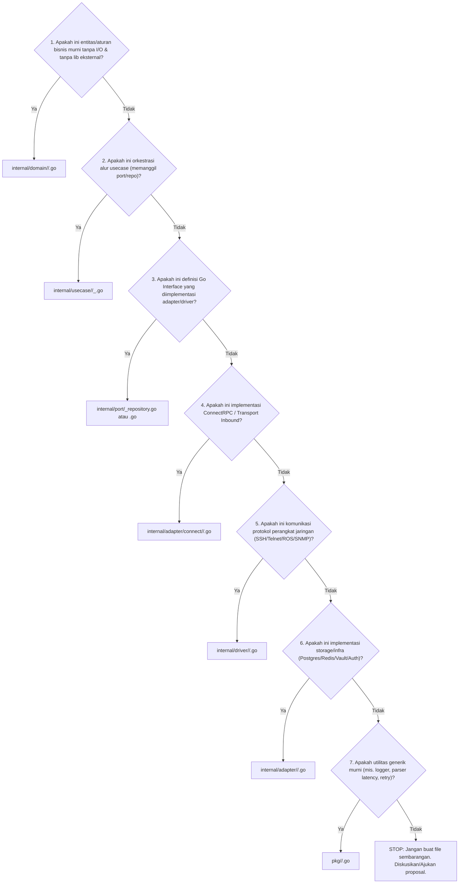

# Panduan & Standar Pengembangan (Development Guidelines) — Polyglot NetOps Engine

Dokumen ini adalah **standar definitif dan aturan baku pengembangan** untuk seluruh kontributor dan AI Agent pada proyek **Polyglot** (Go Backend). Semua kode baru, refactoring, dan penambahan fitur **wajib** mematuhi panduan ini tanpa pengecualian agar codebase tetap konsisten, modular, maintainable, dan bersih.

---

## Daftar Isi

1. [Prinsip Utama & Batasan Arsitektur (Architectural Invariants)](#1-prinsip-utama--batasan-arsitektur)
2. [Matriks Penempatan File & Folder (Directory & File Placement)](#2-matriks-penempatan-file--folder)
3. [Konvensi Penamaan (Naming Conventions)](#3-konvensi-penamaan)
4. [Standar Desain & Pola Kode Tiap Layer (Layer Implementation Patterns)](#4-standar-desain--pola-kode-tiap-layer)
   - [4.1 Domain Layer (`internal/domain/`)](#41-domain-layer)
   - [4.2 Port Layer (`internal/port/`)](#42-port-layer)
   - [4.3 Use Case Layer (`internal/usecase/`)](#43-use-case-layer)
   - [4.4 Adapter ConnectRPC Layer (`internal/adapter/connect/`)](#44-adapter-connectrpc-layer)
   - [4.5 Adapter HTTP & Middleware Layer (`internal/adapter/http/`)](#45-adapter-http--middleware-layer)
   - [4.6 Adapter WebSocket & SSE Layer (`internal/adapter/ws/`)](#46-adapter-websocket--sse-layer)
   - [4.7 Driver Layer (`internal/driver/`)](#47-driver-layer)
   - [4.8 Shared Packages (`pkg/`)](#48-shared-packages)
5. [Standar Logging Terpusat (Logrus Standard)](#5-standar-logging-terpusat)
6. [Manajemen Error & Response Mapping](#6-manajemen-error--response-mapping)
7. [Checklist Verifikasi Sebelum Commit / Merge](#7-checklist-verifikasi)

---

## 1. Prinsip Utama & Batasan Arsitektur

Arsitektur Polyglot mengadopsi **Hexagonal / Clean Architecture (Ports and Adapters)** dengan batasan keras (*hard boundaries*):

```
┌─────────────────────────────────────────────────────────────────────────────┐
│                          Transport & Inbound Layer                          │
│   (ConnectRPC Handlers, ServeMux, Middlewares, SSE Hub, WS Terminal, MCP)  │
└──────────────────────────────────────┬──────────────────────────────────────┘
                                       │ calls
                                       ▼
┌─────────────────────────────────────────────────────────────────────────────┐
│                              Use Case Layer                                 │
│      (Orchestration, Business Logic, Streaming Flows, Device Execution)     │
└──────────────┬───────────────────────────────────────────────┬──────────────┘
               │ depends on                                    │ calls via interface
               ▼                                               ▼
┌───────────────────────────────┐               ┌─────────────────────────────┐
│         Domain Layer          │               │         Port Layer          │
│   (Pure Entities, Enums,      │               │   (Go Interfaces: Repos,    │
│    Validation, Domain Errors) │               │    Drivers, Auth, Vault)    │
└───────────────────────────────┘               └──────────────▲──────────────┘
                                                               │ implemented by
                                                ┌──────────────┴──────────────┐
                                                │ Outbound Adapters & Drivers │
                                                │   (Postgres GORM, Redis,    │
                                                │    Mikrotik, Cisco, WA)     │
└─────────────────────────────────────────────────────────────────────────────┘
```

### Hukum Batasan Lapisan (*Layer Boundaries*):

1. **Domain adalah Pusat Murni**:
   - `internal/domain/` **HANYA** boleh mengimpor Go Standard Library (`time`, `errors`, `fmt`, `strings`, dll.).
   - **DILARANG KERAS** mengimpor `adapter`, `driver`, `port`, `usecase`, database driver (`gorm`), ataupun generated Protobuf (`api/gen/v1`).
2. **Use Case Bergantung Hanya ke Domain dan Port**:
   - `internal/usecase/` mengimpor `domain` dan `port`.
   - **DILARANG KERAS** mengimpor `adapter` (seperti HTTP, Gin, ConnectRPC, Postgres, Redis).
   - Use Case tidak boleh tahu apakah request datang dari ConnectRPC, MCP, CLI, atau SSE.
3. **Port adalah Kontrak Antarmuka (Go Interface)**:
   - Semua antarmuka outbound didefinisikan di `internal/port/`.
   - Implementasi konkret ditaruh di `internal/adapter/` atau `internal/driver/`.
4. **Pemisahan Total Transport Contract (Protobuf) vs Domain Model**:
   - Generated Protobuf (`api/gen/v1`) adalah kontrak transport/wire serialization.
   - Domain Model (`internal/domain/`) adalah entitas bisnis aplikasi.
   - Transformasi bolak-balik **HANYA** terjadi di file `mapper.go` pada `internal/adapter/connect/<domain>/`.
5. **Batas Ukuran File**:
   - Setiap file `.go` **maksimal 400–500 baris kode**. Jika mendekati 400 baris, segera pecah menjadi beberapa file dalam folder yang sama dengan tanggung jawab spesifik.
6. **Larangan Folder Sampah**:
   - Dilarang membuat folder `utils/`, `common/`, `helpers/`, `shared/` di sembarang tempat.
   - Jika utilitas generik tanpa dependensi domain -> letakkan di `pkg/<nama_fitur>/`.
   - Jika utilitas terikat domain -> letakkan di `internal/domain/<domain>/` atau `internal/usecase/`.

---

## 2. Matriks Penempatan File & Folder

### 2.1 Algoritma Keputusan Penempatan

Sebelum membuat file atau menulis fungsi baru, jawab urutan pertanyaan ini dari atas ke bawah:



### 2.2 Panduan Struktur Folder Lengkap

| Lapisan / Direktori | Tanggung Jawab | File yang Diizinkan | Contoh Path |
|---|---|---|---|
| `api/proto/v1/` | Definisi Schema Protobuf | `*.proto` | `api/proto/v1/device.proto` |
| `api/gen/v1/` | Generated Code dari Buf / Protoc | `*.pb.go`, `*_connect.pb.go` | `api/gen/v1/device.pb.go` |
| `cmd/server/` | Main entrypoint aplikasi server | `main.go` | `cmd/server/main.go` |
| `cmd/probe/` | Main entrypoint probe agent remote | `main.go` | `cmd/probe/main.go` |
| `internal/app/` | Dependency Injection & ServeMux Bootstrap | `app.go`, `*_test.go` | `internal/app/app.go` |
| `internal/config/` | Konfigurasi Environment & Defaults | `config.go` | `internal/config/config.go` |
| `internal/domain/<domain>/` | Struct entitas murni, enum, domain error | `<domain>.go`, `errors.go` | `internal/domain/device/device.go` |
| `internal/port/` | Interface kontrak repository & driver | `<name>.go`, `<name>_repository.go` | `internal/port/user_repository.go` |
| `internal/usecase/<area>/` | Logika bisnis & orkestrasi per use case | `<verb>_<noun>.go` | `internal/usecase/auth/login.go` |
| `internal/adapter/connect/<domain>/` | Handler ConnectRPC + DTO Mapper | `<domain>_handler.go`, `mapper.go`, `router.go` | `internal/adapter/connect/device/mapper.go` |
| `internal/adapter/http/middleware/` | Standard `net/http` Middlewares | `<name>.go` | `internal/adapter/http/middleware/auth.go` |
| `internal/adapter/ws/` | SSE Event Hub & WebSocket Terminal | `sse_hub.go`, `device_stream_handler.go`, `router.go` | `internal/adapter/ws/sse_hub.go` |
| `internal/adapter/postgres/` | Implementasi GORM Repository | `<resource>_repository.go`, `store.go` | `internal/adapter/postgres/user_repository.go` |
| `internal/adapter/auth/` | Implementasi JWT & Casbin Enforcer | `jwt.go`, `casbin.go`, `refresh_token.go` | `internal/adapter/auth/jwt.go` |
| `internal/driver/<vendor>/` | Komunikasi vendor hardware jaringan | `driver.go`, `commands.go`, `<submodul>.go` | `internal/driver/mikrotik/system_resource.go` |
| `pkg/<utilitas>/` | Utilitas mandiri non-domain | `<utilitas>.go` | `pkg/logger/logger.go` |
| `migrations/` | File migrasi skema database PostgreSQL | `NNNNNN_<name>.up.sql`, `.down.sql` | `migrations/000001_create_devices_table.up.sql` |
| `docs/adr/` | Rekaman keputusan arsitektur (ADR) | `NNNN-<slug-kebab-case>.md` | `docs/adr/0005-migrasi-dari-gin-ke-net-http-servemux.md` |

---

## 3. Konvensi Penamaan (Naming Conventions)

### 3.1 Penamaan Package & Direktori
- **Huruf kecil semua**, satu kata, **tanpa underscore**, **tanpa bentuk jamak (plural)**:
  - ✅ `package device`, `package customer`, `package plan`
  - ❌ `package devices`, `package device_management`, `package package` (ingat: `package` adalah keyword reserved di Go).

### 3.2 Penamaan File
- Gunakan `snake_case` untuk nama file `.go`:
  - Handlers: `<resource>_handler.go`, `stream_handler.go`
  - Mappers: `mapper.go` (berisi fungsi konversi DTO Proto <-> Domain)
  - Routers: `router.go` (berisi inisialisasi routing ServeMux)
  - Use Cases: `<verb>_<noun>.go` (contoh: `login.go`, `manage_user.go`, `execute_command.go`)
  - Ports: `<noun>_repository.go` atau `<noun>_service.go`
  - Unit Tests: `<nama_file>_test.go` (wajib di folder yang sama dengan file yang diuji).

### 3.3 Penamaan Struct, Interface, dan Tipe
- **Exported Struct / Interface**: Gunakan `PascalCase`.
- **Suffix Peran Standar**:
  - Use Case: `*UseCase` atau `*Service` (mis. `ManageUserUseCase`, `AuthUseCase`)
  - Repository Interface: `*Repository` (mis. `UserRepository`, `DeviceRepository`)
  - Adapter Repository: `*Repository` (mis. `postgres.UserRepository`)
  - Handler ConnectRPC: `*ConnectHandler` (mis. `DeviceConnectHandler`)
  - Driver: `*Driver` (mis. `mikrotik.Driver`)
- **Interface Satu Method**: Nama method + `-er` (mis. `EventPublisher`, `Authorizer`, `Closer`).

### 3.4 Penamaan Variabel & Fungsi
- **Exported Function / Method**: `PascalCase` dengan awalan kata kerja (`New*`, `Get*`, `List*`, `Create*`, `Update*`, `Delete*`).
- **Unexported Identifier**: `camelCase`.
- **Akronim Huruf Besar/Kecil Konsisten**:
  - ✅ `deviceID`, `userID`, `httpServer`, `macAddress`, `ipAddress`
  - ❌ `deviceId`, `userId`, `HttpServer`, `MacAddress`
- **Konstanta**: `PascalCase` untuk exported, **TIDAK PERNAH** `ALL_CAPS`:
  - ✅ `const MaxRetryAttempts = 3`
  - ❌ `const MAX_RETRY_ATTEMPTS = 3`
- **Receiver Parameter**: 1–2 huruf yang konsisten dalam satu package (mis. `(u *ManageUserUseCase)`, `(d *Driver)`, `(h *DeviceConnectHandler)`). Dilarang memakai `self` atau `this`.

---

## 4. Standar Desain & Pola Kode Tiap Layer

### 4.1 Domain Layer (`internal/domain/`)

Domain hanya memuat state, validasi murni, dan invariant bisnis.

```go
// internal/domain/customer/user.go
package customer

import (
	"errors"
	"strings"
	"time"
)

var (
	ErrInvalidEmail    = errors.New("user: invalid email address")
	ErrPasswordTooWeak = errors.New("user: password must be at least 8 characters")
)

type User struct {
	ID           int64     `json:"id"`
	Username     string    `json:"username"`
	Email        string    `json:"email"`
	PasswordHash string    `json:"-"`
	Role         string    `json:"role"`
	IsActive     bool      `json:"is_active"`
	CreatedAt    time.Time `json:"created_at"`
	UpdatedAt    time.Time `json:"updated_at"`
}

func (u *User) Validate() error {
	if !strings.Contains(u.Email, "@") {
		return ErrInvalidEmail
	}
	return nil
}
```

---

### 4.2 Port Layer (`internal/port/`)

Port mendefinisikan antarmuka murni yang dibutuhkan layer usecase. Selalu sertakan Go Context sebagai parameter pertama pada operasi I/O.

```go
// internal/port/user_repository.go
package port

import (
	"context"

	"github.com/quixiq/polyglot/internal/domain/customer"
)

type UserRepository interface {
	FindByID(ctx context.Context, id int64) (*customer.User, error)
	FindByUsername(ctx context.Context, username string) (*customer.User, error)
	List(ctx context.Context, limit, offset int) ([]*customer.User, error)
	Save(ctx context.Context, user *customer.User) error
	Delete(ctx context.Context, id int64) error
}
```

---

### 4.3 Use Case Layer (`internal/usecase/`)

Use Case mengorkestrasi alur aplikasi. Dependencies di-inject via constructor berupa interface Port.

```go
// internal/usecase/user/manage_user.go
package user

import (
	"context"
	"fmt"

	"github.com/quixiq/polyglot/internal/domain/customer"
	"github.com/quixiq/polyglot/internal/port"
)

type ManageUserUseCase struct {
	userRepo port.UserRepository
	enforcer port.RoleAuthorizer
}

func NewManageUserUseCase(repo port.UserRepository, enforcer port.RoleAuthorizer) *ManageUserUseCase {
	return &ManageUserUseCase{
		userRepo: repo,
		enforcer: enforcer,
	}
}

func (uc *ManageUserUseCase) GetUser(ctx context.Context, id int64) (*customer.User, error) {
	if id <= 0 {
		return nil, fmt.Errorf("user: invalid id %d", id)
	}
	return uc.userRepo.FindByID(ctx, id)
}
```

---

### 4.4 Adapter ConnectRPC Layer (`internal/adapter/connect/`)

Setiap modul ConnectRPC dibagi menjadi minimal 3 file:
1. `mapper.go`: Fungsi murni konversi Proto <-> Domain.
2. `<domain>_handler.go`: Method RPC ConnectRPC (tipis, hanya memanggil usecase & mapper).
3. `router.go`: Fungsi pembuat ServeMux dan mounting handler.

#### Pola `mapper.go`:
```go
// internal/adapter/connect/customer/mapper.go
package customer

import (
	devicepb "github.com/quixiq/polyglot/api/gen/v1"
	"github.com/quixiq/polyglot/internal/domain/customer"
)

func DomainUserToPb(u *customer.User) *devicepb.User {
	if u == nil {
		return nil
	}
	return &devicepb.User{
		Id:        u.ID,
		Username:  u.Username,
		Email:     u.Email,
		Role:      u.Role,
		IsActive:  u.IsActive,
		CreatedAt: u.CreatedAt.Unix(),
	}
}
```

#### Pola Handler (`<domain>_handler.go`):
```go
// internal/adapter/connect/customer/user_handler.go
package customer

import (
	"context"

	"connectrpc.com/connect"
	devicepb "github.com/quixiq/polyglot/api/gen/v1"
	userUC "github.com/quixiq/polyglot/internal/usecase/user"
	"github.com/quixiq/polyglot/pkg/response"
)

type UserConnectHandler struct {
	useCase *userUC.ManageUserUseCase
}

func NewUserConnectHandler(uc *userUC.ManageUserUseCase) *UserConnectHandler {
	return &UserConnectHandler{useCase: uc}
}

func (h *UserConnectHandler) GetUser(ctx context.Context, req *connect.Request[devicepb.GetUserRequest]) (*connect.Response[devicepb.GetUserResponse], error) {
	u, err := h.useCase.GetUser(ctx, req.Msg.Id)
	if err != nil {
		return nil, response.MapDomainError(err)
	}
	return connect.NewResponse(&devicepb.GetUserResponse{
		User: DomainUserToPb(u),
	}), nil
}
```

#### Pola Router (`router.go`):
```go
// internal/adapter/connect/customer/router.go
package customer

import (
	"net/http"

	"connectrpc.com/connect"
	iconnect "github.com/quixiq/polyglot/internal/adapter/connect"
	userUC "github.com/quixiq/polyglot/internal/usecase/user"
)

func NewUserServiceHandler(uc *userUC.ManageUserUseCase) (string, http.Handler) {
	handler := NewUserConnectHandler(uc)
	mux := http.NewServeMux()
	codecOpt := connect.WithCodec(iconnect.JSONCodec())

	serviceName := "polyglot.v1.UserService"
	mux.Handle("/"+serviceName+"/GetUser", connect.NewUnaryHandler(
		"/"+serviceName+"/GetUser",
		handler.GetUser,
		codecOpt,
	))

	return "/" + serviceName + "/", mux
}
```

---

### 4.5 Adapter HTTP & Middleware Layer (`internal/adapter/http/`)

Seluruh middleware HTTP menggunakan standar Go `func(http.Handler) http.Handler` dan dirangkai via `middleware.Chain`.

```go
// internal/adapter/http/middleware/chain.go
package middleware

import "net/http"

type Middleware func(http.Handler) http.Handler

func Chain(h http.Handler, mws ...Middleware) http.Handler {
	for i := len(mws) - 1; i >= 0; i-- {
		h = mws[i](h)
	}
	return h
}
```

---

### 4.6 Adapter WebSocket & SSE Layer (`internal/adapter/ws/`)

SSE dan WebSocket tidak menggunakan framework luar (Gin/Echo), melainkan `http.Handler` standar dan mengambil URL path param dengan `r.PathValue("id")` (Go 1.22+).

---

### 4.7 Driver Layer (`internal/driver/`)

Driver adalah tempat isolasi vendor jaringan. Setiap vendor driver memiliki:
1. `driver.go`: Mengimplementasikan interface `port.DeviceDriver`.
2. `commands.go`: Berisi `Classify(cmd) command.Class` dan `Translate(op) (command.Command, error)`.
3. Submodul per area (mis. `system_resource.go`, `system_ping.go`).

```go
// Bukti compile-time bahwa struct memenuhi port.DeviceDriver
var _ port.DeviceDriver = (*Driver)(nil)
```

---

## 5. Standar Logging Terpusat (Logrus Standard)

Aplikasi menggunakan `pkg/logger` yang membungkus `github.com/sirupsen/logrus`.

### 5.1 Aturan Penggunaan Logger:
- **DILARANG MENGGUNAKAN** `log.Printf`, `log.Println`, `fmt.Println` di kode production (kecuali startup error di `cmd/`).
- Gunakan `logger.WithComponent("<NamaKomponen>")` untuk structured metadata.
- Gunakan context jika tersedia: `logger.WithContext(ctx)`.

```go
// ✅ BOLEH & DIANJURKAN
logger.WithComponent("DeviceDriver").WithFields(map[string]any{
    "device_id": deviceID,
    "command":   cmd.Raw,
}).Info("executing command on target device")

logger.WithComponent("AuthUseCase").Warnf("failed login attempt for username: %s", username)

// ❌ DILARANG KERAS
log.Printf("[DeviceDriver] Executing command on device %s: %s\n", deviceID, cmd.Raw)
fmt.Println("Error:", err)
```

---

## 6. Manajemen Error & Response Mapping

1. **Domain Sentinel Error**: Didefinisikan di `internal/domain/<domain>/errors.go` dengan prefix nama domain (mis. `var ErrDeviceNotFound = errors.New("device: not found")`).
2. **Use Case Error Wrapping**: Gunakan `fmt.Errorf("...: %w", err)` untuk mempertahankan context error asli.
3. **Response Error Mapping**: Gunakan `pkg/response/errors.go` di layer adapter ConnectRPC untuk menerjemahkan error domain ke `connect.Code`.

```go
// pkg/response/errors.go
package response

import (
	"errors"
	"connectrpc.com/connect"
	"github.com/quixiq/polyglot/internal/domain/device"
)

func MapDomainError(err error) error {
	if err == nil {
		return nil
	}
	if errors.Is(err, device.ErrNotFound) {
		return connect.NewError(connect.CodeNotFound, err)
	}
	if errors.Is(err, device.ErrUnauthorized) {
		return connect.NewError(connect.CodeUnauthenticated, err)
	}
	return connect.NewError(connect.CodeInternal, err)
}
```

---

## 7. Checklist Verifikasi

Sebelum membuat Pull Request atau menyelesaikan task, wajib jalankan langkah verifikasi berikut:

- [ ] **1. Compile & Build**:
  ```bash
  go build -v ./cmd/server
  ```
- [ ] **2. Seluruh Unit & Integration Test Lolos 100%**:
  ```bash
  go test -v -race ./...
  ```
- [ ] **3. Batasan Ukuran File (< 400–500 baris)**:
  Pastikan tidak ada file baru atau file yang diedit melebihi 400–500 baris.
- [ ] **4. Tidak Ada Ketergantungan Terbalik / Pelanggaran Boundary**:
  - `domain` tidak mengimpor `adapter`/`port`/`usecase`/`proto`.
  - `usecase` tidak mengimpor `adapter`/`proto`.
- [ ] **5. Logging Terstruktur**:
  Tidak ada `log.Printf` atau `fmt.Println` baru; semua menggunakan `pkg/logger`.
- [ ] **6. Dependensi Bersih**:
  ```bash
  go mod tidy
  ```
