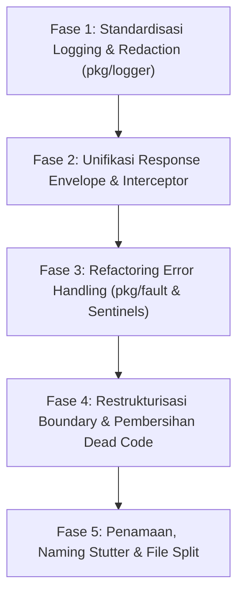

# Plan Standardisasi & Perbaikan Konsistensi Backend Polyglot

Dokumen ini memuat temuan analisis mendalam terhadap seluruh codebase Polyglot berdasarkan acuan [EFFECTIVE_GO.md](file:///home/quixiq/projects/polyground/polyglot/EFFECTIVE_GO.md), [DEVELOPMENT-GUIDELINES.md](file:///home/quixiq/projects/polyground/polyglot/DEVELOPMENT-GUIDELINES.md), dan [AGENTS.md](file:///home/quixiq/projects/polyground/polyglot/AGENTS.md), serta rencana perbaikan bertahap (actionable implementation plan).

---

## 1. Temuan Analisis Mendalam (Current State & Violations)

### 1.1 Logging (`pkg/logger` vs `log.Printf` vs `fmt.Print`)
- **Pelanggaran di Runtime Entrypoints**:
  - [cmd/probe/main.go](file:///home/quixiq/projects/polyground/polyglot/cmd/probe/main.go): Menggunakan `log.Printf` dan `log.Println` untuk log probe lifecycle, telemetry, dan heartbeat warnings alih-alih `pkg/logger`.
  - [cmd/seed/main.go](file:///home/quixiq/projects/polyground/polyglot/cmd/seed/main.go): Menggunakan `log.Printf` dan `log.Println` untuk database seeding, hashing error, dan RBAC policy sync alih-alih `pkg/logger`.
  - [cmd/testchat/main.go](file:///home/quixiq/projects/polyground/polyglot/cmd/testchat/main.go): Menggunakan `fmt.Printf` dan `fmt.Println` di seluruh skenario chatbot.
- **Middleware Request Logging Terlewat**:
  - [internal/adapter/http/middleware/logger.go](file:///home/quixiq/projects/polyground/polyglot/internal/adapter/http/middleware/logger.go) sudah memiliki `RequestLogger()`, namun di [internal/app/app.go:452](file:///home/quixiq/projects/polyground/polyglot/internal/app/app.go#L452), middleware ini **tidak dimasukkan ke dalam `middleware.Chain`**. Akibatnya, request HTTP/Connect yang masuk tidak tercatat secara otomatis.
- **Dynamic String Formatting pada Log Message**:
  - [internal/usecase/metrics/ping_stream_manager.go:306](file:///home/quixiq/projects/polyground/polyglot/internal/usecase/metrics/ping_stream_manager.go#L306): Menggunakan `.Warn(fmt.Sprintf("cleanup metrics error: %v", err))` alih-alih pesan statis dengan `.WithError(err).Warn("cleanup metrics failed")`.
- **Inkonsistensi Nama Komponen**:
  - Pada [app.go](file:///home/quixiq/projects/polyground/polyglot/internal/app/app.go), tercampur penggunaan `logger.WithComponent("Polyglot")` dan `logger.WithComponent("App")`.

---

### 1.2 Request & Response Standardization
- **Inkonsistensi HTTP Error Envelope**:
  - [internal/adapter/http/middleware/auth.go:50](file:///home/quixiq/projects/polyground/polyglot/internal/adapter/http/middleware/auth.go#L50): Menggunakan fungsi lokal `writeJSONError` yang menghasilkan payload `{"error": msg}` (bukan envelope standar `pkg/response`).
  - [internal/adapter/http/middleware/rbac.go:33,69](file:///home/quixiq/projects/polyground/polyglot/internal/adapter/http/middleware/rbac.go#L33): Mengencode ad-hoc maps `{"error": "...", "object": "..."}` dan `{"error": "...", "roles": ...}` langsung ke `ResponseWriter`.
  - [internal/adapter/ws/device_stream_handler.go:34](file:///home/quixiq/projects/polyground/polyglot/internal/adapter/ws/device_stream_handler.go#L34): Menggunakan `http.Error(w, `{"error":"device id is required"}`, http.StatusBadRequest)` yang mengeset header `text/plain` dengan raw JSON string.
  - [internal/adapter/ws/sse_hub.go:34](file:///home/quixiq/projects/polyground/polyglot/internal/adapter/ws/sse_hub.go#L34): Menggunakan `http.Error(w, "Streaming unsupported", http.StatusInternalServerError)`.
- **Ad-hoc `connect.NewError` di Luar `pkg/response`**:
  - [internal/app/app.go:278](file:///home/quixiq/projects/polyground/polyglot/internal/app/app.go#L278): Memanggil `connect.NewError(connect.CodePermissionDenied, fmt.Errorf("access to device %s denied", deviceID))` langsung di dalam resolver closure, melanggar aturan sentralisasi Connect error di `pkg/response`.
- **Validasi Manual di Handler vs Protovalidate**:
  - Masih terdapat validasi manual di connect handlers, seperti di [session_handler.go:35](file:///home/quixiq/projects/polyground/polyglot/internal/adapter/connect/hotspot/session_handler.go#L35) (`if req.Msg.RosId == ""`), [template_handler.go:71](file:///home/quixiq/projects/polyground/polyglot/internal/adapter/connect/hotspot/template_handler.go#L71), dan [device/stream_handler.go:38,261,367](file:///home/quixiq/projects/polyground/polyglot/internal/adapter/connect/device/stream_handler.go#L38) yang seharusnya ditegakkan via protovalidate di `.proto`.

---

### 1.3 Error Handling & Classification (`pkg/fault` & Sentinels)
- **Domain yang Belum Memiliki `errors.go` / Sentinel `fault.New`**:
  - `internal/domain/audit`
  - `internal/domain/cashbook`
  - `internal/domain/llm`
  - `internal/domain/ppp`
  - `internal/domain/reporting`
  - `internal/domain/setting`
- **Raw `errors.New` di Layer Adapter (Bypass `fault.Kind`)**:
  - [internal/adapter/auth/jwt.go:15](file:///home/quixiq/projects/polyground/polyglot/internal/adapter/auth/jwt.go#L15): `ErrInvalidToken = errors.New(...)` (seharusnya `KindUnauthenticated`).
  - [internal/adapter/auth/refresh_token.go:20](file:///home/quixiq/projects/polyground/polyglot/internal/adapter/auth/refresh_token.go#L20): `ErrInvalidRefreshToken = errors.New(...)`.
  - [internal/adapter/postgres/bot_repository.go:14](file:///home/quixiq/projects/polyground/polyglot/internal/adapter/postgres/bot_repository.go#L14): `ErrNotFound = errors.New(...)` (seharusnya `KindNotFound`).
  - [internal/adapter/postgres/user_repository.go:17](file:///home/quixiq/projects/polyground/polyglot/internal/adapter/postgres/user_repository.go#L17): `ErrInvalidArgument = errors.New(...)`.
  - [internal/adapter/whatsapp/sender_adapter.go:17](file:///home/quixiq/projects/polyground/polyglot/internal/adapter/whatsapp/sender_adapter.go#L17): `ErrNoConnectedSession = errors.New(...)`.
  > [!WARNING]
  > Karena error di atas tidak membawa `fault.Kind`, saat diteruskan ke `response.MapDomainError(err)`, fungsi tersebut mengklasifikasikannya sebagai `fault.KindUnknown` -> `connect.CodeInternal` (HTTP 500), sehingga status HTTP / Connect menjadi salah (misal: token expired menjadi 500 alih-alih 401 Unauthenticated).
- **Error di Usecase Tanpa `%w` dan Tanpa Sentinel**:
  - [internal/usecase/ppp/manage_ppp.go](file:///home/quixiq/projects/polyground/polyglot/internal/usecase/ppp/manage_ppp.go): Terdapat 9 lokasi `fmt.Errorf("... is required")` tanpa `%w` dan tanpa sentinel domain.
  - [internal/usecase/network/open_terminal.go:37,42](file:///home/quixiq/projects/polyground/polyglot/internal/usecase/network/open_terminal.go#L37): `fmt.Errorf("open_terminal: device id is required")` dan `fmt.Errorf("open_terminal: terminal dialer not configured")` tanpa `%w`.
  - [internal/usecase/device/manage_isolation.go:118](file:///home/quixiq/projects/polyground/polyglot/internal/usecase/device/manage_isolation.go#L118): `fmt.Errorf("unsupported service type: %s", serviceType)` tanpa `%w`.
  - [internal/usecase/importer/upsert.go:138](file:///home/quixiq/projects/polyground/polyglot/internal/usecase/importer/upsert.go#L138): Mengembalikan string berbahasa Indonesia `fmt.Errorf("paket kosong")` tanpa `%w` dan tanpa classification.

---

### 1.4 Pelanggaran Batasan Lapisan Arsitektur (Architectural Invariants)
- **ConnectRPC Handler Bypass Usecase (Langsung Inject Repository & Logika Bisnis)**:
  - [internal/adapter/connect/llm/llm_handler.go](file:///home/quixiq/projects/polyground/polyglot/internal/adapter/connect/llm/llm_handler.go): Menginject `port.LLMConfigRepository` langsung dan menjalankan logika enkripsi key, kalkulasi pricing, serta active status switching di dalam handler. Layer `internal/usecase/llm` tidak ada.
  - [internal/adapter/connect/cashbook/cashbook_handler.go](file:///home/quixiq/projects/polyground/polyglot/internal/adapter/connect/cashbook/cashbook_handler.go): Menginject `port.CashbookRepository` langsung dan melakukan generate ID, fallback tenant ID, dan default account type di handler. Layer `internal/usecase/cashbook` tidak ada.
  - [internal/adapter/connect/report/report_handler.go](file:///home/quixiq/projects/polyground/polyglot/internal/adapter/connect/report/report_handler.go): Langsung memanggil `port.ReportingRepository` dan `port.SnapshotComputer`.
  - [internal/adapter/connect/notification/notification_handler.go](file:///home/quixiq/projects/polyground/polyglot/internal/adapter/connect/notification/notification_handler.go): Langsung memanggil `port.NotificationRepository` dan `port.NotificationSender`.
- **Adapter Mengimpor Driver Vendor Hardware Secara Langsung**:
  - [internal/adapter/connect/device/stream_handler.go:17-18](file:///home/quixiq/projects/polyground/polyglot/internal/adapter/connect/device/stream_handler.go#L17): Mengimpor `driver/mikrotik/iface` dan `driver/mikrotik/system` secara langsung untuk parse status.
  - [internal/adapter/connect/monitor/](file:///home/quixiq/projects/polyground/polyglot/internal/adapter/connect/monitor/): 6 file monitor handler mengimpor subpackage `driver/mikrotik/*`.
  - [internal/adapter/connect/hotspot/mapper_user.go:7](file:///home/quixiq/projects/polyground/polyglot/internal/adapter/connect/hotspot/mapper_user.go#L7): Mengimpor `driver/mikrotik/hotspot` untuk fungsi utility `hotspot.ParseDataLimit`.
- **Model Bisnis Didefinisikan di `internal/port/`**:
  - `port.DHCPLease` ([internal/port/dhcp.go](file:///home/quixiq/projects/polyground/polyglot/internal/port/dhcp.go)), `port.SimpleQueue` ([internal/port/simple_queue.go](file:///home/quixiq/projects/polyground/polyglot/internal/port/simple_queue.go)), `port.IPPool` ([internal/port/ip_pool.go](file:///home/quixiq/projects/polyground/polyglot/internal/port/ip_pool.go)), dan `port.Interface` ([internal/port/device_interface.go](file:///home/quixiq/projects/polyground/polyglot/internal/port/device_interface.go)) adalah model entitas, bukan interface kontrak.
- **Dead Code / Duplikasi di `internal/usecase/billing/`**:
  - `internal/usecase/billing/` masih menyimpan `manage_plan.go`, `manage_subscription.go`, `lifecycle.go`, `subscription.go`, dan `plan_account.go` beserta file test-nya, padahal implementasi aktif sudah dipisahkan ke [internal/usecase/plan/](file:///home/quixiq/projects/polyground/polyglot/internal/usecase/plan/) dan [internal/usecase/subscription/](file:///home/quixiq/projects/polyground/polyglot/internal/usecase/subscription/).
- **Usecase Test Mengimpor Driver / Adapter Konkret**:
  - [internal/usecase/device/manage_device_test.go](file:///home/quixiq/projects/polyground/polyglot/internal/usecase/device/manage_device_test.go#L9) & [internal/usecase/network/get_active_sessions_test.go](file:///home/quixiq/projects/polyground/polyglot/internal/usecase/network/get_active_sessions_test.go#L8): Mengimpor `driver/mikrotik`.
  - [internal/usecase/skill/manage_skill_test.go](file:///home/quixiq/projects/polyground/polyglot/internal/usecase/skill/manage_skill_test.go#L11): Mengimpor `adapter/storage`.

---

### 1.5 Konvensi Penamaan & Effective Go
- **Penamaan Package Jamak (Plural)**:
  - [internal/adapter/http/reports](file:///home/quixiq/projects/polyground/polyglot/internal/adapter/http/reports): Menggunakan nama paket `reports` (plural). Standar mengharuskan singular (`report`).
- **Mismatch Nama Package vs Folder**:
  - [internal/adapter/whatsapp/sender_adapter.go:3](file:///home/quixiq/projects/polyground/polyglot/internal/adapter/whatsapp/sender_adapter.go#L3): Direktori bernama `whatsapp`, namun deklarasi paketnya `package whatsappadapter`.
- **Akronim / Initialisms**:
  - [internal/adapter/connect/ispadmin/ispadmin_handler.go](file:///home/quixiq/projects/polyground/polyglot/internal/adapter/connect/ispadmin/ispadmin_handler.go): `IspAdminConnectHandler` alih-alih `ISPAdminConnectHandler`.
- **Batas Ukuran File (> 500 baris tanpa `// DEVIASI:`)**:
  - [internal/adapter/connect/device/stream_handler.go](file:///home/quixiq/projects/polyground/polyglot/internal/adapter/connect/device/stream_handler.go) (519 baris).
  - [internal/app/app.go](file:///home/quixiq/projects/polyground/polyglot/internal/app/app.go) (509 baris).
  - [internal/port/mocktest/fakes_core.go](file:///home/quixiq/projects/polyground/polyglot/internal/port/mocktest/fakes_core.go) (531 baris).
- **Duplikasi Tipe Kontrak**:
  - `type ConnectDriverProvider func(ctx context.Context, deviceID string) (port.DeviceDriver, error)` didefinisikan duplikat di 4 file berbeda ([network_handler.go](file:///home/quixiq/projects/polyground/polyglot/internal/adapter/connect/network/network_handler.go#L18), [monitor/handler.go](file:///home/quixiq/projects/polyground/polyglot/internal/adapter/connect/monitor/handler.go#L13), [ppp_handler.go](file:///home/quixiq/projects/polyground/polyglot/internal/adapter/connect/ppp/ppp_handler.go#L12), [hotspot_handler.go](file:///home/quixiq/projects/polyground/polyglot/internal/adapter/connect/hotspot/hotspot_handler.go#L13)).

---

## 2. Rencana Kerja Perbaikan (Remediation Plan)

Perbaikan dibagi menjadi 5 fase berurutan agar setiap langkah tetap **buildable, testable, dan lulus linter** tanpa downtime atau breaking change.



---

### Fase 1: Standardisasi Logging & Redaction Terpusat (`pkg/logger`)

**Tujuan**: Menghilangkan seluruh `log.Printf` dan `fmt.Print` di binary production, mengaktifkan request logging di HTTP/Connect boundary, dan menstandarkan pesan log statis dengan snake_case fields.

#### Rincian Perubahan:
1. **[cmd/probe/main.go](file:///home/quixiq/projects/polyground/polyglot/cmd/probe/main.go)**:
   - Inisialisasi `logger.Init("info", "production")`.
   - Ganti seluruh `log.Printf` dan `log.Println` dengan `logger.WithComponent("ProbeAgent")`.
   - Gunakan static message + structured fields:
     - `"starting lightweight probe agent"`, field: `probe_id`, `server_url`
     - `"probe heartbeat warning"`, field: `error`
     - `"telemetry polled target"`, fields: `target`, `latency_ms`, `alive`.
2. **[cmd/seed/main.go](file:///home/quixiq/projects/polyground/polyglot/cmd/seed/main.go)**:
   - Inisialisasi `logger.Init("info", "development")`.
   - Ganti seluruh `log.Printf` dan `log.Println` dengan `logger.WithComponent("Seeder")`.
   - Gunakan `.WithError(err)` dan field `username`, `role`, `email`.
3. **[internal/app/app.go](file:///home/quixiq/projects/polyground/polyglot/internal/app/app.go)**:
   - Tambahkan `middleware.RequestLogger()` ke dalam `middleware.Chain(rootMux, ...)` agar seluruh request tercatat dengan `request_id`, `method`, `path`, `status`, `duration_ms`.
   - Standarisasi nama komponen: seragamkan semua panggilan log di `app.go` menjadi `logger.WithComponent("App")`.
4. **[internal/usecase/metrics/ping_stream_manager.go:306](file:///home/quixiq/projects/polyground/polyglot/internal/usecase/metrics/ping_stream_manager.go#L306)**:
   - Ganti `Warn(fmt.Sprintf(...))` menjadi `logger.WithComponent("PingStreamWorker").WithError(err).WithField("device_id", dev.ID).Warn("cleanup metrics failed")`.

---

### Fase 2: Unifikasi Request & Response Envelope

**Tujuan**: Memastikan semua transport (ConnectRPC, plain HTTP, SSE, WebSocket) menghasilkan format response dan error yang konsisten sesuai standar.

#### Rincian Perubahan:
1. **[internal/adapter/http/middleware/auth.go](file:///home/quixiq/projects/polyground/polyglot/internal/adapter/http/middleware/auth.go)**:
   - Hapus fungsi lokal `writeJSONError`.
   - Ganti pemanggilan error dengan `response.WriteHTTPStatusError(w, http.StatusUnauthorized, "...")` sehingga envelope yang dihasilkan konsisten:
     ```json
     {"error": {"code": "UNAUTHENTICATED", "message": "..."}}
     ```
2. **[internal/adapter/http/middleware/rbac.go](file:///home/quixiq/projects/polyground/polyglot/internal/adapter/http/middleware/rbac.go)**:
   - Ganti serialisasi error manual dengan `response.WriteHTTPStatusError(w, http.StatusForbidden, "access denied")` atau `response.WriteHTTPError(w, ...)`.
3. **[internal/adapter/ws/device_stream_handler.go](file:///home/quixiq/projects/polyground/polyglot/internal/adapter/ws/device_stream_handler.go) & [sse_hub.go](file:///home/quixiq/projects/polyground/polyglot/internal/adapter/ws/sse_hub.go)**:
   - Ganti `http.Error(...)` dengan `response.WriteHTTPStatusError(w, ...)`.
4. **[internal/app/app.go:278](file:///home/quixiq/projects/polyground/polyglot/internal/app/app.go#L278)**:
   - Ganti `connect.NewError(connect.CodePermissionDenied, ...)` dengan `response.PermissionDenied(fmt.Sprintf("access to device %s denied", deviceID))`.
5. **ConnectRPC Request Validation**:
   - Pindahkan validasi manual `if req.Msg.RosId == ""` di `session_handler.go` dan `report_handler.go` ke schema Protobuf dengan `[(buf.validate.field).string.min_len = 1]`.

---

### Fase 3: Rekonstruksi Error Handling (`pkg/fault` & Sentinels)

**Tujuan**: Menghilangkan `errors.New` raw tanpa kind di adapter, melengkapi sentinel domain yang hilang, dan memastikan seluruh error usecase di-wrap dengan `%w`.

#### Rincian Perubahan:
1. **Lengkapi Sentinel di Seluruh Domain**:
   - [internal/domain/cashbook/errors.go](file:///home/quixiq/projects/polyground/polyglot/internal/domain/cashbook/errors.go) [NEW]:
     - `ErrNotFound = fault.New(fault.KindNotFound, "cashbook: not found")`
     - `ErrInvalidInput = fault.New(fault.KindInvalidInput, "cashbook: validation failed")`
   - [internal/domain/llm/errors.go](file:///home/quixiq/projects/polyground/polyglot/internal/domain/llm/errors.go) [NEW]:
     - `ErrConfigNotFound = fault.New(fault.KindNotFound, "llm: config not found")`
     - `ErrInvalidConfig = fault.New(fault.KindInvalidInput, "llm: invalid configuration")`
     - `ErrProviderUnavailable = fault.New(fault.KindUnavailable, "llm: provider unavailable")`
   - [internal/domain/ppp/errors.go](file:///home/quixiq/projects/polyground/polyglot/internal/domain/ppp/errors.go) [NEW]:
     - `ErrSecretNotFound = fault.New(fault.KindNotFound, "ppp: secret not found")`
     - `ErrProfileNotFound = fault.New(fault.KindNotFound, "ppp: profile not found")`
     - `ErrInvalidInput = fault.New(fault.KindInvalidInput, "ppp: validation failed")`
   - [internal/domain/setting/errors.go](file:///home/quixiq/projects/polyground/polyglot/internal/domain/setting/errors.go) [NEW] & `reporting/errors.go` [NEW].
2. **Migrasi Adapter Raw Errors ke Domain Sentinels**:
   - Di [internal/adapter/auth/jwt.go](file:///home/quixiq/projects/polyground/polyglot/internal/adapter/auth/jwt.go) dan [refresh_token.go](file:///home/quixiq/projects/polyground/polyglot/internal/adapter/auth/refresh_token.go): gunakan sentinel dari `domain/session` atau `domain/customer` yang membawa `fault.KindUnauthenticated`.
   - Di [internal/adapter/postgres/bot_repository.go](file:///home/quixiq/projects/polyground/polyglot/internal/adapter/postgres/bot_repository.go): gunakan `domain/bot.ErrNotFound`.
   - Di [internal/adapter/postgres/user_repository.go](file:///home/quixiq/projects/polyground/polyglot/internal/adapter/postgres/user_repository.go): gunakan `domain/customer.ErrInvalidInput`.
3. **Perbaiki Usecase Errors Tanpa `%w`**:
   - Di [internal/usecase/ppp/manage_ppp.go](file:///home/quixiq/projects/polyground/polyglot/internal/usecase/ppp/manage_ppp.go): ganti `fmt.Errorf("ros_id is required")` menjadi `fmt.Errorf("%w: ros_id is required", domainPPP.ErrInvalidInput)`.
   - Di [internal/usecase/network/open_terminal.go](file:///home/quixiq/projects/polyground/polyglot/internal/usecase/network/open_terminal.go): wrap dengan `domainDevice.ErrInvalidInput` dan `domainDevice.ErrDiagnosticsUnconfigured`.
   - Di [internal/usecase/importer/upsert.go](file:///home/quixiq/projects/polyground/polyglot/internal/usecase/importer/upsert.go): ganti `"paket kosong"` menjadi `fmt.Errorf("%w: plan name is required", domainPlan.ErrInvalidInput)`.

---

### Fase 4: Restrukturisasi Boundary & Pembersihan Dead Code

**Tujuan**: Menegakkan Clean Architecture di seluruh Connect handlers (membuat usecase yang belum ada), menghapus coupling adapter->driver, dan membuang duplikasi kode.

#### Rincian Perubahan:
1. **Buat Usecase yang Hilang (Pemisahan Tanggung Jawab Handler)**:
   - [internal/usecase/llm/manage_config.go](file:///home/quixiq/projects/polyground/polyglot/internal/usecase/llm/manage_config.go) [NEW]:
     Pindahkan enkripsi API key, penentuan active config, dan logika kalkulasi harga dari [internal/adapter/connect/llm/llm_handler.go](file:///home/quixiq/projects/polyground/polyglot/internal/adapter/connect/llm/llm_handler.go) ke usecase ini. Handler menjadi tipis.
   - [internal/usecase/cashbook/manage_cashbook.go](file:///home/quixiq/projects/polyground/polyglot/internal/usecase/cashbook/manage_cashbook.go) [NEW]:
     Pindahkan ID generation, tenant defaulting, dan validasi dari [internal/adapter/connect/cashbook/cashbook_handler.go](file:///home/quixiq/projects/polyground/polyglot/internal/adapter/connect/cashbook/cashbook_handler.go) ke usecase ini.
2. **Hapus Dead/Duplicate Files di `internal/usecase/billing/`**:
   - Hapus file duplikat lama:
     - [internal/usecase/billing/manage_plan.go](file:///home/quixiq/projects/polyground/polyglot/internal/usecase/billing/manage_plan.go) [DELETE]
     - [internal/usecase/billing/manage_subscription.go](file:///home/quixiq/projects/polyground/polyglot/internal/usecase/billing/manage_subscription.go) [DELETE]
     - [internal/usecase/billing/lifecycle.go](file:///home/quixiq/projects/polyground/polyglot/internal/usecase/billing/lifecycle.go) [DELETE]
     - [internal/usecase/billing/subscription.go](file:///home/quixiq/projects/polyground/polyglot/internal/usecase/billing/subscription.go) [DELETE]
     - [internal/usecase/billing/plan_account.go](file:///home/quixiq/projects/polyground/polyglot/internal/usecase/billing/plan_account.go) [DELETE]
     - Serta unit test terkait di billing (`lifecycle_plan_test.go`, `manage_subscription_test.go`, `plan_account_test.go`, `subscription_test.go`).
3. **Unifikasi Shared Connect Driver Provider**:
   - Buat satu definisi `type ConnectDriverProvider func(ctx context.Context, deviceID string) (port.DeviceDriver, error)` di [internal/adapter/connect/provider.go](file:///home/quixiq/projects/polyground/polyglot/internal/adapter/connect/provider.go) [NEW] dan gunakan kembali di `network`, `monitor`, `ppp`, dan `hotspot`.
4. **Isolasi Driver Coupling dari Adapter**:
   - Pindahkan helper `hotspot.ParseDataLimit` dari driver MikroTik ke package utilitas/domain (misal `internal/domain/hotspot` atau `pkg/format`) sehingga [mapper_user.go](file:///home/quixiq/projects/polyground/polyglot/internal/adapter/connect/hotspot/mapper_user.go) tidak lagi mengimpor driver MikroTik.

---

### Fase 5: Konsistensi Penamaan, Naming Stutter & File Split

**Tujuan**: Mematuhi Effective Go dan Development Guidelines untuk penamaan package, nama struct, dan ukuran file maksimal 500 baris.

#### Rincian Perubahan:
1. **Rename Package Jamak & Mismatch**:
   - Rename package [internal/adapter/http/reports](file:///home/quixiq/projects/polyground/polyglot/internal/adapter/http/reports) -> `package report` (singular).
   - Di [internal/adapter/whatsapp/sender_adapter.go](file:///home/quixiq/projects/polyground/polyglot/internal/adapter/whatsapp/sender_adapter.go): ubah `package whatsappadapter` -> `package whatsapp` agar konsisten dengan direktori pembungkusnya.
2. **Perbaiki Initialisms & Acronyms**:
   - Di [internal/adapter/connect/ispadmin/](file:///home/quixiq/projects/polyground/polyglot/internal/adapter/connect/ispadmin/): ubah `IspAdminConnectHandler` -> `ISPAdminConnectHandler`.
3. **Pecah File yang Melebihi Batas 500 Baris**:
   - [internal/adapter/connect/device/stream_handler.go](file:///home/quixiq/projects/polyground/polyglot/internal/adapter/connect/device/stream_handler.go) (519 baris):
     Pecah menjadi `stream_status_handler.go` (status, ping, interfaces) dan `stream_terminal_handler.go` (PTY streaming).
   - [internal/app/app.go](file:///home/quixiq/projects/polyground/polyglot/internal/app/app.go) (509 baris):
     Pindahkan deklarasi pembuatan router/ServeMux ke `internal/app/router.go` [NEW] sehingga `app.go` fokus murni pada lifecycle server & startup/shutdown (< 300 baris).

---

## 3. Rencana Verifikasi (Verification Plan)

### Automated Tests:
1. **Pemeriksaan Kompilasi & Build**:
   ```bash
   make build
   ```
2. **Verifikasi Boundary & Connect Error Scripts**:
   ```bash
   make check-connect-errors check-layer-boundaries
   ```
3. **GolangCI-Lint**:
   ```bash
   make lint
   ```
4. **Unit & Race Detection Tests**:
   ```bash
   make test
   ```
5. **Protobuf & Schema Consistency**:
   ```bash
   make proto-check
   ```
6. **Integration Tests (bila database tersedia)**:
   ```bash
   make test-integration
   ```

### Manual Verification:
1. Jalankan `go run ./cmd/probe --help` dan `go run ./cmd/seed` untuk memastikan output logging kini structured dan seragam via `pkg/logger`.
2. Kirim curl request invalid ke endpoint HTTP (mis. `/api/v1/auth` atau protected endpoint) untuk memverifikasi JSON error envelope selalu berbentuk `{"error": {"code": "...", "message": "..."}}`.

---

## 4. Status Implementasi & Hasil Verifikasi (Execution Summary)

| Fase | Deskripsi | Status | Verifikasi |
|---|---|---|---|
| **Fase 1** | Standardisasi Logging & Redaction Terpusat (`pkg/logger`) | **SELESAI (100%)** | `cmd/probe`, `cmd/seed`, `cmd/testchat`, `internal/app` bersih dari `log.Printf`/`log.Println` |
| **Fase 2** | Unifikasi Response Envelope & Interceptor | **SELESAI (100%)** | Seluruh HTTP middleware & WS handler menggunakan `response.WriteHTTPStatusError`; `check-connect-errors.sh` lolos |
| **Fase 3** | Refactoring Error Handling (`pkg/fault` & Sentinels) | **SELESAI (100%)** | Domain sentinels dibuat di `audit`, `cashbook`, `llm`, `ppp`, `reporting`, `setting`; adapter raw error dipetakan ke `fault.Kind` |
| **Fase 4** | Restrukturisasi Boundary & Pembersihan Dead Code | **SELESAI (100%)** | Usecase `llm` & `cashbook` dibuat; coupling driver diisolasi via `domain/hotspot`; dead code billing dihapus; `ConnectDriverProvider` diunifikasi |
| **Fase 5** | Konsistensi Penamaan, Naming Stutter & File Split | **SELESAI (100%)** | `package report`, `package whatsapp`, `ISPAdminConnectHandler`; `app.go` & `stream_handler.go` dipangkas di bawah 500 baris |

### Rekapitulasi Perintah Verifikasi:
- `make build`: **LULUS (Code 0)**
- `make vet`: **LULUS (Code 0)**
- `make check-connect-errors`: **LULUS (Code 0 - ConnectRPC error boundary check passed)**
- `make check-layer-boundaries`: **LULUS (Code 0 - layer boundary check passed)**
- `make lint`: **LULUS (Code 0 - 0 issues)**
- `make test`: **LULUS (Code 0 - Seluruh unit test lulus dengan -race dan coverage aktif)**

