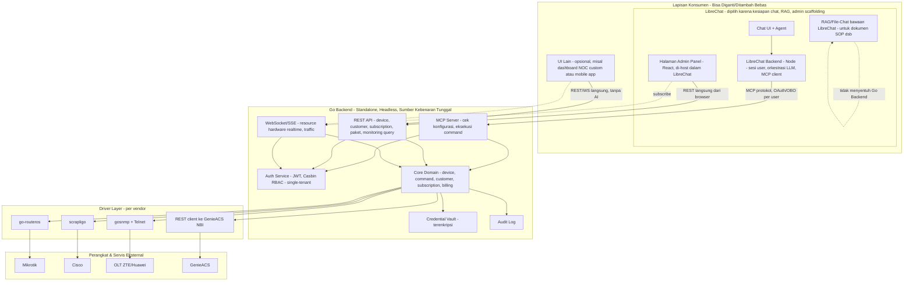
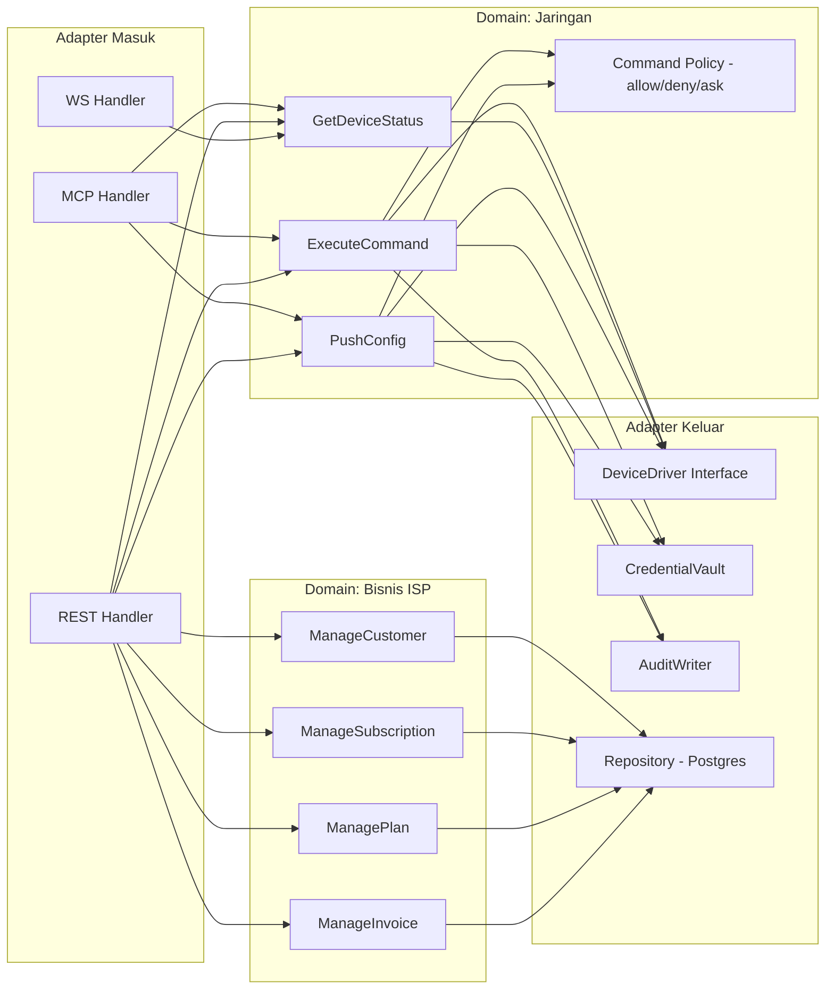
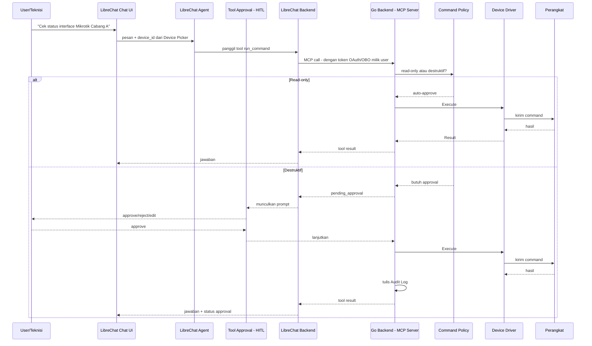
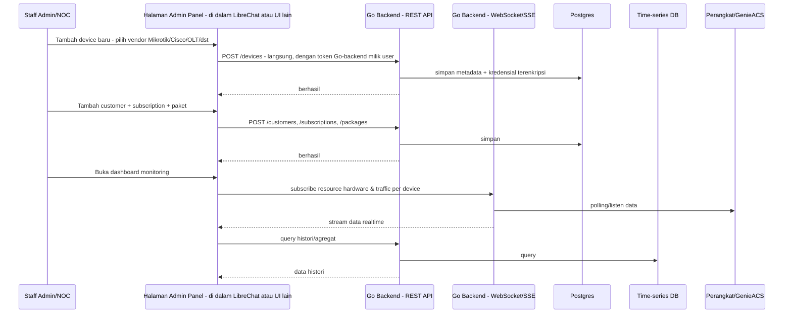
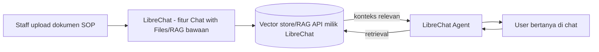
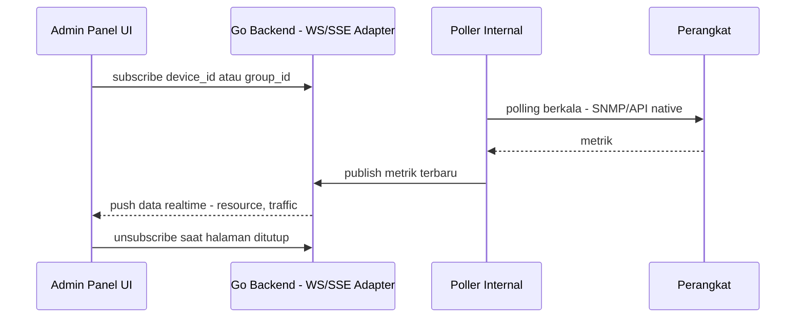
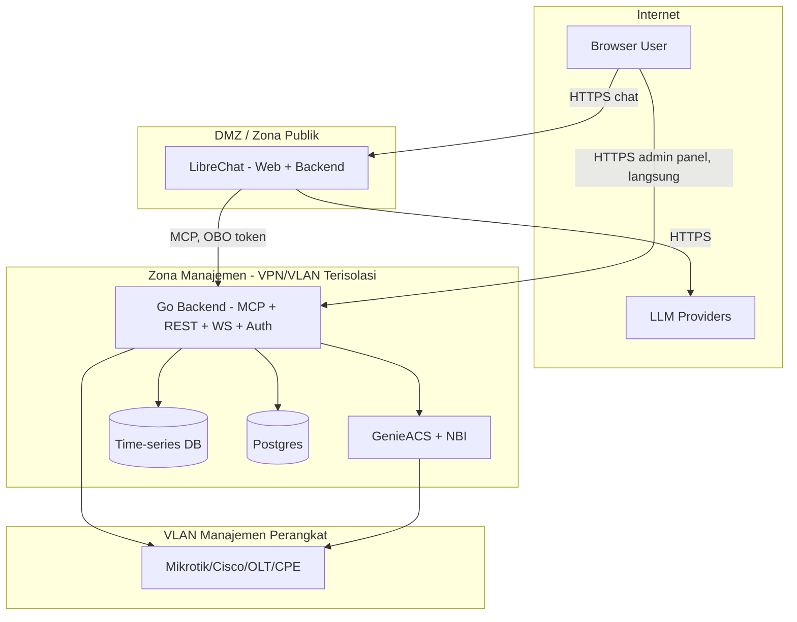

# Arsitektur NetOps + ISP Management Platform — Go Backend (Independen) + LibreChat

> **Status:** Draft Arsitektur v2 — revisi setelah klarifikasi independensi backend
> **Cakupan:** Backend Go standalone untuk NetOps & manajemen bisnis ISP, dikonsumsi oleh LibreChat (dipilih karena kesiapan chat UI, RAG, dan admin panel scaffolding) — tapi tidak bergantung padanya.

### Perubahan dari v1
- Go backend ditegaskan sebagai **sistem berdiri sendiri (headless, API-first)** — LibreChat hanyalah salah satu konsumen, bukan fondasi.
- Skema `NetworkDevice` di MongoDB LibreChat **dihapus** — device picker query langsung ke Go backend, tidak ada salinan data.
- "Billing/OSS-BSS" tidak lagi jadi service terpisah — dilebur jadi modul internal di Go backend yang sama, dengan batas package yang jelas.
- Ditambahkan bagian khusus soal batas otentikasi (auth boundary) antara LibreChat dan Go backend.
- Ditegaskan: dokumen SOP/pembelajaran AI memakai RAG bawaan LibreChat, tidak menyentuh Go backend sama sekali.
- **[Update]** Model tenancy dikonfirmasi **single-tenant** — satu instance/deployment = satu ISP. Asumsi `TenantID` dari rencana roskit dilepas untuk proyek ini; siapa pun yang ingin memakai platform ini cukup deploy instance sendiri (self-hosted atau di VPS terpisah), bukan berbagi satu database multi-tenant.

---

## 1. Ringkasan Eksekutif

Prinsip inti dari revisi ini: **Go backend adalah produk itu sendiri — mandiri, headless, dan tidak bergantung pada LibreChat sama sekali.** Semua logika bisnis (eksekusi jaringan multi-vendor, inventory device, pelanggan, langganan, paket, monitoring) hidup di Go backend dan diekspos lewat tiga antarmuka standar: **MCP**, **REST API**, dan **WebSocket/SSE**.

LibreChat dipilih sebagai lapisan **chat/AI/UI** karena ia sudah menyediakan hal-hal yang mahal untuk dibangun ulang — chat UI, orkestrasi multi-provider LLM, RAG/file-chat, HITL/tool-approval, RBAC dasar, dan skeleton admin panel. Tapi ini murni pilihan **konsumen**, bukan dependensi struktural. Kalau suatu saat LibreChat diganti UI lain (dashboard NOC custom, aplikasi mobile, dsb), Go backend tetap berjalan penuh tanpa perubahan apa pun — karena tidak ada satu pun logika bisnis yang "menitip" di LibreChat.

---

## 2. Prinsip Panduan (Guiding Principles)

1. **API-first, UI-agnostic, AI-agnostic.** Go backend tidak tahu dan tidak peduli siapa yang memanggilnya — LibreChat, dashboard lain, atau `curl` langsung. Semua fungsi bisnis harus bisa diakses tanpa LibreChat.
2. **Satu sumber kebenaran (single source of truth).** Data device, customer, subscription, paket, kredensial — semuanya **hanya** hidup di database Go backend. LibreChat tidak menyimpan salinan/replika data ini di MongoDB-nya sendiri, untuk menghindari *dual sync* dan *ownership ambiguity*.
3. **MCP sesempit mungkin, bukan "expose semuanya lewat MCP".** MCP hanya untuk operasi yang benar-benar butuh keputusan AI: cek konfigurasi, eksekusi command ke hardware. CRUD admin (device, customer, subscription, paket) lewat REST biasa, dipanggil langsung dari UI, tanpa lewat agent.
4. **AI tidak pernah menyentuh kredensial mentah.** LLM hanya kenal `device_id`/`customer_id`, kredensial dikelola penuh oleh Go backend.
5. **Human-in-the-loop wajib untuk command destruktif** — memanfaatkan mekanisme *tool approval* LibreChat yang sudah ada.
6. **RAG/dokumen pembelajaran AI adalah domain LibreChat, bukan Go backend.** Upload SOP perusahaan dsb memakai fitur RAG/file-chat bawaan LibreChat — tidak perlu direplikasi atau di-passthrough ke Go backend.
7. **Batas modul internal yang jelas**, meski satu binary/service. Domain jaringan (`device`, `command`) dan domain bisnis ISP (`customer`, `subscription`, `billing`) dipisah sebagai package Go yang berbeda, supaya bisa dipecah jadi service independen nanti kalau skala menuntut — tanpa rewrite besar.
8. **Audit trail penuh** untuk setiap command eksekusi dan setiap perubahan data bisnis penting.

---

## 3. Gambaran Umum Arsitektur



**Dua hal krusial dari diagram ini:**
- **Jalur REST/WS untuk admin panel tidak lewat backend Node LibreChat** — browser memanggil langsung ke Go backend. LibreChat backend hanya jadi perantara untuk jalur MCP (chat/AI). Ini menjaga agar Go backend benar-benar tidak bergantung pada LibreChat berjalan atau tidak.
- **`OtherUI` sejajar dengan LibreChat** sebagai konsumen — membuktikan secara arsitektur bahwa mengganti UI tidak memengaruhi Go backend sama sekali.

---

## 4. Pembagian Tanggung Jawab

| Layer | Dikembangkan di | Tanggung Jawab | Bahasa |
|---|---|---|---|
| Chat UI + Agent | Repo LibreChat (fork) | Percakapan, device picker (query live ke Go backend), tool-approval (HITL) | TypeScript/React |
| RAG/Dokumen SOP | Repo LibreChat (fork), fitur bawaan | Upload & indexing dokumen untuk konteks AI di chat | TypeScript/Node (bawaan LibreChat) |
| Halaman Admin Panel | Repo LibreChat (fork), sebagai React pages baru — atau UI terpisah lain | Menampilkan & mengelola device, customer, subscription, paket, monitoring — **panggil langsung ke Go backend** | TypeScript/React |
| **Go Backend** | **Repo terpisah, mandiri** | Seluruh logika bisnis: eksekusi jaringan, inventory device, customer, subscription, paket, billing, auth, audit — expose MCP + REST + WS | **Go** |
| Poller Monitoring | Bagian dari Go backend (proses/mode terpisah, bisa dipecah nanti) | Polling berkala ke semua device, tulis ke time-series DB | Go |
| GenieACS | Deploy apa adanya, tidak ditulis ulang | TR-069/ACS untuk CPE/ONT | Node.js (upstream project) |

**Aturan tegas:** Go backend harus tetap 100% fungsional (via REST/MCP/WS) walau LibreChat dimatikan total. Sebaliknya tidak berlaku — LibreChat tanpa Go backend kehilangan seluruh fitur NetOps/ISP management, tapi chat biasa & RAG dokumen tetap jalan normal.

---

## 5. Arsitektur Internal Go Backend

### 5.1 Modul Domain: Jaringan vs Bisnis ISP, Dipisah Secara Internal

Meskipun berjalan sebagai satu service/binary untuk kesederhanaan operasional (cocok untuk tim kecil), batas antar-domain dijaga ketat di level package Go — sama seperti pola yang sudah dipakai pada refactor `core/behavior/execution/pipeline/orchestrator` sebelumnya. Ini membuat pemecahan jadi service terpisah di masa depan (misalnya kalau modul billing perlu scaling sendiri) menjadi perubahan konfigurasi deployment, bukan rewrite kode.



### 5.2 Struktur Folder Proyek

**Struktur folder definitif — termasuk aturan penempatan file per jenis perubahan, konvensi penamaan, dan larangan terkait struktur — ada sepenuhnya di `CLAUDE.md`.** Sengaja tidak diduplikasi di sini: dua dokumen yang masing-masing punya versi struktur folder sendiri gampang jadi tidak sinkron begitu salah satu diubah. `CLAUDE.md` adalah satu-satunya sumber kebenaran untuk struktur folder/file — dokumen ini hanya menjelaskan *mengapa* pembagian domain jaringan vs bisnis ada (§5.1), bukan *di path mana* persis setiap file diletakkan.

### 5.3 Interface `DeviceDriver` — Desain Final (Sudah Divalidasi Compile)

> Ini desain **final** untuk fase sekarang — didokumentasikan di `docs/adr/0002-devicedriver-tanpa-session-terpisah.md` pada hasil scaffold, dan sudah dibuktikan benar secara mekanis (bukan cuma "kelihatannya benar") lewat `var _ port.DeviceDriver = (*Driver)(nil)` di ketujuh vendor — lihat §5.4. Kalau ada kebutuhan baru yang tampak butuh mengubah interface ini lagi (menambah `Connect`/`Session` terpisah, menambah `Stream`), itu perubahan interface yang harus lewat ADR baru, bukan diam-diam ditambah di satu driver saja.

Interface ini didefinisikan di `internal/port/device_driver.go` (`package port`):

```go
package port

// DeviceDriver adalah kontrak yang wajib dipenuhi setiap driver vendor.
// Konstruksi (koneksi ke device tertentu) BUKAN bagian interface ini —
// setiap package vendor punya NewDriver(ctx, target) sendiri yang connect
// langsung dan mengembalikan *Driver yang sudah terhubung. Tidak ada tipe
// Session terpisah (lihat ADR 0002).
//
// Stream (command jangka panjang dengan output live) SENGAJA tidak ada di
// sini — ditunda sampai Fase 7 (streaming) benar-benar dikerjakan, supaya
// tidak ada method separuh jadi hari ini.
type DeviceDriver interface {
    Execute(ctx context.Context, cmd command.Command) (command.Result, error)
    Classify(cmd command.Command) command.Class
    Translate(op command.Operation) (command.Command, error)
    Close() error
}
```

`Command`, `Result`, `Operation`, `Class` generik, didefinisikan di `internal/domain/command/command.go`. Parameter koneksi (`Target`) didefinisikan di `internal/domain/device/device.go` — dipisah dari entity `Device` (record inventory) karena `Target` cuma berisi yang genuinely dibutuhkan driver untuk connect (host, port, kredensial, timeout, plus `Extra map[string]string` untuk parameter vendor-spesifik seperti community string SNMP):

```go
package command

type Command struct {
    Raw  string
    Args map[string]string
}

type Result struct {
    Output string
}

type Operation string

const (
    OpGetStatus Operation = "get_status"
    OpReboot    Operation = "reboot"
)

type Class int

const (
    ClassReadOnly Class = iota
    ClassDestructive
)
```

```go
package device

type Target struct {
    Host     string
    Port     int
    Username string
    Password string
    Timeout  time.Duration
    Extra    map[string]string
}
```

**Ini menjawab langsung pertanyaan "command yang berbeda per device diletakkan di mana", dan `commands.go` per vendor punya DUA tanggung jawab, bukan satu:**

1. **Katalog/terjemahan (`Translate`)** — "operasi abstrak X, jadi command native apa untuk vendor ini". Tanpa ini, `usecase/network/get_device_status.go` terpaksa menaruh string command Mikrotik/Cisco langsung di kodenya sendiri — kebocoran boundary yang coba dihindari sejak awal.
2. **Klasifikasi risiko (`Classify`)** — "command ini (hasil `Translate` maupun raw dari `run_command`) destruktif atau tidak".

Urutan pemanggilan yang benar dari `usecase/`: `Translate` (kalau operasi abstrak) → `Classify` → `domain/command/policy.Decide` → `Execute` kalau diizinkan — persis yang diimplementasikan di `usecase/network/execute_command.go` dan `get_device_status.go` pada hasil scaffold, dan sudah lolos `go build`+`go vet`+`gofmt` di seluruh 66 file yang dihasilkan.

### 5.4 Pemetaan Driver per Vendor

| Vendor | Driver/Library | Protokol | `commands.go` berisi |
|---|---|---|---|
| Mikrotik RouterOS | `go-routeros` | API native | Katalog path API + klasifikasi risiko |
| Cisco IOS-XE/XR/NX-OS | `scrapligo` | SSH/Telnet | Katalog CLI + klasifikasi risiko |
| Device NETCONF-capable | `scrapligo` (paket `netconf`) | NETCONF | Katalog operasi NETCONF + klasifikasi risiko |
| OLT ZTE | `gosnmp` + Telnet client | SNMP + Telnet | Katalog command Telnet + klasifikasi risiko (status baca lewat SNMP, belum diputuskan cara routing-nya — lihat komentar `Translate` di `telnet.go`) |
| OLT/Router Huawei | `scrapligo` v1.3.3 (mainline, sudah dukung VRP CLI via PR #170 — lihat `TECH-STACK-DAN-PERSIAPAN.md` §7) | SSH | Katalog CLI + klasifikasi risiko |
| ACS/TR-069 | REST client ke GenieACS NBI | HTTP REST | Katalog task type GenieACS + klasifikasi risiko |

Satu pengecualian yang disengaja: `internal/driver/genericssh/commands.go` **tidak punya katalog** (`Translate` selalu error) dan **selalu mengklasifikasikan sebagai destruktif** — vendor yang belum dikurasi dianggap berbahaya secara default (fail-safe, bukan fail-open) sampai ada `platformdef` khusus untuknya.

---


## 6. Alur Kerja (Flow) Detail

### 6.1 Alur Eksekusi Command via Chat (MCP + HITL)



**Auth pada jalur ini:** LibreChat MCP client memanfaatkan mekanisme OAuth/OBO (*on-behalf-of*) yang sudah tersedia — Go backend mengenali user asli di balik request, bukan cuma "LibreChat sebagai satu identitas generik". Ini penting untuk audit trail yang akurat (siapa sebenarnya yang menyuruh AI eksekusi command).

### 6.2 Alur Admin Panel — CRUD Device, Customer, Subscription, Paket, dan Monitoring (Murni REST/WS, Tanpa AI)



Tidak ada MCP, tidak ada agent, tidak ada LLM di jalur ini sama sekali — persis seperti admin panel ISP pada umumnya. LibreChat di sini hanya berperan sebagai *shell* React yang meng-*host* halaman-halaman ini.

### 6.3 Alur Dokumen SOP untuk Pembelajaran AI (Murni LibreChat, Tidak Menyentuh Go Backend)



Ini murni memanfaatkan fitur RAG yang sudah ada di LibreChat (`RAG API`, `Chat with Files`) — sesuai prinsip awal Anda: tidak perlu membangun ulang apa yang LibreChat sudah sediakan. Go backend sama sekali tidak terlibat di alur ini.

### 6.4 Alur Streaming Real-time (WebSocket/SSE)

Fokus utama: **data realtime di admin panel** — resource hardware (CPU/memori/suhu) per vendor secara detail, traffic/bandwidth, status koneksi. Pola yang sama juga bisa dipakai untuk live output command di chat (opsional, infrastruktur sama, konsumen berbeda):



---

## 7. Skema Data

### 7.1 LibreChat (MongoDB) — Perubahan Minimal, Tanpa Duplikasi

| Perubahan | Isi | Catatan |
|---|---|---|
| `PermissionTypes` (tambah) | `NETWORK_DEVICES`, `NOC_MONITORING`, `ISP_MANAGEMENT` | Mengikuti pola yang sudah ada di `packages/data-provider/src/permissions.ts` |
| **Tidak ada** koleksi device/customer/subscription baru | — | Sengaja dihindari — device picker & halaman admin query **live** ke REST API Go backend, tidak menyimpan salinan. Prinsip yang sama seperti keputusan *schema separation* (Approach B) yang pernah diambil untuk masalah dual-sync serupa |

### 7.2 Go Backend — Postgres

**Domain jaringan:**

| Tabel | Isi |
|---|---|
| `devices` | Parameter koneksi teknis: `driver_type`, `host`, `port`, `timeout`, `poll_interval` |
| `credentials` | Kredensial terenkripsi, direferensikan via `device_id` — tidak pernah keluar dari Go backend |
| `sessions` | Riwayat koneksi aktif/selesai |
| `command_audit_log` | `user_id`, `device_id`, `command`, `timestamp`, `result`, `approved_by` |
| `command_policy` | Aturan allow/deny/ask per command pattern, per vendor |

**Domain bisnis ISP:**

| Tabel | Isi |
|---|---|
| `customers` | Data pelanggan |
| `subscriptions` | Langganan aktif per customer, terhubung ke `packages` dan opsional ke `devices` (mis. PPPoE profile) |
| `plans` | Definisi paket layanan (kecepatan, harga, dst) — dinamai `plans`, bukan `packages`, karena `package` reserved keyword di Go (lihat `CLAUDE.md`) |
| `invoices` / `payments` | Siklus billing — bisa mulai sederhana, diperluas sesuai kebutuhan |

**Domain monitoring:** metrik time-series (CPU, traffic, dst) sebaiknya tetap di **time-series DB terpisah** (InfluxDB/Prometheus) — bukan Postgres, karena karakteristik data dan query-nya berbeda jauh dari data relasional di atas.

### 7.3 Batas Otentikasi (Auth Boundary)

Ini poin yang perlu diputuskan secara eksplisit karena Go backend punya sistem auth sendiri (JWT + Casbin RBAC, single-tenant — satu instance = satu ISP, lihat dokumen `TECH-STACK-DAN-PERSIAPAN.md` untuk detail), terpisah dari sistem user LibreChat:

| Jalur | Mekanisme |
|---|---|
| **Chat/MCP** | LibreChat MCP client memakai OAuth/OBO (*on-behalf-of*) bawaan — Go backend menerima token yang mewakili user asli, bukan identitas generik LibreChat |
| **Admin Panel (REST/WS)** | Browser memanggil Go backend langsung. Dua opsi: **(a)** login terpisah ke Go backend saat pertama kali membuka halaman admin (paling sederhana, tapi dua sesi login), atau **(b)** LibreChat backend menukar identitas user yang sedang login menjadi token Go-backend jangka pendek saat halaman admin dibuka (SSO ringan, satu kali *exchange*, setelahnya browser bicara langsung ke Go backend) |

Rekomendasi: mulai dengan opsi (a) untuk MVP (lebih cepat dibangun, tidak butuh endpoint *token exchange* khusus), lalu pindah ke opsi (b) begitu UX dua-login mulai terasa mengganggu.

---

## 8. Keamanan

| Aspek | Kontrol |
|---|---|
| Isolasi kredensial | Kredensial device hanya hidup di `Vault` Go backend, terenkripsi at-rest |
| Command allowlist/denylist | `command_policy` per vendor, mencegah LLM men-generate command bebas yang dieksekusi mentah |
| Human-in-the-loop | Wajib untuk command destruktif, memanfaatkan `agents/hitl` LibreChat |
| RBAC granular | JWT + Casbin di Go backend — per device group, per role (`superadmin/owner/admin/staff/teknisi`); tanpa isolasi tenant, konsisten dengan model single-tenant per deployment (lihat perubahan v2 di atas dan `TECH-STACK-DAN-PERSIAPAN.md` §3) |
| Audit trail | Command eksekusi dan perubahan data bisnis penting tercatat lengkap |
| Segmentasi jaringan | Go backend di zona manajemen yang punya jalur ke perangkat; LibreChat di zona publik yang hanya butuh akses internet ke LLM API |
| GenieACS NBI | Wajib diisolasi — tidak ada auth bawaan, batasi dengan firewall/reverse proxy ber-auth |
| Auth boundary | Token OBO untuk jalur MCP; token Go-backend terpisah/exchanged untuk jalur REST/WS admin panel — LibreChat tidak pernah jadi *trusted proxy* tanpa identitas user yang jelas |

---

## 9. Topologi Deployment/Jaringan



Catatan: `Browser` punya dua jalur independen — satu ke LibreChat (chat), satu langsung ke Go backend (admin panel). Ini secara topologi membuktikan Go backend tidak wajib LibreChat hidup untuk berfungsi.

---

## 10. Roadmap Fase Implementasi

| Fase | Fokus | Output |
|---|---|---|
| **Fase 1** | Go backend inti — auth (JWT/Casbin), device Mikrotik, MCP dasar | `go-routeros`, 1 MCP tool read-only, REST CRUD device, HITL wiring |
| **Fase 2** | Admin panel dasar di LibreChat | Halaman device inventory, konsumsi REST langsung dari browser |
| **Fase 3** | Domain bisnis ISP | Customer, subscription, package, REST CRUD lengkap |
| **Fase 4** | Perluas vendor jaringan | Cisco (`scrapligo`), ZTE (`gosnmp`+Telnet), Huawei (`scrapligo` v1.3.3 mainline, sudah dukung VRP CLI) |
| **Fase 5** | Command destruktif + HITL penuh | Command policy allow/deny/ask, audit lengkap |
| **Fase 6** | Monitoring real-time | Poller, TSDB, WS streaming ke admin panel |
| **Fase 7** | Integrasi GenieACS | REST client ke NBI, isolasi jaringan |
| **Fase 8** | Billing/invoice | Modul `business/billing`, evaluasi kompleksitas lanjutan (prorate, pajak, dst) |

---

## 11. Ringkasan Stack Teknologi

| Komponen | Teknologi |
|---|---|
| Chat/RAG/Admin shell | LibreChat — TypeScript/Node, React |
| **Go Backend (mandiri)** | Go |
| Auth Go backend | JWT + Casbin RBAC (single-tenant, tanpa isolasi `tenant_id`) |
| Mikrotik | `go-routeros` |
| Cisco/SSH umum/NETCONF | `scrapligo` |
| OLT ZTE | `gosnmp` + Telnet |
| OLT/Router Huawei | `scrapligo` v1.3.3 (mainline, sudah dukung VRP CLI) |
| ACS/TR-069 | GenieACS (Node.js, deploy terpisah) + REST client Go |
| Protokol tool-calling AI | MCP |
| API non-AI | REST (`gin`/`echo`/`chi`) |
| Streaming real-time | WebSocket/SSE |
| Data relasional (device metadata, customer, subscription, billing) | PostgreSQL |
| Data monitoring time-series | InfluxDB/Prometheus |

---

## 12. Ringkasan Keputusan Kunci

1. **Go backend berdiri sendiri sepenuhnya** — bisa dipakai tanpa LibreChat, dengan UI apa pun.
2. **Tidak ada duplikasi data** — LibreChat tidak menyimpan salinan device/customer/subscription; semua query live ke Go backend.
3. **MCP sesempit mungkin** (cek konfigurasi + eksekusi command); **REST** untuk seluruh CRUD admin panel (device, customer, subscription, paket, monitoring); **WS/SSE** untuk data realtime admin panel.
4. **Dokumen SOP/pembelajaran AI memakai RAG bawaan LibreChat** — tidak lewat Go backend.
5. **Billing/customer/subscription melebur jadi modul internal Go backend yang sama**, dengan batas package Go yang jelas agar bisa dipecah jadi service sendiri nanti tanpa rewrite besar.
6. **Batas otentikasi eksplisit**: OBO untuk jalur MCP, token terpisah/exchanged untuk jalur REST/WS admin panel — admin panel bicara langsung ke Go backend, tidak diproksi lewat backend Node LibreChat.