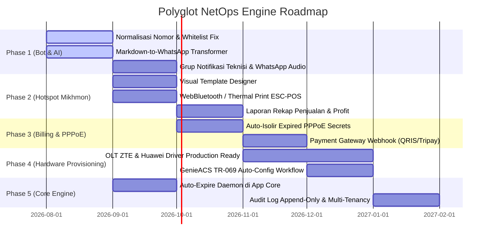

# ROADMAP & KNOWN ISSUES — Polyglot NetOps Engine

Dokumen ini merangkum **isu/kendala teknis yang sedang terjadi (Known Issues)**, **akar masalah (Root Cause)**, serta **rencana pengembangan ke depan (Roadmap & Feature Backlog)** untuk platform Polyglot NetOps Engine.

---

## 📌 DAFTAR ISI

1. [Masalah Kritis Saat Ini (Known Issues)](#1-masalah-kritis-saat-ini-known-issues)
   - [1.1 Normalisasi Nomor Telepon & Whitelist Bot Tidak Berfungsi Efektif](#11-normalisasi-nomor-telepon--whitelist-bot-tidak-berfungsi-efektif)
   - [1.2 Format Respons AI Masih Markdown Mentah pada WhatsApp](#12-format-respons-ai-masih-markdown-mentah-pada-whatsapp)
   - [1.3 Notifikasi Teknisi & Eskalasi Insiden Belum Mendukung Grup WhatsApp](#13-notifikasi-teknisi--eskalasi-insiden-belum-mendukung-grup-whatsapp)
   - [1.4 Penanganan Pesan Suara / Voice Note (PTT) Belum Tersedia](#14-penanganan-pesan-suara--voice-note-ptt-belum-tersedia)
2. [Roadmap Pengembangan Fitur (Feature Roadmap)](#2-roadmap-pengembangan-fitur-feature-roadmap)
   - [Phase 1: Bot WhatsApp & AI Customer Service Hardening](#phase-1-bot-whatsapp--ai-customer-service-hardening)
   - [Phase 2: Mikhmon v4 Parity & Hotspot Enhancements](#phase-2-mikhmon-v4-parity--hotspot-enhancements)
   - [Phase 3: ISP Billing, PPPoE Auto-Isolir & Payment Gateway](#phase-3-isp-billing-pppoe-auto-isolir--payment-gateway)
   - [Phase 4: OLT Provisioning (ZTE & Huawei) & TR-069 GenieACS](#phase-4-olt-provisioning-zte--huawei--tr-069-genieacs)
   - [Phase 5: Background Daemons, Resilience & Observability](#phase-5-background-daemons-resilience--observability)
3. [Matriks Prioritas & Status Implementasi](#3-matriks-prioritas--status-implementasi)

---

## 1. Masalah Kritis Saat Ini (Known Issues)

### 1.1 Normalisasi Nomor Telepon & Whitelist Bot Tidak Berfungsi Efektif

#### 🔴 Masalah & Perilaku Aktual:
- **Ekspektasi Bisnis**:
  - Setiap pengguna/staf internal yang terdaftar di database Polyglot (tabel `users` dengan peran `admin`, `teknisi`, `staff`, dll.) yang memiliki nomor WhatsApp **seharusnya secara otomatis berstatus Whitelist**.
  - Pada **Frontend Web Chat UI** (`web/src/features/chats/index.tsx`), header percakapan dengan nomor yang terdaftar seharusnya menampilkan badge biru **`Whitelist`** dan **tidak menampilkan batasan kuota chat harian (`Kuota AI: x/y`)** serta bebas dari segala bentuk rate limiting/mute.
- **Kenyataan / Bug Saat Ini**:
  - Implementasi badge UI dan filter backend sebenarnya sudah dibuat, **tetapi tidak bekerja dengan baik**.
  - Nomor staf/teknisi terdaftar **tetap tidak terdeteksi sebagai whitelist**:
    1. Badge `Whitelist` tidak muncul di header chat frontend (malah muncul peringatan `Kuota AI: x/y` atau `Kuota AI Habis`).
    2. Saat staf/teknisi mencoba chat dengan bot WhatsApp, mereka tetap dibatasi kuota harian, terkena peringatan rate limit, bahkan bisa ter-mute/terblokir otomatis oleh sistem anti-spam bot.
    3. Tool notifikasi teknisi (`NotifyTechnicianTool`) juga berpotensi gagal mendispatch pesan karena format nomor tujuan tidak seragam.

#### 🔍 Akar Masalah Teknis (Root Cause):
1. **Ketidakcocokan Format Nomor (Discrepancy)**:
   - Nomor yang diinputkan pengguna ke form profil/tabel `users` tersimpan dalam format beragam: `081234567890`, `+6281234567890`, `0812-3456-7890`, atau `6281234567890`.
   - Sedangkan nomor pengirim (`customerNumber`) yang diekstrak dari WhatsApp JID (`whatsmeow`) selalu berformat digit internasional tanpa tanda tambah: `6281234567890`.
2. **Fungsi `cleanPhoneNumber` di `internal/usecase/bot/ratelimit.go` Terlalu Sederhana**:
   ```go
   // KONDISI SAAT INI (TIDAK MENORMALISASI KODE NEGARA):
   func cleanPhoneNumber(phone string) string {
       phone = strings.TrimSpace(phone)
       phone = strings.TrimPrefix(phone, "+")
       phone = strings.Split(phone, "@")[0]
       return phone 
       // Input "081234567890" tetap menghasilkan "081234567890"
       // Input "0812-3456-7890" tetap menghasilkan "0812-3456-7890"
   }
   ```
   Ketika sistem melakukan evaluasi:
   ```go
   cleanPhoneNumber("081234567890") == "6281234567890" // HASIL: FALSE!
   ```
   Perbandingan string selalu gagal (`false`), sehingga sistem menganggap nomor staf tersebut adalah pelanggan biasa tak dikenal.
3. **Ketergantungan Flag `WhitelistAllStaff`**:
   - Jika konfigurasi `WhitelistAllStaff` di database bernilai `false` atau belum diinisialisasi, sistem melewati pengecekan ke tabel `users` sama sekali, padahal secara standar seluruh user terdaftar berhak mendapat prioritas bypass rate limit.

#### 💡 Solusi & Rencana Perbaikan Konkret:
1. **Utilitas Terpusat `pkg/phone/phone.go`**:
   Buat fungsi `Normalize(raw string) string`:
   - Menghapus seluruh karakter non-digit (spasi, strip `-`, tanda kurung `()`, titik `.`).
   - Mengonversi awalan lokal Indonesia (`08...`, `0...`) menjadi `628...` / `62...`.
   - Mengonversi awalan `+62...` menjadi `62...`.
   - Menghapus suffix domain WhatsApp (`@s.whatsapp.net`, `@c.us`, `@g.us`).
2. **Perbaiki `RateLimiter.isWhitelisted` & `GetRateLimitStatus`**:
   - Terapkan fungsi `phone.Normalize()` pada kedua sisi perbandingan:
     ```go
     if phone.Normalize(u.PhoneNumber) == phone.Normalize(customerNumber) {
         return true
     }
     ```
   - Pastikan jika nomor cocok dengan salah satu user aktif di tabel `users` ATAU terdaftar di `CustomWhitelistPhones`, `isWhitelisted` **pasti mengembalikan `true`**.
3. **Sinkronisasi Response RPC `GetRateLimitStatus` ke Web UI**:
   - Memastikan field `IsWhitelisted: true` terkirim dengan benar ke frontend ConnectRPC, sehingga Web UI (`web/src/features/chats/index.tsx`) merender badge `Whitelist` secara konsisten dan menonaktifkan tampilan kuota.

---

### 1.2 Format Respons AI Masih Markdown Mentah pada WhatsApp

#### 🔴 Masalah:
- Hasil jawaban LLM (OpenAI, Gemini, Ollama, DeepSeek) menggunakan sintaks standar **Markdown** (seperti `### Judul`, `**teks tebal**`, `[link](https://...)`, `~~coret~~`, `- daftar bullet`, tabel markdown).
- WhatsApp **tidak mendukung** sintaks markdown standar tersebut dan hanya mendukung format khusus WhatsApp (`*teks tebal*`, `_miring_`, `~coret~`, ````monospace````).
- Akibatnya, pesan yang diterima pelanggan di WhatsApp tampak berantakan dengan simbol bintang ganda `**`, tanda pagar `###`, dan tag markdown link mentah.

#### 🔍 Perbandingan Format Sintaks:
| Elemen Format | Standar Markdown (Output AI) | Format Resmi WhatsApp |
|---|---|---|
| **Bold (Tebal)** | `**Teks Tebal**` atau `__Teks__` | `*Teks Tebal*` |
| **Italic (Miring)** | `*Teks Miring*` atau `_Teks_` | `_Teks Miring_` |
| **Strikethrough (Coret)** | `~~Teks Coret~~` | `~Teks Coret~` |
| **Monospace / Code** | `` `teks kode` `` | ````teks kode```` |
| **Headings (H1 - H6)** | `# Judul`, `## Subjudul`, `### Bagian` | `*JUDUL*` atau `*Subjudul*` |
| **Hyperlink** | `[Portal Login](http://10.10.10.1)` | `Portal Login (http://10.10.10.1)` atau `http://10.10.10.1` |
| **Bullet Lists** | `* Item` atau `- Item` | `• Item` |
| **Horizontal Line** | `---` atau `***` | `━━━━━━━━━━━━━━━━━━━━━` |
| **Markdown Table** | `| Kolom 1 | Kolom 2 |` | Format teks baris terstruktur / bullet list |

#### 💡 Solusi & Rencana Perbaikan:
- Tambahkan transformer `MarkdownToWhatsApp(md string) string` pada pipeline pembersihan `Guardrail` (`internal/usecase/bot/guardrail.go`):
  1. Konversi Header `### ...` menjadi `*...*`.
  2. Konversi `**bold**` menjadi `*bold*`.
  3. Konversi `[title](url)` menjadi `title: url` atau `title (url)`.
  4. Konversi `~~strike~~` menjadi `~strike~`.
  5. Konversi list `* ` atau `- ` menjadi bullet unicode `• `.
  6. Rapikan multiple blank lines yang berlebihan.

---

### 1.3 Notifikasi Teknisi & Eskalasi Insiden Belum Mendukung Grup WhatsApp

#### 🔴 Masalah:
- `NotifyTechnicianTool` saat ini mengirimkan laporan tiket gangguan satu per satu via Direct Message (DM) ke nomor individu teknisi.
- Jika ada 5 teknisi, bot mengirim 5 pesan terpisah. Belum ada opsi mengirimkan broadcast tiket ke **Grup WhatsApp Teknisi / NOC** (`xxx@g.us`) sehingga tim tidak memiliki visibilitas bersama terhadap tiket yang sudah/belum diambil.

#### 💡 Solusi & Rencana Perbaikan:
- Tambahkan konfigurasi `TechnicianGroupID` (JID grup WhatsApp, misal `120363041234567890@g.us`) di `BotSettings`.
- Prioritaskan pengiriman notifikasi ke grup teknisi terlebih dahulu, dengan fallback ke DM teknisi jika grup belum diatur.
- Tambahkan tombol aksi interaktif / perintah cepat bagi teknisi untuk mengambil tiket (misal balas `#ambil <id_tiket>`).

---

### 1.4 Penanganan Pesan Suara / Voice Note (PTT) Belum Tersedia

#### 🔴 Masalah:
- Banyak pelanggan di lapangan lebih suka mengirimkan Voice Note WhatsApp (.ogg opus) ketika melaporkan internet mati.
- Saat ini `whatsmeow` hanya menangkap pesan teks biasa; pesan bertipe audio/voice note dilewati tanpa respons.

#### 💡 Solusi & Rencana Perbaikan:
- Tambahkan penanganan pesan media audio pada `internal/driver/whatsapp/client.go`.
- Unduh payload audio terenkripsi WhatsApp, dekripsi, dan teruskan ke modul Speech-to-Text (Whisper API / Google Gemini Multimodal Audio).
- Masukkan hasil transkripsi suara ke pipeline `Engine.HandleIncomingMessage` secara transparan.

---

## 2. Roadmap Pengembangan Fitur (Feature Roadmap)



---

### Phase 1: Bot WhatsApp & AI Customer Service Hardening

- [ ] **1.1 Normalisasi Nomor E.164 & Otomatisasi Whitelist Seluruh User Terdaftar**:
  - Implementasi parser nomor telepon baku Indonesia (`pkg/phone/phone.go`: `08x`, `+628x`, `0812-xxx`, `628x` -> `628x`).
  - Menjadikan **seluruh user terdaftar di sistem (tabel `users`) secara otomatis ter-whitelist** (bebas dari kuota chat AI harian dan bebas dari pembatasan rate limit / mute).
  - Memastikan sinkronisasi respons RPC `GetRateLimitStatus` mengembalikan `IsWhitelisted: true` sehingga Web UI Frontend (`web/src/features/chats/index.tsx`) merender badge biru **`Whitelist`** pada header chat.
  - Memperbaiki pencarian nomor teknisi pada `NotifyTechnicianTool` agar selalu menerima notifikasi dispatch tiket.
- [ ] **1.2 Converter Format Markdown ke WhatsApp**:
  - Regex replacement untuk header, bold, italic, strikethrough, monospace, list item, dan link.
  - Sanitasi respons LLM sebelum masuk ke `waGateway.SendMessage`.
- [ ] **1.3 Notifikasi Grup WhatsApp & Sistem Tiket**:
  - Konfigurasi target grup WhatsApp teknisi (`@g.us`).
  - Format pesan laporan terstruktur dengan ID Tiket unik.
- [ ] **1.4 Anti-Banned Outbound Dispatcher (Queue & Typing Delay)**:
  - Antrean pesan keluar berbasis Redis/Memory queue dengan human typing simulation (jeda acak 2–5 detik dan status *typing...* di WhatsApp).
  - Rate limiting pengiriman outbound untuk mencegah nomor diblokir oleh sistem anti-spam Meta.
- [ ] **1.5 Integrasi Voice Note (STT / Transkripsi Suara)**:
  - Unduh file audio WhatsApp PTT `.ogg`.
  - Integrasi dengan Whisper API / Gemini 1.5 Flash Audio.

---

### Phase 2: Mikhmon v4 Parity & Hotspot Enhancements

- [ ] **2.1 Visual Voucher Template Editor**:
  - Editor visual drag-and-drop di Web UI untuk mengatur tata letak voucher (Logo, Font, Border, Background, Posisi QR Code, Detail Harga & Masa Aktif).
  - Live preview cetak ukuran A4 (kisi 3x10, 4x10) dan thermal roll.
- [ ] **2.2 Direct Thermal Printing (WebBluetooth & RawBT)**:
  - Pencetakan langsung ke printer kasir Bluetooth (58mm / 80mm ESC/POS) dari peramban tanpa dialog print bawaan browser.
  - Integrasi protokol RawBT Android intent.
- [ ] **2.3 Laporan Penjualan & Pembukuan Hotspot**:
  - Pencatatan otomatis setiap voucher yang dibuat / diaktivasi ke tabel buku besar penjualan.
  - Grafik omset harian, mingguan, bulanan per router dan per profil paket.
  - Ekspor laporan penjualan ke format Excel (`.xlsx`) dan PDF.
- [ ] **2.4 Multi-Router Bulk Generator**:
  - Generate batch voucher serentak ke beberapa router cabang sekaligus.

---

### Phase 3: ISP Billing, PPPoE Auto-Isolir & Payment Gateway

- [ ] **3.1 Otomatisasi Isolir Pelanggan PPPoE Menunggak**:
  - Scheduler rutin untuk mengecek tanggal jatuh tempo tagihan pelanggan langganan.
  - Mengubah profil PPPoE secret pelanggan menunggak ke profil `ISOLIR` (pool IP terisolir dengan Web Proxy / Walled Garden halaman peringatan bayar).
  - Mengembalikan profil normal secara instan setelah pembayaran terkonfirmasi.
- [ ] **3.2 Integrasi Payment Gateway (Tripay, Midtrans, Xendit, QRIS Dinamis)**:
  - Pembuatan invoice otomatis dengan QRIS atau Virtual Account.
  - Endpoint Webhook untuk menerima notifikasi pembayaran masuk (instant auto-settlement).
  - Pengiriman pesan tanda terima pembayaran otomatis via WhatsApp ke nomor pelanggan.

---

### Phase 4: OLT Provisioning (ZTE & Huawei) & TR-069 GenieACS

- [ ] **4.1 Driver OLT ZTE C300 / C320 Production Hardening**:
  - Scan Unconfigured ONU (`show gpon onu uncfg`).
  - Auto-registrasi ONU baru dengan profile T-CONT, GEM Port, dan VLAN service otomatis.
  - Pembacaan daya optik Rx/Tx optical power (`show gpon onu rx-power`).
- [ ] **4.2 Driver OLT Huawei MA5608T / MA5800**:
  - Perintah `display ont autofind` dan konfigurasi service-port otomatis via Scrapligo/SSH CLI driver.
- [ ] **4.3 Integrasi TR-069 GenieACS**:
  - Push konfigurasi PPPoE Username/Password dan WiFi SSID/Key ke router modem ONT pelanggan dari Polyglot web dashboard tanpa login fisik ke modem.

---

### Phase 5: Background Daemons, Resilience & Observability

- [ ] **5.1 Built-in Expire Monitor Daemon**:
  - Menjalankan background worker di Go runtime engine (`internal/app/app.go`) untuk memantau user expired setiap interval waktu, menggantikan ketergantungan pada script MikroTik Scheduler.
- [ ] **5.2 Audit Trail & Log Streaming**:
  - Pencatatan seluruh aksi destruktif (hapus user massal, ubah IP binding, reboot router, ubah config bot) ke tabel audit log append-only.
  - Menampilkan live log aktivitas operator di web dashboard.
- [ ] **5.3 Multi-Tenant & Role Isolation**:
  - Isolasi data per ISP / Mitra jaringan (tenant isolation) dengan kebijakan Casbin RBAC tingkat lanjut.

---

## 3. Matriks Prioritas & Status Implementasi

| Modul | Komponen / Fitur | Prioritas | Kompleksitas | Status Saat Ini |
|---|---|:---:|:---:|:---:|
| **Bot AI** | Normalisasi Nomor & Whitelist Universal | 🔴 P0 (Tinggi) | Rendah | ⚠️ Perlu Segera Dibereskan |
| **Bot AI** | Markdown to WhatsApp Text Transformer | 🔴 P0 (Tinggi) | Rendah | ⚠️ Perlu Segera Dibereskan |
| **Bot AI** | Notifikasi Tiket ke WhatsApp Group Teknisi | 🟡 P1 (Sedang) | Sedang | 📋 Rencana |
| **Bot AI** | Transkripsi Voice Note (STT Audio) | 🟡 P1 (Sedang) | Sedang | 📋 Rencana |
| **Hotspot** | Bulk Cleaner Users (Profile, Batch, Expired) | 🟢 P0 (Selesai) | Sedang | ✅ Sudah Selesai |
| **Hotspot** | IP Bindings Management (`/ip/hotspot/ip-binding`) | 🟢 P0 (Selesai) | Sedang | ✅ Sudah Selesai |
| **Hotspot** | Cookies Session Management (`/ip/hotspot/cookie`) | 🟢 P0 (Selesai) | Rendah | ✅ Sudah Selesai |
| **Hotspot** | Quick Voucher Status Checker & Inspector | 🟢 P0 (Selesai) | Sedang | ✅ Sudah Selesai |
| **Hotspot** | Visual Voucher Designer & Custom Logo | 🟡 P1 (Sedang) | Tinggi | 📋 Rencana |
| **Hotspot** | Direct Thermal Printing (ESC-POS / Bluetooth) | 🟡 P1 (Sedang) | Sedang | 📋 Rencana |
| **Hotspot** | Laporan Penjualan & Akuntansi Voucher | 🟡 P1 (Sedang) | Sedang | 📋 Rencana |
| **Billing** | Auto-Isolir PPPoE Secret Jatuh Tempo | 🟡 P1 (Sedang) | Sedang | 📋 Rencana |
| **Billing** | Payment Gateway Webhook & QRIS | 🟡 P1 (Sedang) | Sedang | 📋 Rencana |
| **Hardware**| OLT ZTE / Huawei ONU Discovery & Power Read | 🔵 P2 (Lanjutan) | Tinggi | 📋 Rencana |
| **Hardware**| GenieACS TR-069 Auto Provisioning | 🔵 P2 (Lanjutan) | Tinggi | 📋 Rencana |

---

*Dokumen ini diperbarui secara berkala sesuai perkembangan arsitektur dan kebutuhan operasional Polyglot NetOps Engine.*
