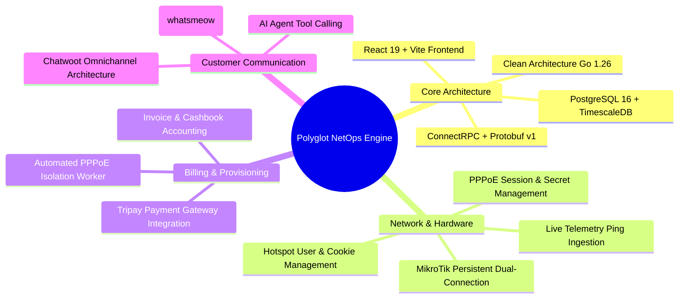
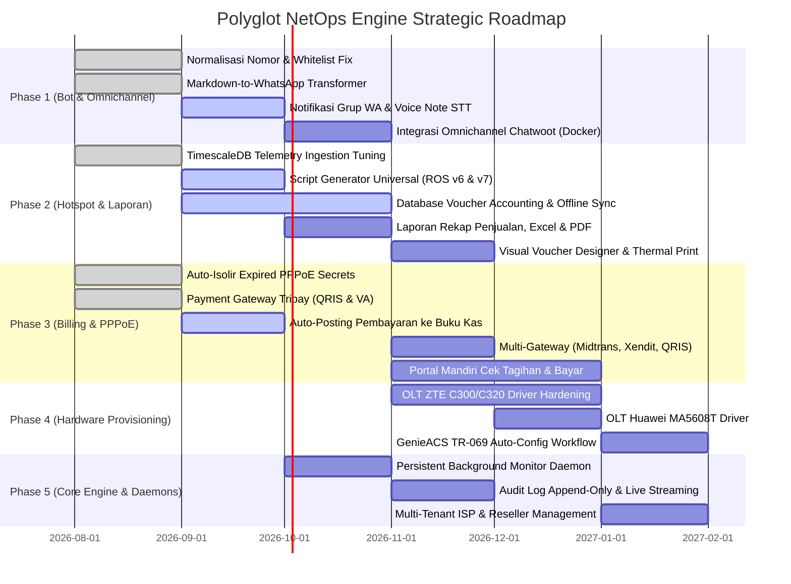

# ROADMAP & KNOWN ISSUES — Polyglot NetOps Engine

Dokumen ini merangkum **kondisi aktual proyek**, **isu/kendala teknis yang sedang dihadapi (Known Issues)**, **akar masalah teknis (Root Cause)**, **status implementasi fitur saat ini**, serta **rencana pengembangan strategis ke depan (Roadmap & Feature Backlog)** untuk platform Polyglot NetOps Engine.

---

## 📌 DAFTAR ISI

1. [Kondisi Aktual & Status Pengembangan Terkini](#1-kondisi-aktual--status-pengembangan-terkini)
2. [Isu & Kendala Teknis Kritis (Known Issues)](#2-isu--kendala-teknis-kritis-known-issues)
   - [2.1 [TERSELESAIKAN] Normalisasi Nomor Telepon & Whitelist Universal](#21-terselesaikan-normalisasi-nomor-telepon--whitelist-universal)
   - [2.2 [TERSELESAIKAN] Format Respons AI Mentah pada WhatsApp](#22-terselesaikan-format-respons-ai-mentah-pada-whatsapp)
   - [2.3 [TERSELESAIKAN] Bottleneck & Slowdown Ingestion TimescaleDB > 12 Jam](#23-terselesaikan-bottleneck--slowdown-ingestion-timescaledb--12-jam)
   - [2.4 [KRITIS BARU] Kompatibilitas Skrip MikroTik RouterOS v6 vs RouterOS v7](#24-kritis-baru-kompatibilitas-skrip-mikrotik-routeros-v6-vs-routeros-v7)
   - [2.5 [KRITIS BARU] Ketergantungan Penyimpanan Laporan di Router & Ketiadaan Offline Sync](#25-kritis-baru-ketergantungan-penyimpanan-laporan-di-router--ketiadaan-offline-sync)
   - [2.6 [OPEN] Notifikasi Teknisi & Eskalasi Insiden Belum Mendukung Grup WhatsApp](#26-open-notifikasi-teknisi--eskalasi-insiden-belum-mendukung-grup-whatsapp)
   - [2.7 [OPEN] Penanganan Pesan Suara / Voice Note (PTT) Belum Tersedia](#27-open-penanganan-pesan-suara--voice-note-ptt-belum-tersedia)
3. [Roadmap Pengembangan Fitur (Feature Roadmap)](#3-roadmap-pengembangan-fitur-feature-roadmap)
   - [Phase 1: Bot WhatsApp, AI Service & Omnichannel Helpdesk (Chatwoot)](#phase-1-bot-whatsapp-ai-service--omnichannel-helpdesk-chatwoot)
   - [Phase 2: Mikhmon v4 Parity, Multi-Version ROS Scripts & Voucher Accounting](#phase-2-mikhmon-v4-parity-multi-version-ros-scripts--voucher-accounting)
   - [Phase 3: ISP Billing, PPPoE Auto-Isolir & Multi-Payment Gateway](#phase-3-isp-billing-pppoe-auto-isolir--multi-payment-gateway)
   - [Phase 4: Hardware Provisioning (OLT ZTE/Huawei) & TR-069 GenieACS](#phase-4-hardware-provisioning-olt-ztehuawei--tr-069-genieacs)
   - [Phase 5: Time-Series Telemetry, Observability & Core Daemons](#phase-5-time-series-telemetry-observability--core-daemons)
   - [Phase 6: Multi-Tenant & Mitra ISP Management](#phase-6-multi-tenant--mitra-isp-management)
4. [Matriks Prioritas & Status Implementasi](#4-matriks-prioritas--status-implementasi)

---

## 1. Kondisi Aktual & Status Pengembangan Terkini

Polyglot telah berkembang dari engine monitoring MikroTik dasar menjadi sistem orkestrasi ISP multi-vendor yang komprehensif. Berikut rekapitulasi pencapaian aktual arsitektur saat ini:



- **Database & Telemetry High-Throughput**: TimescaleDB telah dioptimasi dengan chunk interval 1 hari, columnar compression (< 2 jam), dan continuous aggregate view `device_ping_metrics_1m` dengan real-time aggregation. Teruji memproses beban **100 router konkuren** dengan throughput **> 8.000 titik/detik** dan query < 15ms.
- **PPPoE & Billing Automation**: Modul invoice, pencatatan kasir, webhook Tripay, serta worker otomatisasi isolir pelanggan menunggak (`isolate_worker.go`) sudah aktif dan berjalan.
- **WhatsApp Engine**: Terhubung langsung ke WhatsApp via `whatsmeow` dengan normalisasi nomor E.164 (`pkg/phone`) dan konversi otomatis Markdown ke format resmi WhatsApp (`Guardrail.MarkdownToWhatsApp`).

---

## 2. Isu & Kendala Teknis Kritis (Known Issues)

### 2.1 [TERSELESAIKAN] Normalisasi Nomor Telepon & Whitelist Universal
- **Status**: ✅ **SELESAI (RESOLVED)**
- **Implementasi**: 
  - Utilitas sentral [pkg/phone/phone.go](file:///home/quixiq/projects/polyground/polyglot/pkg/phone/phone.go) dibuat untuk menormalisasi variasi input nomor telepon (`08...`, `+62...`, `0812-xxx`) menjadi format standar digit internasional `628...` tanpa tanda tambah.
  - Diintegrasikan ke [internal/usecase/bot/ratelimit.go](file:///home/quixiq/projects/polyground/polyglot/internal/usecase/bot/ratelimit.go) dan `user_repository`, sehingga seluruh staf/teknisi terdaftar otomatis mendapatkan status whitelist tanpa batasan kuota chat AI.

### 2.2 [TERSELESAIKAN] Format Respons AI Mentah pada WhatsApp
- **Status**: ✅ **SELESAI (RESOLVED)**
- **Implementasi**:
  - Dibuat pipeline transformer [MarkdownToWhatsApp](file:///home/quixiq/projects/polyground/polyglot/internal/usecase/bot/guardrail.go#L89-L150) pada modul `Guardrail`.
  - Mengonversi sintaks Markdown standar (Heading, Bold, Italic, Strikethrough, Hyperlink, Bullet List, Horizontal Rule, dan Tabel) secara mulus menjadi format visual native WhatsApp.

### 2.3 [TERSELESAIKAN] Bottleneck & Slowdown Ingestion TimescaleDB > 12 Jam
- **Status**: ✅ **SELESAI (RESOLVED)**
- **Akar Masalah**: Insert row-by-row tanpa batching, chunk interval default 7 hari membuat working set RAM membengkak, dan ketiadaan continuous aggregate memaksa query membaca jutaan baris mentah.
- **Implementasi**:
  - Migration `000024_optimize_ping_metrics_timescale.up.sql`: Chunk interval 1 hari, columnar compression otomatis untuk data > 2 jam, dan Materialized Continuous Aggregate View `device_ping_metrics_1m` dengan real-time aggregation (`materialized_only = false`).
  - Worker Buffer: `PingStreamManager` menggunakan batching threshold 30 item atau interval 15 detik, reuse alokasi memori buffer, dan strict timeout.
  - GORM Tuning: `Session(&gorm.Session{SkipDefaultTransaction: true})` memangkas overhead transaksi pada bulk insert.
  - Pool DB: Ditingkatkan menjadi `SetMaxOpenConns(50)` dan `SetMaxIdleConns(25)`.

---

### 2.4 [KRITIS BARU] Kompatibilitas Skrip MikroTik RouterOS v6 vs RouterOS v7

#### 🔴 Masalah & Perilaku Aktual:
- Di lapangan, router pelanggan dan cabang ISP memiliki variasi versi yang ekstrem: mulai dari RouterOS v6.48/v6.49 (pada perangkat arsitektur lama seperti RB750r2/RB951) hingga RouterOS v7.12+ (pada router baru seperti hEX v4, RB5009, CCR2004).
- Skrip Mikhmon bawaan (seperti skrip on-login, on-logout, expire monitor, tracking traffic, dan scheduler) sering kali **gagal dieksekusi atau memicu `syntax error`** saat dipasang pada RouterOS v7, atau sebaliknya skrip modern v7 gagal di RouterOS v6.
- **Perbedaan Sintaks Kritis ROS v6 vs ROS v7**:
  1. **Perintah `/tool fetch`**:
     - *ROS v6*: Mendukung parameter `mode=http/https`, parsing URL sederhana, dan parameter output terbatas.
     - *ROS v7*: Mewajibkan parameter `http-method=get/post`, penanganan SSL/TLS strict, dan parameter `output=none` atau penyimpanan file yang berbeda.
  2. **Variable Scoping & Syntax Looping**:
     - RouterOS v7 jauh lebih ketat terhadap deklarasi variabel global (`:global`) dan lokal (`:local`). Variabel yang belum diinisialisasi memicu kegagalan runtime.
     - Sintaks `:foreach k,v in=[...]` di v7 memiliki behavior berbeda dibandingkan `:foreach i in=[...]` di v6.
  3. **Event On-Login Hotspot**:
     - Parsing variabel runtime `$user`, `$address`, `$mac`, dan `$interface` pada event script user profile sering kali menghasilkan nilai kosong jika skrip tidak disesuaikan dengan parsing parser v7.

#### 💡 Solusi & Rencana Implementasi:
1. **Bukan File `.rsc` Statis, Melainkan Dynamic Template Engine (`.rsc.tmpl`)**:
   - File `.rsc` statis murni **tidak mungkin langsung dipakai** karena kebutuhan skrip Mikhmon bergantung pada variabel dinamis dari form input admin:
     - `Validity`: Masa aktif voucher (misal `2h`, `1d`, `30d`).
     - `Price` & `Selling Price`: Harga modal dan harga jual voucher (misal `5000` dan `6000`).
     - `Lock User`: Status penguncian MAC address (`true` / `false`).
     - `Grace Period`: Toleransi waktu sebelum akun dinonaktifkan (misal `5m`).
     - `ServerURL`: Endpoint webhook Polyglot untuk realtime accounting jika server online.
   - Oleh karena itu, arsitektur yang digunakan adalah **Go Template Engine (`text/template`)** dengan ekstensi `.rsc.tmpl`:
     - Backend Go mendefinisikan struct parameter injeksi:
       ```go
       type HotspotProfileScriptParams struct {
           ProfileName  string // "Paket-2Jam"
           Validity     string // "2h", "1d", "30d"
           GracePeriod  string // "5m"
           Price        int    // 5000
           SellingPrice int    // 6000
           LockUser     bool   // true / false
           ServerURL    string // Webhook callback Polyglot
           IsROSv7      bool   // true jika target router berjalan di ROS v7
       }
       ```
     - Backend Go men-*render* template ini menjadi teks perintah RouterOS CLI, kemudian menyuntikkannya ke properti `on-login` / `on-logout` profil pengguna MikroTik (`/ip/hotspot/user/profile/set on-login=...`) secara transparan via RouterOS API.
2. **Registry Template Modular Berbasis Versi (ROS v6 vs ROS v7)**:
   - Memisahkan template skrip ke dalam struktur folder modular:
     - `templates/mikrotik/v6/hotspot_on_login.rsc.tmpl` (Sintaks `/tool fetch mode=http`, variable scope v6)
     - `templates/mikrotik/v7/hotspot_on_login.rsc.tmpl` (Sintaks `/tool fetch http-method=post`, strict scoping v7)
     - `templates/mikrotik/v6/hotspot_expire_scheduler.rsc.tmpl`
     - `templates/mikrotik/v7/hotspot_expire_scheduler.rsc.tmpl`
   - Backend Polyglot secara otomatis mendeteksi versi RouterOS target melalui `/system/resource/print` sebelum merender dan menginjeksi skrip.
3. **Automated Compatibility Unit & E2E Testing**:
   - Menambahkan unit test parsing dan integrasi terhadap MikroTik CHR v6 dan v7 untuk memastikan skrip ter-render dengan parameter dinamis dan ter-inject dengan bersih tanpa syntax error.

---

### 2.5 [KRITIS BARU] Ketergantungan Penyimpanan Laporan di Router & Ketiadaan Offline Sync

#### 🔴 Masalah & Perilaku Aktual:
- Sistem Mikhmon konvensional mengandalkan router MikroTik sebagai penyimpan status laporan (misalnya menuliskan catatan penjualan pada *comment* user hotspot `/ip hotspot user`, script global variable, atau file disk router).
- **Kelemahan Fatal**:
  1. Jika router reboot, mati lampu, atau di-reset, histori laporan penjualan dan aktivasi voucher bisa **hilang permanen**.
  2. Beban pembacaan data historis memperberat CPU dan memori router MikroTik.
  3. Saat server manajemen mati atau sedang dalam masa pemeliharaan (*maintenance*), tidak ada mekanisme pencatatan yang tersinkronisasi.

#### 💡 Solusi & Desain Arsitektur: Dual-State & Offline Catch-Up Sync

Sistem harus mengadopsi model **Hybrid Dual-State Recording** dengan jaminan ketahanan offline (*offline resilience*):

```
┌────────────────────────────────────────────────────────────────────────────────────────┐
│                                 KONDISI NORMAL (ONLINE)                                │
│                                                                                        │
│  [Router MikroTik]                                            [Polyglot Server]        │
│   Voucher Login ──── (API Stream / Webhook / Tool Fetch) ────>  Database PostgreSQL    │
│                                                                 (Tersimpan Real-Time)  │
└────────────────────────────────────────────────────────────────────────────────────────┘

┌────────────────────────────────────────────────────────────────────────────────────────┐
│                              KONDISI SERVER MATI / MAINTENANCE                         │
│                                                                                        │
│  [Router MikroTik]                                            [Polyglot Server]        │
│   Voucher Login ────> Dicatat di Buffer Log Lokal Router               (OFFLINE)       │
│                       (Script On-Login mencatat timestamp,                             │
│                        user, harga, profil ke buffer disk/RAM)                         │
└────────────────────────────────────────────────────────────────────────────────────────┘

┌────────────────────────────────────────────────────────────────────────────────────────┐
│                             KONDISI SERVER KEMBALI ONLINE (SYNC)                       │
│                                                                                        │
│  [Router MikroTik]                                            [Polyglot Server]        │
│   Buffer Transaksi ── (Catch-Up Worker / Pull Reconcile) ───> Reconcile Idempotent     │
│   Lokal Router                                                -> Simpan ke Database    │
│                                                               -> Bersihkan Buffer      │
└────────────────────────────────────────────────────────────────────────────────────────┘
```

1. **Penyimpanan Utama di Database Pusat (PostgreSQL)**:
   - Seluruh transaksi pembuatan voucher, penjualan, aktivasi, dan penggunaan kuota wajib tercatat langsung ke tabel database pusat: `vouchers`, `voucher_sales`, dan `cash_transactions`.
2. **Offline Fallback Buffer di MikroTik**:
   - Saat Polyglot server tidak dapat dijangkau, skrip fallback di MikroTik tetap mencatat riwayat login/aktivasi ke dalam storage sementara di router (misalnya tabel log khusus atau komentar terstruktur `OFFLINE_LOG:<timestamp>:<user>:<price>`).
3. **Auto-Reconciliation & Catch-Up Sync Worker**:
   - Background worker di Polyglot engine secara berkala memeriksa router. Begitu router dan server kembali terhubung, worker melakukan *pull* terhadap seluruh transaksi offline yang belum tercatat di database.
   - Menggunakan identifier unik (*idempotency key*) agar tidak terjadi duplikasi pencatatan pada laporan keuangan atau kasir.
4. **Laporan Diproses di Database Pusat, Bukan dari `.rsc`**:
   - Format `.rsc` **sama sekali tidak dipakai untuk menyusun atau menampilkan laporan**.
   - Peran skrip `.rsc.tmpl` di router hanyalah sebagai sensor pemicu (*trigger*): saat pelanggan login, skrip mengirim sinyal transaksi ke server Polyglot atau menyimpan satu baris log di buffer router jika offline.
   - Seluruh visualisasi grafik, rekapitulasi omzet, dan laporan akuntansi dikompilasi secara instan dan efisien di sisi server melalui query agregasi PostgreSQL.
5. **Modul Laporan Lengkap & Akuntansi Terpadu**:
   - Laporan rekapitulasi omzet: Harian, Mingguan, Bulanan, Tahunan.
   - Filter multidimensi: Berdasarkan router cabang, profil paket hotspot (misal Paket 2 Jam, Paket 24 Jam), agen/reseller, atau kasir.
   - Integrasi otomatis ke modul Buku Kas (`cash_transactions` & `cash_accounts`).
   - Ekspor laporan ke format Excel (`.xlsx`), CSV, dan cetak PDF.

---

### 2.6 [OPEN] Notifikasi Teknisi & Eskalasi Insiden Belum Mendukung Grup WhatsApp
- **Masalah**: `NotifyTechnicianTool` saat ini mendispatch tiket gangguan hanya ke nomor individu teknisi (DM). Belum mendukung pengiriman ke Grup WhatsApp Teknisi/NOC (`xxx@g.us`).
- **Rencana**: Tambahkan field `TechnicianGroupID` di `BotSettings` dengan format notifikasi tiket terstruktur yang dilengkapi tombol/perintah klaim tiket (`#ambil <id_tiket>`).

### 2.7 [OPEN] Penanganan Pesan Suara / Voice Note (PTT) Belum Tersedia
- **Masalah**: Pelanggan yang mengirimkan Voice Note WhatsApp (.ogg opus) tidak mendapatkan respons dari bot karena `whatsmeow` saat ini memfilter hanya pesan bertipe teks.
- **Rencana**: Tambahkan downloader media audio pada client WhatsApp, integrasikan dengan Speech-to-Text (STT Whisper API / Gemini 1.5 Flash Audio), lalu teruskan hasil transkripsi ke engine bot.

### 2.8 [OPEN] Onboarding & Migrasi Data Eksisting: Import/Export Pelanggan, Langganan (PPPoE & Hotspot) Terikat Router MikroTik

#### 🔴 Latar Belakang & Masalah Aktual:
- Saat ISP atau pengelola jaringan RT/RW Net beralih ke Polyglot NetOps Engine, mereka telah memiliki ratusan hingga ribuan pelanggan aktif yang sudah berjalan di MikroTik (akun PPPoE di `/ppp/secret` dan akun Hotspot di `/ip/hotspot/user`), atau tersimpan dalam file spreadsheet (ekspor data Mikhmon, aplikasi billing lama, atau file Excel pembukuan).
- Menginput ulang data satu per satu secara manual sangat memakan waktu dan rentan salah ketik (*human error*).
- **Asosiasi Kritis ke Router/Device**:
  - Pelanggan dan langganan aktif (Subscription) **wajib terhubung secara eksplisit ke Router/Device (`DeviceID`)**. Kredensial jaringan (username PPPoE, secret, kuota, paket/profile) dieksekusi dan berjalan di router fisik terkait.
  - Saat mengimpor data, status langganan harus di-set ke `provision_status = OK` agar sistem tidak menimpa atau memutus kredensial router yang sedang aktif melayani pelanggan di lapangan.
- Kebutuhan data inti saat migrasi:
  1. **Pelanggan (Customer)**: Nama Lengkap, Nomor WhatsApp/Telepon, Alamat, Kode Pelanggan (opsional).
  2. **Langganan (Subscription)**: Router/Device tujuan (`DeviceID`), Jenis Layanan (`PPPOE` atau `HOTSPOT`), Username/Secret di MikroTik, Password, Nama Paket/Profile di MikroTik, Harga Langganan, Hari Jatuh Tempo (`BillingDay`).
  3. **Paket Layanan (Service Plan)**: Nama Paket, Jenis Layanan (`PPPOE` / `HOTSPOT`), Profil di MikroTik, Alokasi Bandwidth/Rate Limit, Harga Bulanan.

#### 💡 Solusi & Dua Metode Import yang Diterapkan:

##### 1. Metode A: "Tarik Langsung dari Router" (Live Pull from Router)
- **Alur Kerja**:
  1. Operator memilih Router MikroTik target dari daftar router yang telah terhubung di Polyglot.
  2. Operator memilih jenis akun yang ingin ditarik: **PPPoE Secret**, **Hotspot User**, atau **Semua Layanan**.
  3. Polyglot engine melakukan pembacaan *read-only* langsung ke router (`/ppp/secret/print` dan `/ip/hotspot/user/print`).
  4. **Auto-Discovery Paket Layanan**: Sistem mengidentifikasi profil paket pada router. Jika profil belum terdaftar di database Service Plan Polyglot, sistem otomatis membuatkan master paket dengan tipe layanan yang sesuai (`PPPOE` atau `HOTSPOT`).
  5. **Ekstraksi Metadata Cerdas**: Pola komentar (comment) ala Mikhmon diekstrak otomatis untuk mengenali nomor telepon WhatsApp pelanggan dan tarif harga.
  6. **Pratinjau (Dry-Run Preview)**: Menampilkan tabel daftar akun yang terdeteksi, profil yang dipetakan, dan status duplikasi sebelum disimpan.
  7. **Upsert Idempotent**: Menyimpan data `Customer`, membuat entri `Subscription` dengan `DeviceID` router tersebut, dan menandai `provision_status = OK` sehingga router operasional tidak terganggu sama sekali.

##### 2. Metode B: "Import via Excel / CSV" (Spreadsheet dengan Mapping Kolom)
- **Alur Kerja**:
  1. Operator mengunggah file spreadsheet dalam format `.xlsx` atau `.csv` (kompatibel ekspor Mikhmon, aplikasi billing lain, atau template standar Polyglot).
  2. **Pilihan Target Router Default**: Menyediakan dropdown router tujuan untuk mengaitkan baris data yang kolom nama server/routernya kosong.
  3. **Header Alias Mapping Fleksibel**: Parser otomatis mengenali variasi penamaan kolom dari berbagai sumber:
     - Nama: `nama`, `name`, `pelanggan`, `customer`
     - Telepon: `nomor_telepon`, `phone`, `no_hp`, `telepon`, `wa`, `whatsapp`
     - Layanan: `tipe`, `service_type`, `jenis`, `layanan` (PPPoE / Hotspot)
     - Akun: `username`, `user`, `secret`, `login`
     - Password: `password`, `pass`, `sandi`
     - Paket: `paket`, `plan_name`, `profile`, `profil`
     - Harga: `harga`, `price`, `biaya`, `tarif`
     - Router: `server`, `device_name`, `router`, `mikrotik`
     - Jatuh Tempo: `billing_day`, `tgl_tagihan`, `jatuh_tempo`
  4. **Dry-Run & Validasi Baris**: File divalidasi terlebih dahulu; sistem melaporkan baris valid, baris duplikat, dan kolom yang hilang sebelum data di-commit ke database.

##### 3. Fitur Ekspor Komprehensif (Excel & CSV)
- Menyediakan tombol ekspor data Pelanggan & Langganan lengkap dengan nama Router (`DeviceName`), tipe layanan, profil paket, harga, dan status aktif ke format Excel (`.xlsx`) dan `.csv` untuk arsip fisik, pelaporan, dan audit.

---

## 3. Roadmap Pengembangan Fitur (Feature Roadmap)



---

### Phase 1: Bot WhatsApp, AI Service & Omnichannel Helpdesk (Chatwoot)

- [x] **1.1 Normalisasi Nomor E.164 & Whitelist Universal**:
  - Pustaka terpusat [pkg/phone/phone.go](file:///home/quixiq/projects/polyground/polyglot/pkg/phone/phone.go).
  - Bypass kuota dan rate limit otomatis untuk staf terdaftar di database `users`.
- [x] **1.2 Converter Format Markdown ke WhatsApp**:
  - Transformasi teks otomatis di [internal/usecase/bot/guardrail.go](file:///home/quixiq/projects/polyground/polyglot/internal/usecase/bot/guardrail.go).
- [ ] **1.3 Notifikasi Grup WhatsApp & Sistem Tiket Teknisi**:
  - Konfigurasi target grup WhatsApp teknisi (`@g.us`).
  - Format laporan tiket gangguan terstruktur dengan ID Tiket unik.
- [ ] **1.4 Penanganan Pesan Suara / Voice Note (PTT)**:
  - Download payload `.ogg` dari WhatsApp client.
  - Integrasi Whisper STT / Gemini Flash Audio untuk transkripsi otomatis.
- [ ] **1.5 Integrasi Omnichannel Chatwoot (Sesuai CHATWOOT_PLAN.md)**:
  - Menjalankan container Chatwoot (Rails, Sidekiq, PostgreSQL, Redis) di `deployments/chatwoot`.
  - Sinkronisasi dua arah: pesan masuk WhatsApp (`whatsmeow`) diteruskan ke Chatwoot Inbox, dan balasan agen manusia di Chatwoot diteruskan kembali ke pelanggan.
  - AgentBot Webhook: Bot AI memproses pesan masuk dan mengeksekusi ISP Tool Calling (`ping_host`, `check_invoice_bill`, `check_subscription_status`, `escalate_to_human`).

---

### Phase 2: Mikhmon v4 Parity, Multi-Version ROS Scripts & Voucher Accounting

- [x] **2.1 Manajemen Pengguna Hotspot & Pembersihan Massal**:
  - Filter dan bulk cleaner user berdasarkan profil, komentar batch, dan expired status.
  - Manajemen IP Bindings (`/ip/hotspot/ip-binding`) dan Active Cookies (`/ip/hotspot/cookie`).
- [ ] **2.2 Universal Multi-Version RouterOS Script Generator (ROS v6 & v7)**:
  - Pemeriksaan versi otomatis RouterOS target (`system/resource/print`).
  - Generator skrip khusus yang membedakan sintaks `/tool fetch` (v6: `mode=http`, v7: `http-method=get`), variable scoping, dan loop syntax.
  - Template terstandarisasi untuk On-Login, On-Logout, dan Expire Scheduler.
- [ ] **2.3 Database-First Voucher Accounting & Offline Sync Engine**:
  - **Online Recording**: Pembuatan, aktivasi, dan masa berlaku voucher tersimpan langsung di database pusat (`vouchers`, `voucher_sales`).
  - **Offline Resilience**: Skrip fallback di MikroTik tetap mencatat penjualan ke buffer lokal router jika server Polyglot sedang offline/maintenance.
  - **Catch-Up Reconciliation**: Background worker otomatis menarik data offline begitu koneksi kembali tersambung dan mencocokkannya ke database secara idempotent.
- [ ] **2.4 Laporan Penjualan & Pembukuan Hotspot Terpadu**:
  - Rekap omzet harian, mingguan, bulanan, tahunan.
  - Analitik penjualan per router cabang, per profil paket, dan per kasir/agen reseller.
  - Integrasi otomatis ke modul Buku Kas (`cash_transactions` & `cash_accounts`).
  - Ekspor laporan ke format Excel (`.xlsx`), CSV, dan cetak PDF.
- [ ] **2.5 Visual Voucher Template Editor & Direct Thermal Printing**:
  - Drag-and-drop designer di Web UI untuk mengatur logo, font, tata letak, QR Code, dan barcode voucher.
  - Pencetakan langsung ke printer kasir Bluetooth (58mm / 80mm ESC/POS) via WebBluetooth API dan intent RawBT Android.

---

### Phase 3: ISP Billing, PPPoE Auto-Isolir & Multi-Payment Gateway

- [x] **3.1 Otomatisasi Isolir Pelanggan PPPoE Menunggak**:
  - Worker rutin [isolate_worker.go](file:///home/quixiq/projects/polyground/polyglot/internal/usecase/billing/isolate_worker.go) memeriksa tagihan jatuh tempo.
  - Mengubah profil PPPoE secret pelanggan menunggak ke profil `ISOLIR` dan memutuskan sesi aktif pelanggan secara otomatis.
- [x] **3.2 Integrasi Payment Gateway Tripay**:
  - Pembuatan transaksi QRIS dan Virtual Account via Tripay API ([internal/adapter/tripay/](file:///home/quixiq/projects/polyground/polyglot/internal/adapter/tripay/)).
  - Webhook endpoint untuk instant auto-settlement faktur dan pemulihan profil normal pelanggan dari isolir.
- [ ] **3.3 Pembukuan Otomatis Pembayaran Invoice ke Buku Kas**:
  - Setiap invoice yang lunas otomatis membuat entri mutasi penerimaan (`IN`) di `cash_transactions` dan memperbarui saldo `cash_accounts`.
- [ ] **3.4 Multi-Gateway Expansion (Midtrans, Xendit, QRIS Dinamis)**:
  - Menambahkan adapter gateway alternatif untuk redundansi pembayaran.
- [ ] **3.5 Notifikasi Pengingat Tagihan WhatsApp Terjadwal**:
  - Scheduler otomatis pengiriman rincian tagihan dan link pembayaran ke WhatsApp pelanggan (H-3, H-1, dan hari-H jatuh tempo).
- [ ] **3.6 Migrasi & Onboarding Pelanggan/Langganan Terikat Router (Metode A & B)**:
  - **Metode A (Tarik Langsung dari Router)**: Tarik akun PPPoE & Hotspot live dari MikroTik, auto-create Service Plan, mapping profil, idempotency upsert `provision_status = OK` tanpa mengganggu router.
  - **Metode B (Import Spreadsheet Excel/CSV)**: Parser kolom cerdas (header alias), dropdown target router default, validasi baris, dan dry-run preview.
  - **Ekspor Komprehensif**: Ekspor data Pelanggan dan Langganan lengkap dengan nama Router (`DeviceName`), paket, tarif, dan status ke file Excel (.xlsx) dan CSV.

---

### Phase 4: Hardware Provisioning (OLT ZTE/Huawei) & TR-069 GenieACS

- [ ] **4.1 Driver OLT ZTE C300 / C320 Production Hardening**:
  - Scanning Unconfigured ONU (`show gpon onu uncfg`).
  - Registrasi otomatis ONU baru dengan penetapan profile T-CONT, GEM Port, dan VLAN service.
  - Pembacaan optical power Rx/Tx (`show gpon onu rx-power`).
- [ ] **4.2 Driver OLT Huawei MA5608T / MA5800**:
  - Perintah `display ont autofind` dan konfigurasi service-port otomatis via Scrapligo/SSH CLI.
- [ ] **4.3 Integrasi TR-069 GenieACS**:
  - Push konfigurasi PPPoE Username/Password dan konfigurasi WiFi SSID/Key ke modem ONT pelanggan langsung dari Web Dashboard Polyglot tanpa perlu login fisik ke modem.

---

### Phase 5: Time-Series Telemetry, Observability & Core Daemons

- [x] **5.1 TimescaleDB Telemetry Ingestion & Real-Time Aggregates**:
  - Columnar compression hypertable untuk data > 2 jam, chunk interval 1 hari, dan Continuous Aggregate `device_ping_metrics_1m`.
  - Teruji dengan testcontainers dan simulasi 100 router konkuren (> 8.000 titik/detik).
- [ ] **5.2 Persistent Router Health & Traffic Stream Daemon**:
  - Daemon internal Go untuk memantau interface traffic, CPU load, memory, dan status link router tanpa ketergantungan pada polling berkala.
- [ ] **5.3 Audit Trail & Log Streaming Append-Only**:
  - Pencatatan seluruh aksi operator (reboot router, isolir manual, hapus voucher, ubah tarif) ke tabel audit log append-only.
  - Live log streaming di Web Dashboard.

---

### Phase 6: Multi-Tenant & Mitra ISP Management

- [ ] **6.1 Multi-Tenant Isolation**:
  - Pemisahan data per ISP / Mitra jaringan (tenant isolation) dengan kebijakan Casbin RBAC tingkat lanjut.
- [ ] **6.2 Sistem Reseller & Agen Penjualan Voucher**:
  - Saldo deposit reseller, pembagian komisi otomatis, dan portal login khusus agen voucher hotspot.

---

## 4. Matriks Prioritas & Status Implementasi

| Modul | Komponen / Fitur | Prioritas | Kompleksitas | Status Saat Ini |
|---|---|:---:|:---:|:---:|
| **Telemetry** | TimescaleDB Continuous Aggregates & Batch Worker | 🟢 P0 | Tinggi | ✅ Selesai |
| **Bot AI** | Normalisasi Nomor E.164 & Whitelist Universal | 🟢 P0 | Rendah | ✅ Selesai |
| **Bot AI** | Markdown to WhatsApp Text Transformer | 🟢 P0 | Rendah | ✅ Selesai |
| **Billing** | Auto-Isolir PPPoE Secret Jatuh Tempo | 🟢 P0 | Sedang | ✅ Selesai |
| **Billing** | Payment Gateway Tripay Integration (QRIS/VA) | 🟢 P0 | Sedang | ✅ Selesai |
| **Hotspot** | Multi-Version Script Generator (ROS v6 & ROS v7) | 🔴 P0 (Mendesak) | Sedang | ⚠️ Perlu Segera Dibereskan |
| **Hotspot** | Database-First Voucher Accounting & Offline Sync | 🔴 P0 (Mendesak) | Tinggi | ⚠️ Sedang Dikerjakan |
| **Hotspot** | Laporan Penjualan Voucher (Excel, PDF, Kasir) | 🔴 P0 (Mendesak) | Sedang | 📋 Rencana |
| **Bot AI** | Integrasi Omnichannel Chatwoot (Docker Stack) | 🟡 P1 (Tinggi) | Tinggi | 📋 Rencana (Sesuai Plan) |
| **Bot AI** | Notifikasi Tiket ke WhatsApp Group Teknisi | 🟡 P1 (Sedang) | Sedang | 📋 Rencana |
| **Bot AI** | Transkripsi Voice Note (STT Audio Whisper/Gemini) | 🟡 P1 (Sedang) | Sedang | 📋 Rencana |
| **Hotspot** | Visual Voucher Designer & Custom Logo | 🟡 P1 (Sedang) | Tinggi | 📋 Rencana |
| **Hotspot** | Direct Thermal Printing (ESC-POS / Bluetooth) | 🟡 P1 (Sedang) | Sedang | 📋 Rencana |
| **Billing** | Multi-Gateway (Midtrans, Xendit) & Auto-Posting Kas | 🟡 P1 (Sedang) | Sedang | 📋 Rencana |
| **Billing / Onboarding** | Import Pelanggan & Langganan (Metode A Live Router & B Spreadsheet) | 🔴 P0 (Mendesak) | Sedang | 📋 Rencana (Implementation Plan) |
| **Hardware**| OLT ZTE / Huawei ONU Discovery & Power Read | 🔵 P2 (Lanjutan) | Tinggi | 📋 Rencana |
| **Hardware**| GenieACS TR-069 Auto Provisioning Modem | 🔵 P2 (Lanjutan) | Tinggi | 📋 Rencana |
| **Core**    | Multi-Tenant ISP & Reseller Deposit Management | 🔵 P2 (Lanjutan) | Tinggi | 📋 Rencana |

---

*Dokumen ini diperbarui secara berkala sesuai perkembangan arsitektur dan kebutuhan operasional Polyglot NetOps Engine.*
