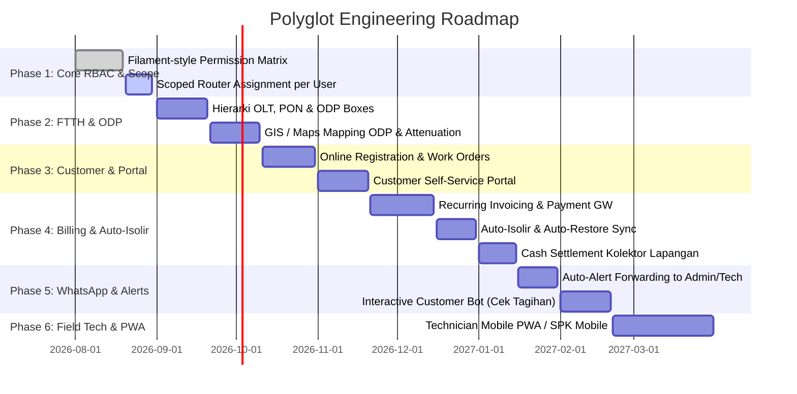

# 🗺️ Product & Engineering Roadmap — Polyglot ISP Management & NetOps Engine

Dokumen ini adalah **Roadmap Pengembangan Komprehensif** untuk platform **Polyglot**. Dokumen ini merangkum visi produk, tahapan rilis (*milestones*), arsitektur teknis, dan fitur-fitur dari infrastruktur jaringan (*NetOps*), manajemen FTTH/ODP, siklus hidup pelanggan, penagihan (*billing* otomatis), notifikasi bot WhatsApp, hingga operasional teknisi lapangan.

---

## 🎯 Visi & Prinsip Arsitektur

1. **All-in-One ISP Operating System**: Menggabungkan manajemen perangkat keras jaringan (MikroTik, OLT ZTE/Huawei, Cisco, GenieACS TR-069) dengan operasional bisnis (CRM, Registrasi, Penagihan, Kas Lapangan, & AI Customer Service).
2. **Clean Separation of Concerns**:
   - **PostgreSQL**: Sumber kebenaran tunggal (*Single Source of Truth*) untuk data bisnis, pelanggan, infrastruktur FTTH, invoice, dan audit log.
   - **MikroTik / OLT**: Sumber kebenaran tunggal untuk *state* jaringan *live* (PPPoE active sessions, DHCP leases, queue, optical power).
   - **Live Streaming Only**: Metrik CPU, trafik interface, dan sesi dipantau *real-time* via WebSocket/SSE tanpa membebani database (*zero metrics bloat*).
3. **Automated Revenue & Zero Human Error**: Otomasi penuh dari invoice terbit, pengingat WhatsApp, pembayaran QRIS/Virtual Account, isolir otomatis saat jatuh tempo, hingga auto-restore seketika setelah bayar.

---

## 🧭 Timeline & Tahapan Pengembangan



---

## 📌 Rincian Modul & Fitur Pengembangan

---

### 🛡️ Phase 1: Advanced RBAC & Scoped Router Access (Multi-Router Scope)
*Fokus: Mengamankan otorisasi berdasarkan modul (Feature-level) dan pembatasan router wilayah tugas (Data-level).*

- [x] **Permission Matrix Checkbox (Filament Style)**: Antarmuka matriks izin terstruktur per modul (*Devices, Hotspot, PPP, WhatsApp, Knowledge, Billing, Users/RBAC*).
- [x] **Role CRUD & Casbin Synchronization**: Sinkronisasi izin batch langsung ke tabel `casbin_rule` dan backend enforcement.
- [ ] **Scoped Router Assignment (`user_devices`)**:
  - Relasi Many-to-Many antara staf/teknisi dengan perangkat MikroTik yang menjadi tanggung jawabnya.
  - Dropdown `DeviceSwitcher` di frontend hanya memunculkan router yang ditugaskan ke user terkait.
  - Backend enforcement pada `ListDevices`, modul Hotspot, dan PPP agar menolak request jika `device_id` berada di luar wewenang teknisi (`403 Scoped Router Denied`).
- [ ] **Role Presets**: Template cepat untuk role umum (*NOC Engineer, Field Technician, Billing Admin, Customer Support, Collector*).

---

### 🌐 Phase 2: FTTH Infrastructure & ODP Mapping (Optical Management)
*Fokus: Visualisasi dan manajemen jalur fiber optik dari OLT hingga ke modem pelanggan.*

- [ ] **Hierarki FTTH Data Model**:
  - `olt_devices`: Manajemen OLT (ZTE C320/C300, Huawei MA5608T, dsb.).
  - `olt_pon_ports`: Manajemen kapasitas port PON (kapasitas maksimal 64/128 ONU per port).
  - `odp_boxes`: Manajemen kotak pembagi ODP (kode, kapasitas port 1:8 / 1:16, status port kosong/terpakai).
  - `onu_devices`: Inventori modem ONT/ONU (SN, MAC, model, redaman optik Rx/Tx dBm).
- [ ] **Peta GIS & Geolocation ODP**:
  - Visualisasi koordinat ODP di peta interaktif (Mapbox / Leaflet).
  - Indikator kapasitas ODP (*Hijau: Tersedia, Kuning: Hampir Penuh, Merah: Penuh*).
  - Jalur rute kabel fiber optik dari OLT ke ODP.
- [ ] **Optical Telemetry & LOS Monitoring**:
  - Pembacaan berkala redaman optik ONU via SNMP / TR-069 GenieACS.
  - Peringatan otomatis jika redaman melewati ambang batas wajar (misal $> -24\text{ dBm}$ atau LOS merah).

---

### 👥 Phase 3: Customer Lifecycle, Pendaftaran Online & Portal Mandiri
*Fokus: Mempermudah akuisisi pelanggan baru dan memberikan kemudahan akses bagi pelanggan.*

- [ ] **Modul Registrasi Online (`customer_registrations`)**:
  - Formulir pendaftaran mandiri calon pelanggan (upload KTP, share location Google Maps, pilih paket).
  - Alur persetujuan: `PENDING` $\rightarrow$ `APPROVED` $\rightarrow$ `SCHEDULED` $\rightarrow$ `IN_INSTALLATION` $\rightarrow$ `COMPLETED`.
  - Cek otomatis ODP terdekat berdasarkan radius koordinat GPS pemohon.
- [ ] **Surat Perintah Kerja (SPK) Pemasangan Baru**:
  - Penugasan teknisi lapangan untuk instalasi 1x24 jam.
  - Teknisi memasukkan SN Modem, redaman hasil splicing kabel, dan foto bukti instalasi.
- [ ] **Auto-Provisioning PPPoE**:
  - Saat status registrasi menjadi `COMPLETED`, sistem otomatis membuat akun `customers`, `subscriptions`, dan men-generate `/ppp/secret` ke router MikroTik sasaran tanpa input manual.
- [ ] **Portal Pelanggan Mandiri (Customer Self-Service Web)**:
  - Login via nomor WhatsApp / Kode Akses Unik (tanpa ribet password).
  - Cek rincian paket, riwayat pemakaian FUP, unduh invoice PDF, dan bayar online.

---

### 💳 Phase 4: Billing, Invoicing & Automated Revenue Engine
*Fokus: Otomasi penagihan bulanan, integrasi payment gateway, dan manajemen setoran kas.*

- [ ] **Recurring Invoicing Engine (Cron Scheduler)**:
  - Generate invoice otomatis setiap awal bulan atau tanggal jatuh tempo langganan.
  - Mendukung skema *Pascabayar (Postpaid)* dan *Prabayar (Prepaid)*.
  - Komponen biaya tambahan (biaya pasang, sewa IP publik, denda keterlambatan).
- [ ] **Multi-Channel Payment Gateway**:
  - Integrasi QRIS Real-time (Xendit / Midtrans / Tripay / Duitku).
  - Integrasi Virtual Account (BCA, Mandiri, BRI, BNI) dan Retail Outlet (Indomaret / Alfamart).
  - Webhook listener untuk verifikasi pembayaran instan (*zero delay*).
- [ ] **Auto-Isolir & Auto-Restore System**:
  - **Isolir Otomatis**: Jika lewat batas toleransi (*grace period*), sistem otomatis memasukkan IP pelanggan ke Firewall Address List `blocked_customers` atau mengubah PPPoE profile ke profile `ISOLIR` yang dialihkan ke halaman peringatan tagihan.
  - **Auto-Restore**: Begitu pembayaran terverifikasi sukses via webhook/kasir, rule isolir otomatis dicabut dalam hitungan detik.
- [ ] **Buku Kas Sederhana & Setoran Kolektor (`cash_settlements`)**:
  - Pelacakan saldo kas tunai yang dipegang oleh teknisi/kolektor lapangan saat menagih ke rumah pelanggan.
  - Batas maksimal saldo kas kolektor (*cash limit*) sebelum wajib disetor ke kasir kantor.
  - Alur verifikasi serah terima kas kolektor ke kasir keuangan.

---

### 🤖 Phase 5: WhatsApp AI Engine & Automated Alerting
*Fokus: Notifikasi otomatis multi-arah dan eskalasi cerdas via WhatsApp.*

- [ ] **Broadcast & Pengingat Tagihan Otomatis**:
  - Notifikasi tagihan baru (H-7 sebelum jatuh tempo).
  - Peringatan jatuh tempo (H-3 dan H-0).
  - Notifikasi isolir dan kuitansi pembayaran resmi (disertai link invoice / PDF).
- [ ] **Forwarding Alert Eskalasi ke WhatsApp Admin & Teknisi**:
  - Pengaturan daftar nomor HP Admin & Teknisi Siaga.
  - Ketika bot AI mengalami kegagalan (*fallback*) atau pelanggan meminta bantuan darurat, sistem otomatis mengirimkan pesan WhatsApp ke teknisi:
    ```
    🚨 [ESKALASI TIKET BOT]
    Pelanggan : 08123456789 (Bpk. Budi)
    Alamat    : ODP-KOT-01 / Jl. Mawar No. 4
    Keluhan   : "Lampu LOS merah sejak siang"
    Tindakan  : Silakan buka Live Chat Polyglot untuk ambil alih.
    ```
- [ ] **Tiered AI Chat Quota (Pembedaan Kuota Pelanggan vs Tamu Publik)**:
  - Pelanggan aktif terdaftar di database `customers`: Kuota prioritas lebih longgar (misal **25 percakapan AI/hari**).
  - Nomor tamu publik non-pelanggan: Kuota standar hemat token (**10 percakapan AI/hari**).
  - Integrasi dengan modul Customer Lifecycle untuk pengenalan nomor otomatis.
- [ ] **Interactive Customer Self-Care Bot**:
  - Menu interaktif di WhatsApp: *Ketik "1" untuk Cek Tagihan, "2" untuk Lapor Gangguan, "3" untuk Beli Voucher Hotspot*.
  - Pembuatan link pembayaran QRIS langsung di dalam chat WhatsApp.

---

### 📱 Phase 6: Field Operations, PWA & Mikhmon Hotspot Enhancements
*Fokus: Pengalaman teknisi di lapangan dan efisiensi penjualan voucher hotspot.*

- [ ] **Progressive Web App (PWA) untuk Teknisi Lapangan**:
  - Tampilan responsif mobile khusus teknisi dengan autentikasi biometrik / PIN.
  - Daftar tugas harian (tiket gangguan, jadwal pemasangan baru, setoran tagihan).
  - Fitur *Optical Power Tester* cepat dan *Live Ping* ke IP pelanggan langsung dari ponsel.
- [ ] **Mikhmon Hotspot Physical & Online Sales**:
  - **Cetak Massal Voucher**: Format template siap cetak A4/Thermal (Logo ISP, QR Code Login, Username/Password).
  - **Voucher Online via QRIS Captive Portal**: Pelanggan di captive portal MikroTik dapat scan QRIS dan langsung mendapatkan kode voucher aktif secara otomatis tanpa harus ke konter.
  - Laporan rekapitulasi omset penjualan voucher per router/lokasi.

---

### ⚡ Phase 7: Distributed Telemetry, TR-069 & Network Automation
*Fokus: Skalabilitas jaringan skala besar dan otomatisasi tingkat lanjut.*

- [ ] **TR-069 ACS (GenieACS Integration)**:
  - Auto-konfigurasi SSID Wi-Fi dan password router pelanggan secara remote dari web dashboard.
  - Reboot modem pelanggan dari jarak jauh tanpa kunjungan fisik.
- [ ] **Distributed Latency Probes (`cmd/probe`)**:
  - Probe ringan berbasis Go yang disebar di berbagai titik BTS/Node jaringan untuk memonitor *packet loss*, *jitter*, dan *bandwidth drop* antar link backbone.
- [ ] **Automated RouterOS Backup & Rollback**:
  - Backup konfigurasi `/export` otomatis terjadwal (tersimpan aman di database / S3 vault).
  - Riwayat audit perubahan konfigurasi (*who changed what in MikroTik*).

---

## 🏗️ Matriks Status Modul (Feature Matrix)

| Modul | Backend Domain | Database Migration | ConnectRPC API | Frontend UI | Status |
|---|---|---|---|---|---|
| **Auth & Casbin RBAC** | `domain/auth` | `000001` - `000008` | `RBACService` | `/rbac` | 🟢 **Selesai (v1.0)** |
| **MikroTik Diagnostics & Terminal** | `domain/device` | `000001` | `DeviceService` | `/devices` | 🟢 **Selesai (v1.0)** |
| **Mikhmon Hotspot Management** | `driver/mikrotik/hotspot` | `000002` | `HotspotService` | `/hotspot` | 🟢 **Selesai (v1.0)** |
| **PPPoE Secrets & Active Sessions** | `driver/mikrotik/ppp` | `000002` | `PPPService` | `/ppp` | 🟢 **Selesai (v1.0)** |
| **WhatsApp Chat & AI Bot Engine** | `usecase/bot` | `000004` | `BotService` | `/chats`, `/whatsapp` | 🟢 **Selesai (v1.0)** |
| **Knowledge Base & LLM Config** | `domain/knowledge` | `000003` | `KnowledgeService` | `/knowledge` | 🟢 **Selesai (v1.0)** |
| **Scoped Router Assignment** | `domain/device` | *Pending* | `DeviceService` | `/users`, `/rbac` | 🟡 **Dalam Pengerjaan** |
| **FTTH Infrastructure (OLT/ODP/ONU)** | `domain/ftth` | *Pending* | `FTTHService` | `/infrastructure` | ⚪ *Planned* |
| **Registrasi & Customer Lifecycle** | `domain/customer` | *Pending* | `CustomerService` | `/customers` | ⚪ *Planned* |
| **Billing, Auto-Isolir & QRIS VA** | `domain/billing` | *Pending* | `BillingService` | `/billing` | ⚪ *Planned* |
| **Technician SPK & PWA Mobile** | `domain/operations` | *Pending* | `OperationsService`| `/operations` | ⚪ *Planned* |

---

## 📈 Prinsip Rilis & Standar Kualitas

- Setiap modul baru wajib mengikuti arsitektur baku di [`AGENTS.md`](file:///home/quixiq/projects/polyground/polyglot/AGENTS.md) dan [`DEVELOPMENT-GUIDELINES.md`](file:///home/quixiq/projects/polyground/polyglot/DEVELOPMENT-GUIDELINES.md).
- Lapisan domain bersih tanpa ketergantungan transport/database.
- Pemisahan DTO Protobuf dan Domain Model via `mapper.go`.
- Unit test coverage $\ge 80\%$ dan zero build error pada server Go dan React/Vite.
