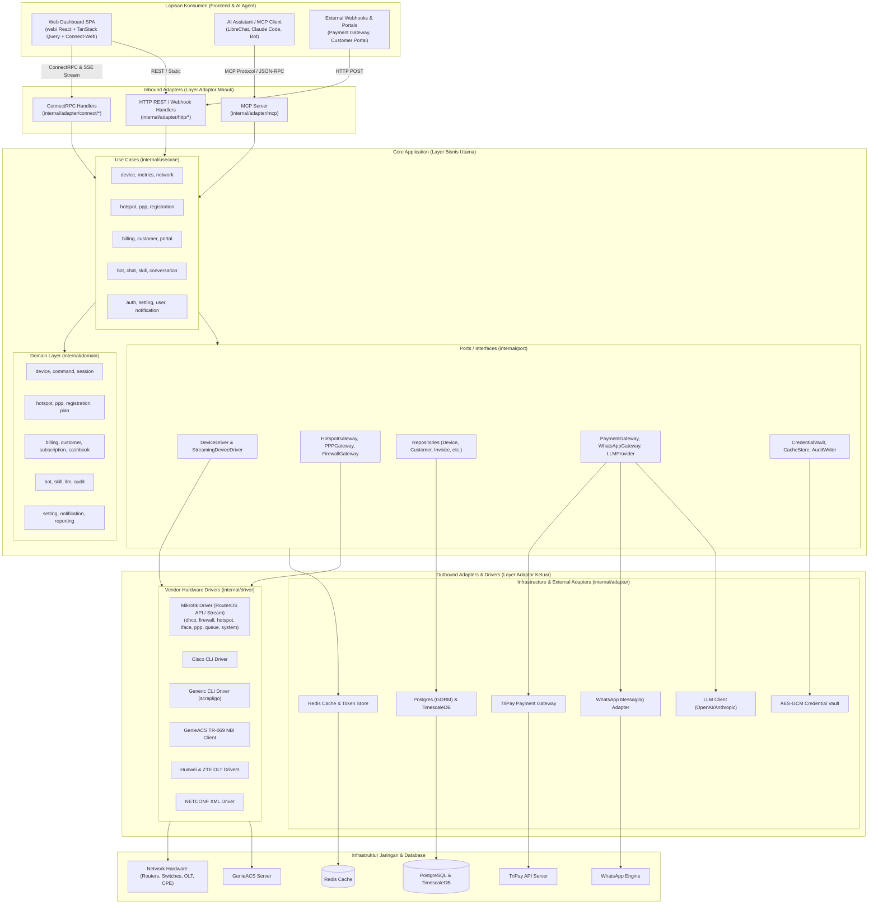
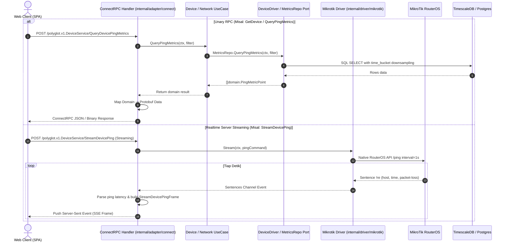
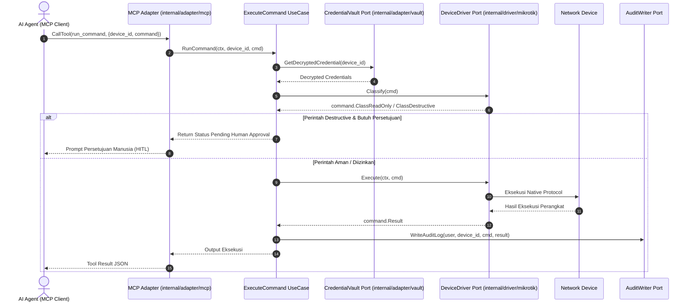

# Struktur Folder & Arsitektur Sistem — Polyglot NetOps Engine

Dokumen ini menyajikan panduan arsitektur sistem dan struktur folder definitif terkini untuk proyek **Polyglot** (NetOps Engine, ISP Management Platform, & AI-Augmented Network Automation Backend berbasis Go).

---

## 1. Ringkasan Eksekutif & Prinsip Utama

Polyglot dirancang sebagai platform backend **standalone, headless, dan API-first** berbasis bahasa **Go (Go 1.26)** dengan antarmuka frontend modern terpisah di direktori `web/` (React + TypeScript). Backend ini bertindak sebagai satu-satunya sumber kebenaran (*single source of truth*) untuk manajemen otomasi jaringan multi-vendor dan operasi bisnis ISP.

### Prinsip Arsitektur Utama

1. **Clean / Hexagonal Architecture (Ports and Adapters)**
   - **Domain Layer (`internal/domain/`)**: Entitas bisnis murni, invariants, value objects, dan sentinel error (`fault.New`). Dilarang mengimpor transport, port, adapter, driver, database, atau framework eksternal.
   - **Usecase Layer (`internal/usecase/`)**: Mengorkestrasi logika alur kerja aplikasi dan berinteraksi hanya dengan domain dan interface `internal/port`. Tidak pernah mengimpor `internal/adapter` atau `internal/driver`.
   - **Port Layer (`internal/port/`)**: Kontrak interface (*consumer-owned interfaces*) untuk repositori data, driver perangkat, gateway pembayaran, messaging WhatsApp, LLM, cache, dan audit log.
   - **Adapter Layer (`internal/adapter/`)**: Mengimplementasikan interface port untuk protokol masuk dan keluar:
     - **ConnectRPC (`internal/adapter/connect/`)**: Transport RPC type-safe & server-streaming (Connect/gRPC/gRPC-Web) berbasis Protobuf v1. Satu-satunya tempat mapping Protobuf <-> Domain.
     - **HTTP Gateway (`internal/adapter/http/`)**: Endpoint REST/Webhooks standar menggunakan `net/http.ServeMux` dan `middleware.Chain`.
     - **MCP Server (`internal/adapter/mcp/`)**: Model Context Protocol server untuk integrasi AI Agent (LibreChat, Claude, LLM).
     - **Postgres & TimescaleDB (`internal/adapter/postgres/`)**: Repositori database relasional (GORM) dan hypertables untuk metrik jaringan time-series (`time_bucket`).
     - **Redis (`internal/adapter/redis/`)**: Caching, distributed locks, dan token store.
     - **Third-Party Adapters**: `whatsapp` (messaging bridge), `tripay` (payment gateway), `llm` (AI provider client), `storage` (object storage), dan `vault` (AES-GCM credential encryption).
   - **Driver Layer (`internal/driver/`)**: Mengisolasi protokol perangkat keras dan komunikasi vendor (Mikrotik RouterOS API, Scrapligo SSH/Telnet, Cisco CLI, Huawei/ZTE OLT, GenieACS TR-069, NETCONF).

2. **Dual Communication Paradigms & Realtime Streaming**
   - **ConnectRPC & Protobuf (`api/proto/v1/`)**: Kontrak API terdefinisi secara presisi, mendukung pemanggilan RPC unary dan server-streaming berkelanjutan (Resource, Health, Ping, Traffic, Logs) tanpa polling periodik.
   - **MCP (Model Context Protocol)**: Memungkinkan AI Agent menjalankan diagnostik, membaca status, dan mengajukan konfigurasi jaringan secara aman.

3. **Driver Modularization & Safety-First Risk Classification**
   - Driver vendor RouterOS Mikrotik dipecah modular ke dalam domain package (`dhcp`, `firewall`, `hotspot`, `iface`, `ppp`, `queue`, `system`).
   - Setiap perintah dievaluasi tingkat risikonya (`command.ClassReadOnly` vs `command.ClassDestructive`) untuk mendukung persetujuan (*Human-In-The-Loop / HITL*) dan pencatatan audit log otomatis.

---

## 2. Diagram Arsitektur Sistem

### 2.1 Diagram Komponen Utama (High-Level Architecture)



---

## 3. Struktur Folder Definitif Proyek

Berikut adalah struktur direktori lengkap repositori **Polyglot**:

```text
polyglot/
├── cmd/                                    # Runtime Entrypoints
│   ├── server/                             # Entry point utama Polyglot server daemon
│   │   └── main.go
│   ├── probe/                              # Remote POP network probe agent
│   │   └── main.go
│   └── seed/                               # Database & initial RBAC policy seeder
│       └── main.go
│
├── api/                                    # Definisi Kontrak & Skema API
│   ├── proto/v1/                           # Protobuf v1 Service Definitions
│   │   ├── auth.proto                      # Service otentikasi & token JWT
│   │   ├── billing.proto                   # Service tagihan, pembayaran, & invoice
│   │   ├── bot.proto                       # Service konfigurasi bot & LLM agent
│   │   ├── cashbook.proto                  # Service kas / pembukuan keuangan
│   │   ├── customer.proto                  # Service manajemen data pelanggan
│   │   ├── device.proto                    # Service perangkat & streaming status/ping/traffic
│   │   ├── hotspot.proto                   # Service voucher, profil, binding, & server hotspot
│   │   ├── ispadmin.proto                  # Service administrasi ISP & integrasi sistem
│   │   ├── notification.proto              # Service template & log notifikasi
│   │   ├── portal.proto                    # Service customer self-service portal
│   │   ├── ppp.proto                       # Service PPPoE secret, profile, & active sessions
│   │   ├── probe.proto                     # Service probe status & metrics
│   │   ├── rbac.proto                      # Service role & permission management
│   │   ├── registration.proto              # Service registrasi mandiri pelanggan
│   │   ├── report.proto                    # Service laporan operasional & keuangan
│   │   ├── settings.proto                  # Service konfigurasi sistem & LLM
│   │   ├── users.proto                     # Service manajemen pengguna internal
│   │   └── whatsapp.proto                  # Service sesi WhatsApp gateway
│   ├── gen/v1/                             # Go Generated Protobuf & ConnectRPC Code (Jangan Diedit Manual)
│   └── openapi.yaml                        # OpenAPI / Swagger Specification
│
├── internal/                               # Internal Codebase (Clean Architecture)
│   ├── app/                                # App Lifecycle & Dependency Injection Container
│   │   ├── app.go                          # Service wiring, startup listeners, graceful shutdown
│   │   └── wire_gen.go
│   │
│   ├── domain/                             # Entitas & Aturan Bisnis Murni (Zero Framework Imports)
│   │   ├── audit/                          # Entitas audit trail
│   │   ├── billing/                        # Entitas invoice, item tagihan, & transaksi pembayaran
│   │   ├── bot/                            # Entitas agen bot, prompt, & tool execution
│   │   ├── cashbook/                       # Entitas buku kas & akun keuangan
│   │   ├── command/                        # Klasifikasi risiko (ReadOnly vs Destructive) & model perintah
│   │   ├── customer/                       # Entitas data pelanggan ISP
│   │   ├── device/                         # Entitas router/switch, kredensial, & ping/traffic metrics
│   │   ├── hotspot/                        # Entitas voucher, profil, server, & template hotspot
│   │   ├── llm/                            # Entitas konfigurasi model AI & token cost
│   │   ├── notification/                   # Entitas pesan & template notifikasi
│   │   ├── plan/                           # Entitas paket internet (bandwidth, harga)
│   │   ├── ppp/                            # Entitas PPPoE secret, profile, & active session
│   │   ├── registration/                   # Entitas registrasi pelanggan baru
│   │   ├── reporting/                      # Entitas agregat laporan pendapatan & operasional
│   │   ├── session/                        # Entitas sesi koneksi perangkat
│   │   ├── setting/                        # Entitas konfigurasi umum & integrasi
│   │   ├── skill/                          # Entitas skill metadata AI
│   │   └── subscription/                   # Entitas langganan pelanggan aktif
│   │
│   ├── usecase/                            # Orchestration Layer (Logika Alur Kerja Aplikasi)
│   │   ├── auth/                           # Login, refresh token, otentikasi user
│   │   ├── billing/                        # Pembuatan tagihan bulanan, proses pembayaran, reconciler
│   │   ├── bot/                            # Eksekusi interaksi bot & AI orchestrator
│   │   ├── chat/                           # Pengelolaan percakapan chat & broadcast
│   │   ├── conversation/                   # Manajemen histori percakapan AI
│   │   ├── customer/                       # CRUD & pengelolaan status pelanggan
│   │   ├── device/                         # Pengelolaan perangkat & query metrik
│   │   ├── hotspot/                        # Generator voucher batch, sync profil, expire scheduler
│   │   ├── importer/                       # Importer data dari sistem eksternal / Mikhmon
│   │   ├── metrics/                        # PingStreamWorker & agregasi metrik background
│   │   ├── network/                        # Eksekusi command jaringan, streaming traffic, sync status
│   │   ├── notification/                   # Dispatcher pesan notifikasi (WhatsApp/Email/SMS)
│   │   ├── portal/                         # Layanan portal pelanggan (cek tagihan, bayar)
│   │   ├── ppp/                            # Manajemen akun PPPoE & pemutusan sesi
│   │   ├── registration/                   # Registrasi mandiri & provisioning otomatis
│   │   ├── setting/                        # Pengelolaan parameter setting sistem
│   │   ├── skill/                          # Sinkronisasi & manajemen skill AI
│   │   └── user/                           # Manajemen akun user internal & RBAC
│   │
│   ├── port/                               # Interface Kontrak Go (Boundary Abstractions)
│   │   ├── audit.go                        # Interface pencatatan audit log
│   │   ├── auth_service.go                 # Interface layanan otentikasi
│   │   ├── credential_vault.go             # Interface enkripsi kredensial perangkat
│   │   ├── device_driver.go                # Interface driver (Execute, Classify, Translate)
│   │   ├── device_repository.go            # Interface repositori perangkat
│   │   ├── hotspot_gateway.go              # Interface operasi gateway hotspot RouterOS
│   │   ├── invoice_repository.go           # Interface repositori tagihan & invoice
│   │   ├── metrics_repository.go           # Interface repositori metrik time-series (TimescaleDB)
│   │   ├── payment_gateway.go              # Interface integrasi payment gateway
│   │   ├── ppp_gateway.go                  # Interface operasi gateway PPPoE RouterOS
│   │   ├── streaming_driver.go             # Interface driver native streaming realtime
│   │   ├── whatsapp_gateway.go             # Interface pengiriman pesan WhatsApp
│   │   └── ...                             # (Kontrak repositori & gateway domain lainnya)
│   │
│   ├── adapter/                            # Protocol & Infrastructure Adapters
│   │   ├── connect/                        # ConnectRPC Handlers & Router Layer
│   │   │   ├── auth/                       # ConnectRPC AuthServiceHandler
│   │   │   ├── billing/                    # ConnectRPC BillingServiceHandler
│   │   │   ├── bot/                        # ConnectRPC BotServiceHandler
│   │   │   ├── cashbook/                   # ConnectRPC CashbookServiceHandler
│   │   │   ├── customer/                   # ConnectRPC CustomerServiceHandler
│   │   │   ├── device/                     # ConnectRPC DeviceServiceHandler & StreamPing/Traffic
│   │   │   ├── hotspot/                    # ConnectRPC HotspotServiceHandler
│   │   │   ├── ispadmin/                   # ConnectRPC ISPAdminServiceHandler
│   │   │   ├── notification/               # ConnectRPC NotificationServiceHandler
│   │   │   ├── portal/                     # ConnectRPC PortalServiceHandler
│   │   │   ├── ppp/                        # ConnectRPC PPPServiceHandler
│   │   │   ├── registration/               # ConnectRPC RegistrationServiceHandler
│   │   │   ├── report/                     # ConnectRPC ReportServiceHandler
│   │   │   ├── setting/                    # ConnectRPC SettingServiceHandler
│   │   │   ├── codec.go                    # Protovalidate & Connect JSON Codec setup
│   │   │   ├── options.go                  # Interceptor & HTTP Connect options
│   │   │   └── request_id.go               # Request correlation ID injector
│   │   │
│   │   ├── http/                           # HTTP REST Gateway & Webhooks (net/http.ServeMux)
│   │   │   ├── adminapi/                   # REST fallback endpoints
│   │   │   ├── gateway/                    # Payment & WhatsApp Webhook listeners
│   │   │   ├── middleware/                 # Auth JWT, RBAC Casbin, CORS, Recovery
│   │   │   ├── portal/                     # Public customer portal endpoints
│   │   │   └── reports/                    # Export PDF / Excel reporting endpoints
│   │   │
│   │   ├── mcp/                            # Model Context Protocol (MCP) Server untuk AI
│   │   │   ├── server.go                   # MCP server setup & tool registry
│   │   │   ├── tool_get_device_status.go   # Tool pembaca status router
│   │   │   ├── tool_push_config.go         # Tool push konfigurasi
│   │   │   └── tool_run_command.go         # Tool eksekusi perintah aman
│   │   │
│   │   ├── postgres/                       # PostgreSQL (GORM) & TimescaleDB Repositories
│   │   │   ├── model/                      # GORM Database Entities
│   │   │   ├── metrics_repository.go       # TimescaleDB hypertable query & time_bucket downsampling
│   │   │   ├── store.go                    # GORM DB connection & migration bootstrapper
│   │   │   └── ...                         # (Customer, Device, Invoice, Hotspot, User Repositories)
│   │   │
│   │   ├── redis/                          # Redis Client Adapter (Caching, Token Store, Locks)
│   │   ├── llm/                            # LLM Client Adapter (OpenAI, Anthropic API)
│   │   ├── storage/                        # Object Storage (Local disk / S3-compatible)
│   │   ├── tripay/                         # TriPay Payment Gateway API Client
│   │   ├── vault/                          # AES-GCM Encrypted Credential Vault
│   │   ├── whatsapp/                       # WhatsApp Baileys / Go-WhatsApp client adapter
│   │   └── auth/                           # JWT Token Generator & Casbin RBAC Adapter
│   │
│   ├── driver/                             # Vendor Hardware & Protocol Drivers
│   │   ├── mikrotik/                       # Native RouterOS API & Streaming Driver
│   │   │   ├── dhcp/                       # Sub-package DHCP Server & Leases
│   │   │   ├── firewall/                   # Sub-package Filter Rules, NAT, & Address List
│   │   │   ├── hotspot/                    # Sub-package Hotspot Server, Profiles, & Users
│   │   │   ├── iface/                      # Sub-package Network Interfaces & Traffic Monitor
│   │   │   ├── internal/                   # Parser helpers & command builder utilities
│   │   │   ├── ppp/                        # Sub-package PPPoE Secrets, Profiles, & Active
│   │   │   ├── queue/                      # Sub-package Simple Queue & Queue Tree
│   │   │   ├── system/                     # Sub-package Health, Resource, Ping, Identity, & Logs
│   │   │   ├── commands.go                 # Definisi & klasifikasi risiko perintah RouterOS
│   │   │   ├── connect.go                  # Pengelolaan pool koneksi RouterOS API
│   │   │   ├── driver.go                   # Implementasi utama port.DeviceDriver
│   │   │   ├── gateway.go                  # Implementasi Port Gateways RouterOS
│   │   │   └── stream.go                   # Streaming sentence listener RouterOS
│   │   │
│   │   ├── cisco/                          # Driver Cisco IOS / IOS-XE CLI
│   │   ├── genericcli/                     # Scrapligo Shared CLI Session Engine
│   │   ├── genericssh/                     # Driver SSH generik multi-vendor
│   │   ├── generictelnet/                  # Driver Telnet generik legacy
│   │   ├── genieacs/                       # Driver TR-069 NBI Client GenieACS
│   │   ├── huaweiolt/                      # Driver OLT Huawei (CLI/SNMP)
│   │   ├── netconf/                        # Driver NETCONF XML over SSH
│   │   ├── whatsapp/                       # Driver komunikasi WhatsApp gateway
│   │   └── zteolt/                         # Driver OLT ZTE C300/C320 (CLI/SNMP)
│   │
│   ├── platformdef/                        # Platform YAML definitions untuk Scrapligo
│   ├── registry/                           # Driver Registry & Factory Dispatcher
│   ├── template/                           # Template generator voucher & notifikasi
│   └── config/                             # Parser konfigurasi environment aplikasi
│
├── pkg/                                    # Reusable Pure Utility Libraries (No Business Logic)
│   ├── fault/                              # Domain error builder & error kind classification
│   ├── idgen/                              # K-Sortable / UUID unique identifier generator
│   ├── llmcost/                            # Kalkulator estimasi biaya token model AI
│   ├── logger/                             # Structured contextual JSON logger (slog/zap wrapper)
│   ├── phone/                              # Parser & normalizer format nomor telepon Indonesia
│   ├── ping/                               # Parser latency, packet loss, & format output ping RouterOS
│   ├── response/                           # Mapper error domain ke ConnectRPC status codes
│   ├── retry/                              # Exponential backoff retry helper
│   └── voucher/                            # Generator pola kode & barcode voucher
│
├── web/                                    # Frontend Web Dashboard SPA
│   ├── src/
│   │   ├── features/                       # Modul fitur berbasis domain
│   │   │   ├── auth/                       # Halaman login, register, & autentikasi
│   │   │   ├── billing/                    # Halaman invoice, transaksi, & kasir
│   │   │   ├── bot/                        # Halaman konfigurasi AI Assistant & skill
│   │   │   ├── customers/                  # Halaman master data pelanggan
│   │   │   ├── devices/                    # Halaman manajemen router, kartu status, & Ping Analytics
│   │   │   │   ├── components/             # Sub-komponen (Card, Ping Analytics, Settings)
│   │   │   │   ├── hooks/                  # Hook streaming realtime (status, ping, traffic)
│   │   │   │   └── api/                    # TanStack Query hooks untuk ConnectRPC
│   │   │   ├── hotspot/                    # Halaman voucher, profil, template cetak
│   │   │   ├── ppp/                        # Halaman PPPoE secret & active monitor
│   │   │   ├── reports/                    # Halaman statistik, grafik pendapatan
│   │   │   └── settings/                   # Halaman konfigurasi sistem & LLM
│   │   ├── gen/v1/                         # Protobuf Generated TypeScript Client (@bufbuild)
│   │   ├── lib/                            # API client, utility formatters, theme provider
│   │   └── components/                     # Shadcn UI & reusable design system components
│   ├── package.json                        # Frontend NPM dependencies (Dikelola dengan pnpm)
│   ├── vite.config.ts                      # Vite build configuration
│   └── tsconfig.json                       # TypeScript compiler configuration
│
├── migrations/                             # SQL Schema Migrations (golang-migrate)
│   ├── 000001_create_devices_table.up.sql
│   ├── ...
│   └── 000022_create_device_ping_metrics_table.up.sql
│
├── deployments/                            # Konfigurasi Container & Deployment
│   ├── docker/                             # Dockerfile multi-stage build Go & Web SPA
│   └── docker-compose.yml                  # Compose stack (Postgres, TimescaleDB, Redis, Polyglot)
│
├── scripts/                                # Skrip Automasi & Validasi
│   ├── check-connect-errors.sh             # Validasi pemetaan response ConnectRPC
│   ├── check-layer-boundaries.sh           # Validasi boundary arsitektur antar layer
│   └── ...                                 # Skrip pengujian & setup
│
├── test/                                   # Pengujian Integrasi & E2E
│   └── integration/                        # Tagged integration tests (Postgres, Redis, Mikrotik)
│
├── AGENTS.md                               # Aturan mutlak agen AI (Single Source of Truth)
├── DEVELOPMENT-GUIDELINES.md               # Panduan implementasi & konvensi kode
├── EFFECTIVE_GO.md                         # Standar penamaan, error handling, & formatting Go
├── Makefile                                # Automasi command (build, test, lint, proto-check)
└── go.mod / go.sum                         # Go Module Definition (Go 1.26)
```

---

## 4. Rincian Lapisan Arsitektur (Layer Responsibilities)

### 4.1 Domain Layer (`internal/domain/`)
- Berisi tipe data murni (*pure models*), konstanta, aturan bisnis inti (*invariants*), dan sentinel error yang didefinisikan menggunakan `fault.New`.
- Dilarang keras mengimpor package di luar Go standard library dan package utilitas internal non-bisnis (`pkg/fault`).
- Tidak boleh mengenal HTTP, database, ConnectRPC, Protobuf, ataupun vendor driver.

### 4.2 Usecase Layer (`internal/usecase/`)
- Mengorkestrasi logika alur kerja aplikasi (*business workflow orchestration*).
- Hanya bergantung pada `internal/domain/` dan `internal/port/`.
- Tidak boleh mengimpor package konkret dari `internal/adapter/` atau `internal/driver/`.
- Seluruh dependensi eksternal diinjeksi melalui konstruktor (*manual constructor dependency injection*).

### 4.3 Port Layer (`internal/port/`)
- Tempat pendefinisian seluruh interface kontrak (*consumer-owned Go interfaces*).
- Memisahkan kebutuhan bisnis murni dari implementasi teknis konkret:
  - Repositori database (`DeviceRepository`, `MetricsRepository`, `CustomerRepository`).
  - Driver perangkat keras (`DeviceDriver`, `StreamingDeviceDriver`).
  - Layanan eksternal (`PaymentGateway`, `WhatsAppGateway`, `LLMProvider`, `CredentialVault`).

### 4.4 Adapter Layer (`internal/adapter/`)
- Menerjemahkan komunikasi antara dunia luar dan UseCase internal:
  - **ConnectRPC Adapter (`internal/adapter/connect/`)**: Mengonversi protobuf request ke pemanggilan UseCase, dan memetakan return domain error ke status ConnectRPC via `pkg/response`.
  - **HTTP Adapter (`internal/adapter/http/`)**: Menangani endpoint webhook dan dokumen laporan menggunakan `net/http.ServeMux` standar.
  - **Postgres Adapter (`internal/adapter/postgres/`)**: Menerjemahkan panggilan repositori ke query database relasional GORM dan TimescaleDB hypertable downsampling (`time_bucket`).
  - **MCP Adapter (`internal/adapter/mcp/`)**: Memaparkan kemampuan UseCase sebagai tool JSON-RPC untuk AI Agent.

### 4.5 Driver Layer (`internal/driver/`)
- Mengisolasi komunikasi fisik/protokol ke perangkat keras jaringan.
- Driver Mikrotik RouterOS (`internal/driver/mikrotik/`) mengelola pool koneksi API, memonitor streaming sentence, dan mengeksekusi operasi domain jaringan secara terisolasi.

### 4.6 Utility Package (`pkg/`)
- Package mandiri tanpa logika bisnis spesifik (*domain-agnostic*), dapat digunakan kembali di layer manapun:
  - `pkg/fault`: Konstruktor error domain terstruktur.
  - `pkg/response`: Pemetaan error domain menjadi ConnectRPC response status.
  - `pkg/logger`: Logging terstruktur dengan konteks trace & correlation ID.
  - `pkg/ping`: Parser respon paket ping latency RouterOS.

---

## 5. Ringkasan Alur Data & Eksekusi

### 5.1 Alur Pemanggilan ConnectRPC & Streaming



### 5.2 Alur Eksekusi AI Agent via MCP



---

## 6. Standar Pengembangan & Panduan Kepatuhan

1. **Pemetaan Error**:
   - Error domain **wajib** dibuat dengan `fault.New(fault.Kind..., "pesan")`.
   - Handler ConnectRPC **dilarang** mengonstruksi `connect.NewError` secara ad-hoc; gunakan `response.MapDomainError(err)` dari `pkg/response`.
2. **Logging**:
   - Selalu gunakan `pkg/logger`. Dilarang menggunakan `fmt.Println` atau `log.Printf` pada kode produksi.
   - Log harus menyertakan static message, snake_case fields, dan request correlation ID tanpa memuat token, password, atau PII sensitif.
3. **Ukuran File**:
   - Batas maksimal ukuran file produksi adalah **500 baris**. Jika melebihi batas dengan alasan rancangan khusus, beri tanda `// DEVIASI: <alasan>`.
4. **Validasi Kualitas Kode**:
   - Jalankan pemeriksaan sebelum melakukan commit:
     ```bash
     make build
     make vet
     make test
     make lint
     make check-connect-errors check-layer-boundaries
     ```
   - Untuk frontend web: jalankan `pnpm build` di direktori `web/`.
