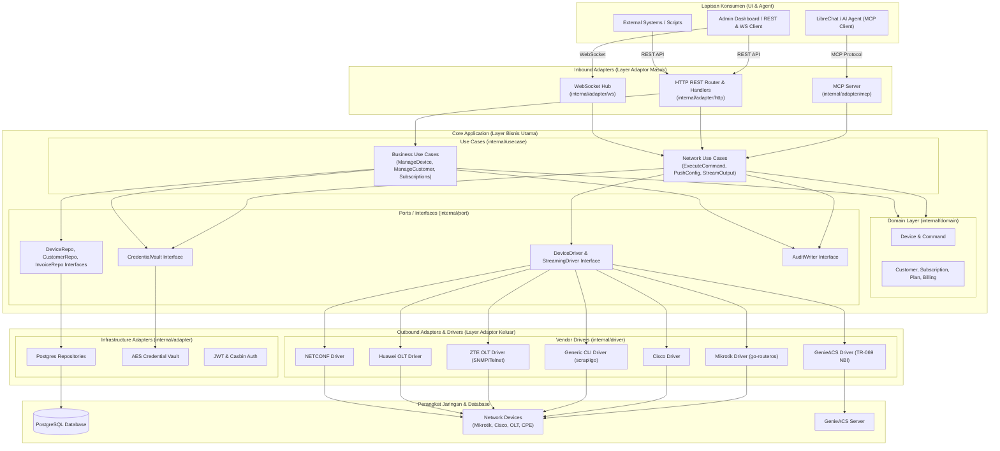
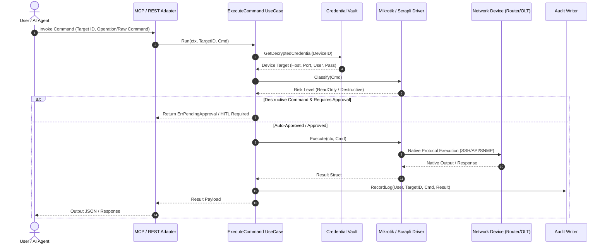

# Struktur Folder & Arsitektur Sistem — Polyglot NetOps Engine

Dokumen ini menyajikan panduan arsitektur sistem dan struktur folder definitif untuk proyek **Polyglot** (NetOps Engine & ISP Management Platform Go Backend).

---

## 1. Ringkasan Eksekutif & Prinsip Utama

Polyglot dirancang sebagai backend **standalone, headless, dan API-first** berbasis bahasa **Go**. Backend ini bertindak sebagai satu-satunya sumber kebenaran (*single source of truth*) untuk manajemen otomasi jaringan multi-vendor dan operasi bisnis ISP.

### Prinsip Arsitektur Utama

1. **Clean / Hexagonal Architecture (Ports and Adapters)**
   - **Domain Layer (`internal/domain/`)**: Hanya berisi entitas bisnis murni & aturan validasi. Tidak bergantung pada library eksternal atau I/O.
   - **Usecase Layer (`internal/usecase/`)**: Mengorkestrasi logika aplikasi bisnis/jaringan tanpa tahu detail HTTP, Postgres, atau protokol vendor.
   - **Port Layer (`internal/port/`)**: Berisi kontrak (Go interfaces) untuk repositori, driver perangkat, vault, dan audit log.
   - **Adapter Layer (`internal/adapter/`)**: Mengimplementasikan interface Port untuk protokol & infrastruktur eksternal (REST HTTP Gin, MCP Server, WebSocket Hub, Postgres GORM, Auth JWT/Casbin, Vault AES).
   - **Driver Layer (`internal/driver/`)**: Tempat isolasi semua komunikasi spesifik vendor perangkat jaringan (Mikrotik, Cisco, OLT ZTE/Huawei, GenieACS, NETCONF, Generic CLI Scrapli).

2. **API-First & UI-Agnostic**
   - Mendukung dua jalur akses utama:
     - **MCP (Model Context Protocol)**: Digunakan oleh AI Assistant (seperti LibreChat) untuk membaca status & mengeksekusi perintah.
     - **REST API & WebSocket/SSE**: Dipanggil langsung oleh UI Dashboard (React/Admin Panel) atau konsumen eksternal lainnya.

3. **Driver Isolation & Risk Classification (Safety First)**
   - Logika vendor & perintah spesifik perangkat **hidup penuh di driver vendor masing-masing**, tidak pernah bocor ke layer use case atau domain.
   - Setiap driver mengevaluasi derajat risiko perintah (`command.ClassReadOnly` vs `command.ClassDestructive`) untuk mendukung persetujuan manusia (*Human-In-The-Loop / HITL*).

---

## 2. Diagram Arsitektur Sistem

### 2.1 Diagram Komponen Utama (High-Level Architecture)

---

## 3. Struktur Folder Definitif Proyek

Berikut adalah struktur folder lengkap dan definitif untuk repositori **Polyglot**:

`
polyglot/
├── cmd/
│   └── server/
│       └── main.go                         # Entry point utama aplikasi Go backend
├── internal/
│   ├── domain/                             # Entity & Aturan Bisnis Murni (Zero External Dependencies)
│   │   ├── billing/                        # Entitas invoice & transaksi pembayaran (invoice.go, payment.go)
│   │   ├── command/                        # Klasifikasi risiko & struktur command/policy (command.go, policy.go)
│   │   ├── customer/                       # Entitas pelanggan ISP (customer.go)
│   │   ├── device/                         # Entitas & kredensial perangkat (credentials.go, device.go, errors.go)
│   │   ├── plan/                           # Entitas paket layanan ISP (plan.go)
│   │   ├── session/                        # Entitas sesi koneksi perangkat (session.go)
│   │   └── subscription/                   # Entitas langganan & profil (subscription.go)
│   │
│   ├── usecase/                            # Orkestrasi Alur Kerja Aplikasi
│   │   ├── business/                       # Use case bisnis (manage_customer.go, manage_device.go, manage_invoice.go, manage_plan.go, manage_subscription.go)
│   │   └── network/                        # Use case jaringan (execute_command.go, get_device_status.go, mikhmon_usecase.go, push_config.go, stream_output.go)
│   │
│   ├── port/                               # Interface / Kontrak Go (Boundary Definition)
│   │   ├── audit_writer.go                 # Interface pencatatan audit log
│   │   ├── credential_vault.go             # Interface pengamanan kredensial
│   │   ├── customer_repository.go          # Interface penyimpanan data pelanggan
│   │   ├── device_driver.go                # Interface utama driver perangkat (Execute, Classify, Translate)
│   │   ├── device_repository.go            # Interface penyimpanan data perangkat
│   │   ├── invoice_repository.go           # Interface penyimpanan data invoice
│   │   ├── streaming_driver.go             # Interface driver pendukung streaming output realtime
│   │   └── subscription_repository.go      # Interface penyimpanan data langganan
│   │
│   ├── adapter/                            # Implementasi Interface Protokol & Infrastruktur
│   │   ├── auth/                           # Adapter JWT (jwt.go) & Casbin RBAC (casbin.go)
│   │   ├── http/                           # REST API Layer (Gin Framework)
│   │   │   ├── customer_handler.go         # Handler HTTP untuk pelanggan
│   │   │   ├── device_handler.go           # Handler HTTP untuk perangkat (device_handler_test.go)
│   │   │   ├── invoice_handler.go          # Handler HTTP untuk invoice
│   │   │   ├── mikhmon_handler.go          # Handler HTTP integrasi Mikhmon v4 (mikhmon_handler_test.go)
│   │   │   ├── router.go                   # Inisialisasi rute REST & middleware
│   │   │   ├── subscription_handler.go     # Handler HTTP untuk langganan
│   │   │   └── middleware/                 # Middleware Auth JWT (auth.go) & RBAC Casbin (rbac.go)
│   │   ├── mcp/                            # MCP (Model Context Protocol) Server untuk AI Agent
│   │   │   ├── server.go                   # Setup MCP server & handler registrasi tool (server_test.go)
│   │   │   ├── tool_get_device_status.go   # Tool MCP status perangkat
│   │   │   ├── tool_push_config.go         # Tool MCP push konfigurasi
│   │   │   ├── tool_run_command.go         # Tool MCP eksekusi perintah (tools_test.go)
│   │   ├── postgres/                       # Implementasi Repository Postgres GORM (customer, device, invoice, subscription)
│   │   ├── vault/                          # Implementasi AES Encrypted Credential Vault (aes_vault.go)
│   │   └── ws/                             # WebSocket Layer (Realtime Hub)
│   │       ├── device_stream_handler.go    # Handler streaming output perangkat
│   │       ├── hub.go                      # WebSocket Client Connection Manager
│   │       └── mikhmon_stream_handler.go   # Stream handler khusus data/monitoring Mikhmon (mikhmon_stream_handler_test.go)
│   │
│   ├── driver/                             # Implementasi Driver Perangkat Komunikasi Langsung
│   │   ├── cisco/                          # Driver Cisco CLI (driver.go, commands.go)
│   │   ├── genericcli/                     # Engine bersama Scrapligo (catalog.go, session.go, catalog_test.go)
│   │   ├── genericssh/                     # Driver SSH generik menggunakan Scrapligo (driver.go, commands.go)
│   │   ├── generictelnet/                  # Driver Telnet generik menggunakan Scrapligo (driver.go)
│   │   ├── genieacs/                       # Driver NBI Client GenieACS TR-069 (client.go, commands.go, errors.go, *_test.go)
│   │   ├── huaweiolt/                      # Driver OLT Huawei (driver.go, commands.go)
│   │   ├── mikrotik/                       # Driver API Native Mikrotik (go-routeros) & SSH
│   │   │   ├── commands.go                 # Katalog command RouterOS & klasifikasi risiko (commands_test.go)
│   │   │   ├── connect.go                  # Handler koneksi RouterOS API
│   │   │   ├── dhcp.go                     # Handler DHCP server & lease
│   │   │   ├── driver.go                   # Core Driver Mikrotik & implementasi port.DeviceDriver (drivers_test.go)
│   │   │   ├── errors.go                   # Custom error definitions driver Mikrotik
│   │   │   ├── firewall.go                 # Handler IP firewall filter & NAT
│   │   │   ├── hotspot_active.go           # Handler hotspot active sessions
│   │   │   ├── hotspot_profile.go          # Handler user profile hotspot
│   │   │   ├── hotspot_user.go             # Handler user CRUD hotspot
│   │   │   ├── iface.go                    # Handler network interfaces
│   │   │   ├── ip.go                       # Handler IP address & route
│   │   │   ├── pool.go                     # Handler IP pool
│   │   │   ├── ppp.go                      # Handler PPPoE / PPP secrets (ppp_test.go)
│   │   │   ├── ppp_active.go               # Handler PPP active connections (ppp_active_test.go)
│   │   │   ├── ppp_profile.go              # Handler PPP profiles
│   │   │   ├── queue.go                    # Handler Simple Queue & Queue Tree
│   │   │   ├── stream.go                   # Handler dual-connection streaming output
│   │   │   ├── system.go                   # Handler system resource & reboot
│   │   │   └── mikhmon/                    # Sub-package generator & helper domain Mikhmon v4
│   │   │       ├── comment.go              # Parser & generator comment expired (comment_test.go)
│   │   │       ├── expire.go               # Monitor & remover user expired (expire_test.go)
│   │   │       ├── profile.go              # Extension user profile Mikhmon (profile_test.go)
│   │   │       ├── report.go               # Generator laporan penjualan voucher (report_test.go)
│   │   │       └── voucher.go              # Generator & batch creator voucher (voucher_test.go)
│   │   ├── netconf/                        # Driver NETCONF XML Over SSH (driver.go, commands.go)
│   │   └── zteolt/                         # Driver OLT ZTE (snmp.go, telnet.go, commands.go)
│   │
│   ├── platformdef/                        # Definisi file YAML platform custom Scrapligo (mikrotik_routeros.yaml, README.md)
│   ├── registry/                           # Driver Factory & Registry Central (registry.go, registry_test.go)
│   ├── audit/                              # Engine pencatat Audit Log (writer.go)
│   └── config/                             # Konfigurasi aplikasi dari environment variable (config.go)
│
├── pkg/                                    # Library Utilitas Generik Murni (Reusable)
│   └── retry/                              # Package retry mechanism (retry.go)
│
├── api/                                    # Spesifikasi API Eksternal
│   ├── mcp-tools.md                        # Dokumentasi spesifikasi tool MCP
│   └── openapi.yaml                        # OpenAPI / Swagger Specification
│
├── migrations/                             # SQL Migration Files (000001_create_devices_table.up.sql & .down.sql)
├── deployments/                            # Configuration Docker & Docker Compose (docker/Dockerfile, docker-compose.yml)
├── docs/                                   # Dokumentasi & Architecture Decision Records (ADR)
│   └── adr/                                # Catatan keputusan arsitektur (0001 - 0004)
├── mikhmon4/                               # Legacy PHP Mikhmon v4 (Kode acuan & dokumentasi API integrasi)
│   ├── MIKHMON_ANALYSIS.md
│   ├── MIKHMON_v4_API_ENDPOINTS_DOCUMENTATION.md
│   └── ...                                 # Source PHP legacy Mikhmon v4
├── scripts/                                # Script pendukung dev, testing WS/streaming, & seed
│   ├── seed.go                             # Database seeder
│   ├── test_docker_api.ps1                 # Script pengujian API via Docker
│   ├── test_inactive_streaming.ps1         # Script pengujian WebSocket inactive streaming
│   ├── test_pure_streaming.ps1             # Script pengujian WebSocket pure streaming
│   └── test_ws_queues.ps1                  # Script pengujian WebSocket queue streaming
├── test/                                   # End-to-end & integration tests
│   └── integration/                        # Integration tests (device_test, mikhmon_test, mikrotik_*_test)
│       ├── .gitkeep
│       ├── device_test.go
│       ├── mikhmon_test.go
│       ├── mikrotik_builders_test.go
│       ├── mikrotik_ssh_test.go
│       └── mikrotik_test.go
│
├── .env / .env.example                     # Konfigurasi Environment Variable
├── .gitignore                              # Git ignore rules
├── .golangci.yml                           # Konfigurasi Linter Go
├── AGENTS.MD                               # Aturan operasional agent untuk proyek ini
├── analisis-api-genieacs.md                # Dokumentasi analisis API GenieACS
├── CLAUDE.md                               # Instruksi khusus AI agent
├── go.mod / go.sum                         # Go Module Dependencies & Checksums
├── Makefile                                # Command automation (build, run, test, lint)
├── MIKROTIK-COMMAND.md                     # Katalog & Pemetaan Perintah Mikrotik
├── Polyglot-Architecture.md                # Spesifikasi arsitektur tingkat lanjut
├── README.md                               # Dokumentasi utama repositori
├── SYSTEM-STRUCTURE-AND-ARCHITECTURE.md    # Dokumen struktur folder & arsitektur sistem
├── TECH-STACK-DAN-PERSIAPAN.md             # Panduan tech stack & persiapan environment
└── skills-lock.json                        # Skill lock configuration
`

## 4. Rincian Lapisan Arsitektur (Layer Responsibilities)

### 4.1 Domain Layer (`internal/domain/`)
- Murni definisi struct Go, enum, error khusus domain, dan metode logika bisnis internal.
- **Dilarang keras** mengimpor package di luar Go stdlib (misal: Gin, GORM, Scrapligo).

### 4.2 Usecase Layer (`internal/usecase/`)
- Mengontrol alur data dari dan ke Port.
- Contoh: `ExecuteCommand` menerima request, memanggil `CredentialVault` untuk mengambil kredensial terenkripsi, memilih driver dari `registry`, mengeksekusi komando, dan menuliskan hasilnya ke `AuditWriter`.

### 4.3 Port Layer (`internal/port/`)
- Menentukan interface kontrak Go.
- `DeviceDriver` memiliki 3 fungsi wajib:
  1. `Execute(ctx, command) (Result, error)`
  2. `Classify(command) command.Class` (Menentukan apakah command `ReadOnly` atau `Destructive`)
  3. `Translate(operation) (command.Command, error)` (Menerjemahkan operasi abstrak seperti `OpReboot` ke sintaks vendor)

### 4.4 Adapter Layer (`internal/adapter/`)
- Memetakan protokol eksternal menjadi pemanggilan UseCase.
- Adapter MCP memetakan JSON-RPC MCP request dari AI Agent ke UseCase `ExecuteCommand`.
- Adapter HTTP REST memetakan HTTP JSON request dari Front-End ke UseCase `ManageDevice`.

### 4.5 Driver Layer (`internal/driver/`)
- Mengani aspek komunikasi low-level ke perangkat jaringan fisik maupun API eksternal (Mikrotik RouterOS API, Scrapligo SSH, Telnet, SNMP, TR-069 GenieACS NBI API).

---

## 5. Ringkasan Alur Data Eksekusi Perintah (Control & Data Flow)

---

## 6. Kesimpulan & Panduan Pengembangan

- **Penambahan Vendor Baru**: Cukup tambahkan folder baru di `internal/driver/<vendor>/` dengan implementasi `driver.go` dan `commands.go`, lalu daftarkan di `internal/registry/`.
- **Penambahan Fitur HTTP/MCP**: Cukup buat handler di `internal/adapter/http/` atau tool di `internal/adapter/mcp/` yang memanggil UseCase terkait.
- **Kepatuhan Layer**: Semua penulisan kode wajib mematuhi batasan *Clean Architecture* sebagaimana diatur dalam `AGENTS.MD` dan `CLAUDE.md`.
