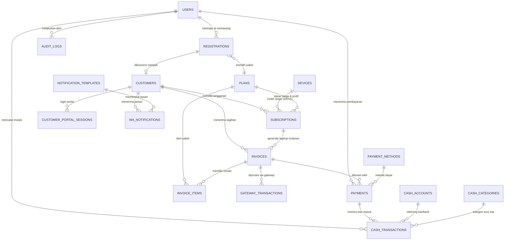

# 🗄️ Skema Database Definitif ISP Management & NetOps Engine (Polyglot)

Dokumen ini adalah **arsitektur dan spesifikasi skema database definitif** yang telah disesuaikan secara presisi untuk kebutuhan operasional ISP:
- **Pendaftaran Pelanggan Ringkas (Tanpa KTP/Berkas Rumit)**: Cukup Nama, No. WhatsApp, Alamat, dan Titik Koordinat (Latitude & Longitude).
- **Manajemen Pelanggan & Paket**: Pelanggan tetap, paket layanan (PPPoE & Hotspot bulanan), dan pemetaan ke router MikroTik.
- **Invoicing & Penagihan Bulanan**: Faktur tagihan bulanan otomatis berbasis periode (`YYYY-MM`).
- **Pembayaran Cepat & Fleksibel**:
  - **Scan QR / Input Kode Portal**: Petugas/kasir tinggal memindai QR code atau mengetik kode pembayaran singkat pelanggan dari portal tanpa perlu input nama/nominal manual.
  - **Payment Gateway**: Otomatisasi Virtual Account & QRIS online (Tripay, Midtrans, Xendit).
  - **Tunai / Kasir**: Pembayaran langsung di loket kantor.
- **Buku Kas Sederhana & Arus Kas**: Pencatatan mutasi kas masuk otomatis dari pembayaran tagihan serta pencatatan pengeluaran operasional manual.
- **Laporan Keuangan & Operasional Lengkap**: Query agregasi dan snapshot harian untuk laporan per-hari, per-bulan, dan per-tahun.

---

## 1. Prinsip Arsitektur & Aturan Sistem

1. **MikroTik Router = Sumber Kebenaran Data Jaringan**:
   - Akun PPPoE, Hotspot user, active session, antrean bandwidth (queue), dan IP leases hidup di router MikroTik.
   - Database hanya menyimpan **mapping relasional** (`subscriptions.remote_username`, `device_id`, `remote_profile`) — tidak menduplikasi konfigurasi internal router.
2. **Database PostgreSQL = Sumber Kebenaran Data Bisnis & Finansial**:
   - Master pelanggan, paket layanan, invoice, pembayaran, buku kas, dan laporan keuangan dihitung dan dicatat 100% dari database.
3. **Teknisi Terintegrasi di Tabel `users`**:
   - Sesuai migrasi `000012_merge_technicians_into_users`, staf teknisi adalah user sistem dengan `role = 'teknisi'`. Relasi penugasan teknisi merujuk langsung ke `users(id)`.
4. **Pendaftaran Ringkas & Praktis**:
   - Formulir pendaftaran baru hanya membutuhkan informasi esensial: Nama, Kontak WhatsApp, Alamat, Titik Peta (Lat/Lng), dan Pilihan Paket. Tidak memerlukan unggah KTP/foto identitas.
5. **Pembayaran Bebas Human Error**:
   - Setiap tagihan memiliki `qr_payload` dan `manual_payment_code` (kode unik 6–12 digit). Saat discan/diketik di kasir, sistem langsung memuat data tagihan dan nominal secara otomatis.
6. **Buku Kas Otomatis & Akurat**:
   - Pelunasan tagihan (`payments`) secara otomatis menghasilkan baris mutasi kas masuk (`cash_transactions.direction = 'IN'`).
   - Saldo kas adalah hasil kalkulasi agregat mutasi masuk dikurangi keluar (`SUM(IN) - SUM(OUT)`), mencegah terjadinya selisih/drift saldo.

---

## 2. Diagram Relasi Entitas (ERD)



---

## 3. Definisi Skema Database (DDL PostgreSQL)

### 3.1 Pendaftaran Pelanggan Baru (Registrations)

Mengelola alur permohonan pasang baru secara ringkas dari pendaftaran mandiri/admin, penjadwalan pasang, penugasan teknisi, hingga aktivasi otomatis.

```sql
CREATE TABLE IF NOT EXISTS registrations (
    id                     TEXT PRIMARY KEY,
    tenant_id              TEXT NOT NULL DEFAULT 'tenant-default',
    registration_no        VARCHAR(30) UNIQUE NOT NULL,       -- Contoh: REG-202608-0001
    plan_id                TEXT NOT NULL REFERENCES plans(id) ON DELETE RESTRICT,
    
    -- Data Pemohon Ringkas (Tanpa KTP)
    full_name              VARCHAR(100) NOT NULL,
    phone                  VARCHAR(20)  NOT NULL,             -- Nomor WhatsApp aktif
    email                  VARCHAR(100),
    address                TEXT         NOT NULL,
    latitude               DOUBLE PRECISION,                  -- Koordinat lokasi pemasangan
    longitude              DOUBLE PRECISION,
    notes                  TEXT,                              -- Catatan khusus dari pemohon/patokan rumah
    
    -- Status Alur
    status                 VARCHAR(20)  NOT NULL DEFAULT 'PENDING',
    -- PENDING -> APPROVED -> INSTALLED -> ACTIVE (atau REJECTED / CANCELLED)
    
    -- Review & Penjadwalan Pemasangan
    reviewed_by            BIGINT       REFERENCES users(id) ON DELETE SET NULL,
    reviewed_at            TIMESTAMPTZ,
    admin_notes            TEXT,
    scheduled_install_date DATE,
    scheduled_install_time VARCHAR(20),
    assigned_technician_id BIGINT       REFERENCES users(id) ON DELETE SET NULL,
    
    -- Hasil Pemasangan & Konfirmasi Teknisi
    installed_at           TIMESTAMPTZ,
    technician_notes       TEXT,
    
    -- Relasi Hasil Aktivasi
    customer_id            TEXT         REFERENCES customers(id) ON DELETE SET NULL,
    subscription_id        TEXT         REFERENCES subscriptions(id) ON DELETE SET NULL,
    invoice_id             TEXT         REFERENCES invoices(id) ON DELETE SET NULL,
    
    rejected_at            TIMESTAMPTZ,
    rejected_reason        TEXT,
    cancelled_at           TIMESTAMPTZ,
    cancel_reason          TEXT,
    
    created_at             TIMESTAMPTZ  NOT NULL DEFAULT CURRENT_TIMESTAMP,
    updated_at             TIMESTAMPTZ  NOT NULL DEFAULT CURRENT_TIMESTAMP,
    CONSTRAINT chk_reg_status CHECK (status IN ('PENDING', 'APPROVED', 'INSTALLED', 'ACTIVE', 'REJECTED', 'CANCELLED'))
);

CREATE INDEX IF NOT EXISTS idx_registrations_status ON registrations(status, created_at DESC);
CREATE INDEX IF NOT EXISTS idx_registrations_phone  ON registrations(phone);
CREATE INDEX IF NOT EXISTS idx_registrations_tech   ON registrations(assigned_technician_id, status);
```

---

### 3.2 Master Pelanggan Aktif & Sesi Portal

Menyimpan data master pelanggan aktif dan kode akses portal pelanggan untuk verifikasi pembayaran instan.

```sql
-- Tabel customers (Perluasan dari migrasi 000006)
ALTER TABLE customers
    ADD COLUMN IF NOT EXISTS customer_code      VARCHAR(30),       -- Contoh: CUST-2026-0001
    ADD COLUMN IF NOT EXISTS portal_access_code VARCHAR(16),       -- Kode unik 6-12 char untuk scan/portal
    ADD COLUMN IF NOT EXISTS latitude           DOUBLE PRECISION,
    ADD COLUMN IF NOT EXISTS longitude          DOUBLE PRECISION,
    ADD COLUMN IF NOT EXISTS notes              TEXT,
    ADD COLUMN IF NOT EXISTS deleted_at         TIMESTAMPTZ;

CREATE UNIQUE INDEX IF NOT EXISTS idx_customers_tenant_code 
    ON customers (tenant_id, customer_code) 
    WHERE customer_code IS NOT NULL AND deleted_at IS NULL;

CREATE UNIQUE INDEX IF NOT EXISTS idx_customers_portal_code 
    ON customers (tenant_id, portal_access_code) 
    WHERE portal_access_code IS NOT NULL AND deleted_at IS NULL;

CREATE INDEX IF NOT EXISTS idx_customers_phone ON customers(phone) WHERE deleted_at IS NULL;

-- Sesi Login Portal Pelanggan
CREATE TABLE IF NOT EXISTS customer_portal_sessions (
    id            TEXT PRIMARY KEY,
    tenant_id     TEXT NOT NULL DEFAULT 'tenant-default',
    customer_id   TEXT NOT NULL REFERENCES customers(id) ON DELETE CASCADE,
    session_token VARCHAR(128) UNIQUE NOT NULL,
    ip_address    VARCHAR(45),
    user_agent    TEXT,
    expires_at    TIMESTAMPTZ NOT NULL,
    created_at    TIMESTAMPTZ NOT NULL DEFAULT CURRENT_TIMESTAMP
);

CREATE INDEX IF NOT EXISTS idx_portal_sessions_token ON customer_portal_sessions(session_token);
```

---

### 3.3 Paket Layanan & Langganan Jaringan

Sumber kebenaran profil paket (kecepatan, harga) dan langganan aktif pelanggan yang terhubung ke MikroTik.

```sql
-- Tabel plans (Perluasan dari migrasi 000006)
ALTER TABLE plans
    ADD COLUMN IF NOT EXISTS tenant_id        TEXT NOT NULL DEFAULT 'tenant-default',
    ADD COLUMN IF NOT EXISTS plan_type        VARCHAR(20) NOT NULL DEFAULT 'PPPOE', -- 'PPPOE' | 'HOTSPOT'
    ADD COLUMN IF NOT EXISTS speed_up_kbps    BIGINT NOT NULL DEFAULT 0,
    ADD COLUMN IF NOT EXISTS speed_down_kbps  BIGINT NOT NULL DEFAULT 0,
    ADD COLUMN IF NOT EXISTS setup_fee        NUMERIC(18,2) NOT NULL DEFAULT 0.00,
    ADD COLUMN IF NOT EXISTS remote_profile   VARCHAR(100),                         -- Nama profile di MikroTik
    ADD COLUMN IF NOT EXISTS billing_cycle    VARCHAR(20) NOT NULL DEFAULT 'MONTHLY',
    ADD COLUMN IF NOT EXISTS is_active        BOOLEAN NOT NULL DEFAULT TRUE,
    ADD COLUMN IF NOT EXISTS deleted_at       TIMESTAMPTZ;

CREATE INDEX IF NOT EXISTS idx_plans_type_active ON plans (plan_type, is_active) WHERE deleted_at IS NULL;

-- Tabel subscriptions (Perluasan dari migrasi 000006)
ALTER TABLE subscriptions
    ADD COLUMN IF NOT EXISTS tenant_id             TEXT NOT NULL DEFAULT 'tenant-default',
    ADD COLUMN IF NOT EXISTS device_id             UUID REFERENCES devices(id) ON DELETE RESTRICT,
    ADD COLUMN IF NOT EXISTS remote_username       VARCHAR(100),                          -- Username akun di MikroTik
    ADD COLUMN IF NOT EXISTS remote_profile        VARCHAR(100),                          -- Profil MikroTik saat ini
    ADD COLUMN IF NOT EXISTS billing_day           INT NOT NULL DEFAULT 1,                -- Tanggal jatuh tempo (1-28)
    ADD COLUMN IF NOT EXISTS auto_isolate          BOOLEAN NOT NULL DEFAULT TRUE,         -- Auto-isolir saat nunggak
    ADD COLUMN IF NOT EXISTS current_period_start  TIMESTAMPTZ,
    ADD COLUMN IF NOT EXISTS current_period_end    TIMESTAMPTZ,
    ADD COLUMN IF NOT EXISTS deleted_at            TIMESTAMPTZ;

CREATE INDEX IF NOT EXISTS idx_subscriptions_device ON subscriptions(device_id);
CREATE INDEX IF NOT EXISTS idx_subscriptions_remote ON subscriptions(device_id, remote_username) 
    WHERE remote_username IS NOT NULL AND deleted_at IS NULL;
```

---

### 3.4 Invoices & Penagihan Bulanan

Faktur tagihan bulanan pelanggan yang dilengkapi payload QR dan kode pembayaran singkat untuk kasir.

```sql
-- Tabel invoices (Perluasan dari migrasi 000006)
ALTER TABLE invoices
    ADD COLUMN IF NOT EXISTS tenant_id           TEXT NOT NULL DEFAULT 'tenant-default',
    ADD COLUMN IF NOT EXISTS invoice_number      VARCHAR(50),                           -- Contoh: INV-202608-0001
    ADD COLUMN IF NOT EXISTS subscription_id     TEXT REFERENCES subscriptions(id) ON DELETE SET NULL,
    ADD COLUMN IF NOT EXISTS period              VARCHAR(10),                           -- Format: '2026-08'
    ADD COLUMN IF NOT EXISTS subtotal            NUMERIC(18,2) NOT NULL DEFAULT 0.00,
    ADD COLUMN IF NOT EXISTS discount            NUMERIC(18,2) NOT NULL DEFAULT 0.00,
    ADD COLUMN IF NOT EXISTS total               NUMERIC(18,2) NOT NULL DEFAULT 0.00,
    ADD COLUMN IF NOT EXISTS qr_payload          VARCHAR(255),                          -- String data QR untuk scan kasir
    ADD COLUMN IF NOT EXISTS manual_payment_code VARCHAR(30),                           -- Kode pembayaran singkat (misal: PAY-892147)
    ADD COLUMN IF NOT EXISTS notes               TEXT,
    ADD COLUMN IF NOT EXISTS cancelled_at        TIMESTAMPTZ,
    ADD COLUMN IF NOT EXISTS cancel_reason       TEXT,
    ADD COLUMN IF NOT EXISTS deleted_at          TIMESTAMPTZ;

CREATE UNIQUE INDEX IF NOT EXISTS idx_invoices_number 
    ON invoices (tenant_id, invoice_number) 
    WHERE invoice_number IS NOT NULL AND deleted_at IS NULL;

CREATE INDEX IF NOT EXISTS idx_invoices_period      ON invoices (period);
CREATE INDEX IF NOT EXISTS idx_invoices_status      ON invoices (status);
CREATE INDEX IF NOT EXISTS idx_invoices_pay_code    ON invoices (manual_payment_code) WHERE manual_payment_code IS NOT NULL;
CREATE INDEX IF NOT EXISTS idx_invoices_qr_payload  ON invoices (qr_payload) WHERE qr_payload IS NOT NULL;

-- Rincian Baris Tagihan (Invoice Items)
CREATE TABLE IF NOT EXISTS invoice_items (
    id             TEXT PRIMARY KEY,
    invoice_id     TEXT NOT NULL REFERENCES invoices(id) ON DELETE CASCADE,
    description    VARCHAR(255) NOT NULL,               -- Contoh: "Paket Fiber 20 Mbps (Agustus 2026)"
    quantity       NUMERIC(12,2) NOT NULL DEFAULT 1.00,
    unit_price     NUMERIC(18,2) NOT NULL DEFAULT 0.00,
    amount         NUMERIC(18,2) NOT NULL DEFAULT 0.00,
    created_at     TIMESTAMPTZ NOT NULL DEFAULT CURRENT_TIMESTAMP
);

CREATE INDEX IF NOT EXISTS idx_invoice_items_invoice ON invoice_items(invoice_id);
```

---

### 3.5 Pembayaran & Payment Gateway

Mencatat bukti pelunasan tagihan melalui berbagai metode (QR Scan kasir, kode manual, transfer, atau Payment Gateway).

```sql
-- Master Metode Pembayaran
CREATE TABLE IF NOT EXISTS payment_methods (
    id          TEXT PRIMARY KEY,
    tenant_id   TEXT NOT NULL DEFAULT 'tenant-default',
    name        VARCHAR(50) NOT NULL,                  -- 'TUNAI', 'TRANSFER_BCA', 'QRIS', 'XENDIT_VA', 'TRIPAY'
    type        VARCHAR(30) NOT NULL,                  -- 'CASH', 'BANK', 'QRIS', 'GATEWAY'
    is_active   BOOLEAN NOT NULL DEFAULT TRUE,
    created_at  TIMESTAMPTZ NOT NULL DEFAULT CURRENT_TIMESTAMP
);

-- Bukti Pembayaran / Pelunasan
CREATE TABLE IF NOT EXISTS payments (
    id                TEXT PRIMARY KEY,
    tenant_id         TEXT NOT NULL DEFAULT 'tenant-default',
    invoice_id        TEXT NOT NULL REFERENCES invoices(id) ON DELETE RESTRICT,
    payment_method_id TEXT REFERENCES payment_methods(id) ON DELETE SET NULL,
    amount            NUMERIC(18,2) NOT NULL CHECK (amount > 0),
    payment_date      TIMESTAMPTZ NOT NULL DEFAULT CURRENT_TIMESTAMP,
    received_by       BIGINT REFERENCES users(id) ON DELETE SET NULL, -- Kasir / Admin penerima
    scan_method       VARCHAR(30) NOT NULL DEFAULT 'MANUAL',          -- 'QR_SCAN', 'CODE_INPUT', 'MANUAL', 'PAYMENT_GATEWAY'
    reference         VARCHAR(100),                                   -- No. ref transfer bank / kwitansi
    notes             TEXT,
    created_at        TIMESTAMPTZ NOT NULL DEFAULT CURRENT_TIMESTAMP
);

CREATE INDEX IF NOT EXISTS idx_payments_invoice ON payments(invoice_id);
CREATE INDEX IF NOT EXISTS idx_payments_date    ON payments(payment_date);

-- Transaksi Payment Gateway Online (Tripay / Midtrans / Xendit)
CREATE TABLE IF NOT EXISTS gateway_transactions (
    id              TEXT PRIMARY KEY,
    tenant_id       TEXT NOT NULL DEFAULT 'tenant-default',
    gateway         VARCHAR(30) NOT NULL,             -- 'TRIPAY', 'MIDTRANS', 'XENDIT'
    external_id     VARCHAR(100) NOT NULL,            -- Order ID / Referensi unik dari gateway
    invoice_id      TEXT REFERENCES invoices(id) ON DELETE CASCADE,
    payment_id      TEXT REFERENCES payments(id) ON DELETE SET NULL,
    amount          NUMERIC(18,2) NOT NULL,
    fee_amount      NUMERIC(18,2) DEFAULT 0.00,
    status          VARCHAR(30) NOT NULL DEFAULT 'PENDING', -- 'PENDING', 'SETTLED', 'EXPIRED', 'FAILED'
    payment_channel VARCHAR(50),                      -- 'BCA_VA', 'QRIS', 'MANDIRI_VA'
    payment_url     TEXT,                             -- URL pembayaran / redirect QRIS
    qr_string       TEXT,
    raw_callback    JSONB,                            -- Payload webhook terakhir untuk audit
    callback_count  INT NOT NULL DEFAULT 0,
    paid_at         TIMESTAMPTZ,
    expires_at      TIMESTAMPTZ,
    created_at      TIMESTAMPTZ NOT NULL DEFAULT CURRENT_TIMESTAMP,
    updated_at      TIMESTAMPTZ NOT NULL DEFAULT CURRENT_TIMESTAMP,
    CONSTRAINT uq_gateway_ext UNIQUE (gateway, external_id)
);

CREATE INDEX IF NOT EXISTS idx_gateway_tx_invoice ON gateway_transactions(invoice_id);
CREATE INDEX IF NOT EXISTS idx_gateway_tx_status  ON gateway_transactions(status);
```

---

### 3.6 Buku Kas, Arus Kas & Pengeluaran Operasional

Buku kas sederhana untuk mencatat keluar-masuk uang secara real-time. Pemasukan tercatat otomatis saat invoice lunas, dan pengeluaran dicatat manual.

```sql
-- Rekening Kas & Bank
CREATE TABLE IF NOT EXISTS cash_accounts (
    id          TEXT PRIMARY KEY,
    tenant_id   TEXT NOT NULL DEFAULT 'tenant-default',
    account_code VARCHAR(30) UNIQUE NOT NULL,          -- '1001-KAS-KANTOR', '1002-BANK-BCA'
    name        VARCHAR(100) NOT NULL,                 -- 'Kas Kasir Utama', 'Rekening BCA Operasional'
    type        VARCHAR(30) NOT NULL DEFAULT 'CASH',   -- 'CASH', 'BANK'
    is_active   BOOLEAN NOT NULL DEFAULT TRUE,
    created_at  TIMESTAMPTZ NOT NULL DEFAULT CURRENT_TIMESTAMP,
    updated_at  TIMESTAMPTZ NOT NULL DEFAULT CURRENT_TIMESTAMP
);

-- Kategori Arus Kas (Pendapatan vs Pengeluaran)
CREATE TABLE IF NOT EXISTS cash_categories (
    id          TEXT PRIMARY KEY,
    tenant_id   TEXT NOT NULL DEFAULT 'tenant-default',
    name        VARCHAR(100) NOT NULL,                 -- 'Tagihan Pelanggan', 'Biaya Listrik', 'Bandwidth Uplink', 'Gaji'
    type        VARCHAR(20) NOT NULL,                  -- 'INCOME', 'EXPENSE'
    is_active   BOOLEAN NOT NULL DEFAULT TRUE,
    CONSTRAINT uq_cash_cat_tenant UNIQUE (tenant_id, name)
);

-- Buku Mutasi Kas Keluar & Masuk
CREATE TABLE IF NOT EXISTS cash_transactions (
    id             TEXT PRIMARY KEY,
    tenant_id      TEXT NOT NULL DEFAULT 'tenant-default',
    account_id     TEXT NOT NULL REFERENCES cash_accounts(id) ON DELETE RESTRICT,
    category_id    TEXT REFERENCES cash_categories(id) ON DELETE RESTRICT,
    direction      VARCHAR(10) NOT NULL,              -- 'IN' (Masuk), 'OUT' (Keluar)
    amount         NUMERIC(18,2) NOT NULL CHECK (amount > 0),
    trx_date       TIMESTAMPTZ NOT NULL DEFAULT CURRENT_TIMESTAMP,
    source_type    VARCHAR(30),                       -- 'PAYMENT' (otomatis dari invoice) | 'EXPENSE' (manual) | 'TRANSFER'
    source_id      TEXT,                              -- id payments terkait jika ada
    description    TEXT NOT NULL,
    recorded_by    BIGINT REFERENCES users(id) ON DELETE SET NULL,
    created_at     TIMESTAMPTZ NOT NULL DEFAULT CURRENT_TIMESTAMP,
    CONSTRAINT chk_cash_direction CHECK (direction IN ('IN', 'OUT'))
);

CREATE INDEX IF NOT EXISTS idx_cash_trx_account_date ON cash_transactions(account_id, trx_date DESC);
CREATE INDEX IF NOT EXISTS idx_cash_trx_category     ON cash_transactions(category_id);
CREATE INDEX IF NOT EXISTS idx_cash_trx_source       ON cash_transactions(source_type, source_id);
```

---

### 3.7 Laporan Keuangan & Snapshot Agregat

Menyediakan tabel snapshot harian yang otomatis direkap untuk mempercepat pembuatan **Laporan Harian**, **Laporan Bulanan**, dan **Laporan Tahunan**.

```sql
CREATE TABLE IF NOT EXISTS daily_financial_snapshots (
    id                   BIGINT GENERATED ALWAYS AS IDENTITY PRIMARY KEY,
    tenant_id            TEXT NOT NULL DEFAULT 'tenant-default',
    snapshot_date        DATE NOT NULL,
    invoice_count        INT NOT NULL DEFAULT 0,
    invoice_total        NUMERIC(18,2) NOT NULL DEFAULT 0.00,  -- Total tagihan terbit
    payment_count        INT NOT NULL DEFAULT 0,
    payment_total        NUMERIC(18,2) NOT NULL DEFAULT 0.00,  -- Total penerimaan kas
    outstanding_total    NUMERIC(18,2) NOT NULL DEFAULT 0.00,  -- Total piutang yang belum lunas
    expense_total        NUMERIC(18,2) NOT NULL DEFAULT 0.00,  -- Total biaya operasional keluar
    active_subscriptions INT NOT NULL DEFAULT 0,               -- Total pelanggan aktif
    cash_balance_json    JSONB NOT NULL DEFAULT '{}',          -- Saldo akhir per rekening kas
    created_at           TIMESTAMPTZ NOT NULL DEFAULT CURRENT_TIMESTAMP,
    CONSTRAINT uq_daily_snapshot UNIQUE (tenant_id, snapshot_date)
);

CREATE INDEX IF NOT EXISTS idx_daily_snapshot_date ON daily_financial_snapshots(snapshot_date DESC);
```

---

### 3.8 Template Pesan WhatsApp, Antrean Notifikasi & Audit Trail

Tabel `notification_templates` menyimpan template pesan dinamis berbasis placeholder (misal: `{{customer_name}}`, `{{amount}}`, `{{due_date}}`, `{{payment_code}}`, `{{payment_url}}`) yang dapat dikustomisasi admin.

```sql
-- Master Template Pesan Notifikasi WhatsApp
CREATE TABLE IF NOT EXISTS notification_templates (
    id             TEXT PRIMARY KEY,
    tenant_id      TEXT NOT NULL DEFAULT 'tenant-default',
    template_key   VARCHAR(50) NOT NULL,               -- 'BILL_REMINDER', 'PAYMENT_RECEIPT', 'REGISTRATION_APPROVED', 'INSTALLATION_SCHEDULED', 'ISOLATION_NOTICE', 'SERVICE_RESTORED'
    name           VARCHAR(100) NOT NULL,              -- Contoh: "Pengingat Tagihan Jatuh Tempo"
    content        TEXT NOT NULL,                      -- Isi pesan template dengan variabel {{variable}}
    variables_json JSONB NOT NULL DEFAULT '[]',        -- Daftar variabel yang tersedia, contoh: ["customer_name", "amount", "due_date", "payment_code"]
    is_active      BOOLEAN NOT NULL DEFAULT TRUE,
    created_at     TIMESTAMPTZ NOT NULL DEFAULT CURRENT_TIMESTAMP,
    updated_at     TIMESTAMPTZ NOT NULL DEFAULT CURRENT_TIMESTAMP,
    CONSTRAINT uq_notif_template UNIQUE (tenant_id, template_key)
);

-- Antrean & Log Notifikasi WhatsApp Terkirim
CREATE TABLE IF NOT EXISTS wa_notifications (
    id              TEXT PRIMARY KEY,
    tenant_id       TEXT NOT NULL DEFAULT 'tenant-default',
    template_id     TEXT REFERENCES notification_templates(id) ON DELETE SET NULL,
    customer_id     TEXT REFERENCES customers(id) ON DELETE SET NULL,
    invoice_id      TEXT REFERENCES invoices(id) ON DELETE SET NULL,
    recipient_phone VARCHAR(20) NOT NULL,
    message_type    VARCHAR(50) NOT NULL,              -- 'BILL_REMINDER', 'PAYMENT_RECEIPT', 'REGISTRATION_APPROVED', 'INSTALLATION_SCHEDULED', 'ISOLATION_NOTICE'
    message_content TEXT NOT NULL,                     -- Hasil render template setelah variabel diisi
    status          VARCHAR(20) NOT NULL DEFAULT 'QUEUED', -- 'QUEUED', 'SENT', 'FAILED'
    error_message   TEXT,
    sent_at         TIMESTAMPTZ,
    created_at      TIMESTAMPTZ NOT NULL DEFAULT CURRENT_TIMESTAMP
);

CREATE INDEX IF NOT EXISTS idx_wa_notifications_cust ON wa_notifications(customer_id, created_at DESC);
CREATE INDEX IF NOT EXISTS idx_wa_notifications_status ON wa_notifications(status, created_at DESC);

-- Audit Log Aktivitas Sensitif Admin/Petugas
CREATE TABLE IF NOT EXISTS audit_logs (
    id          BIGINT GENERATED ALWAYS AS IDENTITY PRIMARY KEY,
    tenant_id   TEXT NOT NULL DEFAULT 'tenant-default',
    actor_type  VARCHAR(20) NOT NULL DEFAULT 'USER', -- 'USER', 'SYSTEM', 'PORTAL'
    actor_id    TEXT,                                -- ID user yang mengeksekusi aksi
    action      VARCHAR(50) NOT NULL,                -- 'CREATE', 'UPDATE', 'DELETE', 'APPROVE_REGISTRATION', 'COLLECT_PAYMENT'
    entity_type VARCHAR(50) NOT NULL,                -- 'customer', 'invoice', 'payment', 'plan', 'subscription', 'template'
    entity_id   TEXT NOT NULL,
    description TEXT,
    ip_address  VARCHAR(45),
    created_at  TIMESTAMPTZ NOT NULL DEFAULT CURRENT_TIMESTAMP
);

CREATE INDEX IF NOT EXISTS idx_audit_logs_entity ON audit_logs(entity_type, entity_id);
CREATE INDEX IF NOT EXISTS idx_audit_logs_date   ON audit_logs(created_at DESC);
```

---

## 4. Alur Kerja Operasional Utama

### 4.1 Alur Pendaftaran Baru & Aktivasi MikroTik
1. **Pendaftaran (Online / Input Admin)**:
   - Masuk ke tabel `registrations` dengan status `PENDING` (hanya Nama, No. WA, Alamat, Titik Lat/Lng, dan Pilihan Paket).
2. **Review & Jadwal Pasang**:
   - Admin/petugas menyetujui $\rightarrow$ status `APPROVED`.
   - Mengisi tanggal pasang (`scheduled_install_date`) dan memilih teknisi (`assigned_technician_id` $\rightarrow$ `users.id`).
3. **Pemasangan Selesai di Lapangan**:
   - Teknisi konfirmasi selesai $\rightarrow$ status `INSTALLED`.
4. **Aktivasi Otomatis (Single DB Transaction)**:
   - Status registrasi menjadi `ACTIVE`.
   - Otomatis membuat data master di tabel `customers` (generate `portal_access_code`).
   - Otomatis membuat `subscriptions` dan akun ke router MikroTik target (`/ppp/secret` untuk PPPoE atau Hotspot user).
   - Otomatis menerbitkan faktur tagihan pertama di `invoices` (Setup Fee + Bulan ke-1).
   - Mengirim rincian akun & info login portal via WhatsApp (`wa_notifications`).

---

### 4.2 Alur Penagihan Bulanan & Pelunasan Kasir (Scan QR / Kode)
1. **Terbit Tagihan Otomatis**:
   - Scheduler bulanan membuat invoice baru untuk setiap langganan aktif:
     - Mengisi `period` (contoh: `'2026-08'`).
     - Meng-generate `qr_payload` dan `manual_payment_code` unik (misal: `PAY-892147`).
   - Notifikasi tagihan terbit terkirim ke WhatsApp pelanggan.
2. **Pelanggan Membuka Portal**:
   - Pelanggan login ke portal mandiri $\rightarrow$ menampilkan QR Code pembayaran dan Kode Bayar.
3. **Pembayaran di Loket / Lapangan**:
   - **Kasir Scan QR** ATAU **Ketik Kode Bayar `PAY-892147`**:
     - Sistem langsung menemukan invoice, nama pelanggan, dan nominal `total` secara otomatis (tanpa kasir input data manual).
   - Kasir klik **Konfirmasi Bayar**:
     - Status invoice berubah menjadi `'PAID'`.
     - Tercatat di `payments` dengan `scan_method = 'QR_SCAN'` atau `'CODE_INPUT'`.
     - Otomatis membuat mutasi `cash_transactions` (`direction = 'IN'`, `source_type = 'PAYMENT'`) ke `cash_accounts` Kasir.
   - WhatsApp tanda terima lunas otomatis terkirim ke pelanggan.

---

### 4.3 Alur Pembayaran Online (Payment Gateway)
1. Pelanggan memilih metode bayar QRIS / Virtual Account di portal.
2. Sistem membuat order ke gateway $\rightarrow$ mencatat di `gateway_transactions` (`status = 'PENDING'`).
3. Pelanggan menyelesaikan pembayaran di aplikasi bank / e-wallet.
4. Webhook callback diterima dari gateway:
   - Update `gateway_transactions` $\rightarrow$ `'SETTLED'`.
   - Update `invoices` $\rightarrow$ `'PAID'`.
   - Catat `payments` (`scan_method = 'PAYMENT_GATEWAY'`).
   - Catat `cash_transactions` (`direction = 'IN'`) ke rekening Kas Bank / Escrow Gateway.

---

## 5. Ringkasan Matriks Tabel

| No | Nama Tabel | Status Skema | Kategori & Fungsi |
|---|---|:---:|---|
| 1 | `registrations` | 🆕 Baru | Pendaftaran online/manual ringkas (nama, WA, alamat, lat/lng) & alur approval |
| 2 | `customers` | ✏️ Perluas | Master pelanggan aktif, lokasi GPS, dan `portal_access_code` untuk scan kasir |
| 3 | `customer_portal_sessions` | 🆕 Baru | Sesi login portal mandiri pelanggan |
| 4 | `plans` | ✏️ Perluas | Master katalog paket (PPPoE & Hotspot bulanan), kecepatan, biaya pasang |
| 5 | `subscriptions` | ✏️ Perluas | Langganan aktif pelanggan & mapping akun ke router MikroTik (remote_username) |
| 6 | `invoices` | ✏️ Perluas | Tagihan bulanan (`period`), QR payload, dan kode pembayaran singkat |
| 7 | `invoice_items` | 🆕 Baru | Rincian detail per baris item tagihan (paket, diskon, biaya pasang) |
| 8 | `payment_methods` | 🆕 Baru | Master metode bayar (Tunai, Transfer Bank, QRIS, Payment Gateway) |
| 9 | `payments` | 🆕 Baru | Kwitansi pelunasan tagihan & pencatatan metode scan kasir |
| 10 | `gateway_transactions` | 🆕 Baru | Riwayat transaksi & log webhook payment gateway (Tripay, Midtrans, Xendit) |
| 11 | `cash_accounts` | 🆕 Baru | Rekening kas (Kas Kantor, Rekening Bank) |
| 12 | `cash_categories` | 🆕 Baru | Kategori keluar-masuk uang (Pendapatan Tagihan, Biaya Listrik, dll) |
| 13 | `cash_transactions` | 🆕 Baru | Jurnal buku kas masuk & keluar |
| 14 | `daily_financial_snapshots` | 🆕 Baru | Rekapitulasi harian untuk laporan cepat Harian, Bulanan, dan Tahunan |
| 15 | `notification_templates` | 🆕 Baru | Master template pesan notifikasi WhatsApp berbasis variabel placeholder |
| 16 | `wa_notifications` | 🆕 Baru | Antrian & log notifikasi WhatsApp otomatis |
| 17 | `audit_logs` | 🆕 Baru | Audit trail aktivitas dan perubahan data penting |

*(Tabel `users`, `devices`, `credentials`, `wa_sessions`, `conversations`, dan `messages` tetap menggunakan tabel yang sudah ada tanpa perubahan yang merusak).*
