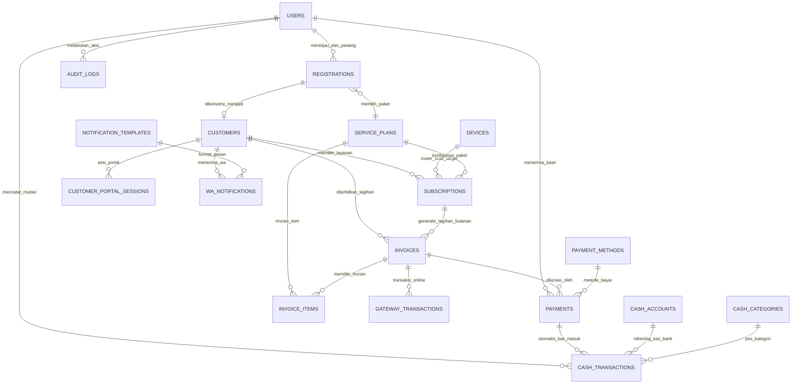

# 🗄️ Skema Database Definitif ISP Management & NetOps Engine (Polyglot)

Dokumen ini adalah **skema database lengkap (Full Standalone DDL)** untuk operasional sistem ISP Management pada project Polyglot. Skema ini dirancang berdasarkan referensi nyata ekspor data ISP (`Data_Pelanggan_*.xlsx`) dan kebutuhan inti sistem:

1. **Pendaftaran Pelanggan Ringkas (Tanpa NIK/KTP)**:
   - Cukup Nama, No. WhatsApp, Alamat, dan Titik Koordinat (Latitude & Longitude).
2. **Master Pelanggan & Paket Layanan Lengkap (`service_plans`)**:
   - Mendukung paket **PPPoE** dan **Hotspot Tetap/Bulanan**.
   - Parameter jaringan lengkap: IP Pool, Parent Queue, Rate Limit, Address List, Burst, Validity, Expire Mode, Simultaneous Use, dsb.
   - Tanpa pembatasan kuota GB / FUP (unlimited flat rate).
3. **Invoicing & Penagihan Bulanan**:
   - Tagihan bulanan otomatis berbasis periode (`YYYY-MM`).
4. **Pembayaran Cepat & Multi-Channel**:
   - **Scan QR / Input Kode Portal**: Kasir memindai QR code atau mengetik `manual_payment_code` / `portal_access_code` pelanggan tanpa perlu input nama/nominal manual.
   - **Payment Gateway**: Otomatisasi QRIS & Virtual Account (Tripay, Midtrans, Xendit).
   - **Tunai di Loket**: Pembayaran langsung di kantor.
5. **Buku Kas Sederhana (Arus Kas Masuk & Keluar)**:
   - Kas masuk otomatis dicatat saat invoice lunas.
   - Pengeluaran operasional (listrik, gaji, bandwidth) dicatat manual.
6. **Laporan Menyeluruh**:
   - Snapshot finansial harian (`daily_financial_snapshots`) dan query agregasi untuk laporan **Per-Hari, Per-Bulan, dan Per-Tahun**.
7. **Template Notifikasi WhatsApp**:
   - Kustomisasi template pesan otomatis (tagihan, bukti bayar, jadwal pasang, isolir).

---

## 1. Diagram Relasi Entitas (Entity-Relationship Diagram)



---

## 2. Definisi Skema Database Penuh (Full PostgreSQL DDL)

### 2.1 Utilitas & Pengguna Sistem (Users)

```sql
CREATE EXTENSION IF NOT EXISTS "pgcrypto";

-- Fungsi update timestamp otomatis
CREATE OR REPLACE FUNCTION set_updated_at()
RETURNS TRIGGER AS $$
BEGIN
    NEW.updated_at = CURRENT_TIMESTAMP;
    RETURN NEW;
END;
$$ LANGUAGE plpgsql;

-- 1. Tabel Pengguna Sistem (Owner, Admin, Kasir, Teknisi)
CREATE TABLE users (
    id             BIGSERIAL PRIMARY KEY,
    username       VARCHAR(100) NOT NULL UNIQUE,
    email          VARCHAR(255) NOT NULL UNIQUE,
    password_hash  VARCHAR(255) NOT NULL,
    full_name      VARCHAR(255),
    phone_number   VARCHAR(50),
    role           VARCHAR(50)  NOT NULL DEFAULT 'agent', -- 'owner', 'admin', 'agent', 'teknisi'
    specialization VARCHAR(255),                          -- Spesialisasi untuk teknisi (Fiber Optic, Wireless, dll)
    is_active      BOOLEAN      NOT NULL DEFAULT TRUE,
    tenant_id      VARCHAR(100) NOT NULL DEFAULT 'tenant-default',
    created_at     TIMESTAMPTZ  NOT NULL DEFAULT CURRENT_TIMESTAMP,
    updated_at     TIMESTAMPTZ  NOT NULL DEFAULT CURRENT_TIMESTAMP
);

CREATE INDEX idx_users_role      ON users(role);
CREATE INDEX idx_users_is_active ON users(is_active);
CREATE TRIGGER trg_users_upd BEFORE UPDATE ON users FOR EACH ROW EXECUTE FUNCTION set_updated_at();
```

---

### 2.2 Master Paket Layanan (`service_plans`)

Mendukung paket PPPoE dan Hotspot Bulanan/Tetap dengan parameter MikroTik lengkap (tanpa kuota GB / FUP).

```sql
-- 2. Master Paket Layanan
CREATE TABLE service_plans (
    id                      TEXT PRIMARY KEY,                     -- UUID string / slug
    tenant_id               TEXT NOT NULL DEFAULT 'tenant-default',
    name                    VARCHAR(100)  NOT NULL,               -- Nama paket (mis. "100-RB-100", "HOME-20M")
    service_type            VARCHAR(20)   NOT NULL,               -- 'PPPOE', 'HOTSPOT', 'DEDICATED'
    bandwidth_download_kbps INT           NOT NULL,               -- Kecepatan download (kbps)
    bandwidth_upload_kbps   INT           NOT NULL,               -- Kecepatan upload (kbps)
    burst_download_kbps     INT,
    burst_upload_kbps       INT,
    burst_threshold_kbps    INT,
    burst_time_seconds      INT,
    price                   NUMERIC(15,2) NOT NULL,               -- Harga dasar tagihan bulanan
    selling_price           NUMERIC(15,2),
    installation_fee        NUMERIC(15,2) DEFAULT 0.00,           -- Biaya pasang awal
    tax_percent             NUMERIC(5,2)  DEFAULT 0.00,
    validity                VARCHAR(20)   DEFAULT '30d',          -- '30d', '1M'
    validity_mode           VARCHAR(20)   DEFAULT 'CALENDAR',     -- 'CALENDAR', 'UPTIME'
    simultaneous_use        INT           DEFAULT 1,              -- Jumlah sesi login bersamaan
    ip_pool_name            VARCHAR(50),                          -- IP Pool MikroTik (mis. "PPPOE (IP Pool)")
    parent_queue            VARCHAR(50)   DEFAULT 'none',         -- Parent Queue MikroTik
    address_list            VARCHAR(50),                          -- Address List firewall
    shared_users            INT           DEFAULT 1,
    expire_mode             VARCHAR(10)   DEFAULT 'ntf',          -- 'ntf', 'ntfc', 'rem', 'remc', '0'
    lock_user               BOOLEAN       DEFAULT FALSE,
    lock_server             BOOLEAN       DEFAULT FALSE,
    limit_uptime            VARCHAR(20),
    limit_bytes             VARCHAR(20),                          -- NULL/opsional (unlimited flat rate)
    is_active               BOOLEAN       NOT NULL DEFAULT TRUE,
    description             TEXT,
    created_at              TIMESTAMPTZ   NOT NULL DEFAULT CURRENT_TIMESTAMP,
    updated_at              TIMESTAMPTZ   NOT NULL DEFAULT CURRENT_TIMESTAMP
);

CREATE INDEX idx_service_plans_type   ON service_plans(service_type);
CREATE INDEX idx_service_plans_active ON service_plans(is_active);
CREATE TRIGGER trg_service_plans_upd BEFORE UPDATE ON service_plans FOR EACH ROW EXECUTE FUNCTION set_updated_at();
```

---

### 2.3 Pendaftaran Pelanggan Baru (`registrations`)

Formulir pendaftaran pelanggan baru yang ringkas (tanpa NIK/KTP) beserta alur approval teknisi dan aktivasi.

```sql
-- 3. Pendaftaran Pelanggan Baru
CREATE TABLE registrations (
    id                     TEXT PRIMARY KEY,                      -- UUID string
    tenant_id              TEXT NOT NULL DEFAULT 'tenant-default',
    registration_no        VARCHAR(30) UNIQUE NOT NULL,           -- Contoh: REG-202608-0001
    plan_id                TEXT NOT NULL REFERENCES service_plans(id) ON DELETE RESTRICT,
    
    -- Data Pemohon Ringkas (Tanpa NIK/KTP)
    full_name              VARCHAR(100) NOT NULL,
    phone                  VARCHAR(20)  NOT NULL,                 -- Nomor WhatsApp aktif
    email                  VARCHAR(100),
    address                TEXT         NOT NULL,                 -- Alamat pemasangan (Desa/Dusun/Patokan)
    latitude               DOUBLE PRECISION,                      -- Titik koordinat GPS
    longitude              DOUBLE PRECISION,
    notes                  TEXT,                                  -- Catatan khusus / patokan rumah
    
    -- Status Alur
    status                 VARCHAR(20)  NOT NULL DEFAULT 'PENDING',
    -- PENDING -> APPROVED -> INSTALLED -> ACTIVE (atau REJECTED / CANCELLED)
    
    -- Review Admin & Penjadwalan
    reviewed_by            BIGINT       REFERENCES users(id) ON DELETE SET NULL,
    reviewed_at            TIMESTAMPTZ,
    admin_notes            TEXT,
    scheduled_install_date DATE,
    scheduled_install_time VARCHAR(20),
    assigned_technician_id BIGINT       REFERENCES users(id) ON DELETE SET NULL, -- Teknisi penugasan
    
    -- Hasil Pemasangan Teknisi Lapangan
    installed_at           TIMESTAMPTZ,
    technician_notes       TEXT,
    
    -- Relasi Hasil Konversi Pelanggan Aktif
    customer_id            TEXT,
    subscription_id        TEXT,
    invoice_id             TEXT,
    
    rejected_at            TIMESTAMPTZ,
    rejected_reason        TEXT,
    cancelled_at           TIMESTAMPTZ,
    cancel_reason          TEXT,
    
    created_at             TIMESTAMPTZ  NOT NULL DEFAULT CURRENT_TIMESTAMP,
    updated_at             TIMESTAMPTZ  NOT NULL DEFAULT CURRENT_TIMESTAMP,
    CONSTRAINT chk_reg_status CHECK (status IN ('PENDING', 'APPROVED', 'INSTALLED', 'ACTIVE', 'REJECTED', 'CANCELLED'))
);

CREATE INDEX idx_registrations_status ON registrations(status, created_at DESC);
CREATE INDEX idx_registrations_phone  ON registrations(phone);
CREATE INDEX idx_registrations_tech   ON registrations(assigned_technician_id, status);
CREATE TRIGGER trg_registrations_upd BEFORE UPDATE ON registrations FOR EACH ROW EXECUTE FUNCTION set_updated_at();
```

---

### 2.4 Master Pelanggan Aktif & Sesi Portal (`customers`)

```sql
-- 4. Master Pelanggan Aktif
CREATE TABLE customers (
    id                 TEXT PRIMARY KEY,                          -- UUID string
    tenant_id          TEXT NOT NULL DEFAULT 'tenant-default',
    customer_code      VARCHAR(30)  UNIQUE NOT NULL,              -- ID Pelanggan (mis. "01075" / "CUST-01075")
    name               VARCHAR(100) NOT NULL,
    phone              VARCHAR(20)  NOT NULL,                     -- Nomor WhatsApp aktif
    email              VARCHAR(100),
    address            TEXT         NOT NULL,                     -- Alamat pelanggan
    latitude           DOUBLE PRECISION,                          -- Koordinat lokasi
    longitude          DOUBLE PRECISION,
    portal_access_code VARCHAR(16)  UNIQUE NOT NULL,              -- Kode unik 6-12 digit untuk scan/portal
    status             VARCHAR(20)  NOT NULL DEFAULT 'ACTIVE',    -- 'ACTIVE', 'ISOLATED', 'SUSPENDED', 'TERMINATED'
    notes              TEXT,
    registered_at      DATE         NOT NULL DEFAULT CURRENT_DATE,
    deleted_at         TIMESTAMPTZ,
    created_at         TIMESTAMPTZ  NOT NULL DEFAULT CURRENT_TIMESTAMP,
    updated_at         TIMESTAMPTZ  NOT NULL DEFAULT CURRENT_TIMESTAMP
);

CREATE INDEX idx_customers_code   ON customers(customer_code) WHERE deleted_at IS NULL;
CREATE INDEX idx_customers_phone  ON customers(phone) WHERE deleted_at IS NULL;
CREATE INDEX idx_customers_portal ON customers(portal_access_code) WHERE deleted_at IS NULL;
CREATE INDEX idx_customers_status ON customers(status) WHERE deleted_at IS NULL;
CREATE TRIGGER trg_customers_upd BEFORE UPDATE ON customers FOR EACH ROW EXECUTE FUNCTION set_updated_at();

-- 5. Sesi Login Portal Mandiri Pelanggan
CREATE TABLE customer_portal_sessions (
    id            TEXT PRIMARY KEY,
    tenant_id     TEXT NOT NULL DEFAULT 'tenant-default',
    customer_id   TEXT NOT NULL REFERENCES customers(id) ON DELETE CASCADE,
    session_token VARCHAR(128) UNIQUE NOT NULL,
    ip_address    VARCHAR(45),
    user_agent    TEXT,
    expires_at    TIMESTAMPTZ NOT NULL,
    created_at    TIMESTAMPTZ NOT NULL DEFAULT CURRENT_TIMESTAMP
);

CREATE INDEX idx_portal_sessions_token ON customer_portal_sessions(session_token);
```

---

### 2.5 Langganan Jaringan Pelanggan (`subscriptions`)

Menyimpan data langganan aktif pelanggan beserta parameter akun MikroTik (PPPoE Secret atau Hotspot User).

```sql
-- 6. Langganan Pelanggan (Mapping ke Router MikroTik)
CREATE TABLE subscriptions (
    id                   TEXT PRIMARY KEY,                        -- UUID string
    tenant_id            TEXT NOT NULL DEFAULT 'tenant-default',
    customer_id          TEXT NOT NULL REFERENCES customers(id) ON DELETE RESTRICT,
    plan_id              TEXT NOT NULL REFERENCES service_plans(id) ON DELETE RESTRICT,
    device_id            UUID REFERENCES devices(id) ON DELETE RESTRICT, -- Router BRAS MikroTik (mis. "JAYA ABADI")
    service_type         VARCHAR(20)  NOT NULL DEFAULT 'PPPOE',   -- 'PPPOE', 'HOTSPOT'
    
    -- Kredensial & Konfigurasi MikroTik
    remote_username      VARCHAR(100) NOT NULL,                   -- Username PPP Secret / Hotspot User
    remote_password      VARCHAR(100) NOT NULL,                   -- Password akun jaringan
    local_address        VARCHAR(45),                             -- Gateway IP (mis. 192.168.56.1)
    remote_address       VARCHAR(45),                             -- IP Statis atau nama IP Pool
    parent_queue         VARCHAR(50)  DEFAULT 'none',
    rate_limit           VARCHAR(100),                            -- String Rate Limit MikroTik (mis. "5M/5M 10M/10M ...")
    
    -- Penagihan & Periode
    billing_cycle        VARCHAR(20)  NOT NULL DEFAULT '1 Bulan',
    billing_day          INT          NOT NULL DEFAULT 1,         -- Tanggal jatuh tempo per bulan (1-28)
    auto_isolate         BOOLEAN      NOT NULL DEFAULT TRUE,      -- Otomatis ubah profile ke ISOLIR jika jatuh tempo
    isolation_grace_days INT          NOT NULL DEFAULT 3,
    status               VARCHAR(20)  NOT NULL DEFAULT 'ACTIVE',  -- 'ACTIVE', 'ISOLATED', 'SUSPENDED', 'TERMINATED'
    start_date           DATE         NOT NULL DEFAULT CURRENT_DATE,
    end_date             DATE,                                    -- Tanggal expired langganan
    custom_price         NUMERIC(15,2),                           -- Override harga jika ada promo khusus
    current_period_start TIMESTAMPTZ,
    current_period_end   TIMESTAMPTZ,
    notes                TEXT,
    deleted_at           TIMESTAMPTZ,
    created_at           TIMESTAMPTZ  NOT NULL DEFAULT CURRENT_TIMESTAMP,
    updated_at           TIMESTAMPTZ  NOT NULL DEFAULT CURRENT_TIMESTAMP
);

CREATE INDEX idx_subscriptions_customer ON subscriptions(customer_id);
CREATE INDEX idx_subscriptions_device   ON subscriptions(device_id);
CREATE INDEX idx_subscriptions_remote   ON subscriptions(device_id, remote_username) WHERE deleted_at IS NULL;
CREATE INDEX idx_subscriptions_status   ON subscriptions(status) WHERE deleted_at IS NULL;
CREATE TRIGGER trg_subscriptions_upd BEFORE UPDATE ON subscriptions FOR EACH ROW EXECUTE FUNCTION set_updated_at();
```

---

### 2.6 Invoices & Rincian Tagihan (`invoices`, `invoice_items`)

Mendukung penagihan bulanan berbasis periode (`YYYY-MM`), kode QR, dan kode pembayaran kasir cepat.

```sql
-- 7. Faktur Tagihan Bulanan Pelanggan
CREATE TABLE invoices (
    id                  TEXT PRIMARY KEY,                         -- UUID string
    tenant_id           TEXT NOT NULL DEFAULT 'tenant-default',
    invoice_number      VARCHAR(50) UNIQUE NOT NULL,              -- Contoh: INV-202608-00042
    customer_id         TEXT NOT NULL REFERENCES customers(id) ON DELETE RESTRICT,
    subscription_id     TEXT REFERENCES subscriptions(id) ON DELETE SET NULL,
    period              VARCHAR(10) NOT NULL,                     -- Periode tagihan: '2026-08'
    subtotal            NUMERIC(15,2) NOT NULL DEFAULT 0.00,
    discount            NUMERIC(15,2) NOT NULL DEFAULT 0.00,
    tax_amount          NUMERIC(15,2) NOT NULL DEFAULT 0.00,
    total               NUMERIC(15,2) NOT NULL DEFAULT 0.00,      -- subtotal - discount + tax
    paid_amount         NUMERIC(15,2) NOT NULL DEFAULT 0.00,
    due_date            DATE NOT NULL,                            -- Tanggal batas bayar
    paid_at             TIMESTAMPTZ,
    status              VARCHAR(20) NOT NULL DEFAULT 'UNPAID',    -- 'UNPAID', 'PARTIAL', 'PAID', 'OVERDUE', 'CANCELLED'
    
    -- Fitur Scan & Bayar Cepat
    qr_payload          VARCHAR(255) UNIQUE NOT NULL,             -- String payload QR untuk scan kasir
    manual_payment_code VARCHAR(30)  UNIQUE NOT NULL,             -- Kode bayar singkat (misal: "PAY-892147")
    
    notes               TEXT,
    cancelled_at        TIMESTAMPTZ,
    cancel_reason       TEXT,
    deleted_at          TIMESTAMPTZ,
    created_at          TIMESTAMPTZ NOT NULL DEFAULT CURRENT_TIMESTAMP,
    updated_at          TIMESTAMPTZ NOT NULL DEFAULT CURRENT_TIMESTAMP
);

CREATE INDEX idx_invoices_customer ON invoices(customer_id);
CREATE INDEX idx_invoices_period   ON invoices(period);
CREATE INDEX idx_invoices_status   ON invoices(status);
CREATE INDEX idx_invoices_due_date ON invoices(due_date);
CREATE INDEX idx_invoices_qr       ON invoices(qr_payload);
CREATE INDEX idx_invoices_code     ON invoices(manual_payment_code);
CREATE TRIGGER trg_invoices_upd BEFORE UPDATE ON invoices FOR EACH ROW EXECUTE FUNCTION set_updated_at();

-- 8. Rincian Item Baris Tagihan
CREATE TABLE invoice_items (
    id             TEXT PRIMARY KEY,
    invoice_id     TEXT NOT NULL REFERENCES invoices(id) ON DELETE CASCADE,
    description    VARCHAR(255) NOT NULL,                         -- Contoh: "Paket 100-RB-100 (Agustus 2026)"
    quantity       NUMERIC(12,2) NOT NULL DEFAULT 1.00,
    unit_price     NUMERIC(15,2) NOT NULL DEFAULT 0.00,
    amount         NUMERIC(15,2) NOT NULL DEFAULT 0.00,
    item_type      VARCHAR(30)  NOT NULL DEFAULT 'SUBSCRIPTION_FEE', -- 'SUBSCRIPTION_FEE', 'INSTALLATION_FEE', 'AD_HOC'
    created_at     TIMESTAMPTZ  NOT NULL DEFAULT CURRENT_TIMESTAMP
);

CREATE INDEX idx_invoice_items_invoice ON invoice_items(invoice_id);
```

---

### 2.7 Pembayaran & Payment Gateway (`payments`, `gateway_transactions`)

```sql
-- 9. Master Metode Pembayaran
CREATE TABLE payment_methods (
    id          TEXT PRIMARY KEY,
    tenant_id   TEXT NOT NULL DEFAULT 'tenant-default',
    name        VARCHAR(50) NOT NULL,                             -- 'TUNAI', 'TRANSFER_BCA', 'QRIS', 'TRIPAY_VA'
    type        VARCHAR(30) NOT NULL,                             -- 'CASH', 'BANK', 'QRIS', 'GATEWAY'
    is_active   BOOLEAN NOT NULL DEFAULT TRUE,
    created_at  TIMESTAMPTZ NOT NULL DEFAULT CURRENT_TIMESTAMP
);

-- 10. Kwitansi Pembayaran Tagihan
CREATE TABLE payments (
    id                TEXT PRIMARY KEY,
    tenant_id         TEXT NOT NULL DEFAULT 'tenant-default',
    payment_no        VARCHAR(50)   UNIQUE NOT NULL,              -- No kwitansi (mis. "PAY-202608-0012")
    invoice_id        TEXT NOT NULL REFERENCES invoices(id) ON DELETE RESTRICT,
    payment_method_id TEXT REFERENCES payment_methods(id) ON DELETE SET NULL,
    amount            NUMERIC(15,2) NOT NULL CHECK (amount > 0),
    payment_date      TIMESTAMPTZ   NOT NULL DEFAULT CURRENT_TIMESTAMP,
    received_by       BIGINT REFERENCES users(id) ON DELETE SET NULL, -- User/kasir penerima
    scan_method       VARCHAR(30)   NOT NULL DEFAULT 'MANUAL',    -- 'QR_SCAN', 'CODE_INPUT', 'MANUAL', 'PAYMENT_GATEWAY'
    reference         VARCHAR(100),                               -- No ref bank / bukti bayar
    notes             TEXT,
    created_at        TIMESTAMPTZ   NOT NULL DEFAULT CURRENT_TIMESTAMP
);

CREATE INDEX idx_payments_invoice ON payments(invoice_id);
CREATE INDEX idx_payments_date    ON payments(payment_date);

-- 11. Transaksi Payment Gateway Online (Tripay / Midtrans / Xendit)
CREATE TABLE gateway_transactions (
    id              TEXT PRIMARY KEY,
    tenant_id       TEXT NOT NULL DEFAULT 'tenant-default',
    gateway         VARCHAR(30)   NOT NULL,                       -- 'TRIPAY', 'MIDTRANS', 'XENDIT'
    external_id     VARCHAR(100)  NOT NULL,                       -- Order ID dari payment gateway
    invoice_id      TEXT REFERENCES invoices(id) ON DELETE CASCADE,
    payment_id      TEXT REFERENCES payments(id) ON DELETE SET NULL,
    amount          NUMERIC(15,2) NOT NULL,
    fee_amount      NUMERIC(15,2) DEFAULT 0.00,
    status          VARCHAR(30)   NOT NULL DEFAULT 'PENDING',     -- 'PENDING', 'SETTLED', 'EXPIRED', 'FAILED'
    payment_channel VARCHAR(50),                                  -- 'BCA_VA', 'QRIS', 'MANDIRI_VA'
    payment_url     TEXT,                                         -- URL pembayaran / redirect QRIS
    qr_string       TEXT,
    raw_callback    JSONB,                                        -- Payload webhook callback terakhir
    callback_count  INT           NOT NULL DEFAULT 0,
    paid_at         TIMESTAMPTZ,
    expires_at      TIMESTAMPTZ,
    created_at      TIMESTAMPTZ   NOT NULL DEFAULT CURRENT_TIMESTAMP,
    updated_at      TIMESTAMPTZ   NOT NULL DEFAULT CURRENT_TIMESTAMP,
    CONSTRAINT uq_gateway_ext UNIQUE (gateway, external_id)
);

CREATE INDEX idx_gateway_tx_invoice ON gateway_transactions(invoice_id);
CREATE INDEX idx_gateway_tx_status  ON gateway_transactions(status);
CREATE TRIGGER trg_gateway_tx_upd BEFORE UPDATE ON gateway_transactions FOR EACH ROW EXECUTE FUNCTION set_updated_at();
```

---

### 2.8 Buku Kas Sederhana (`cash_accounts`, `cash_categories`, `cash_transactions`)

Mencatat mutasi kas masuk (otomatis saat invoice lunas) dan kas keluar operasional secara real-time.

```sql
-- 12. Rekening Kas & Bank
CREATE TABLE cash_accounts (
    id           TEXT PRIMARY KEY,
    tenant_id    TEXT NOT NULL DEFAULT 'tenant-default',
    account_code VARCHAR(30) UNIQUE NOT NULL,                     -- '1001-KAS-KANTOR', '1002-BANK-BCA'
    name         VARCHAR(100) NOT NULL,                            -- 'Kas Kasir Utama', 'Rekening BCA Operasional'
    type         VARCHAR(30) NOT NULL DEFAULT 'CASH',             -- 'CASH', 'BANK'
    is_active    BOOLEAN NOT NULL DEFAULT TRUE,
    created_at   TIMESTAMPTZ NOT NULL DEFAULT CURRENT_TIMESTAMP,
    updated_at   TIMESTAMPTZ NOT NULL DEFAULT CURRENT_TIMESTAMP
);

-- 13. Kategori Pos Arus Kas
CREATE TABLE cash_categories (
    id          TEXT PRIMARY KEY,
    tenant_id   TEXT NOT NULL DEFAULT 'tenant-default',
    name        VARCHAR(100) NOT NULL,                            -- 'Tagihan Pelanggan', 'Biaya Listrik', 'Bandwidth Uplink', 'Gaji'
    type        VARCHAR(20) NOT NULL,                             -- 'INCOME', 'EXPENSE'
    is_active   BOOLEAN NOT NULL DEFAULT TRUE,
    CONSTRAINT uq_cash_cat_tenant UNIQUE (tenant_id, name)
);

-- 14. Jurnal Mutasi Arus Kas Keluar & Masuk
CREATE TABLE cash_transactions (
    id             TEXT PRIMARY KEY,
    tenant_id      TEXT NOT NULL DEFAULT 'tenant-default',
    transaction_no VARCHAR(50)   UNIQUE NOT NULL,                 -- Contoh: TRX-202608-00125
    account_id     TEXT NOT NULL REFERENCES cash_accounts(id) ON DELETE RESTRICT,
    category_id    TEXT NOT NULL REFERENCES cash_categories(id) ON DELETE RESTRICT,
    direction      VARCHAR(10)   NOT NULL,                        -- 'IN' (Masuk), 'OUT' (Keluar)
    amount         NUMERIC(15,2) NOT NULL CHECK (amount > 0),
    trx_date       TIMESTAMPTZ   NOT NULL DEFAULT CURRENT_TIMESTAMP,
    source_type    VARCHAR(30),                                   -- 'PAYMENT' (otomatis dari tagihan) | 'EXPENSE' (manual) | 'TRANSFER'
    source_id      TEXT,                                          -- ID pembayaran terkait
    description    TEXT NOT NULL,
    recorded_by    BIGINT REFERENCES users(id) ON DELETE SET NULL,
    created_at     TIMESTAMPTZ   NOT NULL DEFAULT CURRENT_TIMESTAMP,
    CONSTRAINT chk_cash_direction CHECK (direction IN ('IN', 'OUT'))
);

CREATE INDEX idx_cash_trx_account ON cash_transactions(account_id, trx_date DESC);
CREATE INDEX idx_cash_trx_cat     ON cash_transactions(category_id);
CREATE INDEX idx_cash_trx_date    ON cash_transactions(trx_date DESC);
```

---

### 2.9 Laporan Finansial & Snapshot Agregat Harian (`daily_financial_snapshots`)

Menyediakan data rekapitulasi harian siap-pakai untuk menghasilkan **Laporan Harian**, **Laporan Bulanan**, dan **Laporan Tahunan** secara instan.

```sql
-- 15. Snapshot Rekap Finansial Harian
CREATE TABLE daily_financial_snapshots (
    id                   BIGINT GENERATED ALWAYS AS IDENTITY PRIMARY KEY,
    tenant_id            TEXT NOT NULL DEFAULT 'tenant-default',
    snapshot_date        DATE NOT NULL,
    invoice_count        INT NOT NULL DEFAULT 0,                  -- Jumlah tagihan terbit
    invoice_total        NUMERIC(15,2) NOT NULL DEFAULT 0.00,     -- Total nilai tagihan terbit
    payment_count        INT NOT NULL DEFAULT 0,                  -- Jumlah pembayaran lunas
    payment_total        NUMERIC(15,2) NOT NULL DEFAULT 0.00,     -- Total uang kas masuk
    outstanding_total    NUMERIC(15,2) NOT NULL DEFAULT 0.00,     -- Sisa piutang belum lunas
    expense_total        NUMERIC(15,2) NOT NULL DEFAULT 0.00,     -- Total biaya operasional keluar
    active_subscriptions INT NOT NULL DEFAULT 0,                  -- Jumlah pelanggan aktif
    cash_balance_json    JSONB NOT NULL DEFAULT '{}',             -- Saldo akhir per rekening kas
    created_at           TIMESTAMPTZ NOT NULL DEFAULT CURRENT_TIMESTAMP,
    CONSTRAINT uq_daily_snapshot UNIQUE (tenant_id, snapshot_date)
);

CREATE INDEX idx_daily_snapshot_date ON daily_financial_snapshots(snapshot_date DESC);
```

---

### 2.10 Notifikasi WhatsApp & Audit Trail (`notification_templates`, `wa_notifications`, `audit_logs`)

```sql
-- 16. Master Template Pesan WhatsApp
CREATE TABLE notification_templates (
    id             TEXT PRIMARY KEY,
    tenant_id      TEXT NOT NULL DEFAULT 'tenant-default',
    template_key   VARCHAR(50) NOT NULL,                          -- 'BILL_REMINDER', 'PAYMENT_RECEIPT', 'REGISTRATION_APPROVED', 'INSTALLATION_SCHEDULED', 'ISOLATION_NOTICE'
    name           VARCHAR(100) NOT NULL,                         -- Contoh: "Pemberitahuan Tagihan Bulanan"
    content        TEXT NOT NULL,                                 -- Template teks dengan variabel: {{customer_name}}, {{amount}}, {{due_date}}, {{payment_code}}
    variables_json JSONB NOT NULL DEFAULT '[]',                   -- Metadata variabel: ["customer_name", "amount", "due_date", "payment_code"]
    is_active      BOOLEAN NOT NULL DEFAULT TRUE,
    created_at     TIMESTAMPTZ NOT NULL DEFAULT CURRENT_TIMESTAMP,
    updated_at     TIMESTAMPTZ NOT NULL DEFAULT CURRENT_TIMESTAMP,
    CONSTRAINT uq_notif_template UNIQUE (tenant_id, template_key)
);

CREATE TRIGGER trg_notif_templates_upd BEFORE UPDATE ON notification_templates FOR EACH ROW EXECUTE FUNCTION set_updated_at();

-- 17. Antrean & Log Notifikasi WhatsApp Terkirim
CREATE TABLE wa_notifications (
    id              TEXT PRIMARY KEY,
    tenant_id       TEXT NOT NULL DEFAULT 'tenant-default',
    template_id     TEXT REFERENCES notification_templates(id) ON DELETE SET NULL,
    customer_id     TEXT REFERENCES customers(id) ON DELETE SET NULL,
    invoice_id      TEXT REFERENCES invoices(id) ON DELETE SET NULL,
    recipient_phone VARCHAR(20) NOT NULL,
    message_type    VARCHAR(50) NOT NULL,
    message_content TEXT NOT NULL,                                -- Hasil render pesan akhir
    status          VARCHAR(20) NOT NULL DEFAULT 'QUEUED',        -- 'QUEUED', 'SENT', 'FAILED'
    error_message   TEXT,
    sent_at         TIMESTAMPTZ,
    created_at      TIMESTAMPTZ NOT NULL DEFAULT CURRENT_TIMESTAMP
);

CREATE INDEX idx_wa_notif_cust   ON wa_notifications(customer_id, created_at DESC);
CREATE INDEX idx_wa_notif_status ON wa_notifications(status, created_at DESC);

-- 18. Audit Trail Log Aktivitas Penting Sistem
CREATE TABLE audit_logs (
    id          BIGINT GENERATED ALWAYS AS IDENTITY PRIMARY KEY,
    tenant_id   TEXT NOT NULL DEFAULT 'tenant-default',
    actor_type  VARCHAR(20) NOT NULL DEFAULT 'USER',            -- 'USER', 'SYSTEM', 'PORTAL'
    actor_id    TEXT,                                           -- User ID yang melakukan aksi
    action      VARCHAR(50) NOT NULL,                           -- 'CREATE_INVOICE', 'COLLECT_PAYMENT', 'APPROVE_REGISTRATION'
    entity_type VARCHAR(50) NOT NULL,                           -- 'customer', 'invoice', 'payment', 'plan', 'subscription'
    entity_id   TEXT NOT NULL,
    description TEXT,
    ip_address  VARCHAR(45),
    created_at  TIMESTAMPTZ NOT NULL DEFAULT CURRENT_TIMESTAMP
);

CREATE INDEX idx_audit_logs_entity ON audit_logs(entity_type, entity_id);
CREATE INDEX idx_audit_logs_date   ON audit_logs(created_at DESC);
```

---

## 3. Matriks Ringkasan Tabel Skema Definitif

| No | Nama Tabel | Kategori | Fungsi Utama |
|---|---|---|---|
| 1 | `users` | Akun Sistem | Pengguna internal (Owner, Admin, Kasir, Teknisi Lapangan) |
| 2 | `service_plans` | Paket Layanan | Master paket (PPPoE & Hotspot tetap), profil MikroTik, queue & bandwidth |
| 3 | `registrations` | Pendaftaran | Alur pendaftaran baru ringkas (Nama, WA, Alamat, Lat/Lng) & jadwal pasang |
| 4 | `customers` | Master Pelanggan | Pelanggan aktif, koordinat GPS, dan `portal_access_code` untuk kasir cepat |
| 5 | `customer_portal_sessions` | Portal Pelanggan | Sesi autentikasi login portal mandiri pelanggan |
| 6 | `subscriptions` | Langganan Jaringan | Pemetaan langganan pelanggan ke router MikroTik (`remote_username`, IP, rate limit) |
| 7 | `invoices` | Faktur Tagihan | Tagihan bulanan (`period`), QR payload, dan `manual_payment_code` |
| 8 | `invoice_items` | Rincian Tagihan | Rincian detail item per faktur (paket langganan, biaya pasang, diskon) |
| 9 | `payment_methods` | Master Pembayaran | Master kanal bayar (Tunai Kasir, Transfer Bank, QRIS, Payment Gateway) |
| 10 | `payments` | Kwitansi Pelunasan | Bukti pembayaran tagihan & pencatatan metode scan kasir (`scan_method`) |
| 11 | `gateway_transactions` | Payment Gateway | Transaksi online & pencatatan callback webhook (Tripay, Midtrans, Xendit) |
| 12 | `cash_accounts` | Buku Kas | Rekening kas operasional (Kas Kantor, Rekening Bank) |
| 13 | `cash_categories` | Buku Kas | Kategori pos keluar-masuk uang (Pendapatan Tagihan, Biaya Listrik, Gaji) |
| 14 | `cash_transactions` | Buku Kas | Jurnal mutasi kas masuk & keluar secara real-time |
| 15 | `daily_financial_snapshots` | Laporan Finansial | Rekapitulasi harian untuk laporan cepat **Per-Hari, Per-Bulan, dan Per-Tahun** |
| 16 | `notification_templates` | WhatsApp Notifikasi | Master template pesan WhatsApp dinamis berbasis variabel placeholder |
| 17 | `wa_notifications` | WhatsApp Notifikasi | Antrean & log pengiriman notifikasi WhatsApp otomatis |
| 18 | `audit_logs` | Audit Trail | Riwayat audit aktivitas sensitif admin/petugas |

---

## 4. Alur Bisnis & Contoh Implementasi

### 4.1 Pemetaan Data Pelanggan Nyata ke Skema
Berdasarkan data ekspor ISP (`Data_Pelanggan_*.xlsx`), data dipetakan sebagai berikut:
- **`ID Pelanggan` (`01075`)** $\rightarrow$ `customers.customer_code`
- **`Nama` (`MATRAJI-KT`)** $\rightarrow$ `customers.name`
- **`Alamat` (`KATAPANG, SAMPANG`)** $\rightarrow$ `customers.address`
- **`Koordinat` (`-7.0920843,113.7051486`)** $\rightarrow$ `customers.latitude` & `customers.longitude`
- **`Nomor Telepon` (`085606846141`)** $\rightarrow$ `customers.phone`
- **`Tipe` (`PPPOE`)** $\rightarrow$ `subscriptions.service_type`
- **`Server` (`JAYA ABADI`)** $\rightarrow$ `subscriptions.device_id` (merujuk ke router MikroTik terkait)
- **`Username` & `Password` (`MATRAJI-KT`)** $\rightarrow$ `subscriptions.remote_username` & `subscriptions.remote_password`
- **`Paket` (`100-RB-100`)** $\rightarrow `service_plans.name`
- **`Harga` (`Rp. 100.000`)** $\rightarrow `service_plans.price`
- **`Local Address` (`192.168.56.1`)** $\rightarrow `subscriptions.local_address`
- **`Remote Address` (`PPPOE (IP Pool)`)** $\rightarrow `subscriptions.remote_address`
- **`Parent Queue` (`none`)** $\rightarrow `subscriptions.parent_queue`
- **`Rate Limit` (`5M/5M 10M/10M ...`)** $\rightarrow `subscriptions.rate_limit`
- **`Status` (`Active`)** $\rightarrow `customers.status` & `subscriptions.status`

---

### 4.2 Alur Pembayaran Cepat di Kasir (Scan QR / Kode)
1. **Pelanggan Datang / Buka Portal**:
   - Menunjukkan kode QR tagihan atau menyebutkan `manual_payment_code` (misal: `PAY-892147`) atau `portal_access_code` miliknya.
2. **Kasir Scan / Input Kode**:
   - Endpoint sistem mencari invoice terkait:
     ```sql
     SELECT i.*, c.name AS customer_name, s.remote_username 
     FROM invoices i
     JOIN customers c ON c.id = i.customer_id
     LEFT JOIN subscriptions s ON s.id = i.subscription_id
     WHERE i.manual_payment_code = 'PAY-892147' 
        OR i.qr_payload = 'QR_STRING_PAYLOAD'
        OR (c.portal_access_code = 'CUST_CODE' AND i.status = 'UNPAID');
     ```
3. **Konfirmasi Pembayaran**:
   - Kasir menekan tombol **Bayar** $\rightarrow$ Satu transaksi DB mengeksekusi:
     1. Update `invoices` $\rightarrow$ `status = 'PAID'`, `paid_at = now()`, `paid_amount = total`.
     2. Insert ke `payments` $\rightarrow$ `scan_method = 'QR_SCAN'` atau `'CODE_INPUT'`.
     3. Insert ke `cash_transactions` $\rightarrow$ `direction = 'IN'`, `source_type = 'PAYMENT'`, otomatis menambah kas kasir.
     4. Insert ke `wa_notifications` $\rightarrow$ memicu pengiriman bukti kwitansi lunas ke WhatsApp pelanggan.

---

### 4.3 Alur Pembuatan Laporan Finansial (Harian, Bulanan, Tahunan)
- **Laporan Harian**: Mengambil transaksi langsung dari `cash_transactions` dan `payments` pada tanggal berjalan.
- **Laporan Bulanan**:
  ```sql
  SELECT 
      DATE_TRUNC('month', trx_date) AS bulan,
      SUM(CASE WHEN direction = 'IN' THEN amount ELSE 0 END) AS total_pemasukan,
      SUM(CASE WHEN direction = 'OUT' THEN amount ELSE 0 END) AS total_pengeluaran,
      SUM(CASE WHEN direction = 'IN' THEN amount ELSE -amount END) AS laba_bersih
  FROM cash_transactions
  WHERE trx_date >= '2026-01-01' AND trx_date < '2027-01-01'
  GROUP BY DATE_TRUNC('month', trx_date)
  ORDER BY bulan ASC;
  ```
- **Laporan Tahunan**: Mengagregasi data dari tabel `daily_financial_snapshots` per tahun untuk hasil query instan dalam hitungan milidetik tanpa membebani database utama.
