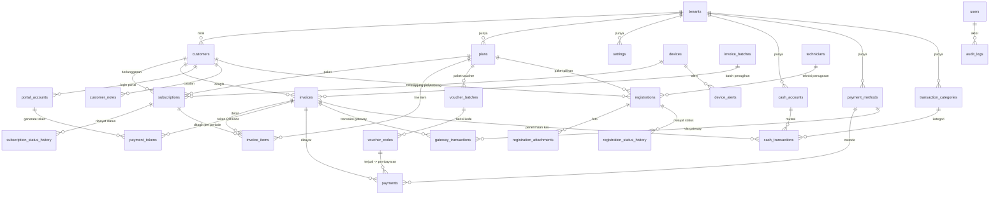
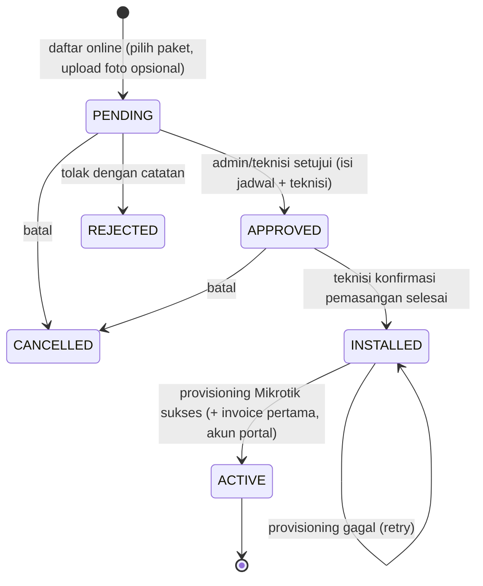
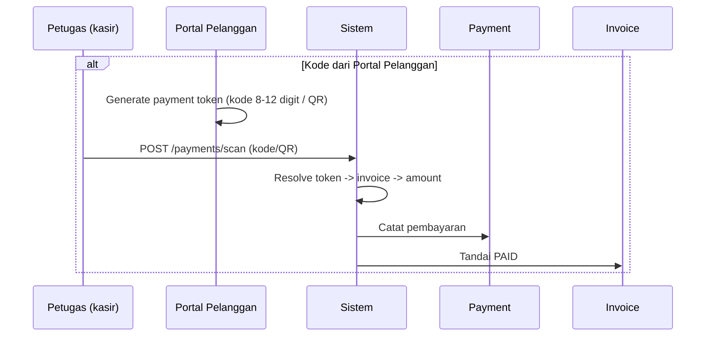

# 🗄️ Skema Database — ISP Management (NetOps Engine)

Dokumen ini adalah **desain skema database definitif** untuk kebutuhan ISP management
di project ini. Skema dirancang berdasarkan analisis mendalam terhadap kode yang sudah
ada (`internal/domain/*`, `internal/adapter/postgres/*`, `migrations/*`, usecase billing/hotspot,
frontend `web/src/features/{customer,billing,hotspot}/*`) dan kebutuhan yang diminta:

manajemen pelanggan, subscription **PPPoE & Hotspot**, plan/paket, invoice, pembayaran,
**billing manual via QR / kode portal** (tanpa input manual), **manajemen voucher
(seperti Mikhmon) dengan plan di database**, log, **payment gateway**, **kas**,
keluar-masuk uang, laporan menyeluruh, dan monitoring jaringan.

> **Status**: Ini adalah dokumen **desain/target** (blueprint). Tabel yang ditandai
> `[EXISTING]` sudah ada di migrasi; sisanya belum dibuat dan harus masuk migrasi baru
> (nomor dimulai dari `000010`). Setiap tabel baru wajib dibuat sebagai pasangan
> `<NNNNNN_...>.up.sql` + `.down.sql` sesuai konvensi `migrations/` project.

---

## 0. Prinsip Desain (Non-Negotiable)

1. **Mikrotik/device = sumber kebenaran untuk data akun jaringan.** Database **tidak
   pernah menyimpan ulang (duplikasi) keseluruhan data device** — akun PPPoE, profile,
   IP, MAC, dan sesi aktif hidup di device. DB hanya menyimpan **mapping** relasional:
   `device_id` + `username` (kunci natural) + `remote_id` (RouterOS `.id`).
   Data detail dibaca langsung dari device via gateway (`port.DeviceDriver`,
   `port.SessionGateway`, `port.HotspotGateway`) saat dibutuhkan.
2. **Plan & voucher = sumber kebenaran di database.** Harga, kuota, masa aktif, dan
   batch voucher disimpan di DB — **bukan** di script/config Mikrotik (seperti pola
   Mikhmon lama). Device hanya menerima hasil *provisioning* (profile/user dibuat di
   device sesuai mapping), sedangkan seluruh data bisnis & laporan dihitung dari DB.
   Ini memastikan **laporan sesuai** (income voucher tidak lagi dibaca dari report
   script di device, melainkan dari `payments`/`cash_transactions`).
3. **Tidak ada tiket teknisi.** Keluhan/catatan cukup lewat `customer_notes` dan
   komunikasi WA (tabel `wa_chats`/`wa_messages` existing) — tidak dibuat tabel
   `tickets`/`ticket_messages`.
4. **Kredensial tidak pernah plaintext di DB.** Bila provisioning ulang membutuhkan
   password akun (mis. PPPoE), gunakan pola `credentials` (AES-GCM vault) yang sudah
   ada — bukan kolom `*_password` di tabel bisnis.
5. **Provisioning kredensial device otomatis HANYA setelah pemasangan dikonfirmasi
   selesai.** Pelanggan bisa **daftar online** dengan alur
   `PENDING → APPROVED (jadwal pemasangan) → INSTALLED → ACTIVE` (plus
   `REJECTED`/`CANCELLED`). Saat `INSTALLED` (teknisi konfirmasi selesai pasang),
   sistem membuat akun ke Mikrotik sesuai tipe plan, lalu membuat **invoice pertama**
   (setup fee + bulan pertama) dan akun portal — dalam satu transaksi.

---

## 1. Konvensi Skema

| Aspek | Konvensi | Alasan / Sumber |
|---|---|---|
| Primary key entitas domain | `TEXT PRIMARY KEY` (UUID string, dibuat di app layer) | Konsisten dengan `customers`, `invoices`, `subscriptions`, `plans` yang sudah ada |
| Primary key tabel append-only (log/metrics) | `BIGINT GENERATED ALWAYS AS IDENTITY` | Baris tidak pernah di-update; identitas serial cukup |
| Uang | `NUMERIC(18,2)` | Menghindari floating point error; konsisten dengan `NUMERIC` existing |
| Waktu | `TIMESTAMPTZ` (UTC) | Konsisten dengan semua tabel existing |
| Multi-tenant | `tenant_id TEXT NOT NULL DEFAULT 'tenant-default'` | `TenantID` sudah menjadi pola di seluruh domain (`customer.Customer`, `device.Device`, `UserModel`) |
| Soft delete | `deleted_at TIMESTAMPTZ` | Master data (customer, plan, subscription) tidak pernah dihapus fisik; historis tetap utuh untuk laporan |
| Updated-at otomatis | Trigger `set_updated_at()` (sudah ada di migrasi `000001`) | Konsisten dengan `devices`/`credentials` |
| Enum/status | `TEXT` + `CHECK` constraint | Project memakai string status (`ACTIVE`, `UNPAID`, dll); CHECK menjaga integritas tanpa enum Postgres |
| Penamaan tabel | `snake_case` jamak | Konsisten (`customers`, `devices`, `invoices`) |
| Foreign key | Selalu `REFERENCES ... ON DELETE` eksplisit | Kebijakan hapus per relasi didefinisikan sadar-diri |

---

## 2. Diagram ERD



---

## 3. Kelompok 1 — Multi-Tenant & Pengaturan

### 3.1 `tenants` — [BARU]
Penyedia/entitas yang memakai sistem (untuk multi-tenant ISP — satu server melayani banyak ISP).

```sql
CREATE TABLE tenants (
    id          TEXT PRIMARY KEY,
    name        TEXT NOT NULL,
    code        TEXT NOT NULL UNIQUE,          -- slug unik, mis. "netops-jkt"
    status      TEXT NOT NULL DEFAULT 'ACTIVE',
    created_at  TIMESTAMPTZ NOT NULL DEFAULT now(),
    updated_at  TIMESTAMPTZ NOT NULL DEFAULT now()
);
```

### 3.2 `settings` — [BARU]
Pengaturan per-tenant. Menyimpan profil perusahaan (nama, alamat, logo, NPWP),
konfigurasi penagihan (hari jatuh tempo, periode billing), dan **config payment gateway
yang tidak sensitif** (nama gateway, mode sandbox/production — **bukan API key**; key
sensitif disimpan di Vault/`credentials` pattern yang sudah ada).

```sql
CREATE TABLE settings (
    id           TEXT PRIMARY KEY,
    tenant_id    TEXT NOT NULL DEFAULT 'tenant-default',
    key          TEXT NOT NULL,                -- mis. "company_name", "billing_due_day", "gateway_enabled"
    value        JSONB NOT NULL DEFAULT '{}',  -- nilai fleksibel per key
    updated_by   TEXT,
    updated_at   TIMESTAMPTZ NOT NULL DEFAULT now(),
    UNIQUE (tenant_id, key)
);
```

---

## 4. Kelompok 2 — Akses & Pengguna

Tabel berikut **sudah ada** dan tidak dibuat ulang:

| Tabel | Sumber | Catatan |
|---|---|---|
| `users` | migrasi `000002` | Admin/agent; `username`, `email`, `password_hash`, `role`, `is_active`, `tenant_id` |
| `technicians` | migrasi `000002` | Teknisi lapangan; `full_name`, `phone_number`, `specialization` |
| RBAC / role-assignment | Casbin policy (bukan tabel) | `internal/adapter/auth/casbin.go` memakai Casbin; policy bisa dipindah ke DB table `casbin_rule` bila butuh manajemen via UI |

> **Rekomendasi (opsional)**: bila role-assignment ingin queryable di laporan,
> tambahkan tabel `role_assignments (user_id, role, scope)` di migrasi berikutnya.

---

## 5. Kelompok 3 — Manajemen Pelanggan

### 5.1 `customers` — [EXISTING, PERLUAS]

Tabel existing hanya punya `name/email/phone/address/status`. Untuk ISP management
diperlukan identitas lengkap, koordinat pemasangan, dan soft delete.

```sql
ALTER TABLE customers
    ADD COLUMN customer_code   TEXT,                       -- nomor pelanggan tampak user, mis. "CUST-000123"
    ADD COLUMN id_type         TEXT,                       -- 'KTP' | 'PASSPORT' | 'SIM' | 'NONE'
    ADD COLUMN id_number       TEXT,
    ADD COLUMN birthday        DATE,
    ADD COLUMN gender          TEXT,
    ADD COLUMN province        TEXT,
    ADD COLUMN city            TEXT,
    ADD COLUMN district        TEXT,
    ADD COLUMN subdistrict     TEXT,
    ADD COLUMN postal_code     TEXT,
    ADD COLUMN latitude        DOUBLE PRECISION,           -- koordinat pemasangan (monitoring/peta)
    ADD COLUMN longitude       DOUBLE PRECISION,
    ADD COLUMN tags            TEXT[] NOT NULL DEFAULT '{}',
    ADD COLUMN notes           TEXT,
    ADD COLUMN deleted_at      TIMESTAMPTZ;                -- soft delete

CREATE UNIQUE INDEX IF NOT EXISTS idx_customers_tenant_code ON customers (tenant_id, customer_code)
    WHERE customer_code IS NOT NULL;
CREATE INDEX IF NOT EXISTS idx_customers_tags        ON customers USING GIN (tags);
CREATE INDEX IF NOT EXISTS idx_customers_deleted_at  ON customers (deleted_at) WHERE deleted_at IS NULL;
```

### 5.2 `customer_notes` — [BARU]
Catatan aktivitas pelanggan (kunjungan teknisi, keluhan, kesepakatan harga) —
terpisah dari `audit_logs` karena ini data bisnis, bukan jejak audit.
**Ini pengganti konsep tiket** — komunikasi/keluhan dicatat di sini + lewat WA.

```sql
CREATE TABLE customer_notes (
    id          TEXT PRIMARY KEY,
    tenant_id   TEXT NOT NULL DEFAULT 'tenant-default',
    customer_id TEXT NOT NULL REFERENCES customers(id) ON DELETE CASCADE,
    user_id     BIGINT REFERENCES users(id) ON DELETE SET NULL,   -- penulis
    content     TEXT NOT NULL,
    created_at  TIMESTAMPTZ NOT NULL DEFAULT now()
);

CREATE INDEX idx_customer_notes_customer ON customer_notes (customer_id, created_at DESC);
```

### 5.3 `registrations` — [BARU] (Daftar Online → Pemasangan → Aktif)

Pelanggan **daftar online** memilih paket sendiri; admin/teknisi menyetujui/menolak
**dengan catatan**; saat disetujui dimasukkan **tanggal & jam pemasangan**;
saat teknisi **konfirmasi pemasangan selesai** barulah sistem otomatis membuat
kredensial ke Mikrotik (sesuai tipe plan) dan generate invoice pertama.



```sql
CREATE TABLE registrations (
    id                TEXT PRIMARY KEY,
    tenant_id         TEXT NOT NULL DEFAULT 'tenant-default',
    -- Data formulir daftar online (snapshot isian pelanggan)
    full_name         TEXT NOT NULL,
    id_type           TEXT,                          -- 'KTP' | 'PASSPORT' | 'SIM'
    id_number         TEXT,
    birthday          DATE,
    phone             TEXT NOT NULL,                 -- WA untuk notifikasi
    email             TEXT,                          -- opsional
    address           TEXT NOT NULL,
    province          TEXT,
    city              TEXT,
    district          TEXT,
    subdistrict       TEXT,
    postal_code       TEXT,
    latitude          DOUBLE PRECISION,              -- koordinat dari maps
    longitude         DOUBLE PRECISION,
    plan_id           TEXT REFERENCES plans(id) ON DELETE SET NULL, -- pilihan paket (bisa diubah admin)
    -- Alur persetujuan & pemasangan
    status            TEXT NOT NULL DEFAULT 'PENDING', -- 'PENDING'|'APPROVED'|'INSTALLED'|'ACTIVE'|'REJECTED'|'CANCELLED'
    reviewed_by_type  TEXT,                          -- 'USER' | 'TECHNICIAN'
    reviewed_by_id    TEXT,
    review_note       TEXT,                          -- catatan tolak/approve
    scheduled_at      TIMESTAMPTZ,                   -- tanggal & jam pemasangan (diisi saat approve)
    assigned_technician_id BIGINT REFERENCES technicians(id) ON DELETE SET NULL,
    installed_at      TIMESTAMPTZ,                   -- saat teknisi konfirmasi pemasangan selesai
    provisioning_status TEXT NOT NULL DEFAULT 'PENDING', -- 'PENDING'|'PROVISIONED'|'FAILED' (retry)
    provisioned_at    TIMESTAMPTZ,
    provision_note    TEXT,                          -- detail error bila provisioning gagal
    -- Hasil approve / instalasi
    customer_id       TEXT REFERENCES customers(id) ON DELETE SET NULL,    -- dibuat saat approve
    subscription_id   TEXT REFERENCES subscriptions(id) ON DELETE SET NULL, -- dibuat saat approve
    invoice_id        TEXT REFERENCES invoices(id) ON DELETE SET NULL,     -- invoice pertama (setup + bulan 1)
    rejected_at       TIMESTAMPTZ,
    rejected_reason   TEXT,
    cancelled_at      TIMESTAMPTZ,
    cancel_reason     TEXT,
    created_at        TIMESTAMPTZ NOT NULL DEFAULT now(),
    updated_at        TIMESTAMPTZ NOT NULL DEFAULT now(),
    CHECK (status IN ('PENDING','APPROVED','INSTALLED','ACTIVE','REJECTED','CANCELLED')),
    CHECK (provisioning_status IN ('PENDING','PROVISIONED','FAILED'))
);

CREATE INDEX idx_registrations_status   ON registrations (status, created_at DESC);
CREATE INDEX idx_registrations_plan     ON registrations (plan_id);
CREATE INDEX idx_registrations_tech     ON registrations (assigned_technician_id, status);
CREATE INDEX idx_registrations_customer ON registrations (customer_id);
```

**Aksi otomatis saat transisi `INSTALLED` → `ACTIVE`** (satu transaksi DB):
1. **Provisioning ke Mikrotik sesuai tipe plan** (`plans.plan_type`):
   - `PPPOE` → buat PPPoE user (username+password, profile dari `plans.remote_profile`)
   - `HOTSPOT` → buat hotspot user
   - `STATIC` → alokasi IP statis
   - Simpan hasil ke `subscriptions` sebagai **mapping** (`remote_username`, `remote_id`, `remote_profile`) — bukan duplikat akun.
2. **Generate invoice pertama**: `setup_fee` (dari plan) + bulan pertama →
   `invoice_items` + `invoices` (status `UNPAID`, jatuh tempo sesuai `billing_day`).
3. **Buat akun portal** (`portal_accounts`, username default = no. HP, password sementara).
4. **Notifikasi WA** ke pelanggan (`notification_logs`).

Bila provisioning gagal: `provisioning_status='FAILED'`, status registrasi tetap
`INSTALLED` (tidak pindah ke `ACTIVE`) dan bisa di-retry.

### 5.4 `registration_attachments` — [BARU]
Foto KTP/rumah yang di-upload saat daftar (opsional).

```sql
CREATE TABLE registration_attachments (
    id              TEXT PRIMARY KEY,
    registration_id TEXT NOT NULL REFERENCES registrations(id) ON DELETE CASCADE,
    file_type       TEXT NOT NULL,                  -- 'KTP' | 'HOUSE' | 'OTHER'
    file_path       TEXT NOT NULL,                  -- path/url file tersimpan
    original_name   TEXT,
    uploaded_at     TIMESTAMPTZ NOT NULL DEFAULT now()
);

CREATE INDEX idx_reg_attachments_reg ON registration_attachments (registration_id);
```

### 5.5 `registration_status_history` — [BARU]
Riwayat perubahan status registrasi (siapa, kapan, dari → ke, beserta catatan).

```sql
CREATE TABLE registration_status_history (
    id              BIGINT GENERATED ALWAYS AS IDENTITY PRIMARY KEY,
    registration_id TEXT NOT NULL REFERENCES registrations(id) ON DELETE CASCADE,
    from_status     TEXT,
    to_status       TEXT NOT NULL,
    reason          TEXT,
    changed_by_type TEXT,                          -- 'USER' | 'TECHNICIAN' | 'SYSTEM'
    changed_by_id   TEXT,
    changed_at      TIMESTAMPTZ NOT NULL DEFAULT now()
);

CREATE INDEX idx_reg_status_hist_reg ON registration_status_history (registration_id, changed_at DESC);
```

---

## 6. Kelompok 4 — Katalog Layanan (Plan / Paket)

### 6.1 `plans` — [EXISTING, PERLUAS]

**Prinsip**: plan adalah **sumber kebenaran di database** — harga, kuota, masa aktif
ditentukan di DB. Device (Mikrotik) hanya menerima hasil provisioning; `remote_profile`
adalah **mapping** nama profile di sisi device (dibuat/di-sync oleh driver saat
provisioning), bukan tempat penyimpanan harga.

Plan saat ini hanya `name/speed_mbps/price/description`. Kebutuhan: **jenis layanan
(PPPoE vs Hotspot)**, kuota, burst, tipe billing, status aktif, dan mapping profile device.

```sql
ALTER TABLE plans
    ADD COLUMN plan_type      TEXT NOT NULL DEFAULT 'PPPOE',  -- 'PPPOE' | 'HOTSPOT' | 'STATIC' | 'VOIP'
    ADD COLUMN speed_up_kbps  BIGINT,                         -- download rate limit
    ADD COLUMN speed_down_kbps BIGINT,
    ADD COLUMN burst_kbps     BIGINT,
    ADD COLUMN quota_gb       BIGINT,                         -- kuota bulanan (NULL = unlimited)
    ADD COLUMN billing_cycle  TEXT NOT NULL DEFAULT 'MONTHLY',-- 'MONTHLY' | 'QUARTERLY' | 'YEARLY' | 'DAILY' (voucher)
    ADD COLUMN setup_fee      NUMERIC(18,2) NOT NULL DEFAULT 0, -- biaya pemasangan
    ADD COLUMN is_active      BOOLEAN NOT NULL DEFAULT TRUE,
    ADD COLUMN remote_profile TEXT,                           -- MAPPING: nama profile di device (RouterOS profile name)
    ADD COLUMN deleted_at     TIMESTAMPTZ;

CREATE INDEX IF NOT EXISTS idx_plans_type      ON plans (plan_type);
CREATE INDEX IF NOT EXISTS idx_plans_active    ON plans (is_active) WHERE deleted_at IS NULL;
```

> **Paket voucher hotspot** (per-hari/per-jam) dimodelkan sebagai `plans` dengan
> `billing_cycle='DAILY'` — detail batch & kode vouchernya ada di Kelompok 6
> (`voucher_batches`/`voucher_codes`). Harga selalu dari DB, sehingga laporan keuangan
> voucher = akumulasi penjualan di DB (bukan report script di device).

---

## 7. Kelompok 5 — Langganan & Provisioning (Mapping-Only)

### 7.1 `subscriptions` — [EXISTING, PERLUAS]

**Prinsip mapping-only**: database **tidak menyimpan keseluruhan akun PPPoE**.
Akun (username, password, profile, IP, MAC) dibuat & hidup di device (Mikrotik)
sebagai sumber kebenaran. `subscriptions` hanya menyimpan **mapping relasional**:

- `device_id` → router tempat akun diprovisi
- `remote_username` → kunci natural akun di device (username PPPoE/hotspot user)
- `remote_id` → RouterOS `.id` akun di device (bila sudah diprovisi)
- `remote_profile` → snapshot nama profile device (hasil terjemahan `plan.remote_profile`)

Detail akun dibaca **langsung dari device** via gateway saat dibutuhkan
(lihat `port.SessionGateway`, `port.HotspotGateway`, `port.DeviceDriver`) —
tidak pernah di-copy ke DB.

```sql
ALTER TABLE subscriptions
    ADD COLUMN plan_type       TEXT,                          -- snapshot jenis layanan (dari plan)
    ADD COLUMN device_id       UUID REFERENCES devices(id) ON DELETE SET NULL, -- MAPPING: router target
    ADD COLUMN remote_username TEXT,                          -- MAPPING: username akun di device (PPPoE/hotspot)
    ADD COLUMN remote_id       TEXT,                          -- MAPPING: RouterOS .id akun (bila terprovisi)
    ADD COLUMN remote_profile  TEXT,                          -- MAPPING: nama profile device (dari plan.remote_profile)
    ADD COLUMN billing_day     INT,                           -- tanggal jatuh tempo per pelanggan (1-28)
    ADD COLUMN current_period_start TIMESTAMPTZ,              -- periode penagihan berjalan
    ADD COLUMN current_period_end   TIMESTAMPTZ,
    ADD COLUMN deleted_at      TIMESTAMPTZ;

CREATE INDEX IF NOT EXISTS idx_subscriptions_device ON subscriptions (device_id);
CREATE INDEX IF NOT EXISTS idx_subscriptions_type   ON subscriptions (plan_type);
CREATE INDEX IF NOT EXISTS idx_subscriptions_active ON subscriptions (customer_id, status)
    WHERE deleted_at IS NULL;
CREATE UNIQUE INDEX IF NOT EXISTS idx_subscriptions_remote
    ON subscriptions (device_id, remote_username)
    WHERE remote_username IS NOT NULL AND deleted_at IS NULL;  -- satu akun device untuk satu langganan aktif
```

> **Password akun PPPoE**: tidak disimpan di tabel ini. Bila provisioning ulang
> membutuhkannya, simpan terenkripsi (AES-GCM vault, pola `credentials` existing) —
> bukan kolom plaintext.

### 7.2 `subscription_status_history` — [BARU]
Riwayat perubahan status (ACTIVE → SUSPENDED → ACTIVE dst.) — untuk laporan
churn dan audit provisioning.

```sql
CREATE TABLE subscription_status_history (
    id              BIGINT GENERATED ALWAYS AS IDENTITY PRIMARY KEY,
    subscription_id TEXT NOT NULL REFERENCES subscriptions(id) ON DELETE CASCADE,
    from_status     TEXT,
    to_status       TEXT NOT NULL,
    reason          TEXT,                       -- mis. "unpaid 30 hari", "permintaan pelanggan"
    changed_by      BIGINT REFERENCES users(id) ON DELETE SET NULL,
    changed_at      TIMESTAMPTZ NOT NULL DEFAULT now()
);

CREATE INDEX idx_sub_status_hist_sub ON subscription_status_history (subscription_id, changed_at DESC);
```

---

## 8. Kelompok 6 — Manajemen Voucher (Seperti Mikhmon, Plan di DB)

Menggantikan pola Mikhmon lama: **plan & harga di DB**, device hanya menerima
provisioning user hotspot. Seluruh laporan income voucher dihitung dari DB
(`voucher_codes.status='SOLD'` → `payments` + `cash_transactions`), **bukan** dari
report script di Mikrotik.

### 8.1 `voucher_batches` — [BARU]
Satu batch = satu kali generate massal voucher (mis. 100 kode paket 1-hari 20k).

```sql
CREATE TABLE voucher_batches (
    id            TEXT PRIMARY KEY,
    tenant_id     TEXT NOT NULL DEFAULT 'tenant-default',
    plan_id       TEXT NOT NULL REFERENCES plans(id) ON DELETE RESTRICT, -- harga & masa aktif dari DB
    device_id     UUID REFERENCES devices(id) ON DELETE SET NULL,        -- device target provisioning
    name          TEXT NOT NULL,                 -- mis. "Batch Voucher Ramadhan"
    prefix        TEXT NOT NULL DEFAULT 'VCR',   -- awalan kode, mis. "VCR" -> "VCR-XXXXXX"
    count         INT NOT NULL CHECK (count > 0),
    price         NUMERIC(18,2) NOT NULL,        -- snapshot harga jual dari plan saat generate
    validity_days INT NOT NULL DEFAULT 1,        -- masa aktif user di device (dari plan.billing_cycle)
    status        TEXT NOT NULL DEFAULT 'GENERATED', -- 'GENERATED' | 'PRINTED' | 'CLOSED' | 'CANCELLED'
    created_by    BIGINT REFERENCES users(id) ON DELETE SET NULL,
    created_at    TIMESTAMPTZ NOT NULL DEFAULT now(),
    closed_at     TIMESTAMPTZ
);

CREATE INDEX idx_voucher_batches_plan ON voucher_batches (plan_id);
CREATE INDEX idx_voucher_batches_status ON voucher_batches (status);
```

### 8.2 `voucher_codes` — [BARU]
Satu baris per kode voucher. Status `AVAILABLE → SOLD` saat terjual
(membuat `payments` + `cash_transactions` dalam satu transaksi DB).
`remote_id` = mapping ke hotspot user di device setelah provisioning.

```sql
CREATE TABLE voucher_codes (
    id          TEXT PRIMARY KEY,
    tenant_id   TEXT NOT NULL DEFAULT 'tenant-default',
    batch_id    TEXT NOT NULL REFERENCES voucher_batches(id) ON DELETE CASCADE,
    plan_id     TEXT NOT NULL REFERENCES plans(id) ON DELETE RESTRICT,
    code        TEXT NOT NULL UNIQUE,            -- kode unik, mis. "VCR-8F3K2A"
    price       NUMERIC(18,2) NOT NULL,          -- snapshot harga jual (dari batch/plan)
    status      TEXT NOT NULL DEFAULT 'AVAILABLE', -- 'AVAILABLE' | 'SOLD' | 'EXPIRED' | 'CANCELLED'
    device_id   UUID REFERENCES devices(id) ON DELETE SET NULL,
    remote_id   TEXT,                            -- MAPPING: RouterOS .id hotspot user setelah provisioning
    remote_username TEXT,                        -- MAPPING: username hotspot user di device
    sold_to_customer TEXT REFERENCES customers(id) ON DELETE SET NULL, -- pembeli (opsional)
    payment_id  TEXT REFERENCES payments(id) ON DELETE SET NULL,       -- pembayaran hasil penjualan
    sold_at     TIMESTAMPTZ,
    expires_at  TIMESTAMPTZ,                     -- masa aktif user (validity_days dari generate)
    created_at  TIMESTAMPTZ NOT NULL DEFAULT now(),
    CHECK (status IN ('AVAILABLE','SOLD','EXPIRED','CANCELLED'))
);

CREATE INDEX idx_voucher_codes_batch  ON voucher_codes (batch_id);
CREATE INDEX idx_voucher_codes_status ON voucher_codes (status);
CREATE INDEX idx_voucher_codes_plan   ON voucher_codes (plan_id);
```

### Alur penjualan voucher
1. Admin generate batch → `voucher_batches` + N `voucher_codes` (`AVAILABLE`).
2. *(Opsional)* Kode langsung diprovisi ke device (buat hotspot user via gateway)
   → `remote_id`/`remote_username` terisi. Atau provisi on-demand saat terjual.
3. Voucher terjual (kasir/portal/WA) → dalam **satu transaksi DB**:
   `voucher_codes.status='SOLD'` + `payments` (metode TUNAI/QRIS/GATEWAY) +
   `cash_transactions` (`direction='IN'`, `source_type='VOUCHER_SALE'`, kategori Voucher).
4. Laporan income voucher = query DB (`payments`/`cash_transactions`), akurat & tidak
   bergantung pada report script device.

---

## 9. Kelompok 7 — Penagihan (Billing)

### 9.1 `invoice_batches` — [BARU]
Satu batch = satu siklus penagihan massal (mis. semua pelanggan aktif periode
Agustus 2026). Mempermudah laporan "penagihan bulan ini" dan re-run.

```sql
CREATE TABLE invoice_batches (
    id          TEXT PRIMARY KEY,
    tenant_id   TEXT NOT NULL DEFAULT 'tenant-default',
    period      TEXT NOT NULL,                  -- "2026-08"
    status      TEXT NOT NULL DEFAULT 'DRAFT',  -- 'DRAFT' | 'GENERATED' | 'CLOSED' | 'CANCELLED'
    total_count INT NOT NULL DEFAULT 0,
    total_amount NUMERIC(18,2) NOT NULL DEFAULT 0,
    generated_by BIGINT REFERENCES users(id) ON DELETE SET NULL,
    generated_at TIMESTAMPTZ NOT NULL DEFAULT now(),
    closed_at   TIMESTAMPTZ,
    UNIQUE (tenant_id, period)
);
```

### 9.2 `invoices` — [EXISTING, PERLUAS]

Invoice existing belum punya periode, batch, diskon, pajak, dan nomor invoice.

```sql
ALTER TABLE invoices
    ADD COLUMN invoice_number  TEXT,                        -- tampilan, mis. "INV-202608-0001"
    ADD COLUMN batch_id        TEXT REFERENCES invoice_batches(id) ON DELETE SET NULL,
    ADD COLUMN subscription_id TEXT REFERENCES subscriptions(id) ON DELETE SET NULL,
    ADD COLUMN period          TEXT,                        -- "2026-08"
    ADD COLUMN subtotal        NUMERIC(18,2) NOT NULL DEFAULT 0,
    ADD COLUMN discount        NUMERIC(18,2) NOT NULL DEFAULT 0,
    ADD COLUMN total           NUMERIC(18,2) NOT NULL DEFAULT 0,   -- subtotal - discount (tanpa pajak)
    ADD COLUMN issue_date      TIMESTAMPTZ,
    ADD COLUMN cancelled_at    TIMESTAMPTZ,
    ADD COLUMN cancel_reason   TEXT,
    ADD COLUMN deleted_at      TIMESTAMPTZ;

CREATE UNIQUE INDEX IF NOT EXISTS idx_invoices_number ON invoices (tenant_id, invoice_number)
    WHERE invoice_number IS NOT NULL;
CREATE INDEX IF NOT EXISTS idx_invoices_period     ON invoices (period);
CREATE INDEX IF NOT EXISTS idx_invoices_status     ON invoices (status);
CREATE INDEX IF NOT EXISTS idx_invoices_batch      ON invoices (batch_id);
CREATE INDEX IF NOT EXISTS idx_invoices_due_date   ON invoices (due_date);
```

> **Migrasi data**: kolom `amount` existing → diisi ke `total`; `subtotal` = `amount`.
> Invoice lama yang `paid_at` terisi → `status='PAID'` (status existing `OVERDUE` dipakai
> bila `due_date < now()` dan belum lunas).

### 9.3 `invoice_items` — [BARU]
Line-item invoice: paket, setup fee, add-on, penyesuaian (prorata, kompensasi gangguan).

```sql
CREATE TABLE invoice_items (
    id             TEXT PRIMARY KEY,
    invoice_id     TEXT NOT NULL REFERENCES invoices(id) ON DELETE CASCADE,
    subscription_id TEXT REFERENCES subscriptions(id) ON DELETE SET NULL,
    plan_id        TEXT REFERENCES plans(id) ON DELETE SET NULL,
    description    TEXT NOT NULL,               -- "Paket Fiber 20Mbps - Agustus 2026"
    quantity       NUMERIC(12,2) NOT NULL DEFAULT 1,
    unit_price     NUMERIC(18,2) NOT NULL DEFAULT 0,
    amount         NUMERIC(18,2) NOT NULL DEFAULT 0,  -- quantity * unit_price (dengan tanda: negatif = penyesuaian)
    created_at     TIMESTAMPTZ NOT NULL DEFAULT now()
);

CREATE INDEX idx_invoice_items_invoice ON invoice_items (invoice_id);
```

---

## 10. Kelompok 8 — Pembayaran & Token QR/Kode

Ini adalah inti kebutuhan **"tagihan manual bisa scan langsung QR atau memasukkan
kode yang ada di portal pelanggan sehingga tidak perlu input manual"**.

### Alur (flow)



**Poin penting**: petugas **tidak pernah input nominal/nama pelanggan manual** —
token menyimpan referensi invoice, sehingga nominal & pelanggan ditentukan sistem.

### 10.1 `payment_tokens` — [BARU]
Token sekali pakai yang dikodekan ke QR (`payment_token.code` + alamat endpoint) atau
diketik dari portal. Umur pendek (mis. 15 menit), satu token = satu invoice.

```sql
CREATE TABLE payment_tokens (
    id           TEXT PRIMARY KEY,
    tenant_id    TEXT NOT NULL DEFAULT 'tenant-default',
    token        TEXT NOT NULL UNIQUE,          -- kode acak 8-12 char (huruf+angka, tanpa karakter ambigu)
    invoice_id   TEXT NOT NULL REFERENCES invoices(id) ON DELETE CASCADE,
    amount       NUMERIC(18,2) NOT NULL,        -- snapshot nominal saat generate (anti tamper)
    status       TEXT NOT NULL DEFAULT 'PENDING', -- 'PENDING' | 'USED' | 'EXPIRED' | 'CANCELLED'
    source       TEXT NOT NULL DEFAULT 'PORTAL',  -- 'PORTAL' | 'ADMIN'
    expires_at   TIMESTAMPTZ NOT NULL,
    used_at      TIMESTAMPTZ,
    created_by   BIGINT REFERENCES users(id) ON DELETE SET NULL,  -- bila dibuat admin
    created_at   TIMESTAMPTZ NOT NULL DEFAULT now(),
    CHECK (status IN ('PENDING','USED','EXPIRED','CANCELLED'))
);

CREATE INDEX idx_payment_tokens_invoice ON payment_tokens (invoice_id);
CREATE INDEX idx_payment_tokens_status  ON payment_tokens (status, expires_at);
```

### 10.2 `payment_methods` — [BARU]
Master metode pembayaran: Tunai (Kas), Transfer Bank, QRIS, Payment Gateway (Midtrans),
WhatsApp (via bot).

```sql
CREATE TABLE payment_methods (
    id         TEXT PRIMARY KEY,
    tenant_id  TEXT NOT NULL DEFAULT 'tenant-default',
    name       TEXT NOT NULL,                   -- "TUNAI", "TRANSFER BCA", "QRIS", "GATEWAY_XENDIT"
    type       TEXT NOT NULL,                   -- 'CASH' | 'BANK' | 'QRIS' | 'GATEWAY'
    is_active  BOOLEAN NOT NULL DEFAULT TRUE,
    created_at TIMESTAMPTZ NOT NULL DEFAULT now()
);
```

### 10.3 `payments` — [BARU]
Catatan pembayaran (diterima). Satu invoice bisa punya beberapa `payments`
(angsuran/DP); status invoice dihitung dari akumulasi `amount`. Penjualan voucher
juga membuat baris di sini (`voucher_codes.payment_id`).

```sql
CREATE TABLE payments (
    id             TEXT PRIMARY KEY,
    tenant_id      TEXT NOT NULL DEFAULT 'tenant-default',
    invoice_id     TEXT REFERENCES invoices(id) ON DELETE RESTRICT, -- NULL untuk penjualan voucher tanpa invoice
    payment_method_id TEXT REFERENCES payment_methods(id) ON DELETE SET NULL,
    amount         NUMERIC(18,2) NOT NULL CHECK (amount > 0),
    status         TEXT NOT NULL DEFAULT 'SUCCESS', -- 'PENDING' | 'SUCCESS' | 'FAILED' | 'REFUNDED' | 'VOID'
    payment_date   TIMESTAMPTZ NOT NULL DEFAULT now(),
    received_by    BIGINT REFERENCES users(id) ON DELETE SET NULL,  -- kasir
    token_id       TEXT REFERENCES payment_tokens(id) ON DELETE SET NULL, -- dari token QR/kode
    gateway_transaction_id TEXT,                -- id eksternal bila via gateway (denormalisasi ringan)
    reference      TEXT,                        -- nomor referensi transfer / nota
    notes          TEXT,
    created_at     TIMESTAMPTZ NOT NULL DEFAULT now(),
    CHECK (status IN ('PENDING','SUCCESS','FAILED','REFUNDED','VOID'))
);

CREATE INDEX idx_payments_invoice ON payments (invoice_id);
CREATE INDEX idx_payments_date    ON payments (payment_date);
CREATE INDEX idx_payments_method  ON payments (payment_method_id);
```

> **Tanpa angsuran** — sesuai kebutuhan, setiap tagihan dibayar **lunas sekaligus**
> (satu `payments` menutup satu `invoices`).

---

## 11. Kelompok 9 — Payment Gateway

### 11.1 `gateway_transactions` — [BARU]
Rekam transaksi payment gateway (**Xendit / Tripay** — atau provider lain).
Menyimpan status terakhir dan **payload callback mentah** untuk audit.

```sql
CREATE TABLE gateway_transactions (
    id              TEXT PRIMARY KEY,
    tenant_id       TEXT NOT NULL DEFAULT 'tenant-default',
    gateway         TEXT NOT NULL,              -- 'XENDIT' | 'TRIPAY' | 'MIDTRANS' ...
    external_id     TEXT NOT NULL,              -- order-id di sisi gateway
    invoice_id      TEXT REFERENCES invoices(id) ON DELETE SET NULL,
    payment_id      TEXT REFERENCES payments(id) ON DELETE SET NULL,
    amount          NUMERIC(18,2) NOT NULL,
    status          TEXT NOT NULL DEFAULT 'PENDING', -- 'PENDING' | 'SETTLEMENT' | 'CAPTURE' | 'DENY' | 'EXPIRE' | 'CANCEL' | 'REFUND'
    method          TEXT,                       -- bank/va/qris dari gateway
    va_number       TEXT,
    payment_url     TEXT,                       -- redirect/QRIS url dari gateway
    raw_request     JSONB,                      -- payload yang dikirim
    raw_callback    JSONB,                      -- payload webhook terakhir (mentah, utk audit)
    callback_count  INT NOT NULL DEFAULT 0,     -- berapa kali webhook diterima (deteksi duplikat)
    created_at      TIMESTAMPTZ NOT NULL DEFAULT now(),
    updated_at      TIMESTAMPTZ NOT NULL DEFAULT now(),
    UNIQUE (gateway, external_id)
);

CREATE INDEX idx_gateway_tx_invoice ON gateway_transactions (invoice_id);
CREATE INDEX idx_gateway_tx_status  ON gateway_transactions (status);
```

> **Anti duplikasi webhook**: `callback_count` + status transition guard — webhook
> `settlement` hanya memicu `payments`/`invoices` update **sekali** (idempotent key =
> `(gateway, external_id)`).

---

## 12. Kelompok 10 — Kas & Keuangan (Keluar Masuk Uang)

### 12.1 `cash_accounts` — [BARU]
Rekening kas. Sesuai kebutuhan: **default satu akun "Kas Utama"** (di-seed saat
setup). Struktur tetap mendukung banyak akun (kas + bank) bila nanti dibutuhkan.
Saldo = hasil agregasi mutasi, bukan kolom yang di-update manual (hindari drift).

```sql
CREATE TABLE cash_accounts (
    id          TEXT PRIMARY KEY,
    tenant_id   TEXT NOT NULL DEFAULT 'tenant-default',
    name        TEXT NOT NULL,                  -- "Kas Utama", "Bank BCA - Operasional"
    type        TEXT NOT NULL DEFAULT 'CASH',   -- 'CASH' | 'BANK'
    currency    TEXT NOT NULL DEFAULT 'IDR',
    is_active   BOOLEAN NOT NULL DEFAULT TRUE,
    created_at  TIMESTAMPTZ NOT NULL DEFAULT now(),
    updated_at  TIMESTAMPTZ NOT NULL DEFAULT now()
);
```

### 12.2 `transaction_categories` — [BARU]
Kategori keluar-masuk uang (Pendapatan: Tagihan, Voucher, Pemasangan; Pengeluaran:
Listrik, Internet Uplink, Gaji, Maintenance, Sewa, Lain-lain).

```sql
CREATE TABLE transaction_categories (
    id          TEXT PRIMARY KEY,
    tenant_id   TEXT NOT NULL DEFAULT 'tenant-default',
    name        TEXT NOT NULL,
    type        TEXT NOT NULL,                  -- 'INCOME' | 'EXPENSE'
    is_active   BOOLEAN NOT NULL DEFAULT TRUE,
    UNIQUE (tenant_id, name)
);
```

### 12.3 `cash_transactions` — [BARU]
**Buku kas / jurnal keluar-masuk uang**. Sumber tunggal kebenaran untuk laporan
arus kas. Penerimaan dari invoice (otomatis dari `payments` via usecase),
penjualan voucher (`source_type='VOUCHER_SALE'`), dan pengeluaran operasional.

```sql
CREATE TABLE cash_transactions (
    id           TEXT PRIMARY KEY,
    tenant_id    TEXT NOT NULL DEFAULT 'tenant-default',
    account_id   TEXT NOT NULL REFERENCES cash_accounts(id) ON DELETE RESTRICT,
    category_id  TEXT REFERENCES transaction_categories(id) ON DELETE SET NULL,
    direction    TEXT NOT NULL,                 -- 'IN' (masuk) | 'OUT' (keluar)
    amount       NUMERIC(18,2) NOT NULL CHECK (amount > 0),
    trx_date     TIMESTAMPTZ NOT NULL DEFAULT now(),
    -- referensi opsional ke sumber transaksi (relasi polimorfik ringan)
    source_type  TEXT,                          -- 'PAYMENT' | 'VOUCHER_SALE' | 'EXPENSE' | 'REFUND' | 'TRANSFER' | 'OPENING_BALANCE'
    source_id    TEXT,                          -- id tabel sumber (payments.id / voucher_codes.id, dll)
    description  TEXT,
    created_by   BIGINT REFERENCES users(id) ON DELETE SET NULL,
    created_at   TIMESTAMPTZ NOT NULL DEFAULT now(),
    CHECK (direction IN ('IN','OUT'))
);

CREATE INDEX idx_cash_trx_account_date ON cash_transactions (account_id, trx_date DESC);
CREATE INDEX idx_cash_trx_category     ON cash_transactions (category_id);
CREATE INDEX idx_cash_trx_source       ON cash_transactions (source_type, source_id);
```

> **Konsistensi**: penerimaan tagihan membuat **satu** `cash_transactions` per `payments`;
> penjualan voucher membuat satu `cash_transactions` (`IN`, `VOUCHER_SALE`) per
> `voucher_codes` — keduanya dalam transaksi DB yang sama (usecase).
> Refund membuat baris `OUT` dengan `source_type='REFUND'`.

---

## 13. Kelompok 11 — Monitoring & Jaringan

### 13.1 `devices` — [EXISTING]
Sudah lengkap (`devices` + `credentials` di migrasi `000001`): inventory router,
polling interval, tags. **Tidak perlu perubahan** — hanya perlu index tambahan:

```sql
CREATE INDEX IF NOT EXISTS idx_devices_enabled_tenant ON devices (tenant_id, enabled);
```

### 13.2 `device_alerts` — [BARU]
Event alert: device down, CPU tinggi, sesi drop massal, dsb. Bisa juga dipakai
sebagai jadwal notifikasi ke operator/teknisi.

```sql
CREATE TABLE device_alerts (
    id          BIGINT GENERATED ALWAYS AS IDENTITY PRIMARY KEY,
    device_id   UUID REFERENCES devices(id) ON DELETE CASCADE,
    tenant_id   TEXT NOT NULL DEFAULT 'tenant-default',
    severity    TEXT NOT NULL DEFAULT 'WARNING', -- 'INFO' | 'WARNING' | 'CRITICAL'
    type        TEXT NOT NULL,                  -- 'DEVICE_DOWN' | 'CPU_HIGH' | 'SESSION_DROP' | 'DISK_HIGH' ...
    message     TEXT,
    raw         JSONB,                          -- konteks tambahan
    is_resolved BOOLEAN NOT NULL DEFAULT FALSE,
    resolved_at TIMESTAMPTZ,
    created_at  TIMESTAMPTZ NOT NULL DEFAULT now()
);

CREATE INDEX idx_device_alerts_open ON device_alerts (device_id, is_resolved, created_at DESC);
```

> **Monitoring lanjutan** (`device_metrics`, `network_sessions`, `command_logs`,
> `approval_requests`) **ditunda** sesuai kebutuhan dasar (status + alert) —
> definisi lengkapnya ada di **Lampiran A**.

---

## 14. Kelompok 12 — Portal Pelanggan

### 14.1 `portal_accounts` — [BARU]
Akun login portal pelanggan: lihat tagihan, **generate token QR/kode** untuk bayar
di kasir tanpa input manual. Satu pelanggan bisa punya lebih dari satu akun
(anggota keluarga), tapi minimum satu.

```sql
CREATE TABLE portal_accounts (
    id            TEXT PRIMARY KEY,
    tenant_id     TEXT NOT NULL DEFAULT 'tenant-default',
    customer_id   TEXT NOT NULL REFERENCES customers(id) ON DELETE CASCADE,
    username      TEXT NOT NULL,
    password_hash TEXT NOT NULL,
    phone_number  TEXT,                         -- untuk OTP/verifikasi WA
    is_active     BOOLEAN NOT NULL DEFAULT TRUE,
    last_login_at TIMESTAMPTZ,
    created_at    TIMESTAMPTZ NOT NULL DEFAULT now(),
    updated_at    TIMESTAMPTZ NOT NULL DEFAULT now(),
    UNIQUE (tenant_id, username)
);

CREATE INDEX idx_portal_accounts_customer ON portal_accounts (customer_id);
```

> **Sesi portal** memakai `refresh_token_store` yang sudah ada di `internal/port/`
> (Redis) — tidak perlu tabel baru.

---

## 15. Kelompok 13 — Komunikasi & Notifikasi

### 15.1 `notification_logs` — [BARU]
Jejak notifikasi yang dikirim (WA via bot, email) — tagihan baru, pengingat jatuh
tempo, pembayaran diterima, alert device. WA chat/message sudah ada
(`wa_chats`, `wa_messages`); tabel ini adalah log **outbound terstruktur** agar
bisa dihitung ulang untuk laporan "notifikasi terkirim".

```sql
CREATE TABLE notification_logs (
    id          BIGINT GENERATED ALWAYS AS IDENTITY PRIMARY KEY,
    tenant_id   TEXT NOT NULL DEFAULT 'tenant-default',
    customer_id TEXT REFERENCES customers(id) ON DELETE SET NULL,
    channel     TEXT NOT NULL,                  -- 'WA' | 'EMAIL' | 'PUSH'
    template_key TEXT,                          -- mis. "invoice_created", "payment_received", "device_down"
    target      TEXT,                           -- nomor WA / email tujuan
    status      TEXT NOT NULL DEFAULT 'SENT',   -- 'SENT' | 'FAILED' | 'QUEUED'
    error       TEXT,
    created_at  TIMESTAMPTZ NOT NULL DEFAULT now()
);

CREATE INDEX idx_notification_logs_customer_time ON notification_logs (customer_id, created_at DESC);
CREATE INDEX idx_notification_logs_template      ON notification_logs (template_key);
```

---

## 16. Kelompok 14 — Audit

### 16.1 `audit_logs` — [BARU]
Audit trail seluruh perubahan data sensitif (siapa mengubah apa, dari → ke).
**Berbeda** dari `command_logs` (operasi device) dan `customer_notes` (catatan bisnis).

```sql
CREATE TABLE audit_logs (
    id          BIGINT GENERATED ALWAYS AS IDENTITY PRIMARY KEY,
    tenant_id   TEXT NOT NULL DEFAULT 'tenant-default',
    actor_type  TEXT NOT NULL,                  -- 'USER' | 'SYSTEM' | 'AGENT' | 'PORTAL'
    actor_id    TEXT,                           -- user id / portal account id
    action      TEXT NOT NULL,                  -- 'CREATE' | 'UPDATE' | 'DELETE' | 'PAY' | 'APPROVE' ...
    entity_type TEXT NOT NULL,                  -- 'customer' | 'invoice' | 'subscription' | 'payment' ...
    entity_id   TEXT NOT NULL,
    before_json JSONB,                          -- snapshot sebelum (opsional)
    after_json  JSONB,                          -- snapshot sesudah (opsional)
    ip_address  TEXT,
    user_agent  TEXT,
    created_at  TIMESTAMPTZ NOT NULL DEFAULT now()
);

CREATE INDEX idx_audit_logs_entity ON audit_logs (entity_type, entity_id);
CREATE INDEX idx_audit_logs_actor  ON audit_logs (actor_type, actor_id, created_at DESC);
CREATE INDEX idx_audit_logs_time   ON audit_logs (created_at DESC);
```

---

## 17. Kelompok 15 — Snapshot Laporan

### 17.1 `daily_financial_snapshots` — [BARU, OPSIONAL]
Snapshot harian agregat (penagihan, penerimaan, piutang, saldo kas per akun,
penjualan voucher). Mempercepat laporan dashboard tanpa agregasi penuh di setiap
request, dan jadi **sumber kebenaran** untuk laporan yang tidak boleh berubah
setelah hari berakhir.

```sql
CREATE TABLE daily_financial_snapshots (
    id               BIGINT GENERATED ALWAYS AS IDENTITY PRIMARY KEY,
    tenant_id        TEXT NOT NULL DEFAULT 'tenant-default',
    snapshot_date    DATE NOT NULL,
    invoice_count    INT NOT NULL DEFAULT 0,
    invoice_total    NUMERIC(18,2) NOT NULL DEFAULT 0,
    payment_count    INT NOT NULL DEFAULT 0,
    payment_total    NUMERIC(18,2) NOT NULL DEFAULT 0,
    voucher_sold     INT NOT NULL DEFAULT 0,
    voucher_total    NUMERIC(18,2) NOT NULL DEFAULT 0,
    outstanding_total NUMERIC(18,2) NOT NULL DEFAULT 0,   -- piutang belum lunas
    expense_total    NUMERIC(18,2) NOT NULL DEFAULT 0,
    cash_balance     JSONB NOT NULL DEFAULT '{}',          -- {"cash_account_id": saldo}
    active_subscriptions INT NOT NULL DEFAULT 0,
    UNIQUE (tenant_id, snapshot_date)
);
```

> **Laporan lain** (laporan pelanggan, laporan per plan, laporan voucher, laporan
> monitoring) cukup berupa **query/view** di atas tabel-tabel di atas — tidak perlu
> tabel khusus.

---

## 18. Ringkasan Tabel

| Kelompok | Tabel | Status |
|---|---|---|
| Multi-tenant & pengaturan | `tenants`, `settings` | 🆕 Baru |
| Akses & pengguna | `users`, `technicians` (+ Casbin) | ✅ Existing |
| Pelanggan | `customers`, `customer_notes` | ✏️ Perluas + 🆕 notes |
| Registrasi online | `registrations`, `registration_attachments`, `registration_status_history` | 🆕 Baru |
| Katalog layanan | `plans` | ✏️ Perluas (+ `remote_profile` mapping) |
| Langganan (mapping-only) | `subscriptions`, `subscription_status_history` | ✏️ Perluas + 🆕 history |
| Voucher (seperti Mikhmon) | `voucher_batches`, `voucher_codes` | 🆕 Baru |
| Penagihan | `invoice_batches`, `invoices`, `invoice_items` | ✏️ Perluas + 🆕 batch/items |
| Pembayaran & token | `payment_methods`, `payment_tokens`, `payments` | 🆕 Baru |
| Payment gateway | `gateway_transactions` | 🆕 Baru |
| Kas & keuangan | `cash_accounts`, `transaction_categories`, `cash_transactions` | 🆕 Baru |
| Monitoring (dasar) | `devices`, `credentials` (existing) + `device_alerts` | ✅ Existing + 🆕 device_alerts |
| Monitoring lanjutan (ditunda) | `device_metrics`, `network_sessions`, `command_logs`, `approval_requests` | ⏸️ Lampiran A |
| Portal pelanggan | `portal_accounts` (+ `refresh_token_store` Redis existing) | 🆕 Baru |
| Notifikasi | `notification_logs` (+ `wa_chats`/`wa_messages` existing) | 🆕 Baru |
| Audit | `audit_logs` | 🆕 Baru |
| Laporan | `daily_financial_snapshots` + query/view | 🆕 Opsional |

**Total**: 22 tabel baru + 4 tabel diperluas (inti), + 4 tabel ditunda di Lampiran A.
**Tidak dibuat**: tabel tiket (`tickets`/`ticket_messages` — keluhan via
`customer_notes` + WA), tabel angsuran (`payment_installments` — bayar lunas),
metode pembayaran WA (cukup tunai/transfer/QRIS/e-wallet via gateway).

---

## 19. Relasi & Aturan Penting (Invariants)

1. **Device = sumber kebenaran data akun jaringan.** DB hanya menyimpan mapping
   (`device_id` + `remote_username` + `remote_id`) — detail akun (password, profile,
   IP, MAC, sesi) dibaca live dari device via gateway. Jangan pernah menambahkan
   kolom duplikasi data device ke tabel bisnis.
2. **Plan & voucher = sumber kebenaran di DB.** Harga/kuota/masa aktif voucher
   ditentukan `plans`; device hanya menerima provisioning. Laporan income voucher
   dihitung dari `payments`/`cash_transactions` — **bukan** dari report script device.
3. **Invoice lunas dihitung dari payments, bukan kolom status saja** — `invoices.status`
   di-update usecase saat `SUM(payments.amount) >= invoices.total`; jangan pernah
   update status manual di SQL. Tanpa angsuran, satu invoice ditutup oleh satu
   pembayaran lunas (`payments.status='SUCCESS'`).
4. **`payment_tokens` sekali pakai** — transisi `PENDING → USED` hanya boleh terjadi
   jika `status='PENDING'` DAN `expires_at > now()` (guard di usecase; tambahkan
   `SELECT ... FOR UPDATE` pada invoice saat proses scan untuk mencegah race).
5. **Kas selalu via `cash_transactions`** — saldo akun = `SUM(IN) - SUM(OUT)`, tidak
   pernah kolom `balance` yang di-update manual. Penerimaan tagihan & penjualan
   voucher membuat `payments` + `cash_transactions` dalam **satu transaksi DB**.
6. **Webhook gateway idempotent** — kunci `UNIQUE (gateway, external_id)` +
   `callback_count` mencegah pembayaran ganda.
7. **Kredensial PPPoE pelanggan & API key gateway** tidak pernah plaintext — pakai
   pola `credentials` (AES-GCM vault) yang sudah ada, bukan kolom baru.
8. **Multi-tenant** — semua tabel baru punya `tenant_id`; semua query usecase wajib
   di-scope tenant dari konteks (token JWT).
9. **Soft delete** — `customers`, `plans`, `subscriptions`, `invoices` memakai
   `deleted_at`; query default `WHERE deleted_at IS NULL`. Tabel finansial
   (`payments`, `cash_transactions`, `gateway_transactions`, `voucher_codes`) **tidak
   boleh dihapus** — gunakan status `VOID`/`REFUNDED`/`CANCELLED`.
10. **Status dengan `CHECK`** — enumerasi status di-*constraint* di DB (bukan hanya di
    kode Go), agar laporan SQL mentah tetap valid.
11. **Registrasi online: provisioning hanya saat `INSTALLED`.** Kredensial Mikrotik
    dibuat otomatis **setelah** teknisi konfirmasi pemasangan selesai — tidak pernah
    sebelumnya. Registrasi `REJECTED`/`CANCELLED` tidak pernah membuat
    `customers`/`subscriptions`.
12. **Invoice pertama (setup fee + bulan pertama) dibuat setelah provisioning sukses**
    (transisi `INSTALLED → ACTIVE`), sesuai keputusan "biaya setup dibayar setelah
    pemasangan selesai".
13. **Registrasi memakai snapshot** — data formulir (`full_name`, `plan_id`, alamat,
    foto) adalah snapshot saat daftar; perubahan data pelanggan setelahnya dilakukan
    di tabel `customers` (bukan mengubah riwayat registrasi).

---

## 20. Roadmap Migrasi (urutan eksekusi)

Migrasi baru dimulai dari `000010`, mengikuti pola `NNNNNN_<deskripsi>.up.sql` +
`.down.sql`:

| Migrasi | Isi |
|---|---|
| `000010_create_tenants_settings.up.sql` | `tenants`, `settings` |
| `000011_extend_customers.up.sql` | `ALTER customers` + `customer_notes` |
| `000012_create_registration_tables.up.sql` | `registrations`, `registration_attachments`, `registration_status_history` (daftar online → pemasangan → aktif) |
| `000013_extend_plans.up.sql` | `ALTER plans` |
| `000014_extend_subscriptions.up.sql` | `ALTER subscriptions` (mapping-only) + `subscription_status_history` |
| `000015_create_billing_tables.up.sql` | `invoice_batches`, `ALTER invoices`, `invoice_items` |
| `000016_create_payment_tables.up.sql` | `payment_methods`, `payment_tokens`, `payments` |
| `000017_create_voucher_tables.up.sql` | `voucher_batches`, `voucher_codes` (manajemen voucher seperti Mikhmon, plan di DB) |
| `000018_create_gateway_tables.up.sql` | `gateway_transactions` |
| `000019_create_cash_tables.up.sql` | `cash_accounts`, `transaction_categories`, `cash_transactions` |
| `000020_create_monitoring_tables.up.sql` | `device_alerts` (monitoring dasar: status + alert) |
| `000021_create_portal_notification_tables.up.sql` | `portal_accounts`, `notification_logs` |
| `000022_create_audit_report_tables.up.sql` | `audit_logs`, `daily_financial_snapshots` |

> Monitoring lanjutan (`device_metrics`, `network_sessions`, `command_logs`,
> `approval_requests`) & HITL **ditunda** — definisi di **Lampiran A**.

> Setiap migrasi dibuat **berpasangan** up/down, satu perubahan skema per pasang,
> nomor tidak pernah di-reuse (konvensi `AGENTS.md` §1.4).

---

## 21. Peta ke Kode yang Sudah Ada

| Konsep baru | Kode existing yang jadi dasar |
|---|---|
| `subscriptions` mapping (`device_id`, `remote_username`, `remote_id`) | `port.SessionGateway` → `ListPPPActive`/`KickPPPSession`; `port.DeviceDriver` |
| `voucher_batches`/`voucher_codes` (plan di DB) | `port.HotspotGateway` → `GenerateVouchers`; income voucher kini akumulasi DB (`payments`/`cash_transactions`) |
| `plans.remote_profile` | `internal/driver/mikrotik/hotspot` (provisioning profile/user ke device) |
| `customers` | `domain/customer.Customer`, `port.CustomerRepository` |
| `subscriptions` | `domain/subscription`, `port.SubscriptionRepository` |
| `invoices` | `domain/billing.Invoice`, `port.InvoiceRepository` |
| `gateway_transactions` | webhook Xendit/Tripay (payload callback mentah di `raw_callback`) |
| `cash_transactions` | menggantikan pembacaan income dari device (`MikhmonTransaction`) — disentralisasi ke DB |
| `payment_tokens` (QR/kode) | usecase billing `PayInvoice`, frontend `use-billing.ts`, `use-hotspot.ts` |
| `registrations` (daftar online → provisioning) | `domain/customer`, `port.CustomerRepository` + `port.SessionGateway`/`HotspotGateway`/`DeviceDriver` (provisioning otomatis saat INSTALLED) |
| `audit_logs` | `port.AuditWriter` (`internal/audit/writer.go`) |
| `tenants`/`settings` | `TenantID` di semua domain + `internal/config/config.go` |

---

## Lampiran A — Tabel Ditunda (Opsional, Fase Berikutnya)

Sesuai kebutuhan yang dipilih (monitoring dasar: status + alert), tabel berikut
**tidak dibuat di tahap awal** — desainnya dipertahankan di sini agar mudah
"diaktifkan" nanti tanpa mendesain ulang.

### A.1 `device_metrics` — telemetri berkala (grafik monitoring)
Snapshot polling (`devices.poll_interval_ms`): CPU, memori, uptime, jumlah klien.

```sql
CREATE TABLE device_metrics (
    id          BIGINT GENERATED ALWAYS AS IDENTITY PRIMARY KEY,
    device_id   UUID NOT NULL REFERENCES devices(id) ON DELETE CASCADE,
    tenant_id   TEXT NOT NULL DEFAULT 'tenant-default',
    cpu_load    INT,
    memory_used BIGINT,                         -- bytes
    memory_total BIGINT,
    uptime_sec  BIGINT,
    active_clients INT,
    pppoe_active INT,
    hotspot_active INT,
    signal_strength INT,                        -- dBm bila ada radio
    rx_bytes    BIGINT,
    tx_bytes    BIGINT,
    collected_at TIMESTAMPTZ NOT NULL DEFAULT now()
);

CREATE INDEX idx_device_metrics_device_time ON device_metrics (device_id, collected_at DESC);
```

### A.2 `network_sessions` — korelasi sesi → pelanggan (mapping ringan)
Sesi aktif dibaca live dari device via gateway; tabel ini hanya menyimpan mapping
ringan untuk korelasi sesi → pelanggan dan laporan pemakaian.

```sql
CREATE TABLE network_sessions (
    id              BIGINT GENERATED ALWAYS AS IDENTITY PRIMARY KEY,
    tenant_id       TEXT NOT NULL DEFAULT 'tenant-default',
    device_id       UUID REFERENCES devices(id) ON DELETE CASCADE,
    customer_id     TEXT REFERENCES customers(id) ON DELETE SET NULL,
    subscription_id TEXT REFERENCES subscriptions(id) ON DELETE SET NULL,
    session_type    TEXT NOT NULL,              -- 'PPPOE' | 'HOTSPOT'
    remote_username TEXT,                       -- MAPPING: username sesi di device
    remote_id       TEXT,                       -- MAPPING: RouterOS .id sesi
    started_at      TIMESTAMPTZ NOT NULL,
    ended_at        TIMESTAMPTZ,
    bytes_in        BIGINT,
    bytes_out       BIGINT,
    created_at      TIMESTAMPTZ NOT NULL DEFAULT now()
);

CREATE INDEX idx_network_sessions_type_time ON network_sessions (session_type, started_at DESC);
CREATE INDEX idx_network_sessions_customer  ON network_sessions (customer_id, started_at DESC);
CREATE INDEX idx_network_sessions_username  ON network_sessions (remote_username);
```

### A.3 `command_logs` — jejak perintah yang dieksekusi ke device
Wajib bila AI agent (MCP tools) dibiarkan menjalankan perintah ke device.

```sql
CREATE TABLE command_logs (
    id          BIGINT GENERATED ALWAYS AS IDENTITY PRIMARY KEY,
    tenant_id   TEXT NOT NULL DEFAULT 'tenant-default',
    device_id   UUID REFERENCES devices(id) ON DELETE SET NULL,
    actor_type  TEXT NOT NULL,                  -- 'USER' | 'AGENT' | 'SYSTEM'
    actor_id    TEXT,
    command     TEXT NOT NULL,
    risk_class  TEXT NOT NULL DEFAULT 'READ_ONLY', -- 'READ_ONLY' | 'DESTRUCTIVE'
    approval_id TEXT REFERENCES approval_requests(id) ON DELETE SET NULL,
    status      TEXT NOT NULL,                  -- 'SUCCESS' | 'FAILED' | 'DENIED' | 'APPROVAL_PENDING'
    output_summary TEXT,
    duration_ms BIGINT,
    created_at  TIMESTAMPTZ NOT NULL DEFAULT now()
);

CREATE INDEX idx_command_logs_device_time ON command_logs (device_id, created_at DESC);
CREATE INDEX idx_command_logs_actor      ON command_logs (actor_type, actor_id);
```

### A.4 `approval_requests` — persetujuan HITL perintah destruktif
Antrian persetujuan untuk perintah `ClassDestructive` (lihat
`internal/domain/command/policy.go`).

```sql
CREATE TABLE approval_requests (
    id          TEXT PRIMARY KEY,
    tenant_id   TEXT NOT NULL DEFAULT 'tenant-default',
    device_id   UUID REFERENCES devices(id) ON DELETE SET NULL,
    command     TEXT NOT NULL,
    requested_by TEXT NOT NULL,
    status      TEXT NOT NULL DEFAULT 'PENDING', -- 'PENDING' | 'APPROVED' | 'REJECTED' | 'CANCELLED'
    approved_by BIGINT REFERENCES users(id) ON DELETE SET NULL,
    reject_reason TEXT,
    created_at  TIMESTAMPTZ NOT NULL DEFAULT now(),
    decided_at  TIMESTAMPTZ,
    expires_at  TIMESTAMPTZ,
    CHECK (status IN ('PENDING','APPROVED','REJECTED','CANCELLED'))
);

CREATE INDEX idx_approval_requests_pending ON approval_requests (status, created_at);
```

### A.5 Catatan lain yang ditunda
- **Multi-akun kas** (kas tunai + beberapa bank): struktur `cash_accounts` sudah
  mendukung; cukup tambah baris akun baru — tidak perlu perubahan skema.
- **Payment gateway tambahan** (selain Xendit/Tripay): cukup isi kolom `gateway`
  dengan nama provider baru — tidak perlu perubahan skema.
