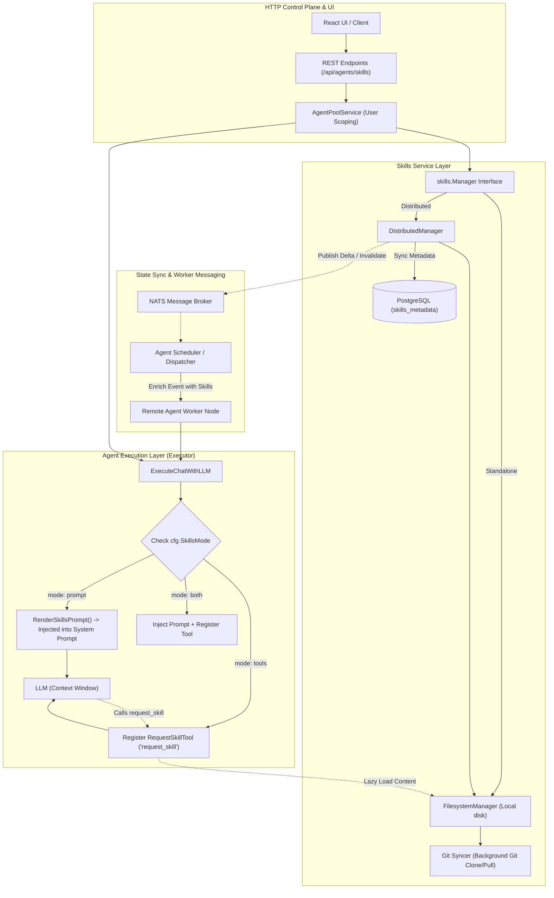

# Arsitektur Lengkap Sistem Skills pada LocalAI
*Dokumen Referensi & Blueprint Implementasi untuk Chatbot / Agent System*

---

## 1. Ringkasan Eksekutif & Topologi Arsitektur

Pada LocalAI, **Skill** adalah unit kapabilitas / instruksi khusus modular yang dapat diaktifkan pada Agent/Chatbot. Format skill mengadopsi standar `SKILL.md` (Markdown dengan YAML frontmatter) yang kompatibel dengan ekosistem Agent moderen (seperti Claude Code, Skillserver, dan LocalAGI).

LocalAI mengimplementasikan sistem Skills secara modular dan bertingkat (*multi-tier architecture*):
1. **Storage/Domain Tier**: Mengelola file fisik `SKILL.md`, resources (aset/skrip), dan Git repository syncer.
2. **Distributed & Database Tier**: Menggunakan PostgreSQL sebagai catalog metadata terpusat dan per-user scoping.
3. **Synchronization & Messaging Tier**: Sinkronisasi status antar replika backend menggunakan NATS message broker (`SyncedMap` & cache invalidation events).
4. **Agent Runtime Tier**: Menyajikan skills ke LLM baik melalui **Direct Prompt Injection** (full render) maupun **Lazy-Loaded Tool Calling** (`request_skill`).
5. **HTTP & API Tier**: REST API untuk manajemen skill (CRUD, export/import zip, resource management, dan sinkronisasi Git).



---

## 2. Struktur Data & Format Standar Skill

### Struktur Direktori Skill
Setiap skill disimpan dalam sub-folder tersendiri di dalam direktori root skills (`LOCALAI_DATA_PATH/skills/`):
```text
skills_dir/
├── my-python-coder/
│   ├── SKILL.md              <-- File utama (Frontmatter + Markdown)
│   ├── scripts/              <-- Resource files (opsional)
│   │   └── helper.py
│   └── templates/
│       └── template.json
└── web-search/
    └── SKILL.md
```

### Format `SKILL.md`
Setiap file `SKILL.md` terdiri dari **YAML Frontmatter** di bagian atas dan **Markdown Body** sebagai konten instruksi:
```markdown
---
name: web-search
description: Search the web for real-time information using Google or DuckDuckGo
license: Apache-2.0
compatibility: >=1.0.0
allowed-tools: bash, curl
metadata:
  category: search
  author: localai
---

# Web Search Skill

When the user asks for real-time information:
1. Formulate a search query.
2. Execute search using available search tools.
3. Summarize findings concisely with source citations.
```

---

## 3. Komponen Inti & Analisis Package

### A. Package `core/services/skills` (Domain & Storage Manager)

#### 1. Interface Manager ([`core/services/skills/manager.go`](file:///home/quixiq/projects/polyground/LocalAI/core/services/skills/manager.go))
Menyediakan abstraksi operasi CRUD, manajemen resource, dan Git repository:
```go
type Manager interface {
    // Skills CRUD
    List() ([]skillserver.Skill, error)
    Get(name string) (*skillserver.Skill, error)
    Search(query string) ([]skillserver.Skill, error)
    Create(name, description, content, license, compatibility, allowedTools string, metadata map[string]string) (*skillserver.Skill, error)
    Update(name, description, content, license, compatibility, allowedTools string, metadata map[string]string) (*skillserver.Skill, error)
    Delete(name string) error
    Export(name string) ([]byte, error)
    Import(archiveData []byte) (*skillserver.Skill, error)

    // Resource Management (file aset/skrip pendukung di dalam folder skill)
    ListResources(skillName string) ([]skillserver.SkillResource, *skillserver.Skill, error)
    GetResource(skillName, path string) (*skillserver.ResourceContent, *skillserver.SkillResource, error)
    CreateResource(skillName, path string, data []byte) error
    UpdateResource(skillName, path, content string) error
    DeleteResource(skillName, path string) error

    // Git Repositories Integration
    ListGitRepos() ([]GitRepoInfo, error)
    AddGitRepo(repoURL string) (*GitRepoInfo, error)
    UpdateGitRepo(id, repoURL string, enabled *bool) (*GitRepoInfo, error)
    DeleteGitRepo(id string) error
    SyncGitRepo(id string) error
    ToggleGitRepo(id string) (*GitRepoInfo, error)

    GetConfig() map[string]string
    GetSkillsDir() string
}
```

#### 2. FilesystemManager ([`core/services/skills/filesystem.go`](file:///home/quixiq/projects/polyground/LocalAI/core/services/skills/filesystem.go))
Implementasi penyimpanan berbasis disk lokal.
- **Pembuatan Skill (`Create`)**: Memvalidasi nama skill, membuat direktori, merender frontmatter via `buildFrontmatter()`, lalu menulis file `SKILL.md`.
- **Ekspor/Impor (`Export` / `Import`)**: Mengompresi folder skill menjadi arsip `.zip` atau mengekstrak file zip ke direktori skill.
- **Git Synchronization (`AddGitRepo` / `SyncGitRepo`)**: Menggunakan `skillgit.GitSyncer` di background goroutine untuk melakukan `git clone` atau `git pull` dari repositori publik/privat, menandai skill dari Git sebagai `ReadOnly: true`, lalu memanggil `RebuildIndex()`.

#### 3. DistributedManager ([`core/services/skills/distributed.go`](file:///home/quixiq/projects/polyground/LocalAI/core/services/skills/distributed.go))
Membungkus `FilesystemManager` untuk arsitektur multi-node:
- **Write-Through**: Operasi tulis (`Create`, `Update`, `Delete`, `Import`, `AddGitRepo`) menulis ke filesystem lokal terlebih dahulu, lalu menyinkronkan metadata ke PostgreSQL melalui method `persistMetadata()`.
- **List Optimization**: `List()` membaca langsung dari PostgreSQL record (`SkillStore.List(userID)`) sebagai *source of truth* status aktif dan scoping user.
- **Full Content Read**: Operasi pembacaan konten penuh (`Get`, `Search`, `Export`, `Resources`) tetap membaca dari filesystem.

---

### B. Package `core/services/distributed` (PostgreSQL Catalog)

#### Model Database `SkillMetadataRecord` ([`core/services/distributed/skills.go`](file:///home/quixiq/projects/polyground/LocalAI/core/services/distributed/skills.go#L11-L26))
```go
type SkillMetadataRecord struct {
    ID         string    `gorm:"primaryKey;size:36" json:"id"`
    UserID     string    `gorm:"index;size:36" json:"user_id,omitempty"`
    Name       string    `gorm:"index;size:255" json:"name"`
    Definition string    `gorm:"type:text" json:"definition,omitempty"` // Ringkasan deskripsi (dipotong max 500 char)
    SourceType string    `gorm:"size:32" json:"source_type"`            // "inline", "git"
    SourceURL  string    `gorm:"size:512" json:"source_url,omitempty"`
    Version    string    `gorm:"size:64" json:"version,omitempty"`
    Enabled    bool      `gorm:"default:true" json:"enabled"`
    CreatedAt  time.Time `json:"created_at"`
    UpdatedAt  time.Time `json:"updated_at"`
}

func (SkillMetadataRecord) TableName() string { return "skills_metadata" }
```

> **Catatan Pola Penyimpanan:**
> Field `Definition` di PostgreSQL **hanya menyimpan cuplikan maksimal 500 karakter** (`definition[:500]`). Konten file penuh tidak disimpan di RDBMS untuk menghemat bandwidth DB dan menjaga ukuran tabel tetap efisien.

---

### C. Package `core/services/syncstate` & `core/services/messaging`

#### 1. SyncedMap Cross-Replica Sync ([`core/services/syncstate/syncstate.go`](file:///home/quixiq/projects/polyground/LocalAI/core/services/syncstate/syncstate.go))
Ketika LocalAI berjalan di balik Load Balancer multi-replica:
- `SyncedMap` menggabungkan 3 komponen: in-memory map lokal, NATS broadcast/apply path, dan durable DB read-through.
- Mutasi lokal mengirimkan delta `{"op": "set"|"delete", "key": ..., "value": ...}` ke NATS subject.
- Replika peer menerima delta, mengupdate memori lokal, dan mengeksekusi callback `OnApply` tanpa memicu broadcast ulang (*echo-loop guard*).

#### 2. Cache Invalidation & Task Event Enrichment
- **Subject NATS**: `SubjectCacheInvalidateSkills = "cache.invalidate.skills"` didefinisikan di [`core/services/messaging/subjects.go`](file:///home/quixiq/projects/polyground/LocalAI/core/services/messaging/subjects.go#L433).
- **Worker Event Packaging** ([`core/services/agents/scheduler.go`](file:///home/quixiq/projects/polyground/LocalAI/core/services/agents/scheduler.go#L98-L115)):
  Saat background scheduler atau dispatcher mengirim pekerjaan ke Worker Node terpisah, data skill lengkap di-*enrich* ke dalam payload event (`AgentChatEvent.Skills`). Dengan cara ini, worker node dapat menjalankan task agent tanpa harus membuka koneksi langsung ke database skills.

---

### D. Package `core/services/storage` (Unified File Management)

#### `FileManager` ([`core/services/storage/filemanager.go`](file:///home/quixiq/projects/polyground/LocalAI/core/services/storage/filemanager.go))
Menyediakan layer abstraksi untuk file biner besar, aset user, dan model AI:
- Pada mode single-node: Langsung mengakses filesystem lokal.
- Pada mode distributed: Menyimpan blob ke Object Storage (S3/MinIO) dengan caching lokal di node worker.
- Menggunakan `singleflight.Group` untuk mencegah *thundering herd problem* saat banyak goroutine/agent mendownload file resource yang sama secara bersamaan.

---

### E. Package `core/services/agents` (Runtime Execution, Injection, & Dispatching)

Paket ini adalah *engine runtime* yang mengatur interaksi antara LLM, skills, memory, MCP tools, dan scheduling.

#### 1. File Konfigurasi: [`config.go`](file:///home/quixiq/projects/polyground/LocalAI/core/services/agents/config.go)
Konfigurasi skill dan eksekusi per agent diatur dalam [`AgentConfig`](file:///home/quixiq/projects/polyground/LocalAI/core/services/agents/config.go#L89-L93):
```go
type AgentConfig struct {
    // Model & API
    Model                 string `json:"model"`
    SystemPrompt          string `json:"system_prompt"`
    PermanentGoal         string `json:"permanent_goal"`
    InnerMonologueTemplate string `json:"inner_monologue_template"`

    // Skills
    EnableSkills   bool     `json:"enable_skills"`
    SkillsMode     string   `json:"skills_mode,omitempty"`     // "prompt" (default), "tools", atau "both"
    SelectedSkills []string `json:"selected_skills,omitempty"` // Filter skill per-agent
    SkillsPrompt   string   `json:"skills_prompt,omitempty"`   // Custom template rendering prompt
}
```

#### 2. Definisi & Helper Skills: [`skills.go`](file:///home/quixiq/projects/polyground/LocalAI/core/services/agents/skills.go)
- **`SkillInfo`**: Struct transfer data berisi `Name`, `Description`, dan `Content` penuh.
- **`SkillProvider`**: Interface untuk menyediakan list skill (`ListSkills() ([]SkillInfo, error)`).
- **`FilterSkills(all, selected)`**: Memfilter list skill global agar hanya skill yang dipilih pada agent yang aktif.
- **`RenderSkillsPrompt()`**: Merender skill ke format XML `<available_skills>` ke system prompt.
- **`RequestSkillTool`**: Cogito tool definition yang dipanggil LLM saat mode `tools` aktif:
```go
type RequestSkillArgs struct {
    SkillName string `json:"skill_name" jsonschema:"description=The name of the skill to request"`
}

func (t RequestSkillTool) Run(args RequestSkillArgs) (string, any, error) {
    for _, s := range t.Skills {
        if s.Name == args.SkillName {
            body := s.Content
            if body == "" {
                body = s.Description
            }
            return fmt.Sprintf("Skill '%s':\n%s", s.Name, body), nil, nil
        }
    }
    return fmt.Sprintf("Skill '%s' not found. Available skills: %s", args.SkillName, skillNames(t.Skills)), nil, nil
}
```

#### 3. Agent Execution Engine: [`executor.go`](file:///home/quixiq/projects/polyground/LocalAI/core/services/agents/executor.go)
- **`Callbacks`** ([`executor.go:L19-L32`](file:///home/quixiq/projects/polyground/LocalAI/core/services/agents/executor.go#L19-L32)): Menyediakan hooks event streaming (`OnStream`, `OnReasoning`, `OnToolCall`, `OnToolResult`, `OnStatus`, `OnMessage`) yang menghubungkan eksekusi ke SSE manager (mode lokal) atau NATS EventBridge (mode distributed).
- **`ExecuteChatWithLLM()`** ([`executor.go:L106-L260`](file:///home/quixiq/projects/polyground/LocalAI/core/services/agents/executor.go#L106-L260)):
  1. Merakit conversation fragment awal.
  2. Memeriksa `cfg.SkillsMode`:
     - Jika `prompt` / `both`: Menggabungkan hasil `RenderSkillsPrompt()` ke `systemPrompt`.
     - Jika `tools`: Menambahkan `SkillsToolsHint` ke `systemPrompt` dan mendaftarkan `RequestSkillTool` ke opsi tool Cogito.
  3. Memasukkan Knowledge Base (RAG) jika diaktifkan.
  4. Mendaftarkan MCP sessions, Knowledge Base tools, dan stream callbacks.
  5. Menjalankan LLM tool loop.
- **`ExecuteBackgroundRun()`** ([`executor.go:L54-L70`](file:///home/quixiq/projects/polyground/LocalAI/core/services/agents/executor.go#L54-L70)): Menjalankan eksekusi otonom berkala menggunakan `InnerMonologueTemplate` dan `PermanentGoal`.

#### 4. Background Scheduler: [`scheduler.go`](file:///home/quixiq/projects/polyground/LocalAI/core/services/agents/scheduler.go)
- Bertugas memantau interval `PeriodicRuns` pada agent.
- Menggunakan `SkillContentProvider` ([`scheduler.go:L98-L105`](file:///home/quixiq/projects/polyground/LocalAI/core/services/agents/scheduler.go#L98-L105)) untuk memuat data skill user, lalu memaketkannya ke dalam event NATS (`AgentChatEvent.Skills`).

#### 5. Distributed Dispatcher: [`dispatcher.go`](file:///home/quixiq/projects/polyground/LocalAI/core/services/agents/dispatcher.go)
- Berjalan pada worker node distributed.
- Mengonsumsi `AgentChatEvent` dari NATS.
- Menggunakan `staticSkillProvider` ([`dispatcher.go:L390-L397`](file:///home/quixiq/projects/polyground/LocalAI/core/services/agents/dispatcher.go#L390-L397)) untuk mengekstrak data skill langsung dari memori event NATS tanpa perlu koneksi DB lokal di sisi worker:
```go
type staticSkillProvider struct {
    skills []SkillInfo
}

func (p *staticSkillProvider) ListSkills() ([]SkillInfo, error) {
    return p.skills, nil
}
```

---

### F. HTTP REST Endpoints

Didaftarkan pada [`core/http/routes/agents.go`](file:///home/quixiq/projects/polyground/LocalAI/core/http/routes/agents.go#L55-L79) dan di-handle oleh [`core/http/endpoints/localai/agent_skills.go`](file:///home/quixiq/projects/polyground/LocalAI/core/http/endpoints/localai/agent_skills.go):

| Method | Endpoint | Deskripsi |
| :--- | :--- | :--- |
| `GET` | `/api/agents/skills` | List semua skills milik user aktif (mendukung admin cross-user aggregation). |
| `POST` | `/api/agents/skills` | Membuat skill baru (menghasilkan file `SKILL.md`). |
| `GET` | `/api/agents/skills/:name` | Mengambil detail skill beserta konten lengkapnya. |
| `PUT` | `/api/agents/skills/:name` | Memperbarui skill (hanya untuk non-readonly). |
| `DELETE` | `/api/agents/skills/:name` | Menghapus direktori skill dan metadata di PostgreSQL. |
| `GET` | `/api/agents/skills/export/:name` | Mengekspor skill dan seluruh asetnya menjadi file `.zip`. |
| `POST` | `/api/agents/skills/import` | Mengimpor arsip `.zip` skill ke dalam sistem. |
| `GET` | `/api/agents/skills/:name/resources` | List file aset/skrip pendukung di dalam folder skill. |
| `GET` | `/api/agents/skills/:name/resources/*` | Mengunduh/membaca isi resource tertentu. |
| `POST` | `/api/agents/skills/:name/resources` | Menambahkan file resource baru. |
| `GET` | `/api/agents/git-repos` | List Git repositori sumber skill. |
| `POST` | `/api/agents/git-repos` | Mendaftarkan repositori Git dan mentrigger background clone/pull. |
| `POST` | `/api/agents/git-repos/:id/sync` | Memaksa sinkronisasi ulang (`git pull`) untuk repo tertentu. |

---

## 4. Blueprint Implementasi untuk Chatbot Anda

Jika Anda ingin mengimplementasikan sistem Skills serupa pada proyek Chatbot Anda, ikuti langkah-langkah berikut:

### Langkah 1: Tentukan Format Standardisasi Skill
Gunakan format markdown dengan frontmatter YAML:
```text
/data/skills/
  ├── [skill_name]/
  │   ├── SKILL.md
  │   └── assets/ (opsional)
```

### Langkah 2: Buat Skill Manager (Filesystem + DB Catalog)
1. **Interface Service**: Buat interface untuk operasi `List()`, `Get(name)`, `Create()`, `Update()`, `Delete()`.
2. **Local Storage**: Simpan file `SKILL.md` pada disk lokal atau volume shared (NFS/EFS/S3).
3. **Database Catalog**: Simpan metadata tabel `skills (id, user_id, name, description, source, enabled, created_at)` di PostgreSQL/SQLite untuk query list dan filtering cepat.

### Langkah 3: Implementasikan Pemilihan Mode Injeksi
Berikan fleksibilitas pada chatbot Anda:
1. **Jika model memiliki context window kecil (atau jumlah skill banyak)**:
   - Gunakan pendekatan **Lazy Load via Tool Calling** (`skills_mode = "tools"`).
   - Masukkan nama & deskripsi ringkas ke system prompt atau tool definition `request_skill`.
   - Ketika chatbot membutuhkan panduan skill tertentu, chatbot akan memanggil tool `request_skill("nama_skill")` untuk mengambil instruksi lengkap.
2. **Jika model memiliki context window besar & jumlah skill sedikit (1-3 skill)**:
   - Gunakan pendekatan **Prompt Injection** (`skills_mode = "prompt"`).
   - Seluruh isi `SKILL.md` langsung digabungkan ke system prompt pada saat inisiasi sesi chat.

### Langkah 4: Tambahkan Fitur Sinkronisasi Git (Opsional)
- Sediakan fitur pendaftaran URL repositori Git.
- Jalankan background worker yang melakukan `git clone` atau `git pull` secara berkala ke folder skills lokal.

---

## 5. Ringkasan Perbandingan Teknis

| Dimensi | Pendekatan LocalAI | Catatan untuk Chatbot Anda |
| :--- | :--- | :--- |
| **Penyimpanan Utama** | Local Filesystem (`SKILL.md`) + Git Clone | Sangat mudah di-edit secara manual, di-backup, dan kompatibel dengan CLI/git. |
| **Katalog Database** | PostgreSQL (`skills_metadata`) hanya untuk metadata | Mencegah bloating pada RDBMS. RDBMS hanya untuk otorisasi & listing. |
| **Penyajian ke LLM** | Dikonfigurasi: Injeksi Penuh vs On-Demand Tool (`request_skill`) | Hemat token jika menggunakan tool on-demand; Lebih cepat jika menggunakan direct injection untuk sedikit skill. |
| **Multi-Node Sync** | NATS broadcast (`SyncedMap`) + payload enrichment pada event scheduler | Worker tidak memerlukan akses langsung ke DB master. |
| **RAG vs Skills** | Terpisah: RAG untuk Knowledge Base / Dokumen; Skills untuk Instruksi / Workflow | Skills tidak memerlukan vector embedding karena pencariannya bersifat deterministik / berbasis nama & deskripsi. |
